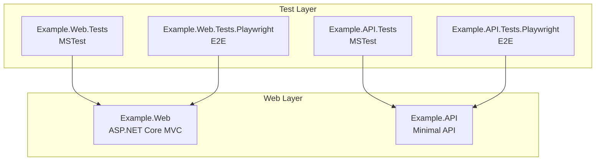
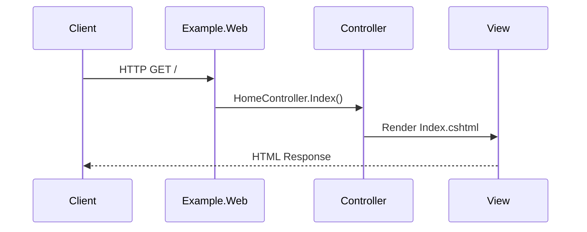
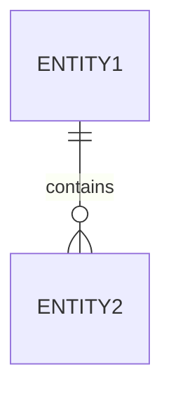

# Phase 3: System Developer Docs Setup

**Estimated Time**: 4-6 hours
**Status**: NOT STARTED
**Dependencies**: Phase 2 complete

---

## Overview

**Goal**: Create professional developer documentation site with API reference, architecture diagrams, and conceptual articles.

**Why This Phase Matters**: Developer docs are the most critical documentation type. They establish patterns for DocFX configuration, Mermaid diagram integration, and AI-assisted content generation that will be reused in Phase 4.

---

## Tasks

### Task 3.1: Create DocFX Developer Directory Structure (Small - 30 minutes)

**Directory**: `docs/docfx-developer/`

**Acceptance Criteria**:
- [ ] Directory created with subdirectories: `articles/`, `diagrams/`, `images/`
- [ ] `index.md` created (developer audience homepage)
- [ ] `toc.yml` created (table of contents navigation)
- [ ] `.gitignore` for `_site/` and `api/` (generated directories)
- [ ] `docfx.json` placeholder created (will configure in Task 3.2)

**Implementation**:
```bash
mkdir -p docs/docfx-developer/{articles,diagrams,images}
touch docs/docfx-developer/{index.md,toc.yml,docfx.json,.gitignore}
```

**.gitignore content**:
```
_site/
api/
.manifest
log.txt
```

**index.md template**:
```markdown
# Developer Documentation

Welcome to the .NET 10 Project Example Developer Documentation.

## Overview

This documentation covers:
- System architecture and design decisions
- API reference for all public APIs
- Domain models and database schemas
- Deployment procedures
- Development workflows

## Quick Links

- [Architecture Overview](articles/architecture.md)
- [API Reference](api/index.html)
- [Domain Models](articles/domain-models.md)
```

**toc.yml template**:
```yaml
- name: Home
  href: index.md
- name: Articles
  href: articles/
- name: API Reference
  href: api/
```

---

### Task 3.2: Configure DocFX for Developer Docs (Medium - 1.5 hours)

**File**: `docs/docfx-developer/docfx.json`

**Acceptance Criteria**:
- [ ] `metadata` section configured for API reference (src/**/*.csproj)
- [ ] `build` section includes `api/` and `articles/`
- [ ] Mermaid diagram support enabled via `markdig` extensions
- [ ] `filterConfig.yml` created for public API filtering
- [ ] Git contribute links configured (platform-agnostic)
- [ ] Custom footer and branding (optional)

**docfx.json implementation**:
```json
{
  "metadata": [
    {
      "src": [
        {
          "src": "../../src",
          "files": ["**/*.csproj"],
          "exclude": ["**/bin/**", "**/obj/**"]
        }
      ],
      "dest": "api",
      "disableGitFeatures": false,
      "disableDefaultFilter": false,
      "filter": "filterConfig.yml"
    }
  ],
  "build": {
    "content": [
      {
        "files": ["**/*.{md,yml}"],
        "src": "api",
        "dest": "api"
      },
      {
        "files": ["**/*.md"],
        "src": "articles",
        "dest": "articles"
      },
      {
        "files": ["toc.yml", "index.md"]
      }
    ],
    "resource": [
      {
        "files": ["images/**", "diagrams/**"]
      }
    ],
    "output": "_site",
    "template": ["default", "modern"],
    "globalMetadata": {
      "_appTitle": "NET10 Project Example - Developer Docs",
      "_appFooter": "NET10 Project Example Developer Documentation",
      "_enableSearch": true,
      "_disableContribution": false,
      "_gitContribute": {
        "repo": "https://github.com/NotMyself/net10-project-example",
        "branch": "main"
      }
    },
    "markdownEngineProperties": {
      "markdigExtensions": [
        "attributes",
        "customcontainers",
        "figures",
        "footnotes",
        "smartypants",
        "mathematics",
        "diagrams"
      ]
    },
    "postProcessors": ["ExtractSearchIndex"]
  }
}
```

**filterConfig.yml**:
```yaml
apiRules:
- exclude:
    uidRegex: ^System\.
    type: Namespace
- exclude:
    uidRegex: ^Microsoft\.
    type: Namespace
- exclude:
    hasAttribute:
      uid: System.Runtime.CompilerServices.CompilerGeneratedAttribute
```

---

### Task 3.3: Create Architecture Documentation (Medium - 2 hours, AI-assisted)

**File**: `docs/docfx-developer/articles/architecture.md`

**Acceptance Criteria**:
- [ ] System architecture overview paragraph
- [ ] Mermaid C4 component diagram showing MVC app, API, test projects
- [ ] Mermaid sequence diagram for key interaction (e.g., HTTP request flow)
- [ ] Describes ASP.NET Core MVC app, Minimal API, test project structure
- [ ] References Directory.Build.props and centralized package management
- [ ] Links to related articles (domain-models.md, deployment.md)
- [ ] Use documentation-architect agent + MCP servers for content generation

**Implementation Guidance**:
```markdown
# Architecture Overview

## System Components

This system consists of:
- **Example.Web**: ASP.NET Core MVC application
- **Example.API**: ASP.NET Core Minimal API
- **Test Projects**: MSTest + Playwright E2E tests

## Component Diagram



## Request Flow



## Key Design Decisions

1. **Centralized Package Management**: Uses Directory.Packages.props
2. **ImplicitUsings Disabled**: All using statements explicit
3. **MSTest with Microsoft.Testing.Platform**: New test runner (not VSTest)
4. **Playwright for E2E**: Cross-browser testing support
```

**AI Prompt for Content Generation**:
```
Using the documentation-architect agent and Microsoft Learn MCP server:

"Create comprehensive architecture documentation for this .NET 10 project. Include:
1. System component overview (Example.Web MVC app, Example.API Minimal API, 4 test projects)
2. Mermaid C4 component diagram showing relationships
3. Sequence diagram for HTTP request flow through MVC
4. Section on centralized package management (Directory.Packages.props)
5. Section on testing strategy (MSTest + Playwright)
6. Links to domain models and deployment docs

Use correct Microsoft terminology for ASP.NET Core, Minimal APIs, and MSTest."
```

---

### Task 3.4: Generate Class Diagrams (Small - 30 minutes)

**Script**: `make diagrams`

**Acceptance Criteria**:
- [ ] Mermaid class diagrams generated for Example.Web
- [ ] Mermaid class diagrams generated for Example.API
- [ ] Output in `docs/docfx-developer/diagrams/`
- [ ] Diagrams referenced from `articles/api-guide.md` (create this article)
- [ ] PlantUML diagrams generated as alternative format

**Implementation**:
```bash
# Build projects first
dotnet build src/Example.Web/Example.Web.csproj
dotnet build src/Example.API/Example.API.csproj

# Generate diagrams
make diagrams

# Or directly:
pwsh .docgen/diagram-gen.ps1 -All

# Verify output
ls -lh docs/docfx-developer/diagrams/
```

**Create api-guide.md to reference diagrams**:
```markdown
# API Reference Guide

## Class Diagrams

### Example.Web Class Structure


### Example.API Class Structure


## Key Classes

...
```

---

### Task 3.5: Create Domain Models Documentation (Small - 1 hour, AI-assisted)

**File**: `docs/docfx-developer/articles/domain-models.md`

**Acceptance Criteria**:
- [ ] Documents key domain concepts (even if minimal in example project)
- [ ] References generated class diagrams
- [ ] Explains relationships between models
- [ ] Links to API reference for specific classes
- [ ] Uses AI assistance for content generation

**Implementation Template**:
```markdown
# Domain Models

## Overview

This project uses a simple domain model consisting of:
- [List domain entities/models]

## Entity Relationships

[Describe relationships, use Mermaid ER diagram if applicable]



## Key Concepts

### [Entity 1]

[Description, purpose, key properties]

See API Reference: @Example.Web.Models.Entity1

### [Entity 2]

[Description, purpose, key properties]

See API Reference: @Example.Web.Models.Entity2
```

**AI Prompt**:
```
"Analyze the Example.Web and Example.API projects and create domain model documentation.
Include entity descriptions, relationships, and Mermaid ER diagrams.
Link to API reference using @NamespaceName.ClassName syntax."
```

---

### Task 3.6: Test Local Developer Docs Build (Small - 30 minutes)

**Command**: `make docs-developer`

**Acceptance Criteria**:
- [ ] DocFX builds without errors: `make docs-developer`
- [ ] API reference generated from XML comments
- [ ] Articles render correctly (architecture.md, domain-models.md)
- [ ] Mermaid diagrams render properly
- [ ] `make docs-serve` shows site at http://localhost:8080
- [ ] Navigation works (sidebar, top nav, search)
- [ ] Search functionality works

**Implementation**:
```bash
# Build developer docs
make docs-developer

# Expected output:
# Building developer documentation...
# cd docs/docfx-developer && docfx build
# [Build output]
# Build succeeded.

# Serve locally
make docs-serve

# Open browser to http://localhost:8080
# Test:
# - Homepage loads
# - Articles menu shows architecture, domain-models
# - API reference shows Example.Web, Example.API
# - Mermaid diagrams render
# - Search works
```

**Troubleshooting**:
- If API reference is empty: Ensure XML documentation enabled (Phase 2, Task 2.1)
- If Mermaid diagrams don't render: Check `markdigExtensions` in docfx.json
- If build fails: Check docfx.json syntax with JSON validator
- If diagrams missing: Run `make diagrams` first

---

## Phase Completion Criteria

Phase 3 is complete when:

- [ ] Developer docs build locally without errors
- [ ] API reference generated from XML comments (even if empty initially)
- [ ] Articles render correctly with Mermaid diagrams
- [ ] Navigation and search work properly
- [ ] Class diagrams generated and referenced from articles
- [ ] AI assistance tested and working for content generation

---

## Output Artifacts

After Phase 3 completion:

1. `docs/docfx-developer/` directory with:
   - `docfx.json` (fully configured)
   - `index.md`, `toc.yml`
   - `articles/architecture.md` (~200-400 lines)
   - `articles/domain-models.md` (~100-200 lines)
   - `articles/api-guide.md` (~100 lines)
   - `diagrams/*.md` (generated Mermaid diagrams)
   - `diagrams/*.puml` (generated PlantUML diagrams)
   - `_site/` (generated HTML, in .gitignore)

2. Working local documentation site at http://localhost:8080

---

## Success Indicators

You'll know this phase is successful when:

- A developer can navigate the entire site structure
- API reference shows all public classes/methods (even without XML comments yet)
- Mermaid diagrams render correctly in the browser
- Architecture documentation provides clear system overview
- Search returns relevant results
- Git contribute links work (edit this page)

---

**Phase Status**: NOT STARTED
**Next Task**: Task 3.1 - Create DocFX Developer Directory Structure
**Estimated Completion**: After 4-6 hours of focused work
