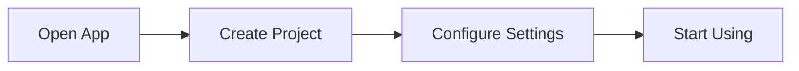

# Phase 4: System User Docs Setup

**Estimated Time**: 3-4 hours
**Status**: NOT STARTED
**Dependencies**: Phase 3 complete

---

## Overview

**Goal**: Create user-friendly documentation site focused on end-user guidance, tutorials, and feature explanations (no API reference).

**Why This Phase Matters**: User docs serve a different audience than developer docs. This phase reuses DocFX patterns from Phase 3 but with user-focused content, simpler navigation, and emphasis on screenshots and tutorials.

---

## Tasks

### Task 4.1: Create DocFX User Directory Structure (Small - 30 minutes)

**Directory**: `docs/docfx-user/`

**Acceptance Criteria**:
- [ ] Directory created with subdirectories: `articles/`, `images/screenshots/`, `diagrams/`, `tutorials/`
- [ ] `index.md` created (user audience, welcoming tone)
- [ ] `toc.yml` created (simple navigation)
- [ ] `.gitignore` for `_site/`
- [ ] `docfx.json` placeholder

**index.md template** (user-friendly tone):
```markdown
# Welcome to NET10 Project Example

Get started with our application in minutes!

## What is NET10 Project Example?

[User-friendly description of what the application does]

## Quick Start

1. [Installation](articles/getting-started.md#installation)
2. [First Steps](articles/getting-started.md#first-steps)
3. [Explore Features](articles/features.md)

## Popular Guides

- [Getting Started Guide](articles/getting-started.md)
- [Feature Overview](articles/features.md)
- [Tutorials](tutorials/index.md)
```

---

### Task 4.2: Configure DocFX for User Docs (Medium - 1 hour)

**File**: `docs/docfx-user/docfx.json`

**Acceptance Criteria**:
- [ ] `build` section (NO metadata/API reference)
- [ ] User-friendly template (default modern template)
- [ ] Simpler navigation structure
- [ ] Mermaid support for simple flow diagrams
- [ ] Different branding/color scheme than developer docs (optional)

**docfx.json implementation**:
```json
{
  "build": {
    "content": [
      {
        "files": ["**/*.md"],
        "src": "articles",
        "dest": "articles"
      },
      {
        "files": ["**/*.md"],
        "src": "tutorials",
        "dest": "tutorials"
      },
      {
        "files": ["toc.yml", "index.md"]
      }
    ],
    "resource": [
      {
        "files": ["images/**", "diagrams/**"]
      }
    ],
    "output": "_site",
    "template": ["default", "modern"],
    "globalMetadata": {
      "_appTitle": "NET10 Project Example - User Guide",
      "_appFooter": "NET10 Project Example Documentation",
      "_enableSearch": true
    },
    "markdownEngineProperties": {
      "markdigExtensions": ["diagrams"]
    }
  }
}
```

---

### Task 4.3: Create Getting Started Guide (Medium - 1.5 hours, AI-assisted)

**File**: `docs/docfx-user/articles/getting-started.md`

**Acceptance Criteria**:
- [ ] Installation instructions (step-by-step)
- [ ] First-time setup guide
- [ ] Hello World example or first action
- [ ] Screenshots for key steps
- [ ] Simple Mermaid flow diagram showing user journey
- [ ] Troubleshooting common issues section
- [ ] Uses AI assistance for content

**Template**:
```markdown
# Getting Started

## Installation

### Prerequisites

- [List prerequisites with versions]

### Step 1: Download

[Instructions with screenshot]


### Step 2: Install

[Instructions]

### Step 3: First Run

[Instructions]

## Your First Task

[Walk through first meaningful action]



## Troubleshooting

### Issue: [Common Problem]

**Solution**: [Step-by-step fix]
```

**AI Prompt**:
```
"Create a getting started guide for end users. Include:
1. Prerequisites and installation steps
2. First-time setup walkthrough
3. Simple Mermaid flowchart showing user journey
4. Troubleshooting section with 3-5 common issues
Use friendly, non-technical language."
```

---

### Task 4.4: Create Features Overview (Small - 1 hour, AI-assisted)

**File**: `docs/docfx-user/articles/features.md`

**Acceptance Criteria**:
- [ ] Lists main features with brief descriptions
- [ ] Screenshot of each feature
- [ ] Links to detailed tutorials
- [ ] Organized by feature category
- [ ] Table format for feature comparison (if applicable)

**Template**:
```markdown
# Features

## Feature Category 1

### Feature A

[Brief description]


[Learn more](../tutorials/feature-a-tutorial.md)

### Feature B

[Brief description]


## Feature Comparison

| Feature | Basic | Advanced |
|---------|-------|----------|
| Feature A | ✅ | ✅ |
| Feature B | ❌ | ✅ |
```

---

### Task 4.5: Test Local User Docs Build (Small - 30 minutes)

**Command**: `make docs-user`

**Acceptance Criteria**:
- [ ] DocFX builds without errors: `make docs-user`
- [ ] Articles render correctly
- [ ] Screenshots display properly (use placeholder images initially)
- [ ] Mermaid diagrams render
- [ ] `make docs-user-serve` shows site at http://localhost:8081
- [ ] User-friendly navigation (simpler than developer docs)
- [ ] Search works

**Implementation**:
```bash
# Build user docs
make docs-user

# Serve locally
make docs-user-serve

# Test in browser at http://localhost:8081
```

---

## Phase Completion Criteria

Phase 4 is complete when:

- [ ] User docs build locally without errors
- [ ] Articles render with user-friendly tone
- [ ] Screenshots display properly (even if placeholders)
- [ ] Navigation is simple and clear
- [ ] Mermaid flow diagrams render
- [ ] Site is visually distinct from developer docs

---

## Output Artifacts

1. `docs/docfx-user/` directory with:
   - `docfx.json` (configured for user docs)
   - `index.md`, `toc.yml`
   - `articles/getting-started.md` (~300-500 lines)
   - `articles/features.md` (~200-300 lines)
   - `images/screenshots/` (placeholders initially)
   - `_site/` (generated HTML)

2. Working local user docs site at http://localhost:8081

---

**Phase Status**: NOT STARTED
**Next Task**: Task 4.1 - Create DocFX User Directory Structure
**Estimated Completion**: After 3-4 hours of focused work
