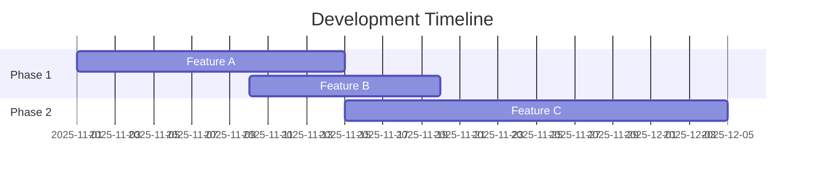

# Phase 5: Company System Docs Setup

**Estimated Time**: 2-3 hours
**Status**: NOT STARTED
**Dependencies**: Phase 4 complete

---

## Overview

**Goal**: Create wiki-based company documentation for internal team communication, frequently updated information, and living documentation.

**Why This Phase Matters**: Company docs serve internal teams with high-change information (active development, access details, feature status). Wiki format enables easy updates without rebuilding static sites.

---

## Tasks

### Task 5.1: Create Wiki Directory Structure (Small - 30 minutes)

**Directory**: `docs/wiki/`

**Acceptance Criteria**:
- [ ] Directory created: `docs/wiki/`
- [ ] `README.md` created (wiki home page)
- [ ] Template files created:
  - `system-purpose.md`
  - `system-access.md`
  - `feature-summary.md`
  - `active-development.md`
- [ ] `.order` file for Azure DevOps Wiki (optional, used in Phase 7)

**README.md template** (wiki homepage):
```markdown
# NET10 Project Example - Company Wiki

## Quick Links

- [System Purpose](system-purpose.md) - What this system does
- [System Access](system-access.md) - How to access environments
- [Feature Summary](feature-summary.md) - Current feature set
- [Active Development](active-development.md) - What's being worked on

## Documentation Links

- [Developer Docs](https://notmyself.github.io/net10-project-example/) - API reference and architecture
- [User Docs](https://notmyself.github.io/net10-project-example/user/) - User guides and tutorials

## Support

- Team Channel: [Link]
- Issue Tracker: [Link]
```

**.order file** (for Azure DevOps Wiki):
```
README
system-purpose
system-access
feature-summary
active-development
```

---

### Task 5.2: Write System Purpose Documentation (Small - 30 minutes, AI-assisted)

**File**: `docs/wiki/system-purpose.md`

**Acceptance Criteria**:
- [ ] Explains what the system does (business purpose)
- [ ] Target audience identified
- [ ] Key value propositions listed
- [ ] Links to developer/user docs for technical details

**Template**:
```markdown
# System Purpose

## What is NET10 Project Example?

[Business-level description of system purpose]

## Target Audience

This system is designed for:
- [Audience 1]
- [Audience 2]

## Key Value Propositions

1. **[Value 1]**: [Description]
2. **[Value 2]**: [Description]
3. **[Value 3]**: [Description]

## Technical Documentation

For technical details, see:
- [Developer Documentation](https://notmyself.github.io/net10-project-example/)
- [User Documentation](https://notmyself.github.io/net10-project-example/user/)
```

**AI Prompt**:
```
"Create system purpose documentation for internal teams. Explain:
1. What the system does (business purpose, not technical details)
2. Who uses it
3. Why it matters (3-5 key value propositions)
Use clear, business-friendly language."
```

---

### Task 5.3: Write System Access Documentation (Small - 30 minutes, AI-assisted)

**File**: `docs/wiki/system-access.md`

**Acceptance Criteria**:
- [ ] How to get access (for team members)
- [ ] URLs for deployed environments (dev, staging, production)
- [ ] Authentication methods explained
- [ ] Permissions model overview

**Template**:
```markdown
# System Access

## Environments

| Environment | URL | Purpose |
|-------------|-----|---------|
| Development | [URL] | Local development |
| Staging | [URL] | Pre-production testing |
| Production | [URL] | Live system |

## Getting Access

### For Developers

1. Request access from [Team Lead/Manager]
2. Provide GitHub/Azure DevOps username
3. Accept repository invitation
4. Clone repository: `git clone [URL]`

### For End Users

1. Contact [Support Email]
2. Complete [Access Request Form]
3. Receive login credentials within [Timeframe]

## Authentication

- **Developers**: GitHub/Azure DevOps SSO
- **End Users**: [Authentication method]

## Permissions

| Role | Access Level |
|------|--------------|
| Admin | Full access |
| Developer | Code + deploy |
| User | Read-only |
```

---

### Task 5.4: Write Feature Summary (Small - 30 minutes, AI-assisted)

**File**: `docs/wiki/feature-summary.md`

**Acceptance Criteria**:
- [ ] Current feature set listed
- [ ] Feature status (Stable, Beta, Planned)
- [ ] Simple table format
- [ ] Links to detailed user docs for each feature

**Template**:
```markdown
# Feature Summary

## Current Features

| Feature | Status | Description | Documentation |
|---------|--------|-------------|---------------|
| Feature A | ✅ Stable | [Brief description] | [Link to user docs] |
| Feature B | 🧪 Beta | [Brief description] | [Link to user docs] |
| Feature C | 📋 Planned | [Brief description] | [In development] |

## Legend

- ✅ **Stable**: Production-ready, fully tested
- 🧪 **Beta**: Available for testing, may have issues
- 📋 **Planned**: Scheduled for development
- 🚧 **In Progress**: Currently being developed

## Feature Details

### Feature A (Stable)

[Detailed description, release date, known limitations]

See: [User Documentation Link]

### Feature B (Beta)

[Detailed description, testing status, known issues]

See: [User Documentation Link]
```

---

### Task 5.5: Write Active Development Documentation (Small - 30 minutes, AI-assisted)

**File**: `docs/wiki/active-development.md`

**Acceptance Criteria**:
- [ ] What's currently being worked on
- [ ] Links to relevant dev docs
- [ ] Timeline for upcoming features
- [ ] Simple Mermaid Gantt chart (optional)

**Template**:
```markdown
# Active Development

**Last Updated**: [Date]

## Current Sprint

**Sprint Goal**: [Goal description]

**In Progress**:
- [ ] Feature X - [Developer Name] - Expected: [Date]
- [ ] Bug Fix Y - [Developer Name] - Expected: [Date]

## Upcoming Features



## Recently Completed

- ✅ [Feature/Fix] - Completed [Date]
- ✅ [Feature/Fix] - Completed [Date]

## Roadmap

### Q4 2025
- Feature C
- Feature D

### Q1 2026
- Feature E
- Platform enhancements

## Development Resources

- [Architecture Documentation](link)
- [API Reference](link)
- [Sprint Board](link)
```

---

### Task 5.6: Create Wiki Sync Script (Medium - 1.5 hours)

**File**: `.docgen/wiki-sync.ps1`

**Acceptance Criteria**:
- [ ] Copies `docs/wiki/*.md` to GitHub Wiki OR Azure DevOps Wiki
- [ ] Creates `.order` file for Azure DevOps Wiki (if applicable)
- [ ] Commits and pushes changes to wiki repository
- [ ] Detects platform (GitHub vs Azure DevOps)
- [ ] Works on WSL2
- [ ] Handles wiki initialization if wiki doesn't exist

**Implementation**:
```powershell
#!/usr/bin/env pwsh
<#
.SYNOPSIS
    Sync wiki content to GitHub or Azure DevOps Wiki
.PARAMETER Platform
    Target platform (GitHub or AzureDevOps). Auto-detects if not specified.
#>
param(
    [ValidateSet("GitHub", "AzureDevOps", "Auto")]
    [string]$Platform = "Auto"
)

# Detect platform if Auto
if ($Platform -eq "Auto") {
    $remoteUrl = git config --get remote.origin.url
    if ($remoteUrl -match "github\.com") {
        $Platform = "GitHub"
    } elseif ($remoteUrl -match "dev\.azure\.com") {
        $Platform = "AzureDevOps"
    } else {
        Write-Error "Cannot detect platform. Specify -Platform GitHub or -Platform AzureDevOps"
        exit 1
    }
}

Write-Host "Syncing to $Platform Wiki"

$wikiDir = "docs/wiki"
if (-not (Test-Path $wikiDir)) {
    Write-Error "Wiki directory not found: $wikiDir"
    exit 1
}

if ($Platform -eq "GitHub") {
    # GitHub Wiki sync
    $wikiRepoUrl = git config --get remote.origin.url -replace "\.git$", ".wiki.git"
    $tempWikiDir = ".wiki-temp"

    # Clone wiki repository
    if (Test-Path $tempWikiDir) {
        Remove-Item $tempWikiDir -Recurse -Force
    }
    git clone $wikiRepoUrl $tempWikiDir

    # Copy wiki files
    Copy-Item "$wikiDir/*.md" $tempWikiDir -Force

    # Create _Sidebar.md for navigation
    @"
**[Home](Home)**

**Documentation**
* [System Purpose](system-purpose)
* [System Access](system-access)
* [Feature Summary](feature-summary)
* [Active Development](active-development)
"@ | Set-Content "$tempWikiDir/_Sidebar.md"

    # Commit and push
    Push-Location $tempWikiDir
    git add .
    git commit -m "Update wiki content from main repository"
    git push
    Pop-Location

    Remove-Item $tempWikiDir -Recurse -Force
    Write-Host "GitHub Wiki sync complete"

} elseif ($Platform -eq "AzureDevOps") {
    # Azure DevOps Wiki sync (via REST API)
    Write-Host "Azure DevOps Wiki sync requires REST API calls"
    Write-Host "This will be implemented in Phase 7"
    # TODO: Implement Azure DevOps Wiki REST API sync
}
```

---

## Phase Completion Criteria

Phase 5 is complete when:

- [ ] All wiki markdown files created
- [ ] Content is clear, concise, and internal-team focused
- [ ] Wiki sync script works locally
- [ ] README.md provides good navigation
- [ ] Links to developer/user docs are correct

---

## Output Artifacts

1. `docs/wiki/` directory with:
   - `README.md` (wiki homepage)
   - `system-purpose.md` (~200 lines)
   - `system-access.md` (~200 lines)
   - `feature-summary.md` (~300 lines)
   - `active-development.md` (~300 lines)

2. `.docgen/wiki-sync.ps1` (GitHub sync working, Azure DevOps stubbed)

---

**Phase Status**: NOT STARTED
**Next Task**: Task 5.1 - Create Wiki Directory Structure
**Estimated Completion**: After 2-3 hours of focused work
