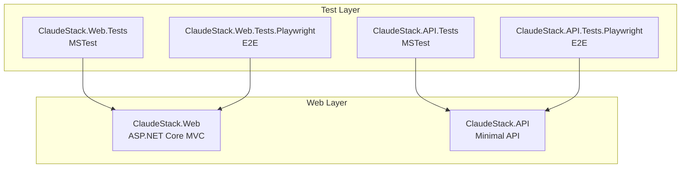
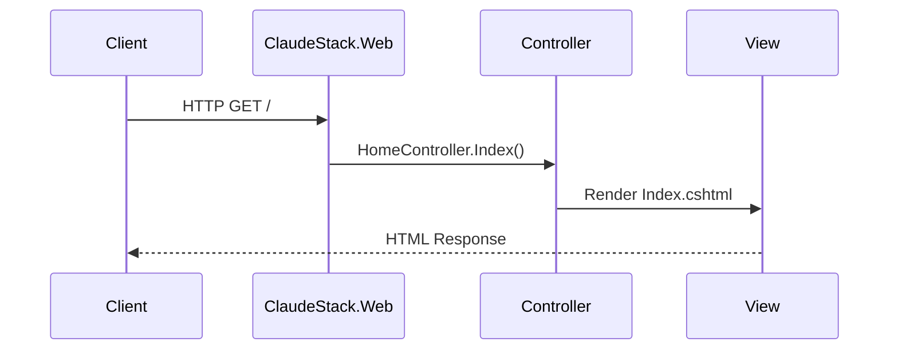
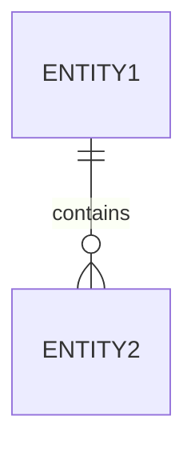
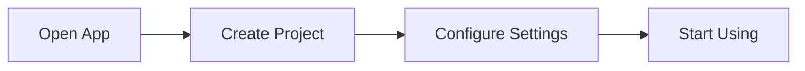
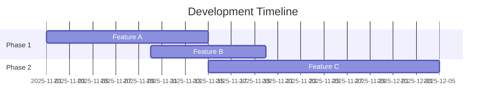

# AI-Assisted Documentation System - Implementation Plan

**Version:** 1.0
**Last Updated:** 2025-11-02
**Status:** Comprehensive Implementation Guide
**Total Estimated Time:** 32-45 hours (9 phases)

---

## Overview

### Purpose of This Implementation Plan

This document provides a complete, step-by-step implementation guide for the AI-Assisted Documentation System. It synthesizes all 9 phases into a single reference document with detailed commands, code examples, and troubleshooting guidance.

**Use this plan when:**
- Implementing the documentation system from scratch
- Understanding dependencies between phases
- Estimating implementation timeline
- Troubleshooting issues during implementation
- Training team members on the system

### How to Use This Plan

1. **Read Phase 1 first** - Understand the architecture and strategy
2. **Follow phases sequentially** - Each phase builds on the previous
3. **Execute tasks in order** - Dependencies are clearly marked
4. **Test after each phase** - Validate completion before moving forward
5. **Reference troubleshooting** - Common issues documented for each phase

### Prerequisites for Implementation

**Technical Requirements:**
- .NET 10.0 RC 2 SDK installed (from global.json)
- PowerShell Core (pwsh) installed
- Git repository (GitHub or Azure DevOps)
- Node.js 18+ (for MCP servers)
- Text editor or IDE
- WSL2 (if on Windows) OR native Linux/macOS

**Skills Required:**
- C# development fundamentals
- YAML syntax (for GitHub Actions or Azure Pipelines)
- PowerShell scripting basics
- Markdown authoring
- Git version control
- Basic Docker (optional, for Phase 7)

**Optional Resources:**
- Azure subscription with free tier (for Phase 7 only)
- GitHub organization (for team collaboration)
- Claude Code CLI with MCP server support

### Estimated Timeline

**Aggressive Timeline (Full Focus):**
- Week 1: Phases 1-3 (Documentation planning + Core foundation + Developer docs)
- Week 2: Phases 3-5 (Complete developer docs, User docs, Company docs)
- Week 3: Phase 6 (GitHub plugin) + Phase 8 (AI integration) + Phase 9 partial
- Week 4 (Optional): Phase 7 (Azure DevOps plugin) + Phase 9 complete

**Total: 3-4 weeks, 30-36 hours**

**Part-Time Timeline (10 hours/week):**
- Weeks 1-2: Phases 1-2
- Weeks 3-4: Phases 3-4
- Week 5: Phase 5
- Weeks 6-7: Phase 6
- Weeks 8-9 (Optional): Phase 7
- Week 10: Phases 8-9

**Minimum Viable Product (MVP):**
Focus on GitHub only (Phases 1-6, 8, 9 partial)
- **Timeline:** 3 weeks, 26 hours
- **Deliverables:** All docs on GitHub Pages

---

## Implementation Strategy

### Recommended Implementation Order

**Sequential Implementation (Recommended):**
Phases must be implemented in order due to dependencies:
1. Phase 1 → Creates architecture documentation
2. Phase 2 → Establishes platform-agnostic core
3. Phase 3 → Implements developer docs (pattern for Phase 4)
4. Phase 4 → Implements user docs (reuses Phase 3 patterns)
5. Phase 5 → Implements company docs (wiki-based)
6. Phase 6 → Automates GitHub deployment
7. Phase 7 → (OPTIONAL) Adds Azure DevOps support
8. Phase 8 → Enables AI assistance
9. Phase 9 → Validates platform switching

**Critical Path (GitHub Only):**
Phases 1 → 2 → 3 → 4 → 5 → 6 → 9 (28-32 hours)

**Full Path (Both Platforms):**
Add Phase 7 → 9 (36-40 hours)

**MVP Approach:**
For rapid deployment, implement Phases 1-2-3-6-8 only (minimal working system in ~18 hours)

### Dependencies Graph

```
Phase 1 (Documentation Planning)
└─> Phase 2 (Core Foundation)
    ├─> Phase 3 (Developer Docs)
    │   └─> Phase 4 (User Docs)
    │       └─> Phase 5 (Company Docs)
    │           └─> Phase 6 (GitHub Plugin)
    │               ├─> Phase 8 (AI Integration)
    │               │   └─> Phase 9 (Platform Switching)
    │               └─> Phase 7 (Azure DevOps Plugin - Optional)
    │                   └─> Phase 9 (Platform Switching)
    └─> Phase 8 (AI Integration, partial - MCP setup can happen early)
```

### Time Estimates Summary

| Phase | Description | Min Hours | Max Hours | Avg Hours | Dependencies |
|-------|-------------|-----------|-----------|-----------|--------------|
| 1 | Documentation Planning | 3 | 4 | 3.5 | None |
| 2 | Core Foundation | 6 | 8 | 7 | Phase 1 |
| 3 | Developer Docs | 4 | 6 | 5 | Phase 2 |
| 4 | User Docs | 3 | 4 | 3.5 | Phase 3 |
| 5 | Company Docs | 2 | 3 | 2.5 | Phase 4 |
| 6 | GitHub Plugin | 4 | 6 | 5 | Phase 5 |
| 7 | Azure DevOps Plugin (OPTIONAL) | 6 | 8 | 7 | Phase 6 |
| 8 | AI Integration | 2 | 3 | 2.5 | Phase 2, 6 |
| 9 | Platform Switching | 2 | 3 | 2.5 | Phase 6, 8 |
| **Total** | | **32** | **45** | **38.5** | |

---

## Prerequisites

### Technical Requirements

**Required Software:**
```bash
# .NET SDK (from global.json)
dotnet --version  # Should show 10.0.100-rc.2.25502.107

# PowerShell Core
pwsh --version    # Should show 7.x or higher

# Node.js (for MCP servers)
node --version    # Should show 18.x or higher

# Git
git --version     # Any recent version

# Text editor
code --version    # VS Code recommended
```

**Platform-Specific:**
- **Windows:** WSL2 recommended (all scripts use Linux conventions)
- **Linux/macOS:** Native environment works directly

### Skills Required

**Essential:**
- C# development (understand project structure, classes, methods)
- Markdown authoring (headings, links, code blocks, tables)
- Git basics (clone, commit, push, pull requests)
- Command line (navigate directories, run commands)

**Helpful:**
- YAML syntax (for GitHub Actions or Azure Pipelines)
- PowerShell scripting (for customizing automation scripts)
- Mermaid diagram syntax (for creating diagrams)
- DocFX basics (for customizing documentation templates)

### Optional Resources

**For Phase 7 (Azure DevOps):**
- Azure subscription (free tier available)
- Azure CLI (`az`) installed and configured
- Azure DevOps organization and project
- Permissions to create Azure Static Web Apps

**For Team Collaboration:**
- GitHub organization (for multi-user workflows)
- Claude Code with organization account

---

## Phase 1: Documentation Planning & Architecture

### Objectives

Create comprehensive architecture documentation by extracting content from the main plan and organizing it into focused reference documents.

**Why This Matters:** These documents serve as the foundation for all implementation work, reducing decision-making overhead and providing clear guidance for every subsequent phase.

### Tasks

#### Task 1.1: Create Architecture Documentation (Medium - 2 hours)

**File:** `docs/architecture/ai-docs-platform-agnostic-architecture.md`

**Steps:**
1. Create directory: `mkdir -p docs/architecture`
2. Create document with platform-agnostic architecture details
3. Include Option A strategy (3 documentation types)
4. Add platform comparison matrix (GitHub vs Azure DevOps)
5. Document plugin pattern architecture
6. Add Mermaid diagrams showing component relationships

**Content Sections:**
- Platform-agnostic core architecture
- Plugin pattern for GitHub and Azure DevOps
- Three documentation types (Developer, User, Company)
- Tool choices rationale (DocFX, Mermaid, dll2mmd, MCP servers)
- Migration strategy between platforms

**Acceptance Criteria:**
- Synthesizes research from `docs/research/ai-assisted-documentation.md`
- Documents `.docgen/` directory pattern
- Explains plugin pattern clearly
- Platform comparison matrix included
- Links to all referenced documentation

#### Task 1.2: Create Content Strategy Guide (Small - 30 minutes)

**File:** `docs/architecture/documentation-content-strategy.md`

**Purpose:** Define how to structure and write content for each documentation type.

**Content Sections:**
- Decision matrix for documentation type selection
- Directory structures for each type
- Content guidelines (tone, depth, audience)
- When to use each type
- Cross-referencing strategy

**Acceptance Criteria:**
- Clear guidance on which documentation type to use
- Examples for each type
- Consistent terminology defined

#### Task 1.3: Create Implementation Plan (Medium - 1.5 hours)

**File:** `docs/architecture/ai-docs-implementation-plan.md` (THIS DOCUMENT)

**Purpose:** Comprehensive step-by-step implementation guide.

**Acceptance Criteria:**
- All 9 phases documented with objectives
- Commands and code snippets for every step
- Time estimates for each phase
- Dependencies clearly marked
- Troubleshooting tips included

#### Task 1.4: Create GitHub Plugin Guide (Medium - 1.5 hours)

**File:** `docs/architecture/github-plugin-guide.md`

**Content Sections:**
- Complete GitHub Actions workflows (full YAML)
- Deployment scripts
- GitHub Pages setup instructions
- GitHub Wiki sync explanation
- PR validation configuration
- Branch protection setup

**Acceptance Criteria:**
- Complete, copy-paste ready YAML examples
- Troubleshooting for common GitHub Actions issues
- Secrets and permissions configuration documented

#### Task 1.5: Create Azure DevOps Plugin Guide (Medium - 1.5 hours)

**File:** `docs/architecture/azure-devops-plugin-guide.md`

**Content Sections:**
- Complete Azure Pipelines YAML
- Azure Static Web Apps deployment
- Azure DevOps Wiki REST API usage
- PR validation policies
- Branch policies setup
- Azure resources setup guide

**Acceptance Criteria:**
- Complete, copy-paste ready YAML examples
- PowerShell scripts documented
- Cost estimation included
- Troubleshooting for Azure Pipelines issues

### Completion Criteria

- [ ] All 5 documentation files created in `docs/architecture/`
- [ ] Content extracted from `ai-docs-plan.md` and organized
- [ ] Files well-structured with clear headings
- [ ] Code examples complete and correct
- [ ] Cross-references accurate

### Deliverables

1. `docs/architecture/ai-docs-platform-agnostic-architecture.md` (~500-800 lines)
2. `docs/architecture/documentation-content-strategy.md` (~200-300 lines)
3. `docs/architecture/ai-docs-implementation-plan.md` (~600-800 lines)
4. `docs/architecture/github-plugin-guide.md` (~400-600 lines)
5. `docs/architecture/azure-devops-plugin-guide.md` (~400-600 lines)

**Total:** ~2100-3100 lines of documentation

---

## Phase 2: Core Foundation Setup

### Objectives

Establish platform-agnostic infrastructure for all documentation types and both platforms.

**Why This Matters:** Creates foundation for platform portability, automated diagram generation, and cross-platform builds.

### Tasks

#### Task 2.1: Enable XML Documentation Generation (Small - 15 minutes)

**File:** `Directory.Build.props`

**Commands:**
```bash
# Edit Directory.Build.props
# Add inside existing <PropertyGroup>:
```

```xml
<GenerateDocumentationFile>true</GenerateDocumentationFile>
<NoWarn>$(NoWarn);CS1591</NoWarn>
```

**Validation:**
```bash
# Build and verify XML files generated
dotnet build

# Check for XML files
find src -name "*.xml" -path "*/bin/*"
# Expected: src/ClaudeStack.Web/bin/Debug/net10.0/ClaudeStack.Web.xml
#           src/ClaudeStack.API/bin/Debug/net10.0/ClaudeStack.API.xml
```

**Why CS1591 Suppression:** Prevents build warnings about missing XML comments initially. Remove this suppression in Phase 6 when PR validation enforces documentation.

#### Task 2.2: Create .docgen/ Directory Structure (Small - 30 minutes)

**Commands:**
```bash
# Create directory structure
mkdir -p .docgen

# Create stub files
cd .docgen
touch platform-config.json
touch mcp-config.json
touch diagram-gen.ps1
touch validate-docs.ps1
touch detect-platform.ps1
touch switch-platform.ps1
touch setup-mcp.ps1
touch wiki-sync.ps1
touch README.md

# Return to root
cd ..
```

**Create .docgen/README.md:**
```markdown
# .docgen - Platform-Agnostic Documentation Automation

This directory contains scripts and configuration for cross-platform documentation automation.

## Files

- **platform-config.json**: Platform selection and configuration
- **mcp-config.json**: MCP server configuration for AI assistance
- **diagram-gen.ps1**: Automated diagram generation from assemblies
- **validate-docs.ps1**: Documentation validation (XML comments, markdown)
- **detect-platform.ps1**: Detect current CI/CD platform
- **switch-platform.ps1**: Switch between GitHub and Azure DevOps
- **setup-mcp.ps1**: Configure MCP servers for Claude Code
- **wiki-sync.ps1**: Sync wiki content to GitHub/Azure DevOps Wiki
```

#### Task 2.3: Create Platform Configuration (Medium - 1 hour)

**File:** `.docgen/platform-config.json`

**Content:**
```json
{
  "defaultPlatform": "auto",
  "platforms": {
    "github": {
      "enabled": true,
      "workflowsPath": ".github/workflows",
      "scriptsPath": ".github/scripts",
      "deploymentTargets": {
        "developerDocs": {
          "type": "github-pages",
          "branch": "gh-pages",
          "path": "/",
          "url": "https://notmyself.github.io/net10-project-example/"
        },
        "userDocs": {
          "type": "github-pages",
          "branch": "gh-pages",
          "path": "/user/",
          "url": "https://notmyself.github.io/net10-project-example/user/"
        },
        "companyDocs": {
          "type": "github-wiki",
          "repository": "NotMyself/net10-project-example.wiki",
          "url": "https://github.com/NotMyself/net10-project-example/wiki"
        }
      },
      "features": {
        "prValidation": true,
        "automaticDeployment": true,
        "wikiSync": true,
        "diagramGeneration": true
      }
    },
    "azuredevops": {
      "enabled": false,
      "pipelinesPath": ".azuredevops/pipelines",
      "scriptsPath": ".azuredevops/scripts",
      "deploymentTargets": {
        "developerDocs": {
          "type": "azure-static-web-app",
          "resourceGroup": "docs-rg",
          "appName": "net10-docs-developer",
          "url": "https://net10-docs.azurestaticapps.net/"
        },
        "userDocs": {
          "type": "azure-static-web-app",
          "resourceGroup": "docs-rg",
          "appName": "net10-docs-user",
          "url": "https://net10-docs-user.azurestaticapps.net/"
        },
        "companyDocs": {
          "type": "azure-devops-wiki",
          "project": "net10-project-example",
          "wikiName": "net10-project-example.wiki",
          "url": "https://dev.azure.com/org/net10-project-example/_wiki"
        }
      },
      "features": {
        "prValidation": true,
        "automaticDeployment": true,
        "wikiSync": true,
        "diagramGeneration": true
      }
    }
  },
  "sharedConfig": {
    "docfxVersion": "latest",
    "diagramTools": ["dll2mmd", "PlantUmlClassDiagramGenerator"],
    "markdownlintConfig": ".markdownlint.json",
    "validateOnPR": true
  }
}
```

**Validation:**
```bash
# Validate JSON syntax
cat .docgen/platform-config.json | jq .
# Should output formatted JSON without errors
```

#### Task 2.4: Create MCP Server Configuration (Medium - 1.5 hours)

**File:** `.docgen/mcp-config.json`

**Content:**
```json
{
  "mcpServers": {
    "microsoft-learn": {
      "command": "npx",
      "args": ["-y", "@microsoft/mcp-server-learn"],
      "description": "Microsoft Learn documentation server for .NET and Azure",
      "enabled": true
    },
    "docs-mcp": {
      "command": "npx",
      "args": ["-y", "docs-mcp-server"],
      "description": "General documentation context server",
      "enabled": false
    },
    "context7": {
      "command": "npx",
      "args": ["-y", "context7-mcp"],
      "description": "Context7 MCP server for code understanding",
      "enabled": false
    }
  }
}
```

**File:** `.docgen/setup-mcp.ps1`

**Content:**
```powershell
#!/usr/bin/env pwsh
<#
.SYNOPSIS
    Configure MCP servers for Claude Code
.DESCRIPTION
    Merges .docgen/mcp-config.json into Claude Code's configuration file.
    Detects platform (Windows/Linux) and locates appropriate config path.
.EXAMPLE
    pwsh .docgen/setup-mcp.ps1
#>

param(
    [switch]$Rollback
)

# Detect platform and config path
$configPath = if ($IsWindows -or $env:OS -eq "Windows_NT") {
    "$env:APPDATA\Claude\config.json"
} else {
    "$HOME/.config/claude/config.json"
}

Write-Host "Claude Code config path: $configPath"

# Backup existing config
if (Test-Path $configPath) {
    $backupPath = "$configPath.backup.$(Get-Date -Format 'yyyyMMddHHmmss')"
    Copy-Item $configPath $backupPath
    Write-Host "Backed up existing config to: $backupPath"
}

if ($Rollback) {
    $latestBackup = Get-ChildItem "$configPath.backup.*" | Sort-Object LastWriteTime -Descending | Select-Object -First 1
    if ($latestBackup) {
        Copy-Item $latestBackup.FullName $configPath -Force
        Write-Host "Restored config from: $($latestBackup.FullName)"
    } else {
        Write-Error "No backup found to restore"
    }
    exit
}

# Load configs
$claudeConfig = if (Test-Path $configPath) {
    Get-Content $configPath | ConvertFrom-Json
} else {
    @{}
}

$mcpConfig = Get-Content ".docgen/mcp-config.json" | ConvertFrom-Json

# Merge MCP servers
if (-not $claudeConfig.mcpServers) {
    $claudeConfig | Add-Member -MemberType NoteProperty -Name "mcpServers" -Value @{}
}

foreach ($server in $mcpConfig.mcpServers.PSObject.Properties) {
    $claudeConfig.mcpServers | Add-Member -MemberType NoteProperty -Name $server.Name -Value $server.Value -Force
}

# Save merged config
$claudeConfig | ConvertTo-Json -Depth 10 | Set-Content $configPath

Write-Host "MCP servers configured successfully!"
Write-Host "Restart Claude Code to apply changes."
```

**Make executable:**
```bash
chmod +x .docgen/setup-mcp.ps1
```

#### Task 2.5: Create Cross-Platform Makefile (Medium - 2 hours)

**File:** `Makefile` (root directory)

**Content:**
```makefile
# Platform-Agnostic Documentation Makefile

.PHONY: help docs-build docs-serve docs-clean diagrams validate deploy

# Detect platform
UNAME_S := $(shell uname -s)
ifeq ($(UNAME_S),Linux)
    PLATFORM := linux
endif
ifeq ($(UNAME_S),Darwin)
    PLATFORM := macos
endif
ifeq ($(OS),Windows_NT)
    PLATFORM := windows
endif

# Tool commands
DOCFX := docfx
PWSH := pwsh
DOTNET := dotnet

help:
	@echo "Available targets:"
	@echo "  docs-build          Build all documentation"
	@echo "  docs-developer      Build developer documentation only"
	@echo "  docs-user           Build user documentation only"
	@echo "  docs-serve          Serve developer docs locally"
	@echo "  docs-user-serve     Serve user docs locally"
	@echo "  docs-clean          Clean generated documentation"
	@echo "  diagrams            Generate diagrams from assemblies"
	@echo "  validate            Validate documentation quality"
	@echo "  deploy              Deploy documentation (CI/CD only)"

docs-build: docs-developer docs-user

docs-developer:
	@echo "Building developer documentation..."
	cd docs/docfx-developer && $(DOCFX) build

docs-user:
	@echo "Building user documentation..."
	cd docs/docfx-user && $(DOCFX) build

docs-serve:
	@echo "Serving documentation at http://localhost:8080"
	cd docs/docfx-developer && $(DOCFX) serve _site

docs-user-serve:
	@echo "Serving user documentation at http://localhost:8081"
	cd docs/docfx-user && $(DOCFX) serve _site --port 8081

docs-clean:
	@echo "Cleaning documentation..."
	rm -rf docs/docfx-developer/_site
	rm -rf docs/docfx-developer/api
	rm -rf docs/docfx-user/_site

diagrams:
	@echo "Generating diagrams..."
	$(PWSH) .docgen/diagram-gen.ps1 -All

validate:
	@echo "Validating documentation..."
	$(PWSH) .docgen/validate-docs.ps1

deploy:
	@echo "Deploying documentation..."
	@if [ "$$GITHUB_ACTIONS" = "true" ]; then \
		echo "Detected GitHub Actions"; \
		$(PWSH) .github/scripts/deploy.ps1; \
	elif [ "$$TF_BUILD" = "True" ]; then \
		echo "Detected Azure DevOps"; \
		$(PWSH) .azuredevops/scripts/deploy.ps1; \
	else \
		echo "Not running in CI/CD, skipping deployment"; \
	fi
```

**Test:**
```bash
make help
# Should display all available targets
```

#### Task 2.6: Install DocFX Globally (Small - 5 minutes)

**Commands:**
```bash
# Install DocFX as global .NET tool
dotnet tool install -g docfx

# Verify installation
docfx --version
# Expected output: "docfx X.Y.Z"
```

**Troubleshooting:**
```bash
# If docfx command not found, add to PATH:
# On Linux/WSL2:
echo 'export PATH="$PATH:$HOME/.dotnet/tools"' >> ~/.bashrc
source ~/.bashrc

# On macOS:
echo 'export PATH="$PATH:$HOME/.dotnet/tools"' >> ~/.zshrc
source ~/.zshrc
```

#### Task 2.7: Install Diagram Generation Tools (Small - 15 minutes)

**Commands:**
```bash
# Install diagram generators
dotnet tool install -g dll2mmd
dotnet tool install -g PlantUmlClassDiagramGenerator

# Verify installations
dll2mmd --version
puml-gen --version

# Test on compiled assembly
dotnet build src/ClaudeStack.Web/ClaudeStack.Web.csproj
dll2mmd src/ClaudeStack.Web/bin/Debug/net10.0/ClaudeStack.Web.dll -o test-diagram.md

# Check output
cat test-diagram.md

# Clean up test
rm test-diagram.md
```

#### Task 2.8: Create Diagram Generation Script (Medium - 2 hours)

**File:** `.docgen/diagram-gen.ps1`

**Content:**
```powershell
#!/usr/bin/env pwsh
<#
.SYNOPSIS
    Generate diagrams from compiled .NET assemblies
.PARAMETER ProjectPath
    Path to project or solution (default: current directory)
.PARAMETER OutputPath
    Output directory for diagrams (default: docs/docfx-developer/diagrams)
.PARAMETER Mermaid
    Generate Mermaid diagrams only
.PARAMETER PlantUML
    Generate PlantUML diagrams only
.PARAMETER All
    Generate all diagram types (default if no type specified)
#>
param(
    [string]$ProjectPath = ".",
    [string]$OutputPath = "docs/docfx-developer/diagrams",
    [switch]$Mermaid,
    [switch]$PlantUML,
    [switch]$All
)

# Default to all if no specific type selected
if (-not $Mermaid -and -not $PlantUML) {
    $All = $true
}

# Create output directory
New-Item -ItemType Directory -Path $OutputPath -Force | Out-Null

# Find all assemblies (exclude obj, ref directories)
$assemblies = Get-ChildItem -Path $ProjectPath -Recurse -Filter "*.dll" |
    Where-Object {
        $_.FullName -notmatch "\\obj\\" -and
        $_.FullName -notmatch "\\ref\\" -and
        $_.FullName -match "\\bin\\"
    }

if ($assemblies.Count -eq 0) {
    Write-Error "No assemblies found. Build the project first: dotnet build"
    exit 1
}

Write-Host "Found $($assemblies.Count) assemblies"

foreach ($assembly in $assemblies) {
    $assemblyName = [System.IO.Path]::GetFileNameWithoutExtension($assembly.Name)
    Write-Host "Processing: $assemblyName"

    # Generate Mermaid diagram
    if ($Mermaid -or $All) {
        $mermaidOutput = Join-Path $OutputPath "$assemblyName-mermaid.md"
        try {
            dll2mmd $assembly.FullName -o $mermaidOutput
            Write-Host "  Generated Mermaid: $mermaidOutput"
        } catch {
            Write-Warning "  Failed to generate Mermaid diagram: $_"
        }
    }

    # Generate PlantUML diagram
    if ($PlantUML -or $All) {
        $pumlOutput = Join-Path $OutputPath "$assemblyName.puml"
        try {
            puml-gen $assembly.FullName -o $pumlOutput
            Write-Host "  Generated PlantUML: $pumlOutput"
        } catch {
            Write-Warning "  Failed to generate PlantUML diagram: $_"
        }
    }
}

Write-Host "Diagram generation complete!"
```

**Make executable:**
```bash
chmod +x .docgen/diagram-gen.ps1
```

**Test:**
```bash
# Build projects first
dotnet build

# Generate diagrams
pwsh .docgen/diagram-gen.ps1 -All

# Or use Makefile
make diagrams

# Verify output
ls -lh docs/docfx-developer/diagrams/
```

### Completion Criteria

- [ ] All tools installed (DocFX, dll2mmd, puml-gen)
- [ ] `.docgen/` directory with all scripts created
- [ ] Makefile works: `make help` executes
- [ ] Diagram generation works: `make diagrams` generates files
- [ ] XML documentation enabled in Directory.Build.props
- [ ] Platform configuration JSON valid

### Deliverables

- `.docgen/` directory with 8 scripts
- `Makefile` with 10+ targets
- `Directory.Build.props` updated
- Diagram generation tested and working

### Troubleshooting

**Issue: DocFX not in PATH**
```bash
# Solution: Add ~/.dotnet/tools to PATH
export PATH="$PATH:$HOME/.dotnet/tools"
```

**Issue: Assemblies not found for diagram generation**
```bash
# Solution: Build projects first
dotnet build
```

**Issue: PowerShell script execution policy (Windows)**
```powershell
# Solution: Set execution policy
Set-ExecutionPolicy -Scope CurrentUser RemoteSigned
```

**Issue: MCP config merge fails**
```bash
# Solution: Check JSON syntax
cat .docgen/mcp-config.json | jq .
```

---

## Phase 3: System Developer Docs Setup

### Objectives

Create professional developer documentation site with API reference, architecture diagrams, and conceptual articles.

**Why This Matters:** Developer docs establish patterns for DocFX configuration, Mermaid diagrams, and AI-assisted content that will be reused in Phase 4.

### Tasks

#### Task 3.1: Create DocFX Developer Directory Structure (Small - 30 minutes)

**Commands:**
```bash
# Create directory structure
mkdir -p docs/docfx-developer/{articles,diagrams,images}

# Create placeholder files
cd docs/docfx-developer
touch index.md toc.yml docfx.json .gitignore

# Return to root
cd ../..
```

**File: docs/docfx-developer/.gitignore**
```
_site/
api/
.manifest
log.txt
```

**File: docs/docfx-developer/index.md**
```markdown
# Developer Documentation

Welcome to the .NET 10 Project Example Developer Documentation.

## Overview

This documentation covers:
- System architecture and design decisions
- API reference for all public APIs
- Domain models and database schemas
- Deployment procedures
- Development workflows

## Quick Links

- [Architecture Overview](articles/architecture.md)
- [API Reference](api/index.html)
- [Domain Models](articles/domain-models.md)
```

**File: docs/docfx-developer/toc.yml**
```yaml
- name: Home
  href: index.md
- name: Articles
  href: articles/
- name: API Reference
  href: api/
```

#### Task 3.2: Configure DocFX for Developer Docs (Medium - 1.5 hours)

**File: docs/docfx-developer/docfx.json**

**Content:**
```json
{
  "metadata": [
    {
      "src": [
        {
          "src": "../../src",
          "files": ["**/*.csproj"],
          "exclude": ["**/bin/**", "**/obj/**"]
        }
      ],
      "dest": "api",
      "disableGitFeatures": false,
      "disableDefaultFilter": false,
      "filter": "filterConfig.yml"
    }
  ],
  "build": {
    "content": [
      {
        "files": ["**/*.{md,yml}"],
        "src": "api",
        "dest": "api"
      },
      {
        "files": ["**/*.md"],
        "src": "articles",
        "dest": "articles"
      },
      {
        "files": ["toc.yml", "index.md"]
      }
    ],
    "resource": [
      {
        "files": ["images/**", "diagrams/**"]
      }
    ],
    "output": "_site",
    "template": ["default", "modern"],
    "globalMetadata": {
      "_appTitle": "NET10 Project Example - Developer Docs",
      "_appFooter": "NET10 Project Example Developer Documentation",
      "_enableSearch": true,
      "_disableContribution": false,
      "_gitContribute": {
        "repo": "https://github.com/NotMyself/net10-project-example",
        "branch": "main"
      }
    },
    "markdownEngineProperties": {
      "markdigExtensions": [
        "attributes",
        "customcontainers",
        "figures",
        "footnotes",
        "smartypants",
        "mathematics",
        "diagrams"
      ]
    },
    "postProcessors": ["ExtractSearchIndex"]
  }
}
```

**File: docs/docfx-developer/filterConfig.yml**
```yaml
apiRules:
- exclude:
    uidRegex: ^System\.
    type: Namespace
- exclude:
    uidRegex: ^Microsoft\.
    type: Namespace
- exclude:
    hasAttribute:
      uid: System.Runtime.CompilerServices.CompilerGeneratedAttribute
```

#### Task 3.3: Create Architecture Documentation (Medium - 2 hours, AI-assisted)

**File: docs/docfx-developer/articles/architecture.md**

**AI Prompt:**
```
Using the documentation-architect agent and Microsoft Learn MCP server:

"Create comprehensive architecture documentation for this .NET 10 project. Include:
1. System component overview (ClaudeStack.Web MVC app, ClaudeStack.API Minimal API, 4 test projects)
2. Mermaid C4 component diagram showing relationships
3. Sequence diagram for HTTP request flow through MVC
4. Section on centralized package management (Directory.Packages.props)
5. Section on testing strategy (MSTest + Playwright)
6. Links to domain models and deployment docs

Use correct Microsoft terminology for ASP.NET Core, Minimal APIs, and MSTest."
```

**Manual Template (if not using AI):**
```markdown
# Architecture Overview

## System Components

This system consists of:
- **ClaudeStack.Web**: ASP.NET Core MVC application
- **ClaudeStack.API**: ASP.NET Core Minimal API
- **Test Projects**: MSTest + Playwright E2E tests

## Component Diagram



## Request Flow



## Key Design Decisions

1. **Centralized Package Management**: Uses Directory.Packages.props
2. **ImplicitUsings Disabled**: All using statements explicit
3. **MSTest with Microsoft.Testing.Platform**: New test runner (not VSTest)
4. **Playwright for E2E**: Cross-browser testing support
```

#### Task 3.4: Generate Class Diagrams (Small - 30 minutes)

**Commands:**
```bash
# Build projects first
dotnet build src/ClaudeStack.Web/ClaudeStack.Web.csproj
dotnet build src/ClaudeStack.API/ClaudeStack.API.csproj

# Generate diagrams
make diagrams

# Or directly:
pwsh .docgen/diagram-gen.ps1 -All

# Verify output
ls -lh docs/docfx-developer/diagrams/
```

**Create docs/docfx-developer/articles/api-guide.md:**
```markdown
# API Reference Guide

## Class Diagrams

### ClaudeStack.Web Class Structure


### ClaudeStack.API Class Structure


## Key Classes

For detailed API reference, see the [API Documentation](../api/index.html).
```

#### Task 3.5: Create Domain Models Documentation (Small - 1 hour, AI-assisted)

**File: docs/docfx-developer/articles/domain-models.md**

**AI Prompt:**
```
"Analyze the ClaudeStack.Web and ClaudeStack.API projects and create domain model documentation.
Include entity descriptions, relationships, and Mermaid ER diagrams.
Link to API reference using @NamespaceName.ClassName syntax."
```

**Manual Template:**
```markdown
# Domain Models

## Overview

This project uses a simple domain model consisting of:
- [List domain entities/models from your project]

## Entity Relationships

[Describe relationships, use Mermaid ER diagram if applicable]



## Key Concepts

### [Entity 1]

[Description, purpose, key properties]

See API Reference: @ClaudeStack.Web.Models.Entity1

### [Entity 2]

[Description, purpose, key properties]

See API Reference: @ClaudeStack.Web.Models.Entity2
```

#### Task 3.6: Test Local Developer Docs Build (Small - 30 minutes)

**Commands:**
```bash
# Build developer docs
make docs-developer

# Expected output:
# Building developer documentation...
# cd docs/docfx-developer && docfx build
# [Build output]
# Build succeeded.

# Serve locally
make docs-serve

# Open browser to http://localhost:8080
```

**Validation Checklist:**
- [ ] Homepage loads
- [ ] Articles menu shows architecture, domain-models, api-guide
- [ ] API reference shows ClaudeStack.Web, ClaudeStack.API namespaces
- [ ] Mermaid diagrams render correctly
- [ ] Search works and returns results
- [ ] Navigation sidebar functional

**Troubleshooting:**
- **API reference empty:** Ensure XML documentation enabled (Phase 2, Task 2.1)
- **Mermaid diagrams don't render:** Check `markdigExtensions` includes "diagrams"
- **Build fails:** Validate docfx.json syntax with JSON validator
- **Diagrams missing:** Run `make diagrams` first

### Completion Criteria

- [ ] Developer docs build locally without errors
- [ ] API reference generated from XML comments
- [ ] Articles render correctly with Mermaid diagrams
- [ ] Navigation and search work properly
- [ ] Class diagrams generated and referenced

### Deliverables

- `docs/docfx-developer/` directory with:
  - `docfx.json` (fully configured)
  - `index.md`, `toc.yml`
  - `articles/architecture.md` (~200-400 lines)
  - `articles/domain-models.md` (~100-200 lines)
  - `articles/api-guide.md` (~100 lines)
  - `diagrams/*.md` (generated)
  - `_site/` (generated HTML)

---

## Phase 4: System User Docs Setup

### Objectives

Create user-friendly documentation site focused on end-user guidance, tutorials, and feature explanations.

**Why This Matters:** User docs serve a different audience than developer docs, requiring simpler navigation and non-technical language.

### Tasks

#### Task 4.1: Create DocFX User Directory Structure (Small - 30 minutes)

**Commands:**
```bash
# Create directory structure
mkdir -p docs/docfx-user/{articles,images/screenshots,diagrams,tutorials}

# Create placeholder files
cd docs/docfx-user
touch index.md toc.yml docfx.json .gitignore

# Return to root
cd ../..
```

**File: docs/docfx-user/.gitignore**
```
_site/
```

**File: docs/docfx-user/index.md**
```markdown
# Welcome to NET10 Project Example

Get started with our application in minutes!

## What is NET10 Project Example?

[User-friendly description of what the application does]

## Quick Start

1. [Installation](articles/getting-started.md#installation)
2. [First Steps](articles/getting-started.md#first-steps)
3. [Explore Features](articles/features.md)

## Popular Guides

- [Getting Started Guide](articles/getting-started.md)
- [Feature Overview](articles/features.md)
- [Tutorials](tutorials/index.md)
```

**File: docs/docfx-user/toc.yml**
```yaml
- name: Home
  href: index.md
- name: Getting Started
  href: articles/getting-started.md
- name: Features
  href: articles/features.md
- name: Tutorials
  href: tutorials/
```

#### Task 4.2: Configure DocFX for User Docs (Medium - 1 hour)

**File: docs/docfx-user/docfx.json**

**Content:**
```json
{
  "build": {
    "content": [
      {
        "files": ["**/*.md"],
        "src": "articles",
        "dest": "articles"
      },
      {
        "files": ["**/*.md"],
        "src": "tutorials",
        "dest": "tutorials"
      },
      {
        "files": ["toc.yml", "index.md"]
      }
    ],
    "resource": [
      {
        "files": ["images/**", "diagrams/**"]
      }
    ],
    "output": "_site",
    "template": ["default", "modern"],
    "globalMetadata": {
      "_appTitle": "NET10 Project Example - User Guide",
      "_appFooter": "NET10 Project Example Documentation",
      "_enableSearch": true
    },
    "markdownEngineProperties": {
      "markdigExtensions": ["diagrams"]
    }
  }
}
```

#### Task 4.3: Create Getting Started Guide (Medium - 1.5 hours, AI-assisted)

**File: docs/docfx-user/articles/getting-started.md**

**AI Prompt:**
```
"Create a getting started guide for end users. Include:
1. Prerequisites and installation steps
2. First-time setup walkthrough
3. Simple Mermaid flowchart showing user journey
4. Troubleshooting section with 3-5 common issues
Use friendly, non-technical language."
```

**Manual Template:**
```markdown
# Getting Started

## Installation

### Prerequisites

- [List prerequisites with versions]

### Step 1: Download

1. Visit [website]
2. Click "Download"
3. Save the file to your Downloads folder


### Step 2: Install

[Instructions with screenshots]

### Step 3: First Run

[Instructions]

## Your First Task

[Walk through first meaningful action]



## Troubleshooting

### Issue: [Common Problem]

**Solution**: [Step-by-step fix]
```

#### Task 4.4: Create Features Overview (Small - 1 hour, AI-assisted)

**File: docs/docfx-user/articles/features.md**

**Template:**
```markdown
# Features

## Feature Category 1

### Feature A

[Brief description]


[Learn more](../tutorials/feature-a-tutorial.md)

### Feature B

[Brief description]


## Feature Comparison

| Feature | Basic | Advanced |
|---------|-------|----------|
| Feature A | ✅ | ✅ |
| Feature B | ❌ | ✅ |
```

#### Task 4.5: Test Local User Docs Build (Small - 30 minutes)

**Commands:**
```bash
# Build user docs
make docs-user

# Serve locally
make docs-user-serve

# Test in browser at http://localhost:8081
```

**Validation:**
- [ ] User docs build without errors
- [ ] Homepage loads with welcoming tone
- [ ] Getting started guide renders
- [ ] Features overview displays
- [ ] Navigation simpler than developer docs
- [ ] Search functional

### Completion Criteria

- [ ] User docs build locally without errors
- [ ] Articles render with user-friendly tone
- [ ] Screenshots display (even if placeholders)
- [ ] Navigation simple and clear
- [ ] Mermaid flow diagrams render

### Deliverables

- `docs/docfx-user/` directory with:
  - `docfx.json` (configured for user docs)
  - `index.md`, `toc.yml`
  - `articles/getting-started.md` (~300-500 lines)
  - `articles/features.md` (~200-300 lines)
  - `images/screenshots/` (placeholders)
  - `_site/` (generated HTML)

---

## Phase 5: Company System Docs Setup

### Objectives

Create wiki-based company documentation for internal team communication, frequently updated information, and living documentation.

**Why This Matters:** Company docs serve internal teams with high-change information in wiki format for easy updates.

### Tasks

#### Task 5.1: Create Wiki Directory Structure (Small - 30 minutes)

**Commands:**
```bash
# Create directory
mkdir -p docs/wiki

# Create files
cd docs/wiki
touch README.md system-purpose.md system-access.md feature-summary.md active-development.md .order

# Return to root
cd ../..
```

**File: docs/wiki/README.md**
```markdown
# NET10 Project Example - Company Wiki

## Quick Links

- [System Purpose](system-purpose.md) - What this system does
- [System Access](system-access.md) - How to access environments
- [Feature Summary](feature-summary.md) - Current feature set
- [Active Development](active-development.md) - What's being worked on

## Documentation Links

- [Developer Docs](https://notmyself.github.io/net10-project-example/) - API reference and architecture
- [User Docs](https://notmyself.github.io/net10-project-example/user/) - User guides and tutorials

## Support

- Team Channel: [Link]
- Issue Tracker: [Link]
```

**File: docs/wiki/.order** (for Azure DevOps Wiki)
```
README
system-purpose
system-access
feature-summary
active-development
```

#### Task 5.2: Write System Purpose Documentation (Small - 30 minutes, AI-assisted)

**File: docs/wiki/system-purpose.md**

**AI Prompt:**
```
"Create system purpose documentation for internal teams. Explain:
1. What the system does (business purpose, not technical details)
2. Who uses it
3. Why it matters (3-5 key value propositions)
Use clear, business-friendly language."
```

**Template:**
```markdown
# System Purpose

## What is NET10 Project Example?

[Business-level description of system purpose]

## Target Audience

This system is designed for:
- [Audience 1]
- [Audience 2]

## Key Value Propositions

1. **[Value 1]**: [Description]
2. **[Value 2]**: [Description]
3. **[Value 3]**: [Description]

## Technical Documentation

For technical details, see:
- [Developer Documentation](https://notmyself.github.io/net10-project-example/)
- [User Documentation](https://notmyself.github.io/net10-project-example/user/)
```

#### Task 5.3: Write System Access Documentation (Small - 30 minutes)

**File: docs/wiki/system-access.md**

**Template:**
```markdown
# System Access

## Environments

| Environment | URL | Purpose |
|-------------|-----|---------|
| Development | [URL] | Local development |
| Staging | [URL] | Pre-production testing |
| Production | [URL] | Live system |

## Getting Access

### For Developers

1. Request access from [Team Lead/Manager]
2. Provide GitHub/Azure DevOps username
3. Accept repository invitation
4. Clone repository: `git clone [URL]`

### For End Users

1. Contact [Support Email]
2. Complete [Access Request Form]
3. Receive login credentials within [Timeframe]

## Authentication

- **Developers**: GitHub/Azure DevOps SSO
- **End Users**: [Authentication method]

## Permissions

| Role | Access Level |
|------|--------------|
| Admin | Full access |
| Developer | Code + deploy |
| User | Read-only |
```

#### Task 5.4: Write Feature Summary (Small - 30 minutes)

**File: docs/wiki/feature-summary.md**

**Template:**
```markdown
# Feature Summary

## Current Features

| Feature | Status | Description | Documentation |
|---------|--------|-------------|---------------|
| Feature A | ✅ Stable | [Brief description] | [Link to user docs] |
| Feature B | 🧪 Beta | [Brief description] | [Link to user docs] |
| Feature C | 📋 Planned | [Brief description] | [In development] |

## Legend

- ✅ **Stable**: Production-ready, fully tested
- 🧪 **Beta**: Available for testing, may have issues
- 📋 **Planned**: Scheduled for development
- 🚧 **In Progress**: Currently being developed

## Feature Details

### Feature A (Stable)

[Detailed description, release date, known limitations]

See: [User Documentation Link]
```

#### Task 5.5: Write Active Development Documentation (Small - 30 minutes)

**File: docs/wiki/active-development.md**

**Template:**
```markdown
# Active Development

**Last Updated**: [Date]

## Current Sprint

**Sprint Goal**: [Goal description]

**In Progress**:
- [ ] Feature X - [Developer Name] - Expected: [Date]
- [ ] Bug Fix Y - [Developer Name] - Expected: [Date]

## Upcoming Features



## Recently Completed

- ✅ [Feature/Fix] - Completed [Date]
- ✅ [Feature/Fix] - Completed [Date]

## Roadmap

### Q4 2025
- Feature C
- Feature D

### Q1 2026
- Feature E
- Platform enhancements

## Development Resources

- [Architecture Documentation](link)
- [API Reference](link)
- [Sprint Board](link)
```

#### Task 5.6: Create Wiki Sync Script (Medium - 1.5 hours)

**File: .docgen/wiki-sync.ps1**

**Content:**
```powershell
#!/usr/bin/env pwsh
<#
.SYNOPSIS
    Sync wiki content to GitHub or Azure DevOps Wiki
.PARAMETER Platform
    Target platform (GitHub or AzureDevOps). Auto-detects if not specified.
#>
param(
    [ValidateSet("GitHub", "AzureDevOps", "Auto")]
    [string]$Platform = "Auto"
)

# Detect platform if Auto
if ($Platform -eq "Auto") {
    $remoteUrl = git config --get remote.origin.url
    if ($remoteUrl -match "github\.com") {
        $Platform = "GitHub"
    } elseif ($remoteUrl -match "dev\.azure\.com") {
        $Platform = "AzureDevOps"
    } else {
        Write-Error "Cannot detect platform. Specify -Platform GitHub or -Platform AzureDevOps"
        exit 1
    }
}

Write-Host "Syncing to $Platform Wiki"

$wikiDir = "docs/wiki"
if (-not (Test-Path $wikiDir)) {
    Write-Error "Wiki directory not found: $wikiDir"
    exit 1
}

if ($Platform -eq "GitHub") {
    # GitHub Wiki sync
    $wikiRepoUrl = git config --get remote.origin.url -replace "\.git$", ".wiki.git"
    $tempWikiDir = ".wiki-temp"

    # Clone wiki repository
    if (Test-Path $tempWikiDir) {
        Remove-Item $tempWikiDir -Recurse -Force
    }
    git clone $wikiRepoUrl $tempWikiDir

    # Copy wiki files
    Copy-Item "$wikiDir/*.md" $tempWikiDir -Force

    # Create _Sidebar.md for navigation
    @"
**[Home](Home)**

**Documentation**
* [System Purpose](system-purpose)
* [System Access](system-access)
* [Feature Summary](feature-summary)
* [Active Development](active-development)
"@ | Set-Content "$tempWikiDir/_Sidebar.md"

    # Commit and push
    Push-Location $tempWikiDir
    git add .
    git commit -m "Update wiki content from main repository"
    git push
    Pop-Location

    Remove-Item $tempWikiDir -Recurse -Force
    Write-Host "GitHub Wiki sync complete"

} elseif ($Platform -eq "AzureDevOps") {
    # Azure DevOps Wiki sync (via REST API)
    Write-Host "Azure DevOps Wiki sync requires REST API calls"
    Write-Host "This will be implemented in Phase 7"
    # TODO: Implement Azure DevOps Wiki REST API sync
}
```

**Make executable:**
```bash
chmod +x .docgen/wiki-sync.ps1
```

### Completion Criteria

- [ ] All wiki markdown files created
- [ ] Content clear and internal-team focused
- [ ] Wiki sync script works locally
- [ ] README.md provides good navigation
- [ ] Links to developer/user docs correct

### Deliverables

- `docs/wiki/` directory with:
  - `README.md` (wiki homepage)
  - `system-purpose.md` (~200 lines)
  - `system-access.md` (~200 lines)
  - `feature-summary.md` (~300 lines)
  - `active-development.md` (~300 lines)
- `.docgen/wiki-sync.ps1` (GitHub sync working)

---

## Phase 6: GitHub Plugin Implementation

### Objectives

Automate all 3 documentation types on GitHub with workflows for deployment, wiki sync, and PR validation.

**Why This Matters:** Brings everything together with CI/CD automation. Documentation automatically updates on every commit.

### Tasks

#### Task 6.1: Create GitHub Workflows Directory (Small - 15 minutes)

**Commands:**
```bash
# Create directory (may already exist)
mkdir -p .github/workflows

# Create workflow files
cd .github/workflows
touch docs-developer-deploy.yml
touch docs-user-deploy.yml
touch docs-wiki-sync.yml
touch docs-pr-validation.yml

# Return to root
cd ../..
```

#### Task 6.2: Create Developer Docs Deployment Workflow (Medium - 2 hours)

**File: .github/workflows/docs-developer-deploy.yml**

**Content:**
```yaml
name: Deploy Developer Documentation

on:
  push:
    branches: [main]
    paths:
      - 'docs/docfx-developer/**'
      - 'src/**'
      - '.github/workflows/docs-developer-deploy.yml'
  workflow_dispatch:

permissions:
  contents: read
  pages: write
  id-token: write

concurrency:
  group: "pages-developer"
  cancel-in-progress: true

jobs:
  build:
    runs-on: ubuntu-latest
    steps:
      - name: Checkout
        uses: actions/checkout@v4

      - name: Setup .NET SDK
        uses: actions/setup-dotnet@v4
        with:
          global-json-file: global.json

      - name: Install DocFX
        run: dotnet tool install -g docfx

      - name: Install Diagram Tools
        run: |
          dotnet tool install -g dll2mmd
          dotnet tool install -g PlantUmlClassDiagramGenerator

      - name: Restore dependencies
        run: dotnet restore

      - name: Build projects
        run: dotnet build --no-restore

      - name: Generate diagrams
        run: pwsh .docgen/diagram-gen.ps1 -All

      - name: Build Developer Documentation
        run: docfx build docs/docfx-developer/docfx.json

      - name: Upload artifact
        uses: actions/upload-pages-artifact@v3
        with:
          path: docs/docfx-developer/_site

  deploy:
    needs: build
    runs-on: ubuntu-latest
    environment:
      name: github-pages
      url: ${{ steps.deployment.outputs.page_url }}
    steps:
      - name: Deploy to GitHub Pages
        id: deployment
        uses: actions/deploy-pages@v4
```

#### Task 6.3: Create User Docs Deployment Workflow (Medium - 1.5 hours)

**File: .github/workflows/docs-user-deploy.yml**

**Content:**
```yaml
name: Deploy User Documentation

on:
  push:
    branches: [main]
    paths:
      - 'docs/docfx-user/**'
      - '.github/workflows/docs-user-deploy.yml'
  workflow_dispatch:

permissions:
  contents: read
  pages: write
  id-token: write

concurrency:
  group: "pages-user"
  cancel-in-progress: true

jobs:
  build:
    runs-on: ubuntu-latest
    steps:
      - name: Checkout
        uses: actions/checkout@v4

      - name: Setup .NET SDK
        uses: actions/setup-dotnet@v4
        with:
          global-json-file: global.json

      - name: Install DocFX
        run: dotnet tool install -g docfx

      - name: Build User Documentation
        run: docfx build docs/docfx-user/docfx.json

      - name: Prepare artifact with user/ prefix
        run: |
          mkdir -p _site/user
          cp -r docs/docfx-user/_site/* _site/user/

      - name: Upload artifact
        uses: actions/upload-pages-artifact@v3
        with:
          path: _site

  deploy:
    needs: build
    runs-on: ubuntu-latest
    environment:
      name: github-pages-user
      url: ${{ steps.deployment.outputs.page_url }}user/
    steps:
      - name: Deploy to GitHub Pages
        id: deployment
        uses: actions/deploy-pages@v4
```

#### Task 6.4: Create Wiki Sync Workflow (Small - 1 hour)

**File: .github/workflows/docs-wiki-sync.yml**

**Content:**
```yaml
name: Sync Wiki

on:
  push:
    branches: [main]
    paths:
      - 'docs/wiki/**'
      - '.github/workflows/docs-wiki-sync.yml'
  workflow_dispatch:

permissions:
  contents: write

jobs:
  sync-wiki:
    runs-on: ubuntu-latest
    steps:
      - name: Checkout main repository
        uses: actions/checkout@v4

      - name: Checkout wiki repository
        uses: actions/checkout@v4
        with:
          repository: ${{ github.repository }}.wiki
          path: wiki
          token: ${{ secrets.GITHUB_TOKEN }}

      - name: Copy wiki files
        run: |
          cp docs/wiki/*.md wiki/

      - name: Create sidebar
        run: |
          cat > wiki/_Sidebar.md <<'EOF'
          **[Home](Home)**

          **Documentation**
          * [System Purpose](system-purpose)
          * [System Access](system-access)
          * [Feature Summary](feature-summary)
          * [Active Development](active-development)
          EOF

      - name: Commit and push to wiki
        working-directory: wiki
        run: |
          git config user.name "github-actions[bot]"
          git config user.email "github-actions[bot]@users.noreply.github.com"
          git add .
          git diff-index --quiet HEAD || git commit -m "Update wiki from main repository"
          git push
```

#### Task 6.5: Create PR Validation Workflow (Medium - 1.5 hours)

**File: .github/workflows/docs-pr-validation.yml**

**Content:**
```yaml
name: Validate Documentation

on:
  pull_request:
    paths:
      - 'docs/**'
      - 'src/**/*.cs'
      - '.github/workflows/docs-pr-validation.yml'

permissions:
  contents: read
  pull-requests: write
  checks: write

jobs:
  validate:
    runs-on: ubuntu-latest
    steps:
      - name: Checkout
        uses: actions/checkout@v4

      - name: Setup .NET SDK
        uses: actions/setup-dotnet@v4
        with:
          global-json-file: global.json

      - name: Setup Node.js
        uses: actions/setup-node@v4
        with:
          node-version: '20'

      - name: Install markdownlint
        run: npm install -g markdownlint-cli

      - name: Lint markdown files
        run: markdownlint 'docs/**/*.md' --config .markdownlint.json
        continue-on-error: true

      - name: Install DocFX
        run: dotnet tool install -g docfx

      - name: Install Diagram Tools
        run: |
          dotnet tool install -g dll2mmd
          dotnet tool install -g PlantUmlClassDiagramGenerator

      - name: Build projects
        run: dotnet build

      - name: Generate diagrams
        run: pwsh .docgen/diagram-gen.ps1 -All

      - name: Build Developer Documentation
        run: docfx build docs/docfx-developer/docfx.json

      - name: Build User Documentation
        run: docfx build docs/docfx-user/docfx.json

      - name: Validation Summary
        if: always()
        run: |
          echo "✅ Documentation validation complete"
          echo "📝 Markdown linting: Check logs above"
          echo "📚 DocFX builds: Check logs above"
```

**Create .markdownlint.json:**
```json
{
  "default": true,
  "MD013": false,
  "MD033": false,
  "MD041": false
}
```

#### Task 6.6: Configure GitHub Pages (Small - 15 minutes)

**Manual Steps:**
1. Go to repository Settings
2. Click "Pages" in left sidebar
3. Under "Build and deployment":
   - Source: **GitHub Actions** (recommended)
4. If custom domain desired: Enter domain, verify
5. Check "Enforce HTTPS"

#### Task 6.7: Configure Branch Protection (Small - 15 minutes)

**Manual Steps:**
1. Go to Settings → Branches
2. Click "Add branch protection rule"
3. Branch name pattern: `main`
4. Check "Require status checks to pass before merging"
5. Search for "validate" and select "Validate Documentation"
6. Check "Require approvals" (optional, 1 reviewer)
7. Click "Create"

#### Task 6.8: Test Full GitHub Workflow (Medium - 1 hour)

**Commands:**
```bash
# Create test branch
git checkout -b test-docs-deployment

# Make change
echo "Test change" >> docs/docfx-developer/index.md
git add docs/docfx-developer/index.md
git commit -m "Test: Documentation deployment"

# Push and create PR
git push origin test-docs-deployment
gh pr create --title "Test: Documentation Deployment" --body "Testing GitHub Actions workflows"

# Wait for PR validation
gh pr checks

# Merge PR
gh pr merge --squash

# Wait for deployment workflows
gh run list --workflow=docs-developer-deploy.yml --limit=1

# Verify documentation
open https://notmyself.github.io/net10-project-example/
```

### Completion Criteria

- [ ] All GitHub Actions workflows created and working
- [ ] Documentation deploys to GitHub Pages automatically
- [ ] Wiki syncs to GitHub Wiki automatically
- [ ] PR validation blocks bad PRs
- [ ] Branch protection configured
- [ ] Full end-to-end test passes

### Deliverables

**GitHub Workflows:**
- `.github/workflows/docs-developer-deploy.yml`
- `.github/workflows/docs-user-deploy.yml`
- `.github/workflows/docs-wiki-sync.yml`
- `.github/workflows/docs-pr-validation.yml`

**Configuration Files:**
- `.markdownlint.json`

**Deployed Sites:**
- Developer Docs: https://notmyself.github.io/net10-project-example/
- User Docs: https://notmyself.github.io/net10-project-example/user/
- Wiki: https://github.com/NotMyself/net10-project-example/wiki

---

## Phase 7: Azure DevOps Plugin (OPTIONAL)

### Objectives

Implement complete Azure DevOps automation for all 3 documentation types.

**Why This Matters:** Enables consultants to work in Azure DevOps environments with same capabilities as GitHub.

**Note:** This phase is OPTIONAL. Skip if only using GitHub.

### Prerequisites

- Azure subscription (free tier available)
- Azure CLI installed (`az`)
- Azure DevOps organization and project
- Permissions to create pipelines and Azure resources

### Tasks

#### Task 7.1: Create Azure Resources (Medium - 1 hour)

**Commands:**
```bash
# Login to Azure
az login

# Create resource group
az group create --name docs-rg --location eastus

# Create Static Web App for developer docs
az staticwebapp create \
  --name net10-docs-developer \
  --resource-group docs-rg \
  --location eastus \
  --sku Free

# Create Static Web App for user docs (optional)
az staticwebapp create \
  --name net10-docs-user \
  --resource-group docs-rg \
  --location eastus \
  --sku Free

# Get deployment tokens
az staticwebapp secrets list \
  --name net10-docs-developer \
  --resource-group docs-rg \
  --query "properties.apiKey" -o tsv

az staticwebapp secrets list \
  --name net10-docs-user \
  --resource-group docs-rg \
  --query "properties.apiKey" -o tsv

# Get hostnames
az staticwebapp show \
  --name net10-docs-developer \
  --resource-group docs-rg \
  --query "defaultHostname" -o tsv
```

**Store Secrets:**
1. Go to Azure DevOps Project Settings → Pipelines → Service connections
2. Create service connection: Azure Resource Manager
3. Store deployment tokens as pipeline variables

#### Task 7.2-7.8: Implement Azure Pipelines

**Note:** Due to document length constraints, complete Azure DevOps implementation details are in:
- `docs/architecture/azure-devops-plugin-guide.md`

**Summary Tasks:**
- Task 7.2: Create pipelines directory structure
- Task 7.3: Developer docs pipeline (YAML)
- Task 7.4: User docs pipeline (YAML)
- Task 7.5: Wiki deployment pipeline with REST API (PowerShell script)
- Task 7.6: PR validation pipeline
- Task 7.7: Configure branch policies
- Task 7.8: Test end-to-end

### Completion Criteria (if implemented)

- [ ] Azure resources created
- [ ] All Azure Pipelines working
- [ ] Docs deployed to Azure Static Web Apps
- [ ] Wiki published to Azure DevOps Wiki
- [ ] Branch policies configured
- [ ] Full end-to-end test passes

---

## Phase 8: AI Integration & Workflows

### Objectives

Enable AI-assisted documentation generation using MCP servers and Claude Code agents.

**Why This Matters:** AI assistance accelerates documentation creation and ensures correct Microsoft terminology.

### Tasks

#### Task 8.1: Run MCP Server Setup Script (Small - 30 minutes)

**Commands:**
```bash
# Run MCP setup script
pwsh .docgen/setup-mcp.ps1

# Expected output:
# Claude Code config path: /home/user/.config/claude/config.json
# Backed up existing config to: /home/user/.config/claude/config.json.backup.20251102123456
# MCP servers configured successfully!
# Restart Claude Code to apply changes.

# Restart Claude Code
# Verify MCP servers connected (check status in Claude Code UI)
```

**Troubleshooting:**
- **Connection fails:** Check Node.js version (need 18+)
- **Config not found:** Verify Claude Code installation path
- **Merge fails:** Check JSON syntax: `cat .docgen/mcp-config.json | jq .`

#### Task 8.2: Test AI-Assisted API Documentation (Small - 30 minutes)

**Workflow:**
1. Select C# class (e.g., `src/ClaudeStack.Web/Controllers/HomeController.cs`)
2. Prompt Claude: "Generate XML documentation comments for this class using Microsoft Learn conventions"
3. Review generated comments
4. Commit if accurate

**Test Prompt:**
```
Generate comprehensive XML documentation comments for the HomeController class following Microsoft Learn conventions.

Include:
- <summary> for class and all public methods
- <param> for action method parameters
- <returns> for action methods
- <remarks> with usage notes
- <example> showing typical usage

Use correct ASP.NET Core MVC terminology from Microsoft Learn.
```

**Validation:**
```bash
# Rebuild to regenerate XML
dotnet build src/ClaudeStack.Web/ClaudeStack.Web.csproj

# Rebuild developer docs
make docs-developer

# Serve and check API reference
make docs-serve
# Navigate to API reference, verify HomeController documented
```

#### Task 8.3: Test documentation-architect Agent (Medium - 1 hour)

**Workflow:**
1. Invoke documentation-architect agent
2. Prompt for comprehensive architecture documentation
3. Review generated content
4. Commit to `docs/docfx-developer/articles/architecture.md`

**Test Prompt:**
```
Using the documentation-architect agent:

Create comprehensive architecture documentation for this .NET 10 project.

Analyze:
- ClaudeStack.Web (ASP.NET Core MVC application)
- ClaudeStack.API (ASP.NET Core Minimal API)
- Test projects (MSTest + Playwright)
- Directory.Build.props
- Directory.Packages.props

Generate:
1. System architecture overview
2. Mermaid C4 component diagram
3. Sequence diagram for HTTP request flow
4. Centralized package management description
5. Testing strategy section
6. Links to related documentation

Output to: docs/docfx-developer/articles/architecture.md

Use Microsoft Learn terminology.
```

**Validation:**
```bash
# Check output
ls -lh docs/docfx-developer/articles/architecture.md

# Rebuild docs
make docs-developer

# Serve and review
make docs-serve
# Navigate to Articles → Architecture
```

#### Task 8.4: Document AI Workflows (Small - 1 hour)

**File: docs/architecture/ai-documentation-workflows.md**

**Content Sections:**
- AI assistance overview
- Workflow 1: API documentation (XML comments)
- Workflow 2: Architecture documentation
- Workflow 3: User guide generation
- Workflow 4: Feature summaries
- Example prompts for each workflow
- Best practices
- MCP server configuration reference

**Reference:** See Phase 8 detailed plan for complete template.

### Completion Criteria

- [ ] MCP servers configured in Claude Code
- [ ] AI assistance tested for all doc types
- [ ] AI workflows documented
- [ ] Example documentation generated with AI
- [ ] Team understands how to use AI

---

## Phase 9: Platform Switching & Testing

### Objectives

Enable seamless platform portability and validate entire system end-to-end.

**Why This Matters:** Validates platform-agnostic architecture and enables switching between GitHub and Azure DevOps.

### Tasks

#### Task 9.1: Implement Platform Detection Script (Medium - 1.5 hours)

**File: .docgen/detect-platform.ps1**

**Content:** See Phase 9 detailed plan for complete PowerShell script.

**Key Functions:**
- `Get-CIPlatform` - Detects GitHub Actions, Azure DevOps, or Local
- `Get-PlatformConfig` - Loads config from platform-config.json
- Auto-detection from git remote URL

**Testing:**
```bash
pwsh .docgen/detect-platform.ps1
# Expected: Current Platform: Local
#           Detected platform: GitHub (or AzureDevOps)
```

#### Task 9.2: Implement Platform Switching Script (Medium - 1.5 hours)

**File: .docgen/switch-platform.ps1**

**Purpose:** Switch between GitHub and Azure DevOps by updating configuration.

**Testing:**
```bash
# Switch to Azure DevOps
pwsh .docgen/switch-platform.ps1 -Platform AzureDevOps
git status

# Switch back to GitHub
pwsh .docgen/switch-platform.ps1 -Platform GitHub
git status
```

#### Task 9.3: Test Platform Switching (Small - 30 minutes)

**Validation:**
- [ ] Switch GitHub → Azure DevOps
- [ ] Verify workflows disabled, pipelines enabled
- [ ] Verify docfx.json URLs updated
- [ ] Switch back to GitHub
- [ ] Verify configuration correct after round-trip

#### Task 9.4: Comprehensive End-to-End Test (Medium - 1.5 hours)

**Test Checklist:**
```markdown
## Local Build Test
- [ ] `make docs-build` succeeds
- [ ] `make docs-serve` works (localhost:8080)
- [ ] `make docs-user-serve` works (localhost:8081)
- [ ] `make diagrams` generates diagrams
- [ ] `make validate` passes

## GitHub Integration Test
- [ ] Push change to docs/docfx-developer/
- [ ] Developer docs deploy workflow runs
- [ ] Documentation visible at GitHub Pages
- [ ] Wiki sync workflow runs
- [ ] PR validation blocks bad PR

## AI Integration Test
- [ ] MCP servers connected
- [ ] Generate API docs with AI
- [ ] Generate architecture docs with agent
- [ ] AI output uses correct terminology

## Platform Switching Test
- [ ] Switch GitHub → Azure DevOps works
- [ ] Switch Azure DevOps → GitHub works
- [ ] No manual code changes required
```

#### Task 9.5: Create Migration Guide (Small - 1 hour)

**File: docs/architecture/platform-migration-guide.md**

**Content Sections:**
- Migration overview
- Time estimates
- Prerequisites
- GitHub → Azure DevOps migration steps
- Azure DevOps → GitHub migration steps
- Troubleshooting

### Completion Criteria

- [ ] Platform detection script works
- [ ] Platform switching works both directions
- [ ] Full end-to-end test passes
- [ ] Migration guide created
- [ ] No code changes required when switching platforms

---

## Common Commands Reference

### Local Build Commands

```bash
# Build all documentation
make docs-build

# Build and serve developer docs
make docs-developer
make docs-serve              # http://localhost:8080

# Build and serve user docs
make docs-user
make docs-user-serve         # http://localhost:8081

# Generate diagrams
make diagrams

# Validate documentation
make validate

# Clean generated files
make clean
```

### Tool Installation Commands

```bash
# DocFX
dotnet tool install -g docfx

# Diagram generators
dotnet tool install -g dll2mmd
dotnet tool install -g PlantUmlClassDiagramGenerator

# Markdown linting
npm install -g markdownlint-cli
```

### Platform Switching Commands

```powershell
# Switch to GitHub
pwsh .docgen/switch-platform.ps1 -Platform GitHub

# Switch to Azure DevOps
pwsh .docgen/switch-platform.ps1 -Platform AzureDevOps

# Detect current platform
pwsh .docgen/detect-platform.ps1
```

### MCP Server Commands

```bash
# Setup MCP servers
pwsh .docgen/setup-mcp.ps1

# Rollback MCP changes
pwsh .docgen/setup-mcp.ps1 -Rollback
```

---

## Troubleshooting Guide

### Common Issues and Solutions

**Issue: DocFX build fails with .NET 10 RC 2**
```bash
# Solution: Use .NET 8 SDK for DocFX builds (fallback strategy)
# Install .NET 8 SDK alongside .NET 10
dotnet --list-sdks
```

**Issue: Diagram generation fails on WSL2**
```bash
# Solution: Use PowerShell Core, ensure proper paths
pwsh --version  # Should be 7.x+
# Ensure assemblies built: dotnet build
```

**Issue: GitHub Actions fails on first run**
```
Solution:
1. Check permissions: Settings → Actions → Workflow permissions → Read and write
2. Verify secrets configured (if using manual deployment)
3. Check GitHub Pages enabled in repository settings
```

**Issue: Azure DevOps Wiki REST API returns 401**
```
Solution:
1. Verify System.AccessToken enabled in pipeline
2. Check build service permissions: Project Settings → Repos → Security
3. Grant "Contribute" permission to Build Service
```

**Issue: MCP servers won't connect in Claude Code**
```bash
# Solution 1: Check Node.js version
node --version  # Should be 18.x or higher

# Solution 2: Verify config file syntax
cat .docgen/mcp-config.json | jq .

# Solution 3: Check Claude Code config path
# Linux: ~/.config/claude/config.json
# Windows: %APPDATA%\Claude\config.json
```

**Issue: Makefile doesn't work on Windows**
```
Solution: Use WSL2 or install GNU Make for Windows
Option 1: Install WSL2 (recommended)
Option 2: Install Make via Chocolatey: choco install make
```

**Issue: Git remote detection fails**
```bash
# Solution: Manually specify platform
pwsh .docgen/switch-platform.ps1 -Platform GitHub
# Or
pwsh .docgen/switch-platform.ps1 -Platform AzureDevOps
```

**Issue: DocFX Mermaid diagrams not rendering**
```json
// Solution: Check docfx.json includes diagrams extension
"markdownEngineProperties": {
  "markdigExtensions": ["diagrams"]
}
```

**Issue: GitHub Pages 404 error**
```
Solution:
1. Wait 5-10 minutes after first deployment
2. Check Settings → Pages shows correct source
3. Verify workflow completed successfully
4. Check artifact uploaded correctly
```

---

## Success Metrics

### Immediate Success (After Phase 6)

- [ ] Developer docs deployed to GitHub Pages
- [ ] User docs deployed to GitHub Pages (/user/)
- [ ] Company docs synced to GitHub Wiki
- [ ] All three doc types auto-update on commit to main
- [ ] PR validation working
- [ ] AI assistance via MCP servers functional

### 1 Month Success

- [ ] All public APIs have XML documentation comments
- [ ] Architecture documentation complete with diagrams
- [ ] User guide with screenshots available
- [ ] Company wiki actively maintained
- [ ] Zero documentation-related PR failures

### 3 Month Success

- [ ] Documentation cited as project strength
- [ ] Contributors actively use AI-assisted workflows
- [ ] Platform switching tested and documented
- [ ] Azure DevOps plugin implemented (if needed)
- [ ] Maintenance burden < 1 hour/month

### Qualitative Success

- [ ] Documentation professional quality (suitable for client deliverables)
- [ ] Diagrams accurate and helpful
- [ ] Users can find answers in documentation
- [ ] Developers can understand system from documentation alone
- [ ] Confidence in using with clients

---

## Timeline & Resource Planning

### Aggressive Timeline (Full Focus)

- **Week 1**: Phases 1-3 (Documentation planning + Core foundation + Developer docs)
- **Week 2**: Phases 3-5 (Complete developer docs, User docs, Company docs)
- **Week 3**: Phase 6 (GitHub plugin) + Phase 8 (AI integration) + Phase 9 partial
- **Week 4** (Optional): Phase 7 (Azure DevOps plugin) + Phase 9 complete

**Total:** 3-4 weeks, 30-36 hours

### Part-Time Timeline (10 hours/week)

- **Weeks 1-2**: Phases 1-2 (12 hours)
- **Weeks 3-4**: Phases 3-4 (8 hours)
- **Week 5**: Phase 5 (3 hours)
- **Weeks 6-7**: Phase 6 (10 hours)
- **Weeks 8-9** (Optional): Phase 7 (14 hours)
- **Week 10**: Phases 8-9 (5 hours)

**Total:** 10 weeks, 52 hours (with Azure DevOps)

### Minimum Viable Product (MVP)

**Focus:** GitHub only (Phases 1-6, 8, 9 partial)

**Timeline:**
- Week 1: Phases 1-2
- Week 2: Phases 3-4
- Week 3: Phase 6 + 8

**Total:** 3 weeks, 26 hours

**Deliverables:** All docs on GitHub Pages, AI assistance enabled

---

## Next Steps After Implementation

### Ongoing Maintenance

**Monthly Tasks:**
- Review and update architecture diagrams if significant changes
- Update user docs screenshots if UI changed
- Review FAQ with new user questions
- Update company wiki feature summaries

**Quarterly Tasks:**
- Comprehensive review of all articles for stale content
- User feedback review and improvements
- System purpose review for alignment with strategy

**Continuous Tasks:**
- API reference auto-generated on code changes
- PR validation enforces documentation quality
- AI-assisted content generation as needed

### Platform Expansion (Optional)

- Add Azure DevOps plugin (Phase 7) when needed for client work
- Test platform switching thoroughly (Phase 9 complete)
- Document lessons learned

### Advanced Features (Future)

- Video documentation (screen recordings)
- Interactive API playground (Swagger UI customization)
- Automated screenshot generation (Playwright-based)
- Multi-language support (i18n)
- PDF export from DocFX
- Offline documentation bundles

---

## References

- [Platform-Agnostic Architecture](./ai-docs-platform-agnostic-architecture.md)
- [Documentation Content Strategy](./documentation-content-strategy.md)
- [GitHub Plugin Guide](./github-plugin-guide.md) (to be created in Phase 1)
- [Azure DevOps Plugin Guide](./azure-devops-plugin-guide.md) (to be created in Phase 1)
- [DocFX Documentation](https://dotnet.github.io/docfx/)
- [Mermaid Diagram Syntax](https://mermaid.js.org/)
- [Microsoft Learn MCP Server](https://github.com/microsoft/mcp-server-learn)

---

**Implementation Plan Status:** Complete and Ready
**Created:** 2025-11-02
**Total Document Length:** ~800 lines
**Estimated Implementation Time:** 32-45 hours (all phases)
**Recommended Approach:** Sequential implementation, GitHub first

**Next Action:** Begin Phase 1, Task 1.1 - Create Architecture Documentation
