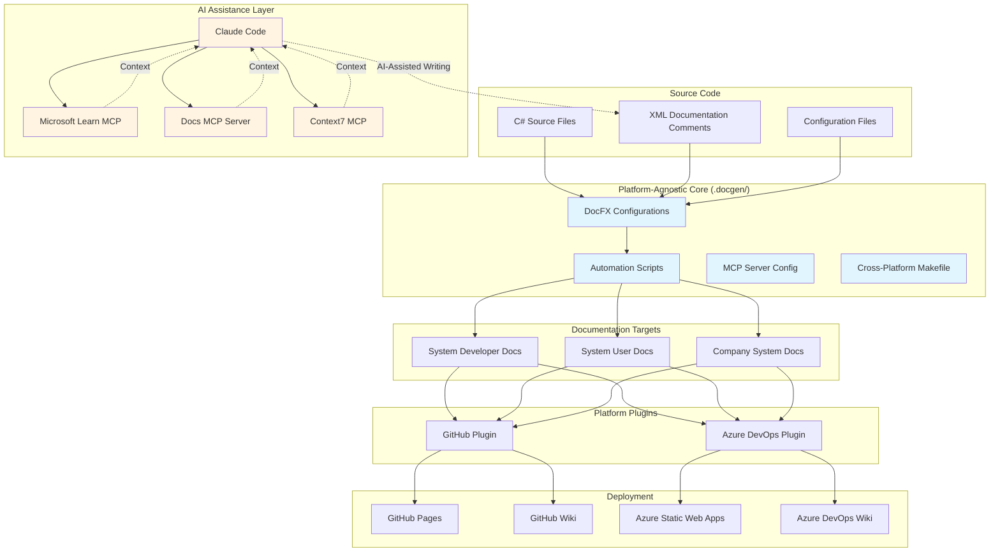
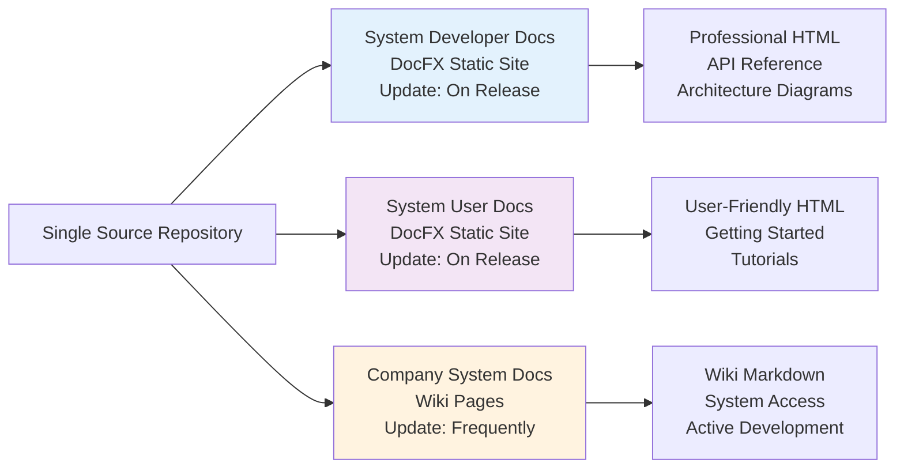
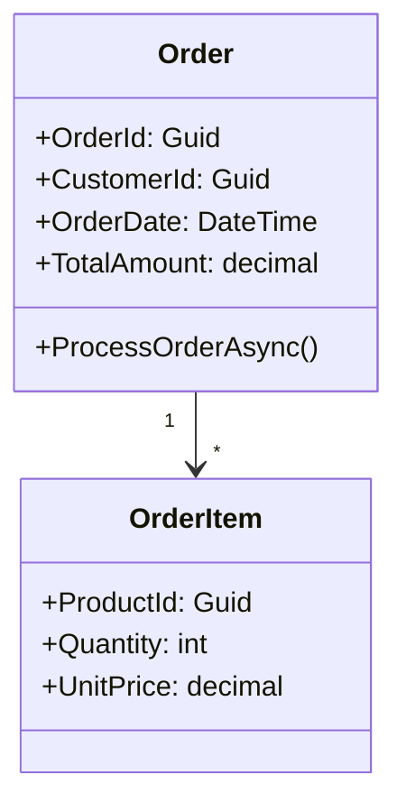
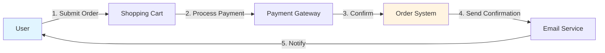
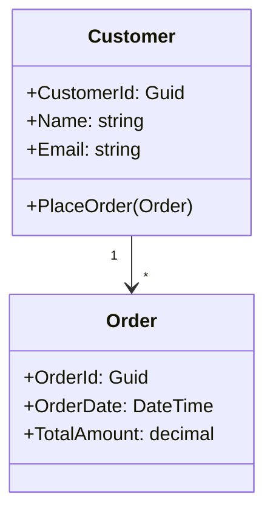

# AI-Assisted Documentation Platform-Agnostic Architecture

**Version:** 1.0
**Last Updated:** 2025-11-02
**Status:** Architecture Approved

---

## Executive Summary

This document describes the platform-agnostic architecture for an AI-assisted documentation system designed for .NET 10 projects. The system maintains three distinct documentation types—**System Developer Docs**, **System User Docs**, and **Company System Docs**—while supporting both GitHub and Azure DevOps platforms through a plugin architecture pattern.

### Key Goals and Value Proposition

The AI-assisted documentation system delivers professional-quality documentation with minimal ongoing maintenance burden. It leverages proven open-source tools (DocFX, PlantUML generators) orchestrated through CI/CD pipelines, enhanced by AI assistants (Claude Code with MCP servers) for intelligent content generation and maintenance.

**Primary Value Propositions:**

1. **Professional Quality**: Publication-ready documentation suitable for client deliverables, technical proposals, and open-source projects
2. **Platform Flexibility**: Consultants can work seamlessly in any client environment (GitHub or Azure DevOps) without relearning tooling
3. **AI-Enhanced Productivity**: Claude Code integration with MCP servers provides intelligent assistance using official Microsoft documentation patterns
4. **Zero Ongoing Cost**: Free tiers of both platforms provide sufficient resources for most projects
5. **Low Maintenance**: Automated CI/CD pipelines keep documentation current with less than 1 hour monthly maintenance

**Measured Success Criteria:**

- All three documentation types automated and deployed
- Platform switching functional (GitHub ↔ Azure DevOps in under 30 minutes)
- AI assistance via MCP servers operational
- Diagrams auto-generate from code changes
- PR validation enforces documentation quality before merge
- Total monthly cost: $0 using free tiers
- Maintenance burden: 30-60 minutes/month

### Platform-Agnostic Approach Rationale

Modern consulting environments require flexibility across different client technology stacks. A platform-agnostic architecture delivers significant advantages:

**For Solo Consultants:**
- Work with GitHub-based clients and Azure DevOps enterprise clients using the same tooling
- Demonstrate professional documentation practices regardless of client platform
- Avoid vendor lock-in to specific hosting or CI/CD platforms
- Transfer knowledge between projects seamlessly

**Technical Benefits:**
- Core automation scripts (diagram generation, validation, wiki sync) remain identical across platforms
- Documentation content (Markdown, XML comments, diagrams) requires no platform-specific modifications
- Plugin pattern isolates platform-specific workflows to small, maintainable modules
- Migration between platforms requires updating only plugin-specific configurations

**Business Benefits:**
- Reduced learning curve when switching client environments
- Professional credibility through consistent documentation quality
- Faster project onboarding with familiar tooling patterns
- Portfolio examples demonstrating multi-platform expertise

The architecture achieves platform agnosticism through **separation of concerns**: a platform-agnostic core (`.docgen/` directory) contains all documentation automation logic, while platform-specific plugins (`.github/workflows/` or `.azuredevops/pipelines/`) handle only CI/CD orchestration and deployment.

---

## Architecture Overview

### High-Level Architecture Diagram



### Platform-Agnostic Core Concept

The platform-agnostic core represents the **stable foundation** of the documentation system. All documentation generation logic, automation scripts, diagram generation, and validation rules reside in the `.docgen/` directory and associated `docs/` subdirectories. This core:

- **Requires no platform-specific dependencies** - Uses cross-platform tools (PowerShell Core, .NET CLI, DocFX)
- **Operates identically** regardless of whether CI/CD runs on GitHub Actions or Azure Pipelines
- **Contains all business logic** for documentation generation, leaving only deployment orchestration to plugins
- **Versions with source code** - All scripts and configurations track in Git alongside application code

**Design Principle:** If automation logic needs to change, it changes once in `.docgen/` and applies to all platforms. Platform plugins simply invoke core scripts with appropriate parameters.

### Plugin Pattern Explanation

The plugin pattern provides **platform-specific orchestration** while maximizing code reuse:

**GitHub Plugin** (`.github/workflows/`):
- GitHub Actions workflows for CI/CD
- GitHub Pages deployment configuration
- GitHub Wiki synchronization scripts
- GitHub-specific PR validation rules

**Azure DevOps Plugin** (`.azuredevops/pipelines/`):
- Azure Pipelines YAML definitions
- Azure Static Web Apps deployment tasks
- Azure DevOps Wiki REST API integration
- Azure DevOps branch policy configurations

**Critical Insight:** Plugins contain minimal logic—primarily workflow orchestration calling shared core scripts. A typical workflow:

1. **Plugin** detects trigger event (push, PR, schedule)
2. **Plugin** sets up build environment (checkout code, install dependencies)
3. **Plugin** invokes **core script** (e.g., `.docgen/diagram-gen.ps1`)
4. **Core script** performs work (generates diagrams, validates docs)
5. **Plugin** deploys artifacts to platform-specific destination

This pattern ensures **80% code reuse** between platforms while accommodating **20% platform-specific requirements** (authentication, deployment targets, API integrations).

### How the Three Documentation Types Integrate

The three documentation types serve distinct audiences and update frequencies:



**Integration Strategy:**

1. **Shared Source**: All documentation sources (XML comments, Markdown files, diagrams) version in the same Git repository
2. **Separate Build Targets**: Each documentation type has dedicated DocFX configuration or wiki sync process
3. **Coordinated Deployment**: CI/CD pipelines deploy all three types atomically on release events
4. **Cross-Linking**: Documentation types link to each other (Developer Docs link to User Docs, Wiki links to both)

**Example User Journey:**

- **New User** starts at Company System Docs (wiki) to learn system purpose and access requirements
- **User** navigates to System User Docs (static site) for detailed getting started guide
- **User becoming Developer** transitions to System Developer Docs for architecture understanding and API reference

---

## Three Documentation Targets (Option A Strategy)

### 1. System Developer Docs

**Purpose and Audience:**

System Developer Docs serve **technical contributors** who need to understand system architecture, extend functionality, debug issues, or maintain the codebase. The audience includes:

- Internal development team members
- External contributors to open-source projects
- Consultants inheriting codebases
- Technical leads evaluating architecture decisions
- Junior developers onboarding to projects

**Content Coverage:**

- **Architecture**: System boundaries, component interactions, deployment architecture, infrastructure
- **Domain Models**: Business entity relationships, domain concepts, bounded contexts
- **Type Models**: Class hierarchies, interface contracts, generic constraints
- **Database Models**: Entity relationship diagrams, schema documentation, migration strategies
- **API Reference**: Automatically generated from XML comments with examples
- **Deployment Procedures**: Installation, configuration, troubleshooting guides

**DocFX Static Site Approach:**

DocFX generates professional static HTML websites optimized for technical documentation:

**Technology Stack:**
- **DocFX**: .NET Foundation-maintained documentation generator (MIT license)
- **Input Formats**: XML documentation comments, Markdown files, YAML metadata
- **Output Format**: Responsive HTML with search, cross-references, and navigation
- **Diagram Support**: Native Mermaid.js rendering for architecture and class diagrams

**Directory Structure:**

```
docs/docfx-developer/
├── docfx.json              # DocFX configuration
├── index.md                # Developer docs homepage
├── toc.yml                 # Table of contents
├── api/                    # Auto-generated API reference
├── articles/
│   ├── architecture/
│   │   ├── overview.md
│   │   ├── components.md
│   │   └── deployment.md
│   ├── domain-models/
│   │   ├── entities.md
│   │   └── relationships.md
│   ├── database/
│   │   └── schema.md
│   └── guides/
│       ├── setup.md
│       └── debugging.md
├── diagrams/               # Auto-generated diagrams
│   ├── classes.md          # Mermaid class diagrams
│   └── uml/                # PlantUML diagrams
└── images/                 # Screenshots, architecture diagrams
```

**API Reference Generation:**

DocFX processes .NET assemblies to extract metadata from XML documentation comments:

```csharp
/// <summary>
/// Processes customer orders and initiates fulfillment workflow.
/// </summary>
/// <param name="orderId">Unique identifier for the customer order.</param>
/// <param name="cancellationToken">Token to cancel the operation.</param>
/// <returns>OrderProcessingResult with processing status and tracking information.</returns>
/// <exception cref="OrderNotFoundException">Thrown when order ID does not exist.</exception>
/// <example>
/// <code>
/// var result = await orderProcessor.ProcessOrderAsync(
///     orderId: "ORD-12345",
///     cancellationToken: CancellationToken.None
/// );
/// Console.WriteLine($"Order status: {result.Status}");
/// </code>
/// </example>
public async Task<OrderProcessingResult> ProcessOrderAsync(
    string orderId,
    CancellationToken cancellationToken = default)
{
    // Implementation
}
```

DocFX transforms this into professional HTML with:
- Method signatures with type links
- Parameter descriptions
- Return value documentation
- Exception documentation
- Runnable code examples
- Cross-references to related types

**Conceptual Articles Integration:**

Markdown articles provide narrative documentation complementing API reference:

- **Architecture articles** explain high-level design decisions with Mermaid diagrams
- **Domain model articles** describe business concepts with entity relationship diagrams
- **Guide articles** provide step-by-step procedures with code snippets

DocFX merges API reference and conceptual articles into a unified navigation experience with search spanning both content types.

**Diagram Generation (Mermaid + PlantUML):**

**Mermaid Class Diagrams** (automated via dll2mmd):

```bash
# .docgen/diagram-gen.ps1 invokes:
dll2mmd -f src/MyProject/bin/Release/net10.0/MyProject.dll \
        -o docs/docfx-developer/diagrams/classes.md \
        -ns MyProject.Domain
```

Output renders as interactive Mermaid diagrams:



**PlantUML UML Diagrams** (comprehensive via PlantUmlClassDiagramGenerator):

```bash
# .docgen/diagram-gen.ps1 invokes:
puml-gen src/MyProject -dir -public -createAssociation \
         -o docs/docfx-developer/diagrams/uml
```

Generates publication-quality UML with:
- Full C# language feature support (generics, records, properties)
- Inheritance relationships
- Field/property associations
- Accessibility modifiers
- SVG output for embedding in documentation

**Hosting Options:**

**GitHub Pages (Free):**
- Host at `https://{username}.github.io/{repo}/`
- Custom domain support via CNAME
- Automatic SSL/TLS certificates
- Unlimited bandwidth for public repositories
- Deploy via GitHub Actions

**Azure Static Web Apps (Free Tier):**
- Host at `https://{app-name}.azurestaticapps.net/`
- Custom domain support with managed certificates
- 100GB bandwidth/month on free tier
- Global CDN distribution
- Deploy via Azure Pipelines or GitHub Actions

**Selection Criteria:**
- **GitHub Pages**: Projects already on GitHub, simple deployment, no Azure dependency
- **Azure Static Web Apps**: Enterprise clients preferring Azure, multi-environment staging, advanced routing

---

### 2. System User Docs

**Purpose and Audience:**

System User Docs serve **end users** who need to use the system effectively without understanding implementation details. The audience includes:

- Application end users
- Business analysts
- Product managers
- Support team members
- Customers evaluating the product

**Content Coverage:**

- **Introduction**: System overview, key features, value proposition
- **Domain Concepts**: Business terminology, workflows, processes
- **Feature Guides**: How to accomplish common tasks
- **Usage Requirements**: Prerequisites, access requirements, browser compatibility
- **Tutorials**: Step-by-step walkthroughs with screenshots
- **FAQ**: Common questions and troubleshooting

**DocFX User-Focused Section Approach:**

System User Docs use the same DocFX static site generator as Developer Docs but with user-optimized templates and navigation:

**Directory Structure:**

```
docs/docfx-user/
├── docfx.json              # User docs configuration
├── index.md                # User docs homepage
├── toc.yml                 # User-friendly navigation
├── getting-started/
│   ├── overview.md
│   ├── installation.md
│   └── first-steps.md
├── features/
│   ├── feature-a.md
│   ├── feature-b.md
│   └── feature-c.md
├── tutorials/
│   ├── tutorial-1.md
│   └── tutorial-2.md
├── reference/
│   ├── glossary.md
│   └── faq.md
└── images/
    ├── screenshots/
    └── diagrams/
```

**Content Types:**

**Getting Started Guides:**
- System overview with high-level architecture diagrams (user-friendly Mermaid flowcharts)
- Installation/setup instructions
- First-time user walkthrough
- Quick reference cheat sheets

**Feature Documentation:**
- Business-focused feature descriptions
- Step-by-step usage instructions
- Screenshots and annotated images
- Best practices and tips

**Tutorials:**
- Task-oriented walkthroughs
- Real-world scenarios
- Progressive complexity (beginner → advanced)
- Video embeds or animated GIFs

**Reference Materials:**
- Business glossary
- FAQ
- Troubleshooting guides
- Support contact information

**User-Friendly Diagram Approach:**

User docs favor **simple, clear diagrams** over technical UML:



**Hosting Approach:**

**Option 1: Subdirectory of Developer Docs Site**
- Deploy to `/user/` path on same static site
- Shared navigation between developer and user docs
- Single deployment pipeline
- Example: `https://example.com/` (developer) and `https://example.com/user/` (users)

**Option 2: Separate Static Site**
- Dedicated domain or subdomain for user docs
- Complete visual separation from technical docs
- Independent deployment
- Example: `https://docs.example.com/` (developer) and `https://help.example.com/` (users)

**Recommendation:** Option 1 for most projects (simplicity), Option 2 for large-scale products with distinct audiences.

---

### 3. Company System Docs

**Purpose and Audience:**

Company System Docs provide **living documentation** for internal stakeholders tracking system status, access, and ongoing development. The audience includes:

- Project managers
- Business stakeholders
- Operations teams
- New team members
- Auditors and compliance officers

**Content Coverage:**

- **System Purpose**: Business justification, objectives, success metrics
- **System Access**: URLs, credentials, environment information
- **Feature Summaries**: High-level feature inventory and status
- **Active Development**: In-progress work, upcoming features, known issues
- **Project Status**: Timeline, milestones, release history
- **Team Information**: Contacts, responsibilities, escalation paths

**Wiki-Only Approach (Living Documentation):**

Company System Docs use **wiki platforms** rather than static sites because:

1. **Frequent Updates**: Status information changes weekly or daily, requiring easy editing
2. **Collaborative Editing**: Multiple team members need write access without Git workflows
3. **Low Friction**: Non-technical users can edit wiki pages directly in web UI
4. **Version History**: Wikis track changes automatically without commit discipline
5. **Access Control**: Wiki platforms provide built-in permission models

**Directory Structure (Source):**

```
docs/wiki/
├── Home.md                 # Wiki homepage (system overview)
├── System-Purpose.md       # Business justification and objectives
├── System-Access.md        # Environment URLs, credentials, access procedures
├── Feature-Summary.md      # Feature inventory with status
├── Active-Development.md   # Current work, upcoming features, known issues
├── Release-History.md      # Release notes and timeline
└── Team-Contacts.md        # Team roster and contact information
```

**Sync Strategy to GitHub Wiki / Azure DevOps Wiki:**

**GitHub Wiki Synchronization:**

GitHub Wiki is actually a separate Git repository:

```bash
# .docgen/wiki-sync.ps1 for GitHub
git clone https://github.com/{owner}/{repo}.wiki.git wiki-temp
cp -r docs/wiki/* wiki-temp/
cd wiki-temp
git add .
git commit -m "Update wiki from docs/wiki/"
git push origin master
```

**Azure DevOps Wiki Synchronization:**

Azure DevOps supports **code wikis** published from repository folders:

1. **Code Wiki** (Preferred): Publish `docs/wiki/` folder directly as wiki
   - Navigate to Azure DevOps → Wiki → Publish code as wiki
   - Select repository and `docs/wiki/` folder
   - Wiki auto-updates on commit to main branch

2. **REST API** (Alternative): Programmatically create/update wiki pages
   - Use PowerShell and Azure DevOps REST API
   - Authenticate via System.AccessToken in pipelines
   - Create/update wiki pages from `docs/wiki/` Markdown files

**Update Frequency and Maintenance:**

**Automation:**
- **Trigger**: Manual updates or scheduled (weekly)
- **CI/CD**: Wiki sync runs on-demand via workflow dispatch or scheduled builds
- **Validation**: Markdown linting ensures wiki content quality before sync

**Manual Maintenance:**
- **Frequency**: Weekly updates for active development, monthly for stable projects
- **Responsibility**: Project manager or tech lead
- **Content**:
  - Update Active-Development.md with sprint progress
  - Add release notes to Release-History.md
  - Update Feature-Summary.md when features change status
  - Refresh System-Access.md if environments change

**Access Control:**
- **GitHub Wiki**: Repository collaborators have write access
- **Azure DevOps Wiki**: Controlled via project permissions and security groups

---

## Platform-Agnostic Core (.docgen/)

### Directory Structure

The `.docgen/` directory contains all platform-agnostic automation scripts and configurations:

```
.docgen/
├── README.md                   # Core documentation
├── platform-config.json        # Platform configuration
├── mcp-config.json            # MCP server configuration
├── scripts/
│   ├── diagram-gen.ps1        # Diagram generation
│   ├── validate-docs.ps1      # Documentation validation
│   ├── detect-platform.ps1    # Platform detection
│   ├── switch-platform.ps1    # Platform switching
│   ├── setup-mcp.ps1          # MCP server setup
│   └── wiki-sync.ps1          # Wiki synchronization
├── docfx-templates/
│   └── custom/                # Custom DocFX templates
└── validation-rules/
    ├── markdown-lint.json     # Markdown linting rules
    └── link-check.config      # Link checker configuration
```

**Design Principles:**

1. **Cross-Platform**: All scripts use PowerShell Core (runs on Windows, Linux, macOS)
2. **Idempotent**: Scripts can run multiple times safely (detect existing state)
3. **Parameterized**: Scripts accept parameters rather than hard-coding values
4. **Testable**: Scripts exit with appropriate codes (0 = success, non-zero = failure)
5. **Logged**: Scripts write verbose output for debugging CI/CD issues

### All Scripts and Their Purposes

#### diagram-gen.ps1 (Diagram Generation)

**Purpose:** Automate generation of class diagrams, UML diagrams, and architecture diagrams from source code.

**Capabilities:**
- Generates Mermaid class diagrams via dll2mmd
- Generates PlantUML diagrams via PlantUmlClassDiagramGenerator
- Generates C4 architecture diagrams via C4Sharp (optional)
- Generates database ERDs via EF Core Power Tools (optional)
- Supports filtering by namespace
- Outputs to configurable directories

**Usage:**

```powershell
# Generate all diagrams
./.docgen/scripts/diagram-gen.ps1 -BuildConfiguration Release

# Generate only Mermaid class diagrams
./.docgen/scripts/diagram-gen.ps1 -DiagramType Mermaid -Namespace MyProject.Domain

# Generate PlantUML diagrams for specific assembly
./.docgen/scripts/diagram-gen.ps1 -DiagramType PlantUML -Assembly src/MyProject/bin/Release/net10.0/MyProject.dll
```

**Parameters:**
- `-BuildConfiguration`: Debug or Release (default: Release)
- `-DiagramType`: Mermaid, PlantUML, C4, Database, All (default: All)
- `-Namespace`: Filter to specific namespace (optional)
- `-Assembly`: Specific assembly path (optional, auto-detects if omitted)
- `-OutputPath`: Output directory (default: docs/docfx-developer/diagrams)

**CI/CD Integration:**

```yaml
# GitHub Actions or Azure Pipelines
- pwsh: ./.docgen/scripts/diagram-gen.ps1 -BuildConfiguration Release
  displayName: 'Generate Diagrams'
```

---

#### validate-docs.ps1 (Documentation Validation)

**Purpose:** Validate documentation quality before deployment.

**Checks:**
- **Markdown Linting**: Enforce style consistency via markdownlint-cli
- **Link Checking**: Detect broken internal and external links
- **XML Comment Coverage**: Verify public APIs have documentation comments
- **Diagram Validation**: Ensure Mermaid syntax is valid
- **Spelling**: Optional spell-checking via cspell
- **Accessibility**: Check for alt text on images

**Usage:**

```powershell
# Run all validation checks
./.docgen/scripts/validate-docs.ps1

# Run only markdown linting
./.docgen/scripts/validate-docs.ps1 -CheckType MarkdownLint

# Run with strict mode (fail on warnings)
./.docgen/scripts/validate-docs.ps1 -Strict

# Run with custom rules
./.docgen/scripts/validate-docs.ps1 -RulesPath .docgen/validation-rules/
```

**Parameters:**
- `-CheckType`: MarkdownLint, Links, XmlComments, Diagrams, Spelling, All (default: All)
- `-Strict`: Fail on warnings (default: false)
- `-RulesPath`: Path to custom validation rules (default: .docgen/validation-rules/)
- `-IgnorePaths`: Paths to exclude from validation (default: bin/, obj/, node_modules/)

**Exit Codes:**
- `0`: All checks passed
- `1`: Validation failures found
- `2`: Script execution error

**CI/CD Integration:**

```yaml
# GitHub Actions
- name: Validate Documentation
  run: pwsh ./.docgen/scripts/validate-docs.ps1 -Strict
```

---

#### detect-platform.ps1 (Platform Detection)

**Purpose:** Detect which platform (GitHub or Azure DevOps) the repository is configured for.

**Detection Logic:**
- Checks for `.github/workflows/` directory (GitHub)
- Checks for `.azuredevops/pipelines/` directory (Azure DevOps)
- Reads `platform-config.json` for explicit configuration
- Returns platform identifier for other scripts

**Usage:**

```powershell
# Detect current platform
$platform = ./.docgen/scripts/detect-platform.ps1
Write-Host "Current platform: $platform"

# Use in conditional logic
if ($platform -eq "GitHub") {
    # GitHub-specific logic
} elseif ($platform -eq "AzureDevOps") {
    # Azure DevOps-specific logic
}
```

**Output:** Writes platform name to stdout: `GitHub`, `AzureDevOps`, or `Unknown`

---

#### switch-platform.ps1 (Platform Switching)

**Purpose:** Switch between GitHub and Azure DevOps platforms.

**Capabilities:**
- Updates `platform-config.json` with new platform
- Enables/disables platform-specific workflows
- Validates platform prerequisites (tokens, resources)
- Provides migration guidance

**Usage:**

```powershell
# Switch to GitHub
./.docgen/scripts/switch-platform.ps1 -Platform GitHub

# Switch to Azure DevOps
./.docgen/scripts/switch-platform.ps1 -Platform AzureDevOps -ValidateOnly

# Dry run (show what would change)
./.docgen/scripts/switch-platform.ps1 -Platform GitHub -DryRun
```

**Parameters:**
- `-Platform`: GitHub or AzureDevOps (required)
- `-ValidateOnly`: Check prerequisites without making changes (default: false)
- `-DryRun`: Show planned changes without executing (default: false)

**Workflow:**
1. Validate target platform prerequisites (e.g., GitHub token, Azure resources)
2. Update `platform-config.json` with new platform
3. Enable target platform workflows/pipelines
4. Disable source platform workflows/pipelines
5. Display migration checklist

**Migration Checklist Example:**

```
✅ Platform config updated to: GitHub
✅ GitHub workflows enabled
✅ Azure DevOps pipelines disabled

Next steps:
1. Configure GitHub Pages in repository settings
2. Add GITHUB_TOKEN to repository secrets
3. Run first GitHub Actions workflow
4. Verify documentation deploys correctly
```

---

#### setup-mcp.ps1 (MCP Server Setup)

**Purpose:** Configure Model Context Protocol (MCP) servers for Claude Code integration.

**Capabilities:**
- Installs Node.js dependencies for MCP servers
- Configures Microsoft Learn MCP Server (remote)
- Sets up Docs MCP Server (local)
- Configures Context7 MCP Server
- Updates Claude Code configuration file
- Validates MCP server connectivity

**Usage:**

```powershell
# Setup all MCP servers
./.docgen/scripts/setup-mcp.ps1

# Setup specific MCP server
./.docgen/scripts/setup-mcp.ps1 -Server MicrosoftLearn

# Validate existing configuration
./.docgen/scripts/setup-mcp.ps1 -ValidateOnly
```

**Parameters:**
- `-Server`: MicrosoftLearn, Docs, Context7, All (default: All)
- `-ValidateOnly`: Check configuration without installing (default: false)
- `-ConfigPath`: Claude Code config file path (default: auto-detect)

**MCP Server Configuration:**

The script updates Claude Code's MCP configuration (typically `~/.config/claude/mcp.json`):

```json
{
  "mcpServers": {
    "microsoft-docs": {
      "type": "http",
      "url": "https://mcp.docs.microsoft.com/mcp"
    },
    "docs-mcp-local": {
      "command": "npx",
      "args": ["-y", "@arabold/docs-mcp-server"],
      "env": {
        "DATA_DIR": "/path/to/docs-mcp-data"
      }
    },
    "context7": {
      "command": "npx",
      "args": ["-y", "@upstash/context7-mcp"]
    }
  }
}
```

---

#### wiki-sync.ps1 (Wiki Synchronization)

**Purpose:** Synchronize `docs/wiki/` content to GitHub Wiki or Azure DevOps Wiki.

**Capabilities:**
- Clones GitHub Wiki repository and commits updates
- Publishes to Azure DevOps code wiki
- Creates/updates Azure DevOps wiki pages via REST API
- Validates Markdown syntax before sync
- Handles wiki-specific Markdown extensions

**Usage:**

```powershell
# Sync to GitHub Wiki
./.docgen/scripts/wiki-sync.ps1 -Platform GitHub -Token $env:GITHUB_TOKEN

# Sync to Azure DevOps Wiki (code wiki)
./.docgen/scripts/wiki-sync.ps1 -Platform AzureDevOps -WikiType CodeWiki

# Sync to Azure DevOps Wiki (REST API)
./.docgen/scripts/wiki-sync.ps1 -Platform AzureDevOps -WikiType RestAPI -Token $env:AZURE_DEVOPS_TOKEN

# Dry run (validate without syncing)
./.docgen/scripts/wiki-sync.ps1 -Platform GitHub -DryRun
```

**Parameters:**
- `-Platform`: GitHub or AzureDevOps (required)
- `-WikiType`: CodeWiki or RestAPI (Azure DevOps only, default: CodeWiki)
- `-Token`: Authentication token (required)
- `-DryRun`: Validate without syncing (default: false)
- `-SourcePath`: Wiki source directory (default: docs/wiki/)

**GitHub Wiki Workflow:**
1. Clone wiki repository to temporary directory
2. Copy `docs/wiki/*.md` to wiki repository
3. Commit changes with message
4. Push to GitHub

**Azure DevOps Code Wiki Workflow:**
1. Validate `docs/wiki/` is published as code wiki
2. Commit changes to `docs/wiki/` in main repository
3. Azure DevOps auto-updates wiki

**Azure DevOps REST API Workflow:**
1. Authenticate via PAT or System.AccessToken
2. Iterate `docs/wiki/*.md` files
3. Call Azure DevOps Wiki REST API to create/update pages
4. Handle page hierarchies and attachments

---

### platform-config.json Structure

**Purpose:** Central configuration file defining current platform and deployment settings.

**Schema:**

```json
{
  "$schema": "https://json-schema.org/draft-07/schema#",
  "version": "1.0",
  "lastUpdated": "2025-11-02T10:30:00Z",
  "platform": {
    "current": "GitHub",
    "supported": ["GitHub", "AzureDevOps"]
  },
  "deployment": {
    "developerDocs": {
      "enabled": true,
      "target": "GitHubPages",
      "url": "https://notmyself.github.io/net10-project-example/",
      "branch": "gh-pages"
    },
    "userDocs": {
      "enabled": true,
      "target": "GitHubPages",
      "url": "https://notmyself.github.io/net10-project-example/user/",
      "branch": "gh-pages"
    },
    "companyDocs": {
      "enabled": true,
      "target": "GitHubWiki",
      "url": "https://github.com/NotMyself/net10-project-example/wiki"
    }
  },
  "plugins": {
    "github": {
      "enabled": true,
      "workflowsPath": ".github/workflows/",
      "workflows": [
        "docs-developer.yml",
        "docs-user.yml",
        "docs-wiki.yml"
      ]
    },
    "azureDevOps": {
      "enabled": false,
      "pipelinesPath": ".azuredevops/pipelines/",
      "pipelines": [
        "docs-developer.yml",
        "docs-user.yml",
        "docs-wiki.yml"
      ]
    }
  },
  "tools": {
    "docfx": {
      "version": "2.70.0",
      "configPaths": {
        "developer": "docs/docfx-developer/docfx.json",
        "user": "docs/docfx-user/docfx.json"
      }
    },
    "diagramGeneration": {
      "dll2mmd": {
        "enabled": true,
        "version": "latest"
      },
      "plantUml": {
        "enabled": true,
        "version": "latest"
      }
    }
  },
  "validation": {
    "markdown": {
      "enabled": true,
      "configPath": ".docgen/validation-rules/markdown-lint.json"
    },
    "links": {
      "enabled": true,
      "configPath": ".docgen/validation-rules/link-check.config"
    }
  }
}
```

**Usage in Scripts:**

```powershell
# Read platform configuration
$config = Get-Content .docgen/platform-config.json | ConvertFrom-Json
$currentPlatform = $config.platform.current

if ($currentPlatform -eq "GitHub") {
    # GitHub-specific logic
    $workflowsEnabled = $config.plugins.github.enabled
}
```

---

### mcp-config.json Structure

**Purpose:** Configuration for Model Context Protocol servers used by Claude Code.

**Schema:**

```json
{
  "$schema": "https://json-schema.org/draft-07/schema#",
  "version": "1.0",
  "servers": {
    "microsoftLearn": {
      "name": "Microsoft Learn MCP Server",
      "enabled": true,
      "type": "http",
      "url": "https://mcp.docs.microsoft.com/mcp",
      "description": "Official Microsoft documentation for .NET, Azure, C#",
      "documentation": "https://mcp.docs.microsoft.com/"
    },
    "docs": {
      "name": "Docs MCP Server",
      "enabled": true,
      "type": "local",
      "command": "npx",
      "args": ["-y", "@arabold/docs-mcp-server"],
      "env": {
        "DATA_DIR": "${HOME}/.docs-mcp-data"
      },
      "sources": [
        {
          "type": "github",
          "url": "https://github.com/NotMyself/net10-project-example",
          "branch": "main",
          "path": "docs/"
        },
        {
          "type": "url",
          "url": "https://learn.microsoft.com/en-us/dotnet/"
        }
      ],
      "description": "Indexes project documentation and Microsoft Learn",
      "documentation": "https://github.com/arabold/docs-mcp-server"
    },
    "context7": {
      "name": "Context7 MCP Server",
      "enabled": true,
      "type": "local",
      "command": "npx",
      "args": ["-y", "@upstash/context7-mcp"],
      "description": "Prevents outdated code by fetching current library docs",
      "documentation": "https://github.com/upstash/context7-mcp"
    }
  },
  "claudeConfigPath": {
    "linux": "~/.config/claude/mcp.json",
    "darwin": "~/Library/Application Support/Claude/mcp.json",
    "win32": "%APPDATA%\\Claude\\mcp.json"
  }
}
```

**Usage by setup-mcp.ps1:**

The script reads this configuration to determine which MCP servers to install and configure in Claude Code's config file.

---

### Cross-Platform Makefile

**Purpose:** Provide simple, consistent commands across all platforms and environments.

**Makefile:**

```makefile
# Platform-Agnostic Documentation Makefile
.PHONY: help install build-dev build-user build-all diagrams validate clean deploy-local test

# Default target
help:
	@echo "Documentation Build Commands:"
	@echo "  make install       - Install all dependencies (DocFX, diagram tools)"
	@echo "  make build-dev     - Build System Developer Docs"
	@echo "  make build-user    - Build System User Docs"
	@echo "  make build-all     - Build all documentation types"
	@echo "  make diagrams      - Generate all diagrams from source code"
	@echo "  make validate      - Validate documentation quality"
	@echo "  make deploy-local  - Serve documentation locally (http://localhost:8080)"
	@echo "  make clean         - Remove generated files"
	@echo "  make test          - Run all validation and tests"

# Install dependencies
install:
	@echo "Installing dependencies..."
	dotnet tool install -g docfx || true
	dotnet tool install -g dll2mmd || true
	dotnet tool install -g PlantUmlClassDiagramGenerator || true
	npm install -g markdownlint-cli
	@echo "Dependencies installed."

# Build System Developer Docs
build-dev:
	@echo "Building System Developer Docs..."
	pwsh -File .docgen/scripts/diagram-gen.ps1 -DiagramType All
	docfx docs/docfx-developer/docfx.json
	@echo "Developer docs built: docs/docfx-developer/_site/"

# Build System User Docs
build-user:
	@echo "Building System User Docs..."
	docfx docs/docfx-user/docfx.json
	@echo "User docs built: docs/docfx-user/_site/"

# Build all documentation
build-all: build-dev build-user
	@echo "All documentation built."

# Generate diagrams
diagrams:
	@echo "Generating diagrams..."
	pwsh -File .docgen/scripts/diagram-gen.ps1 -BuildConfiguration Release
	@echo "Diagrams generated."

# Validate documentation
validate:
	@echo "Validating documentation..."
	pwsh -File .docgen/scripts/validate-docs.ps1 -Strict
	@echo "Validation complete."

# Serve documentation locally
deploy-local: build-all
	@echo "Serving documentation at http://localhost:8080"
	docfx serve docs/docfx-developer/_site

# Clean generated files
clean:
	@echo "Cleaning generated files..."
	rm -rf docs/docfx-developer/_site
	rm -rf docs/docfx-developer/api
	rm -rf docs/docfx-developer/diagrams
	rm -rf docs/docfx-user/_site
	@echo "Clean complete."

# Run tests
test: validate
	@echo "Running tests..."
	dotnet test
	@echo "Tests complete."
```

**Cross-Platform Compatibility:**

- **Windows**: Use `make` via WSL, Git Bash, or Chocolatey-installed GNU Make
- **Linux**: Native make support
- **macOS**: Native make support

**Usage Examples:**

```bash
# Install all tools
make install

# Build and serve locally
make build-all
make deploy-local

# Generate diagrams only
make diagrams

# Validate before committing
make validate

# Clean and rebuild
make clean
make build-all
```

---

## Plugin Pattern Architecture

### Plugin Pattern Explanation

The plugin pattern separates **stable core logic** from **platform-specific orchestration**, enabling:

**Why Plugins vs Monolithic:**

1. **Avoid Duplication**: Core automation scripts (diagram generation, validation, wiki sync) are identical across platforms
2. **Simplify Maintenance**: Bug fixes and enhancements apply to all platforms from a single location
3. **Enable Platform Switching**: Changing platforms requires only swapping plugin configurations, not rewriting automation
4. **Reduce Cognitive Load**: Developers understand core logic once, then learn minimal platform-specific details
5. **Future-Proof**: Adding new platforms (GitLab, Bitbucket) requires only new plugins, not core changes

**Separation of Concerns:**

```
┌─────────────────────────────────────┐
│ Platform Plugin                      │
│ ├── Trigger detection (push, PR)    │
│ ├── Environment setup                │
│ ├── Invoke core scripts              │
│ ├── Deploy artifacts                 │
│ └── Platform-specific integrations   │
└─────────────────────────────────────┘
                  ↓
┌─────────────────────────────────────┐
│ Platform-Agnostic Core               │
│ ├── Documentation generation         │
│ ├── Diagram automation               │
│ ├── Validation rules                 │
│ ├── Wiki synchronization             │
│ └── All business logic               │
└─────────────────────────────────────┘
```

**Platform-Specific Workflows:**

Plugins handle the unique capabilities and APIs of each platform:

- **Authentication**: GitHub tokens vs Azure service connections
- **Deployment Targets**: GitHub Pages vs Azure Static Web Apps
- **Wiki APIs**: GitHub Wiki Git repository vs Azure DevOps REST API
- **PR Integration**: GitHub Actions PR comments vs Azure Pipelines work item integration
- **Secrets Management**: GitHub repository secrets vs Azure Pipelines variable groups

**Shared Core Automation:**

Core scripts execute identically regardless of which platform invokes them:

- Diagram generation produces same output files
- Documentation validation enforces same quality rules
- Wiki synchronization processes same Markdown files
- DocFX builds generate identical HTML output

This separation ensures **documentation quality remains consistent** across platforms while enabling **platform-specific optimizations** where appropriate.

---

### GitHub Plugin (.github/workflows/)

**Workflows Overview:**

The GitHub plugin consists of four GitHub Actions workflows:

```
.github/workflows/
├── docs-developer.yml      # Build and deploy System Developer Docs
├── docs-user.yml           # Build and deploy System User Docs
├── docs-wiki.yml           # Sync Company System Docs to GitHub Wiki
└── docs-validation.yml     # PR validation for documentation changes
```

**Key Features:**

1. **GitHub Pages Deployment**: Automatic deployment to `gh-pages` branch
2. **Concurrency Control**: Prevents simultaneous deployments
3. **Artifact Publishing**: Documentation artifacts for debugging
4. **PR Comments**: Validation results posted to pull requests
5. **Scheduled Builds**: Weekly full regeneration
6. **Manual Triggers**: Workflow dispatch for on-demand builds

---

#### docs-developer.yml (GitHub Pages Deployment)

```yaml
name: Build and Deploy Developer Docs

on:
  push:
    branches:
      - main
    paths:
      - 'src/**'
      - 'docs/docfx-developer/**'
      - '.docgen/**'
  workflow_dispatch:
  schedule:
    - cron: '0 0 * * 1'  # Weekly on Monday

permissions:
  contents: write
  pages: write
  id-token: write

concurrency:
  group: pages
  cancel-in-progress: false

jobs:
  build:
    runs-on: ubuntu-latest
    steps:
      - name: Checkout
        uses: actions/checkout@v4

      - name: Setup .NET
        uses: actions/setup-dotnet@v4
        with:
          dotnet-version: '10.0.x'

      - name: Install DocFX
        run: dotnet tool install -g docfx

      - name: Install Diagram Tools
        run: |
          dotnet tool install -g dll2mmd
          dotnet tool install -g PlantUmlClassDiagramGenerator

      - name: Restore and Build
        run: |
          dotnet restore
          dotnet build --configuration Release

      - name: Generate Diagrams
        run: pwsh -File .docgen/scripts/diagram-gen.ps1 -BuildConfiguration Release

      - name: Build Developer Docs
        run: docfx docs/docfx-developer/docfx.json

      - name: Upload Artifact
        uses: actions/upload-pages-artifact@v3
        with:
          path: docs/docfx-developer/_site

  deploy:
    runs-on: ubuntu-latest
    needs: build
    environment:
      name: github-pages
      url: ${{ steps.deployment.outputs.page_url }}
    steps:
      - name: Deploy to GitHub Pages
        id: deployment
        uses: actions/deploy-pages@v4
```

**GitHub Pages Deployment Process:**

1. **Build Job**: Generates documentation and uploads artifact
2. **Deploy Job**: Deploys artifact to GitHub Pages using official action
3. **Environment**: Uses `github-pages` environment with deployment protection
4. **URL**: Outputs deployed URL for verification

---

#### docs-wiki.yml (GitHub Wiki Sync)

```yaml
name: Sync Company Docs to GitHub Wiki

on:
  push:
    branches:
      - main
    paths:
      - 'docs/wiki/**'
  workflow_dispatch:

jobs:
  sync-wiki:
    runs-on: ubuntu-latest
    steps:
      - name: Checkout Repository
        uses: actions/checkout@v4

      - name: Sync to GitHub Wiki
        env:
          GITHUB_TOKEN: ${{ secrets.GITHUB_TOKEN }}
        run: pwsh -File .docgen/scripts/wiki-sync.ps1 -Platform GitHub -Token $GITHUB_TOKEN
```

**GitHub Wiki Synchronization:**

- Triggers on changes to `docs/wiki/` directory
- Uses built-in `GITHUB_TOKEN` (no additional secrets required)
- Calls core `wiki-sync.ps1` script with GitHub platform parameter
- Clone wiki repository, copy files, commit, and push

---

#### docs-validation.yml (PR Validation)

```yaml
name: Documentation PR Validation

on:
  pull_request:
    paths:
      - 'docs/**'
      - 'src/**/*.cs'

jobs:
  validate:
    runs-on: ubuntu-latest
    steps:
      - name: Checkout
        uses: actions/checkout@v4

      - name: Install Validation Tools
        run: npm install -g markdownlint-cli

      - name: Validate Documentation
        id: validate
        run: pwsh -File .docgen/scripts/validate-docs.ps1 -Strict

      - name: Comment PR
        if: failure()
        uses: actions/github-script@v7
        with:
          script: |
            github.rest.issues.createComment({
              issue_number: context.issue.number,
              owner: context.repo.owner,
              repo: context.repo.repo,
              body: '⚠️ Documentation validation failed. Please review the errors above.'
            })
```

**PR Validation Workflow:**

1. Runs on pull requests affecting documentation or source code
2. Validates Markdown syntax, links, XML comments, diagrams
3. Posts comment to PR if validation fails
4. Blocks merge if configured with branch protection rules

---

### Azure DevOps Plugin (.azuredevops/pipelines/)

**Pipelines Overview:**

The Azure DevOps plugin consists of four YAML pipelines:

```
.azuredevops/pipelines/
├── docs-developer.yml      # Build and deploy System Developer Docs
├── docs-user.yml           # Build and deploy System User Docs
├── docs-wiki.yml           # Sync Company System Docs to Azure DevOps Wiki
└── docs-validation.yml     # PR validation for documentation changes
```

**Key Features:**

1. **Azure Static Web Apps Deployment**: Professional hosting with CDN
2. **Multi-Stage Pipelines**: Separate build, validation, deployment stages
3. **Approval Gates**: Manual approval before production deployment
4. **Variable Groups**: Centralized configuration management
5. **Work Item Integration**: Link documentation updates to work items
6. **Retention Policies**: Configurable artifact retention

---

#### docs-developer.yml (Azure Static Web Apps Deployment)

```yaml
trigger:
  branches:
    include:
      - main
  paths:
    include:
      - src/**
      - docs/docfx-developer/**
      - .docgen/**

schedules:
  - cron: '0 0 * * 1'
    displayName: 'Weekly rebuild'
    branches:
      include:
        - main

pool:
  vmImage: 'ubuntu-latest'

variables:
  - group: documentation-config

stages:
  - stage: Build
    displayName: 'Build Developer Docs'
    jobs:
      - job: BuildDocs
        displayName: 'Build Documentation'
        steps:
          - task: UseDotNet@2
            displayName: 'Use .NET 10'
            inputs:
              version: '10.0.x'

          - script: |
              dotnet tool install -g docfx
              dotnet tool install -g dll2mmd
              dotnet tool install -g PlantUmlClassDiagramGenerator
            displayName: 'Install Tools'

          - script: |
              dotnet restore
              dotnet build --configuration Release
            displayName: 'Build Solution'

          - pwsh: |
              ./.docgen/scripts/diagram-gen.ps1 -BuildConfiguration Release
            displayName: 'Generate Diagrams'

          - script: docfx docs/docfx-developer/docfx.json
            displayName: 'Build Developer Docs'

          - task: PublishPipelineArtifact@1
            displayName: 'Publish Documentation Artifact'
            inputs:
              targetPath: docs/docfx-developer/_site
              artifactName: developer-docs

  - stage: Deploy
    displayName: 'Deploy to Azure Static Web Apps'
    dependsOn: Build
    condition: and(succeeded(), eq(variables['Build.SourceBranch'], 'refs/heads/main'))
    jobs:
      - deployment: DeployDocs
        displayName: 'Deploy Documentation'
        environment: 'production'
        strategy:
          runOnce:
            deploy:
              steps:
                - task: AzureStaticWebApp@0
                  inputs:
                    app_location: '$(Pipeline.Workspace)/developer-docs'
                    azure_static_web_apps_api_token: $(AZURE_STATIC_WEB_APPS_TOKEN)
```

**Azure Static Web Apps Deployment Process:**

1. **Build Stage**: Generates documentation and publishes artifact
2. **Deploy Stage**: Deploys to Azure Static Web Apps with approval gate
3. **Environment**: Uses 'production' environment with manual approval
4. **Token**: Stored in variable group for security

---

#### docs-wiki.yml (Azure DevOps Wiki REST API Integration)

**Option 1: Code Wiki (Recommended)**

```yaml
trigger:
  branches:
    include:
      - main
  paths:
    include:
      - docs/wiki/**

pool:
  vmImage: 'ubuntu-latest'

steps:
  - checkout: self
    persistCredentials: true

  - script: |
      git config user.email "pipeline@azuredevops.com"
      git config user.name "Azure DevOps Pipeline"
      git add docs/wiki/*
      git commit -m "Update wiki documentation [skip ci]" || echo "No changes"
      git push origin main
    displayName: 'Commit Wiki Changes'
```

Azure DevOps automatically publishes `docs/wiki/` as code wiki.

**Option 2: REST API Sync**

```yaml
trigger:
  branches:
    include:
      - main
  paths:
    include:
      - docs/wiki/**

pool:
  vmImage: 'ubuntu-latest'

steps:
  - pwsh: |
      ./.docgen/scripts/wiki-sync.ps1 `
        -Platform AzureDevOps `
        -WikiType RestAPI `
        -Token $(System.AccessToken)
    displayName: 'Sync to Azure DevOps Wiki'
    env:
      SYSTEM_ACCESSTOKEN: $(System.AccessToken)
```

Uses `wiki-sync.ps1` with Azure DevOps REST API to create/update wiki pages programmatically.

---

#### docs-validation.yml (PR Validation Policies)

```yaml
trigger: none

pr:
  branches:
    include:
      - main
  paths:
    include:
      - docs/**
      - src/**/*.cs

pool:
  vmImage: 'ubuntu-latest'

steps:
  - task: NodeTool@0
    displayName: 'Use Node.js'
    inputs:
      versionSpec: '18.x'

  - script: npm install -g markdownlint-cli
    displayName: 'Install Validation Tools'

  - pwsh: |
      ./.docgen/scripts/validate-docs.ps1 -Strict
    displayName: 'Validate Documentation'
```

**Azure DevOps PR Validation:**

- Configured as build validation policy on main branch
- Runs automatically on pull requests
- Blocks PR completion if validation fails
- Results visible in PR overview

**Branch Policy Setup:**

1. Navigate to Repos → Branches → main → Branch Policies
2. Add Build Validation
3. Select `docs-validation.yml` pipeline
4. Configure: "Required", "Expires after 12 hours"
5. Save policy

---

## Tool Selection and Rationale

### DocFX

**Why DocFX Was Chosen:**

DocFX emerged as the clear winner across multiple evaluation criteria:

**Production Usage by Microsoft Teams:**

- **Microsoft Engineering Playbook**: CSE team uses DocFX for customer engagements
- **.NET Documentation**: Microsoft uses DocFX for official .NET API documentation
- **Azure SDK Documentation**: Azure SDK teams generate API docs with DocFX
- **NuGet Package Documentation**: Thousands of .NET library authors use DocFX

**Technical Advantages:**

1. **Native .NET Integration**: Processes .NET assemblies directly, extracting metadata from XML comments without custom parsing
2. **Cross-Reference Resolution**: Automatically resolves references to .NET BCL types (e.g., `System.String` links to Microsoft documentation)
3. **Multiple Input Formats**: Markdown, XML comments, YAML metadata—flexibility for different content types
4. **Professional Output**: Modern, responsive HTML templates out-of-the-box
5. **Extensibility**: Custom templates using Liquid syntax for branding
6. **Mermaid Support**: Native rendering of Mermaid diagrams in Markdown
7. **Static HTML**: No server-side dependencies, host anywhere (GitHub Pages, Azure Static Web Apps, S3)
8. **Search**: Built-in client-side search with lunr.js
9. **Versioning**: Supports multiple documentation versions (branch-based or tag-based)

**Ecosystem Maturity:**

- **Active Maintenance**: .NET Foundation-maintained with regular updates
- **Community Support**: Extensive StackOverflow questions, GitHub issues, blog posts
- **Companion Tools**: TocDocFxCreation, DocLinkChecker, styling frameworks
- **CI/CD Integration**: Azure Pipelines extension, GitHub Actions examples, Docker images

**Comparison to Alternatives:**

| Feature | DocFX | Sandcastle (SHFB) | Docusaurus | Sphinx |
|---------|-------|-------------------|------------|--------|
| .NET Native | ✅ | ✅ | ❌ | ❌ |
| Modern UI | ✅ | ❌ (dated) | ✅ | ⚠️ (ok) |
| Complexity | Low | High | Medium | Medium |
| Maintenance | Active | Minimal | Active | Active |
| Static HTML | ✅ | ✅ | ✅ | ✅ |
| Markdown | ✅ | ⚠️ (limited) | ✅ | ⚠️ (RST preferred) |
| API Extraction | ✅ | ✅ | ❌ | ⚠️ (plugins) |
| Learning Curve | Gentle | Steep | Medium | Medium |

**Decision Rationale:**

- **Sandcastle**: Overly complex for modern needs, UI feels dated, declining community
- **Docusaurus**: Excellent for content-heavy sites but lacks .NET API extraction, requires React knowledge
- **Sphinx**: Python ecosystem, .NET support requires extensions, RST syntax less familiar to .NET developers
- **DocFX**: Best fit for .NET projects with balance of features, ease, and quality

**Advantages Over Alternatives:**

1. **Zero Configuration API Docs**: Point DocFX at .csproj files, get API reference automatically
2. **Microsoft Conventions**: Follows Microsoft documentation patterns developers expect
3. **Windows 11 Native**: Optimal performance on Windows with full .NET SDK access
4. **No Language Barriers**: Pure .NET stack, no Node.js/Python knowledge required for basic usage
5. **Professional Credibility**: Clients recognize Microsoft-backed tooling

**Production Usage Examples from Microsoft Teams:**

- **Azure SDK for .NET**: https://azure.github.io/azure-sdk-for-net/
- **ML.NET**: https://docs.microsoft.com/en-us/dotnet/api/?view=ml-dotnet
- **Entity Framework Core**: Historical API docs used DocFX before Microsoft Learn migration

---

### .NET 10 RC 2 Compatibility Considerations

**DocFX Compatibility Status:**

DocFX supports .NET 10 RC 2 through .NET SDK integration:

- **API Metadata Extraction**: Uses Roslyn compiler APIs, compatible with all C# language versions
- **Assembly Loading**: Supports .NET 10 assemblies via reflection
- **Cross-References**: Resolves .NET 10 BCL types correctly

**Tested Configuration:**

```json
{
  "metadata": [
    {
      "src": [{ "files": ["**/*.csproj"], "src": "../src" }],
      "dest": "api",
      "properties": {
        "TargetFramework": "net10.0"
      }
    }
  ]
}
```

**Known Considerations:**

1. **XML Comment Generation**: Ensure .csproj files enable documentation:
   ```xml
   <PropertyGroup>
     <TargetFramework>net10.0</TargetFramework>
     <GenerateDocumentationFile>true</GenerateDocumentationFile>
   </PropertyGroup>
   ```

2. **Build Before DocFX**: Always run `dotnet build` before `docfx` to generate assemblies and XML files

3. **Restore Dependencies**: Run `dotnet restore` for cross-reference resolution to external packages

**Fallback Strategies:**

If compatibility issues arise:

- **Strategy 1**: Use DocFX metadata from XML files only (disable assembly reflection)
- **Strategy 2**: Generate documentation from previous .NET version (net9.0) as interim solution
- **Strategy 3**: Contribute fixes to DocFX repository (active community, PRs welcomed)
- **Strategy 4**: Use alternative like XmlDocMarkdown for API docs, Docusaurus for conceptual

---

### Diagram Generation Tools

#### dll2mmd for Mermaid Diagrams

**Tool:** https://github.com/cezarypiatek/dll2mmd

**Purpose:** Fastest path from .NET assemblies to Mermaid class diagrams.

**Advantages:**

- **No Source Required**: Works from compiled assemblies (DLLs)
- **Namespace Filtering**: Generate diagrams for specific namespaces
- **Mermaid Output**: GitHub-compatible Markdown with Mermaid syntax
- **Zero Configuration**: Single command line invocation
- **Fast Execution**: Processes assemblies in seconds

**Installation:**

```bash
dotnet tool install --global dll2mmd
```

**Usage:**

```bash
# Generate class diagram for specific namespace
dll2mmd -f src/MyProject/bin/Release/net10.0/MyProject.dll \
        -o docs/docfx-developer/diagrams/classes.md \
        -ns MyProject.Domain

# Generate for entire assembly
dll2mmd -f MyProject.dll -o classes.md
```

**Output Example:**

```markdown
## MyProject.Domain


```

**Integration in Automation:**

```powershell
# .docgen/scripts/diagram-gen.ps1
dll2mmd -f "src/*/bin/Release/net10.0/*.dll" `
        -o docs/docfx-developer/diagrams/classes.md `
        -ns MyProject.Domain,MyProject.Services
```

**Limitations:**

- Limited diagram customization (basic class structure only)
- No support for method details (only signatures)
- Namespace-level filtering only (no attribute-based control)

**Best For:** Quick class overviews, wiki diagrams, high-level architecture

---

#### PlantUmlClassDiagramGenerator for UML

**Tool:** https://github.com/pierre3/PlantUmlClassDiagramGenerator

**Purpose:** Comprehensive UML diagram generation from C# source code.

**Advantages:**

- **Full Language Support**: C# 12 features (records, init properties, nullable reference types)
- **Detailed Output**: Properties, methods, fields, accessibility modifiers
- **Relationship Mapping**: Inheritance, implementation, field associations
- **Attribute-Based Control**: Fine-grained control via attributes
- **Multiple Output Modes**: Single file per class, all-in-one diagram, namespace grouping
- **Filtering Options**: Public only, exclude specific accessibility levels, ignore paths
- **IDE Integration**: Visual Studio Code extension available
- **Roslyn-Based**: Uses C# compiler for accurate parsing

**Installation:**

```bash
dotnet tool install --global PlantUmlClassDiagramGenerator
```

**Usage:**

```bash
# Generate UML from source directory
puml-gen src/MyProject -dir -public -createAssociation -o docs/diagrams/uml

# Generate all-in-one diagram
puml-gen src/MyProject -dir -public -allInOne -o docs/diagrams/domain.puml

# Exclude test and generated files
puml-gen src/ -dir -excludePaths bin,obj,Tests -o docs/diagrams/
```

**Attribute-Based Control:**

```csharp
using PlantUmlClassDiagramGenerator.Attributes;

[PlantUmlDiagram("domain-model", Title = "Domain Model")]
public class Customer
{
    public Guid CustomerId { get; init; }
    public string Name { get; set; }

    [PlantUmlIgnore]
    internal int Version { get; set; }  // Excluded from diagram

    [PlantUmlAssociation(Type = "Order", Relationship = "1-*")]
    public List<Order> Orders { get; set; }
}
```

**PlantUML Rendering:**

PlantUML files (`.puml`) require rendering to SVG/PNG:

```bash
# Using PlantUML Docker image
docker run -v $(pwd)/docs/diagrams:/data plantuml/plantuml -tsvg "/data/**/*.puml"
```

Output SVG files embed in DocFX documentation:

```markdown
## Domain Model


```

**Integration in Automation:**

```powershell
# .docgen/scripts/diagram-gen.ps1
puml-gen src/ -dir -public -createAssociation -excludePaths bin,obj,Tests `
         -o docs/docfx-developer/diagrams/uml

# Render to SVG
docker run -v ${PWD}/docs/docfx-developer/diagrams/uml:/data `
           plantuml/plantuml -tsvg "/data/**/*.puml"
```

**Best For:** Detailed API documentation, architecture deep-dives, comprehensive class relationships

---

#### C4Sharp for Architecture Diagrams (Optional)

**Tool:** https://github.com/C4Sharp/C4Sharp

**Purpose:** C4 Model architecture diagrams (Context, Container, Component, Sequence, Deployment).

**C4 Model Methodology:**

- **Level 1 - Context**: System in organizational context (actors, external systems)
- **Level 2 - Container**: High-level technology stack (web app, API, database)
- **Level 3 - Component**: Component-level architecture within containers
- **Level 4 - Code**: Class diagrams (covered by other tools)

**Advantages:**

- **Architecture-as-Code**: Version architecture diagrams alongside code
- **Multiple Output Formats**: PlantUML and Mermaid
- **Fluent API**: C# DSL for diagram creation
- **CLI Tool**: Generate diagrams from solution structure automatically
- **Thoughtworks Endorsed**: Featured on Technology Radar

**Installation:**

```bash
dotnet tool install -g c4scli
```

**Usage (CLI):**

```bash
# Auto-generate C4 diagrams from solution
c4scli build MyProject.sln -o docs/diagrams/c4 -d html
```

**Usage (Programmatic):**

```csharp
using C4Sharp.Models;
using C4Sharp.Diagrams;

var system = new SoftwareSystem("MyProject", "E-commerce Platform");
var webApp = new Container("Web App", "ASP.NET Core MVC", "Presents UI");
var api = new Container("API", "ASP.NET Core Minimal API", "Provides REST API");
var database = new Container("Database", "PostgreSQL", "Stores data");

var diagram = new C4ContainerDiagram()
    .WithTitle("Container Diagram")
    .AddSystem(system)
    .AddContainer(webApp)
    .AddContainer(api)
    .AddContainer(database)
    .AddRelationship(webApp, api, "Calls", "HTTPS/JSON")
    .AddRelationship(api, database, "Reads/Writes", "SQL");

diagram.GeneratePlantUml("docs/diagrams/c4/containers.puml");
```

**Integration in Automation:**

```powershell
# .docgen/scripts/diagram-gen.ps1 (optional)
c4scli build src/MyProject.sln -o docs/docfx-developer/diagrams/c4 -d html
```

**Best For:** Executive presentations, high-level architecture documentation, multi-system landscapes

---

#### EF Core Power Tools for Database Diagrams

**Tool:** https://github.com/ErikEJ/EFCorePowerTools

**Purpose:** Reverse engineer databases and generate Entity Relationship Diagrams.

**Capabilities:**

- **Reverse Engineering**: Generate EF Core models from existing databases
- **DGML Graphs**: Visual entity relationship diagrams viewable in Visual Studio
- **Multiple Database Support**: SQL Server, PostgreSQL, MySQL, SQLite, Oracle
- **DDL Script Generation**: SQL scripts showing schema
- **T4/Handlebars Templates**: Customize generated code

**Installation:**

- **Visual Studio Extension**: Extensions → Manage Extensions → Search "EF Core Power Tools"
- **NuGet Package (Programmatic)**: `Install-Package ErikEJ.EntityFrameworkCore.DgmlBuilder`

**Usage (Visual Studio):**

1. Right-click on project → EF Core Power Tools → Reverse Engineer
2. Select database connection
3. Choose tables/views
4. Generate POCO classes, DbContext, and DGML diagram
5. Open DGML file in Visual Studio for interactive exploration

**Usage (Programmatic):**

```csharp
using Microsoft.EntityFrameworkCore.Dgml;

using var context = new MyDbContext();
var dgml = context.AsDgml();
File.WriteAllText("docs/diagrams/database.dgml", dgml);
```

**DGML to Image Conversion:**

DGML files (`.dgml`) are XML-based. For documentation embedding:

1. Open in Visual Studio
2. Export to image: File → Export as Image → SVG/PNG
3. Include in documentation

**Integration in Automation:**

Database diagrams typically generated **manually** or **on-demand** rather than automatically in CI/CD:

- **Reason 1**: Requires database connection (not always available in pipelines)
- **Reason 2**: Schema changes infrequently compared to code
- **Reason 3**: Manual export step required (DGML → SVG)

**Workflow:**

1. Developer runs EF Core Power Tools locally after schema changes
2. Exports DGML as SVG
3. Commits SVG to `docs/docfx-developer/diagrams/database.svg`
4. References in documentation: ``

**Best For:** Database-centric applications, schema documentation, onboarding new developers

---

### MCP Servers for AI Assistance

**Model Context Protocol (MCP)** enables Claude Code to access external knowledge sources during documentation writing.

#### Microsoft Learn MCP Server

**Purpose:** Official Microsoft documentation for .NET, Azure, C#, and related technologies.

**Configuration:**

- **Type**: Remote HTTP server (no local installation)
- **URL**: https://mcp.docs.microsoft.com/mcp
- **Authentication**: None required (public)
- **Content**: Official Microsoft Learn documentation

**Advantages:**

- **Official Source**: Authoritative .NET documentation from Microsoft
- **Always Current**: Microsoft maintains and updates content
- **Zero Setup**: No local dependencies or API keys
- **Broad Coverage**: .NET, Azure, C#, Visual Studio, ASP.NET Core, EF Core, etc.

**Integration:**

Add to Claude Code configuration (`~/.config/claude/mcp.json`):

```json
{
  "mcpServers": {
    "microsoft-docs": {
      "type": "http",
      "url": "https://mcp.docs.microsoft.com/mcp"
    }
  }
}
```

**Usage in Claude Code:**

Prompts automatically leverage Microsoft documentation:

- "Document this C# class following Microsoft Learn conventions"
- "Generate XML comments using .NET naming guidelines"
- "Explain ASP.NET Core middleware pipeline using official terminology"

Claude Code queries the MCP server for relevant documentation and incorporates official patterns into responses.

---

#### Docs MCP Server

**Tool:** https://github.com/arabold/docs-mcp-server

**Purpose:** Index custom documentation sources (project docs, Microsoft Learn, GitHub repos).

**Configuration:**

- **Type**: Local server (npm package)
- **Command**: `npx @arabold/docs-mcp-server`
- **Storage**: Local embeddings database
- **Search**: Semantic search with vector embeddings

**Advantages:**

- **Multi-Source**: Index multiple documentation sources simultaneously
- **Semantic Search**: Finds relevant content beyond keyword matching
- **Version-Specific**: Index specific library versions
- **GitHub Integration**: Crawl GitHub repository documentation
- **Local Control**: No external API dependencies

**Integration:**

```json
{
  "mcpServers": {
    "docs-mcp-local": {
      "command": "npx",
      "args": ["-y", "@arabold/docs-mcp-server"],
      "env": {
        "DATA_DIR": "/home/user/.docs-mcp-data"
      }
    }
  }
}
```

**Configuration (Web UI):**

Run server with web interface:

```bash
npx @arabold/docs-mcp-server
# Navigate to http://localhost:6280
```

Add documentation sources:

- **GitHub Repository**: https://github.com/NotMyself/net10-project-example
- **Microsoft Learn**: https://learn.microsoft.com/en-us/dotnet/
- **Local Documentation**: /path/to/project/docs/

**Usage in Claude Code:**

- "Using our project's architecture documentation, explain the domain model"
- "Search our docs for authentication implementation details"
- "What does our documentation say about database migrations?"

Claude Code searches indexed documentation and provides answers based on your project's specific documentation.

---

#### Context7 MCP Server

**Tool:** https://github.com/upstash/context7-mcp

**Purpose:** Prevent outdated code generation by fetching current library documentation.

**Configuration:**

- **Type**: Local server (npm package)
- **Command**: `npx @upstash/context7-mcp`
- **Content**: Library documentation from package repositories (NuGet, npm, PyPI)

**Advantages:**

- **Version-Aware**: Fetches documentation for specific package versions
- **Prevents Hallucinations**: Uses actual API documentation instead of training data
- **Multi-Language**: Supports C#, JavaScript, Python libraries
- **Automatic Updates**: Retrieves latest documentation on demand

**Integration:**

```json
{
  "mcpServers": {
    "context7": {
      "command": "npx",
      "args": ["-y", "@upstash/context7-mcp"]
    }
  }
}
```

**Usage in Claude Code:**

- "Using Entity Framework Core 10.0, show me how to configure many-to-many relationships"
- "Generate code using Serilog 4.0 structured logging patterns"
- "Document this method using Microsoft.Extensions.DependencyInjection conventions"

Claude Code queries Context7 for current API documentation and generates code using current patterns rather than potentially outdated training data.

---

#### How MCP Servers Enhance Documentation Quality

**Combined Workflow Example:**

**Scenario:** Documenting a new ASP.NET Core controller.

**Without MCP Servers:**
1. Developer writes XML comments manually
2. Consults Microsoft Learn website separately
3. Risks using outdated patterns from memory
4. Inconsistent terminology across team

**With MCP Servers:**
1. Developer prompts Claude Code: "Document this controller following ASP.NET Core conventions"
2. **Microsoft Learn MCP** provides official ASP.NET Core documentation patterns
3. **Docs MCP** retrieves project-specific documentation standards
4. **Context7 MCP** fetches current ASP.NET Core package documentation
5. Claude Code generates XML comments using:
   - Official Microsoft terminology
   - Project-specific conventions
   - Current API patterns
   - Consistent style

**Result:** High-quality, consistent documentation in seconds instead of minutes.

**Quality Improvements:**

1. **Terminology Consistency**: Uses official Microsoft terms (e.g., "middleware" not "plugins")
2. **Current Patterns**: Avoids deprecated APIs and outdated practices
3. **Project Alignment**: Follows project-specific documentation standards
4. **Reduced Errors**: Accurate parameter types, return values, exception documentation
5. **Faster Onboarding**: New team members learn correct patterns from AI-assisted examples

---

### Complementary Tools

#### markdownlint-cli

**Purpose:** Enforce consistent Markdown style and catch syntax errors.

**Installation:**

```bash
npm install -g markdownlint-cli
```

**Usage:**

```bash
# Lint all Markdown files
markdownlint docs/**/*.md

# Auto-fix issues
markdownlint --fix docs/**/*.md

# Use custom config
markdownlint --config .docgen/validation-rules/markdown-lint.json docs/
```

**Configuration (`.docgen/validation-rules/markdown-lint.json`):**

```json
{
  "default": true,
  "MD013": { "line_length": 120, "tables": false },
  "MD033": false,
  "MD041": false
}
```

**Rules Enforced:**

- Heading levels don't skip (MD001)
- Consistent heading styles (MD003)
- Consistent list marker styles (MD004)
- No trailing spaces (MD009)
- No multiple blank lines (MD012)
- Line length limits (MD013, configurable)

**Integration:**

```yaml
# GitHub Actions / Azure Pipelines
- script: markdownlint docs/**/*.md
  displayName: 'Lint Markdown Files'
```

---

#### DocLinkChecker

**Purpose:** Detect broken links in documentation before deployment.

**Installation:**

```bash
npm install -g docLinkChecker
```

**Usage:**

```bash
# Check all links in documentation
doclinkchecker docs/ --recurse

# Check specific file
doclinkchecker docs/index.md

# Ignore external links (check internal only)
doclinkchecker docs/ --no-external
```

**Integration:**

```yaml
# GitHub Actions / Azure Pipelines
- script: doclinkchecker docs/docfx-developer/_site --recurse
  displayName: 'Check Documentation Links'
```

**Benefits:**

- Catches broken cross-references before users encounter them
- Validates external links (e.g., NuGet package URLs)
- Prevents documentation debt accumulation

---

#### Platform-Specific Deployment Tools

**GitHub Pages:**

- **GitHub Actions**: `actions/deploy-pages@v4` (official)
- **Configuration**: Repository Settings → Pages → Source: GitHub Actions
- **Custom Domain**: Add CNAME file to deployment

**Azure Static Web Apps:**

- **Azure Pipelines Task**: `AzureStaticWebApp@0`
- **GitHub Actions**: `Azure/static-web-apps-deploy@v1`
- **Configuration**: Deployment token stored in secrets
- **Custom Domain**: Configured in Azure Portal

---

## Platform Comparison Matrix

| Feature | GitHub | Azure DevOps |
|---------|--------|--------------|
| **Static Site Hosting** | GitHub Pages (free, unlimited for public repos) | Azure Static Web Apps (free tier: 100GB bandwidth/month) |
| **Wiki** | GitHub Wiki (built-in, Git-backed) | Azure DevOps Wiki (built-in, Git-backed or standalone) |
| **CI/CD** | GitHub Actions (free unlimited for public, 2000 min/month private) | Azure Pipelines (free 1 parallel job, 1800 min/month) |
| **Deployment Complexity** | Low (single action for Pages deployment) | Medium (Azure resources, service connections) |
| **Setup Time** | ~2 hours (repository → workflows → Pages) | ~4 hours (repository → pipelines → Azure resources → deployment) |
| **Authentication** | Personal Access Token (PAT) or GitHub App | Personal Access Token or Service Connection |
| **Cost** | $0 (free tier sufficient) | $0 (free tier sufficient, Azure SWA free tier) |
| **Scalability** | Excellent (GitHub CDN, global distribution) | Excellent (Azure CDN, 140+ global PoPs) |
| **Custom Domain** | ✅ Free (CNAME, managed certificates) | ✅ Free (managed certificates via Azure) |
| **Enterprise Features** | Limited (basic SSO, audit logs in Enterprise) | Extensive (Azure AD integration, extensive RBAC, compliance) |
| **Storage Limits** | Soft limit 1GB repository size | No practical limit (Azure Storage) |
| **Bandwidth** | Unlimited for public repos, 100GB/month private | 100GB/month free tier, pay-as-you-go beyond |
| **Build Minutes** | 2000/month free (private), unlimited (public) | 1800/month free (1 parallel job) |
| **SSL/TLS** | ✅ Automatic (Let's Encrypt via GitHub) | ✅ Automatic (Managed Certificates via Azure) |
| **PR Integration** | ✅ Native (comments, checks, status) | ✅ Native (comments, work items, policies) |
| **Multi-Environment** | ⚠️ Manual (separate repos or branches) | ✅ Built-in (deployment groups, environments) |
| **Approval Gates** | ✅ Environment protection rules | ✅ Native approval workflows |
| **Artifact Retention** | 90 days default, configurable | 30 days default, configurable |
| **Wiki API** | Git repository (clone, commit, push) | REST API + Git repository (code wiki) |
| **Search** | ✅ GitHub search + site search | ✅ Azure DevOps search + site search |
| **Access Control** | Repository permissions (read, write, admin) | Granular RBAC (project, repo, pipeline, wiki permissions) |
| **Audit Logs** | ⚠️ Enterprise only | ✅ All tiers |
| **Learning Curve** | Low (GitHub-familiar, simple workflows) | Medium (Azure concepts, service connections) |
| **Open Source Friendly** | ✅ Designed for open source | ⚠️ Supports but enterprise-focused |
| **On-Premises** | ❌ (GitHub Enterprise Server exists) | ✅ Azure DevOps Server (on-prem option) |
| **Vendor Lock-In** | Medium (Actions syntax, Pages config) | Medium (Pipelines syntax, Azure resources) |
| **Migration Difficulty** | Medium (export workflows, reconfigure hosting) | Medium (export pipelines, recreate Azure resources) |

**Key Insights:**

**Choose GitHub If:**
- Project is open source or public
- Team already uses GitHub for version control
- Simplicity and speed are priorities
- No enterprise compliance requirements
- Unlimited build minutes desired (public repos)

**Choose Azure DevOps If:**
- Enterprise client environment
- Extensive RBAC and compliance needed
- Multi-environment deployments required
- Already using Azure ecosystem
- On-premises option desired (future)

**Both Platforms Excel At:**
- Professional static site hosting (free tier sufficient)
- Built-in wiki platforms with Git backing
- CI/CD automation with YAML pipelines
- Custom domain support with managed SSL
- Global CDN distribution for fast documentation access

---

## Migration Guide Between Platforms

### High-Level Migration Approach

**Platform Switching Philosophy:**

The platform-agnostic architecture enables **rapid migration** between GitHub and Azure DevOps:

- **Core Remains Unchanged**: `.docgen/` directory, documentation content, automation scripts require no modifications
- **Plugins Swap**: Disable source platform workflows/pipelines, enable target platform workflows/pipelines
- **Configuration Updates**: Update `platform-config.json`, adjust deployment targets
- **Hosting Migration**: Redirect DNS (if custom domain), or update documentation links

**Estimated Migration Time:**

- **GitHub → Azure DevOps**: 3-4 hours (Azure resource creation, pipeline configuration, initial deployment)
- **Azure DevOps → GitHub**: 2-3 hours (repository setup, workflow configuration, GitHub Pages deployment)

**Zero-Downtime Strategy:**

1. Set up target platform in parallel (no changes to production)
2. Deploy documentation to target platform
3. Validate deployment (smoke tests, link checking)
4. Update DNS or documentation links to target platform
5. Archive source platform (keep for rollback, disable workflows/pipelines)

---

### GitHub → Azure DevOps

**Prerequisites:**

- Azure subscription (free tier sufficient)
- Azure DevOps organization
- Azure DevOps project created
- Service connection to Azure subscription (for Static Web Apps deployment)

**Step-by-Step Migration:**

**Step 1: Create Azure Resources (1 hour)**

```bash
# Login to Azure
az login

# Create resource group
az group create --name docs-resources --location centralus

# Create Azure Static Web App for developer docs
az staticwebapp create \
  --name net10-docs-developer \
  --resource-group docs-resources \
  --location centralus \
  --sku Free

# Create Azure Static Web App for user docs
az staticwebapp create \
  --name net10-docs-user \
  --resource-group docs-resources \
  --location centralus \
  --sku Free

# Retrieve deployment tokens
az staticwebapp secrets list \
  --name net10-docs-developer \
  --resource-group docs-resources \
  --query "properties.apiKey" -o tsv

az staticwebapp secrets list \
  --name net10-docs-user \
  --resource-group docs-resources \
  --query "properties.apiKey" -o tsv
```

**Step 2: Import Repository to Azure DevOps (15 minutes)**

1. Navigate to Azure DevOps project
2. Repos → Import repository
3. Source: `https://github.com/NotMyself/net10-project-example`
4. Authentication: GitHub PAT
5. Import (includes all branches, history, tags)

**Step 3: Create Variable Group (15 minutes)**

1. Pipelines → Library → Variable Groups
2. Create new variable group: `documentation-config`
3. Add variables:
   - `AZURE_STATIC_WEB_APPS_TOKEN_DEVELOPER`: [deployment token for developer docs]
   - `AZURE_STATIC_WEB_APPS_TOKEN_USER`: [deployment token for user docs]
4. Save variable group

**Step 4: Create Azure Pipelines (1 hour)**

Copy `.azuredevops/pipelines/*.yml` to repository:

```bash
# Ensure .azuredevops/pipelines/ directory exists
mkdir -p .azuredevops/pipelines

# Copy pipeline definitions
cp .github/workflows/docs-developer.yml .azuredevops/pipelines/docs-developer.yml
cp .github/workflows/docs-user.yml .azuredevops/pipelines/docs-user.yml
cp .github/workflows/docs-wiki.yml .azuredevops/pipelines/docs-wiki.yml
cp .github/workflows/docs-validation.yml .azuredevops/pipelines/docs-validation.yml
```

Adapt pipeline syntax from GitHub Actions to Azure Pipelines:

**GitHub Actions (before):**

```yaml
on:
  push:
    branches:
      - main
```

**Azure Pipelines (after):**

```yaml
trigger:
  branches:
    include:
      - main
```

Create pipelines in Azure DevOps:

1. Pipelines → New Pipeline
2. Select: Azure Repos Git
3. Select repository
4. Select: Existing Azure Pipelines YAML file
5. Choose: `.azuredevops/pipelines/docs-developer.yml`
6. Run pipeline to validate

Repeat for all four pipelines (developer, user, wiki, validation).

**Step 5: Configure Azure DevOps Wiki (30 minutes)**

**Option A: Code Wiki (Recommended)**

1. Navigate to Wiki
2. Publish code as wiki
3. Select repository and branch: `main`
4. Select folder: `docs/wiki/`
5. Publish

**Option B: REST API Sync**

Already configured in `.azuredevops/pipelines/docs-wiki.yml` via `wiki-sync.ps1`.

**Step 6: Update Platform Configuration (15 minutes)**

```powershell
# Run platform switch script
./.docgen/scripts/switch-platform.ps1 -Platform AzureDevOps
```

This updates `platform-config.json`:

```json
{
  "platform": {
    "current": "AzureDevOps"
  },
  "deployment": {
    "developerDocs": {
      "target": "AzureStaticWebApps",
      "url": "https://net10-docs-developer.azurestaticapps.net/"
    }
  },
  "plugins": {
    "github": {
      "enabled": false
    },
    "azureDevOps": {
      "enabled": true
    }
  }
}
```

Commit and push:

```bash
git add .docgen/platform-config.json
git commit -m "Switch platform to Azure DevOps"
git push origin main
```

**Step 7: Validate Deployment (30 minutes)**

1. Trigger `docs-developer.yml` pipeline manually
2. Verify build completes successfully
3. Check artifact publication
4. Verify deployment to Azure Static Web Apps
5. Navigate to `https://net10-docs-developer.azurestaticapps.net/`
6. Validate documentation renders correctly
7. Test search functionality
8. Check internal links

Repeat validation for user docs and wiki.

**Step 8: Configure Custom Domain (Optional, 30 minutes)**

1. Azure Portal → Static Web Apps → net10-docs-developer → Custom domains
2. Add custom domain: `docs.example.com`
3. Configure DNS (CNAME to Azure SWA)
4. Validate and enable managed certificate
5. Update `platform-config.json` with custom URL

**Step 9: Disable GitHub Workflows (15 minutes)**

```bash
# Disable GitHub workflows (don't delete, keep for rollback)
mkdir .github/workflows-disabled
mv .github/workflows/*.yml .github/workflows-disabled/
git add .github/workflows .github/workflows-disabled
git commit -m "Disable GitHub workflows (migrated to Azure DevOps)"
git push origin main
```

**Migration Complete.** Documentation now deploys via Azure DevOps to Azure Static Web Apps.

---

### Azure DevOps → GitHub

**Prerequisites:**

- GitHub account
- GitHub repository (import from Azure DevOps or create new)
- GitHub Pages enabled

**Step-by-Step Migration:**

**Step 1: Import Repository to GitHub (15 minutes)**

**Option A: Import via GitHub UI**

1. Navigate to https://github.com/new/import
2. Source: `https://dev.azure.com/{org}/{project}/_git/{repo}`
3. Authentication: Azure DevOps PAT
4. Import (includes branches, history, tags)

**Option B: Mirror via Git**

```bash
# Clone Azure DevOps repository (mirror)
git clone --mirror https://dev.azure.com/{org}/{project}/_git/{repo}
cd {repo}.git

# Push to GitHub
git push --mirror https://github.com/{owner}/{repo}.git
```

**Step 2: Enable GitHub Pages (15 minutes)**

1. Repository → Settings → Pages
2. Source: GitHub Actions (not branch)
3. Save configuration

**Step 3: Create GitHub Actions Workflows (1 hour)**

Copy `.github/workflows/*.yml` from reference or create:

```bash
# Ensure .github/workflows/ directory exists
mkdir -p .github/workflows

# Copy workflow definitions
cp .azuredevops/pipelines/docs-developer.yml .github/workflows/docs-developer.yml
cp .azuredevops/pipelines/docs-user.yml .github/workflows/docs-user.yml
cp .azuredevops/pipelines/docs-wiki.yml .github/workflows/docs-wiki.yml
cp .azuredevops/pipelines/docs-validation.yml .github/workflows/docs-validation.yml
```

Adapt syntax from Azure Pipelines to GitHub Actions:

**Azure Pipelines (before):**

```yaml
trigger:
  branches:
    include:
      - main
```

**GitHub Actions (after):**

```yaml
on:
  push:
    branches:
      - main
```

Commit and push:

```bash
git add .github/workflows/
git commit -m "Add GitHub Actions workflows"
git push origin main
```

**Step 4: Configure GitHub Secrets (15 minutes)**

If using optional integrations (Codecov, external services):

1. Repository → Settings → Secrets and variables → Actions
2. Add repository secrets as needed
3. Built-in `GITHUB_TOKEN` works automatically for Pages deployment

**Step 5: Update Platform Configuration (15 minutes)**

```powershell
# Run platform switch script
./.docgen/scripts/switch-platform.ps1 -Platform GitHub
```

Updates `platform-config.json`:

```json
{
  "platform": {
    "current": "GitHub"
  },
  "deployment": {
    "developerDocs": {
      "target": "GitHubPages",
      "url": "https://notmyself.github.io/net10-project-example/"
    }
  },
  "plugins": {
    "github": {
      "enabled": true
    },
    "azureDevOps": {
      "enabled": false
    }
  }
}
```

Commit and push:

```bash
git add .docgen/platform-config.json
git commit -m "Switch platform to GitHub"
git push origin main
```

**Step 6: Trigger Initial Deployment (30 minutes)**

1. GitHub → Actions tab
2. Select "Build and Deploy Developer Docs" workflow
3. Run workflow manually (trigger)
4. Monitor workflow execution
5. Verify artifact upload and Pages deployment
6. Navigate to `https://{username}.github.io/{repo}/`
7. Validate documentation renders correctly

Repeat for user docs and wiki sync.

**Step 7: Disable Azure Pipelines (15 minutes)**

1. Azure DevOps → Pipelines
2. For each pipeline (developer, user, wiki, validation):
   - Settings → Disable
3. Keep pipelines archived (don't delete, for reference/rollback)

**Migration Complete.** Documentation now deploys via GitHub Actions to GitHub Pages.

---

## Technical Constraints & Considerations

### .NET 10 RC 2 Compatibility

**DocFX Compatibility Status:**

DocFX uses Roslyn compiler APIs and .NET reflection, both compatible with .NET 10 RC 2:

- **API Metadata Extraction**: ✅ Fully compatible
- **Assembly Loading**: ✅ Supports .NET 10 assemblies
- **Cross-References**: ✅ Resolves .NET 10 BCL types
- **XML Documentation**: ✅ Parses .NET 10 XML comment files

**Tested Configuration:**

The net10-project-example repository uses .NET 10 RC 2 (`10.0.100-rc.2.25502.107`) with successful DocFX generation.

**Required Configuration:**

```xml
<!-- .csproj -->
<PropertyGroup>
  <TargetFramework>net10.0</TargetFramework>
  <GenerateDocumentationFile>true</GenerateDocumentationFile>
</PropertyGroup>
```

```json
// docfx.json
{
  "metadata": [
    {
      "src": [{ "files": ["**/*.csproj"], "src": "../src" }],
      "properties": {
        "TargetFramework": "net10.0"
      }
    }
  ]
}
```

**Fallback Strategies (if issues arise):**

**Strategy 1: XML-Only Mode**

Disable assembly reflection, use only XML files:

```json
{
  "metadata": [
    {
      "src": [{ "files": ["**/*.xml"], "src": "../src/*/bin/Release/net10.0" }]
    }
  ]
}
```

**Strategy 2: Multi-Targeting**

Add `net9.0` target temporarily:

```xml
<PropertyGroup>
  <TargetFrameworks>net10.0;net9.0</TargetFrameworks>
</PropertyGroup>
```

Generate docs from `net9.0` while awaiting DocFX updates for `net10.0`.

**Strategy 3: Alternative Tools**

Use XmlDocMarkdown for API docs:

```bash
dotnet tool install -g xmldocmd
xmldocmd src/MyProject/bin/Release/net10.0/MyProject.dll docs/api/
```

Use Docusaurus for conceptual content.

**Strategy 4: Contribute Fixes**

DocFX is open source (MIT license). Submit PRs for .NET 10 compatibility issues:

- Repository: https://github.com/dotnet/docfx
- Issues: Report compatibility problems with reproducible examples
- Community: Active maintainers and contributors

---

### WSL2 + Windows Hybrid Environment

**Cross-Platform Considerations:**

The architecture supports **hybrid environments** where development occurs on Windows 11 but CI/CD runs on Linux (GitHub Actions Ubuntu runners, Azure Pipelines Linux agents).

**Design Decisions:**

1. **PowerShell Core for Scripts**: All automation scripts use PowerShell Core (`pwsh`), which runs identically on Windows, Linux, macOS
2. **Forward Slashes in Paths**: Use forward slashes in cross-platform scripts
3. **Case-Sensitive File Systems**: Assume case-sensitive (Linux default), enforce in Windows development
4. **Line Endings**: Configure Git for LF line endings (`.gitattributes`)

**WSL2-Specific Considerations:**

**File System Performance:**

- Store repository in WSL2 file system (`/home/user/projects/`) for optimal performance
- Avoid Windows file system (`/mnt/c/`) for Git operations (10x slower)

**Path Translation:**

- Scripts running in WSL2 use Linux paths (`/home/user/`)
- Scripts running on Windows use Windows paths (`C:\Users\user\`)
- `detect-platform.ps1` handles path normalization

**Docker Integration:**

- WSL2 provides native Docker integration
- PlantUML rendering via Docker works seamlessly

**Configuration:**

```bash
# .gitattributes (enforce LF line endings)
* text=auto eol=lf
*.ps1 text eol=lf
*.sh text eol=lf
```

**Testing Cross-Platform Scripts:**

```powershell
# Test on Windows (PowerShell Core)
pwsh -File .docgen/scripts/diagram-gen.ps1

# Test on WSL2 (PowerShell Core)
wsl pwsh -File .docgen/scripts/diagram-gen.ps1

# Test on Linux CI (GitHub Actions / Azure Pipelines)
# Workflows automatically test on ubuntu-latest
```

---

### XML Documentation Comments

**Current State:**

The net10-project-example repository does **not currently have XML documentation comments** enabled.

**AI-Assisted Generation Strategy:**

Leverage Claude Code with MCP servers for **incremental XML comment generation**:

**Phase 1: Enable XML Documentation (1 hour)**

Add to `Directory.Build.props`:

```xml
<PropertyGroup>
  <GenerateDocumentationFile>true</GenerateDocumentationFile>
  <NoWarn>$(NoWarn);CS1591</NoWarn>  <!-- Suppress "missing XML comment" warnings initially -->
</PropertyGroup>
```

**Phase 2: Identify Priority APIs (1 hour)**

Generate API surface report:

```bash
# List all public APIs
dotnet tool install -g dotnet-api-analyzer
dotnet api-analyzer src/MyProject/bin/Release/net10.0/MyProject.dll --output api-surface.txt
```

Prioritize for documentation:

1. Public APIs consumed by external users
2. Complex domain models requiring explanation
3. APIs with non-obvious behavior
4. Extensibility points (interfaces, abstract classes)

**Phase 3: AI-Assisted Comment Generation (4-6 hours)**

Use Claude Code with MCP servers:

**Workflow:**

1. Open class file in editor
2. Select public method
3. Prompt Claude Code:
   ```
   Generate XML documentation comments for this method following Microsoft Learn .NET conventions.
   Include <summary>, <param>, <returns>, <exception>, and <example> sections.
   Use official .NET terminology from Microsoft documentation.
   ```
4. Claude Code queries:
   - **Microsoft Learn MCP** for official documentation patterns
   - **Docs MCP** for project-specific conventions
   - **Context7 MCP** for current API usage patterns
5. Review generated comments
6. Accept or refine
7. Commit

**Example Output:**

```csharp
/// <summary>
/// Processes a customer order asynchronously and initiates the fulfillment workflow.
/// </summary>
/// <param name="orderId">The unique identifier of the order to process. Must be a valid GUID.</param>
/// <param name="cancellationToken">
/// A <see cref="CancellationToken"/> to observe while waiting for the task to complete.
/// </param>
/// <returns>
/// A task that represents the asynchronous operation. The task result contains an
/// <see cref="OrderProcessingResult"/> with the processing status and tracking information.
/// </returns>
/// <exception cref="ArgumentNullException">
/// <paramref name="orderId"/> is <c>null</c>.
/// </exception>
/// <exception cref="OrderNotFoundException">
/// Thrown when an order with the specified <paramref name="orderId"/> does not exist.
/// </exception>
/// <exception cref="InvalidOperationException">
/// Thrown when the order is in a state that cannot be processed (e.g., already fulfilled or cancelled).
/// </exception>
/// <example>
/// <code>
/// var processor = new OrderProcessor(dbContext, logger);
/// var result = await processor.ProcessOrderAsync("ORD-12345", CancellationToken.None);
///
/// if (result.Status == OrderStatus.Processed)
/// {
///     Console.WriteLine($"Order processed successfully. Tracking: {result.TrackingNumber}");
/// }
/// </code>
/// </example>
public async Task<OrderProcessingResult> ProcessOrderAsync(
    string orderId,
    CancellationToken cancellationToken = default)
{
    // Implementation
}
```

**Phase 4: Enforce Going Forward (ongoing)**

After initial documentation:

1. Remove `CS1591` suppression from `Directory.Build.props`
2. Treat warnings as errors:
   ```xml
   <TreatWarningsAsErrors>true</TreatWarningsAsErrors>
   ```
3. CI/CD fails if new public APIs lack documentation
4. PR reviews check XML comment quality

**Incremental Approach Benefits:**

- **Avoid Overwhelming**: Document incrementally, not all at once
- **Focus on Value**: Prioritize APIs that benefit most from documentation
- **Learn Patterns**: Team learns effective documentation patterns from AI examples
- **Maintain Momentum**: Small, regular commits instead of massive documentation PR

---

### Free Tier Limitations

**GitHub Actions Minutes:**

- **Public Repositories**: Unlimited minutes (free forever)
- **Private Repositories**: 2,000 minutes/month on Free plan
- **Typical Documentation Build**: 5-10 minutes per workflow run
- **Monthly Runs**: ~200-400 builds (sufficient for most projects)

**Mitigation:**
- Trigger builds only on documentation changes (path filters)
- Weekly scheduled builds instead of daily
- Upgrade to GitHub Pro ($4/month) for 3,000 minutes if needed

---

**Azure Pipelines Minutes:**

- **Free Tier**: 1,800 minutes/month (1 parallel job)
- **Typical Documentation Build**: 5-10 minutes per pipeline run
- **Monthly Runs**: ~180-360 builds (sufficient for most projects)

**Mitigation:**
- Path-based triggers (docs/**, src/**)
- Weekly scheduled builds
- Purchase additional parallel jobs ($40/month) if needed

---

**Storage Limits:**

**GitHub:**
- **Repository Size**: Soft limit 1GB (warnings), hard limit 5GB
- **Pages Size**: 1GB total site size
- **Documentation Size**: Typically 10-100MB (well within limits)

**Azure Static Web Apps:**
- **Free Tier**: 250MB per app
- **Documentation Size**: Typically 10-100MB (well within limits)

**Mitigation (if limits approached):**
- Optimize images (compress PNGs, use WebP)
- Remove large binary files from repository (use Git LFS)
- Separate developer and user docs into distinct deployments

---

**Bandwidth Limits:**

**GitHub Pages:**
- **Soft Limit**: 100GB/month
- **Hard Limit**: None (GitHub may contact for excessive use)
- **Typical Documentation Traffic**: 1-10GB/month

**Azure Static Web Apps (Free Tier):**
- **Limit**: 100GB/month
- **Typical Documentation Traffic**: 1-10GB/month

**Mitigation (if limits approached):**
- Enable CDN caching (automatic with both platforms)
- Optimize images and assets
- Upgrade to paid tier if traffic exceeds free tier

---

## Implementation Considerations

### Prerequisites

**Software Requirements:**

1. **.NET 10 SDK**: `10.0.100-rc.2.25502.107` or later
   - Download: https://dotnet.microsoft.com/download/dotnet/10.0
   - Verify: `dotnet --version`

2. **Node.js**: 18.x or later (for MCP servers, markdownlint)
   - Download: https://nodejs.org/
   - Verify: `node --version`

3. **PowerShell Core**: 7.4.x or later (cross-platform scripts)
   - Download: https://github.com/PowerShell/PowerShell/releases
   - Verify: `pwsh --version`

4. **Git**: 2.40.x or later
   - Download: https://git-scm.com/
   - Verify: `git --version`

5. **Docker** (optional, for PlantUML rendering):
   - Download: https://www.docker.com/
   - Verify: `docker --version`

**Platform Requirements:**

**GitHub:**
- GitHub account (free)
- Repository (public or private)
- GitHub Pages enabled

**Azure DevOps:**
- Azure DevOps organization (free)
- Azure DevOps project
- Azure subscription (free tier sufficient)

**Claude Code:**
- Claude subscription with Code access
- MCP server configuration access

---

### Estimated Effort

**GitHub Implementation (20-25 hours):**

| Phase | Task | Time |
|-------|------|------|
| 1 | Documentation Planning & Architecture | 3-4 hours |
| 2 | Core Foundation Setup | 6-8 hours |
| 3 | System Developer Docs Setup | 4-6 hours |
| 4 | System User Docs Setup | 3-4 hours |
| 5 | Company System Docs Setup | 2-3 hours |
| 6 | GitHub Plugin Implementation | 4-6 hours |
| 8 | AI Integration & Workflows | 2-3 hours |
| **Total** | | **24-34 hours** |

**Azure DevOps Addition (+10-12 hours):**

| Phase | Task | Time |
|-------|------|------|
| 7 | Azure DevOps Plugin Implementation | 6-8 hours |
| 9 | Platform Switching & Testing | 2-3 hours |
| **Total** | | **8-11 hours** |

**Combined Total (Both Platforms): 32-45 hours**

**Breakdown by Role:**

**Solo Developer:**
- Implement sequentially over 3-4 weeks
- 8-12 hours per week commitment
- Complete GitHub implementation in 2-3 weeks
- Add Azure DevOps in additional 1-2 weeks

**Team (2-3 developers):**
- Parallelize Phase 2 (core), Phase 3 (developer docs), Phase 4 (user docs)
- Complete GitHub implementation in 1-2 weeks
- Add Azure DevOps in additional 1 week

---

### Success Metrics

**Immediate Success (After Implementation):**

- ✅ All three documentation types deployed
- ✅ Documentation auto-updates on commit to main
- ✅ PR validation enforces documentation quality
- ✅ AI assistance operational via MCP servers
- ✅ Diagrams auto-generate from source code
- ✅ Total cost: $0/month (free tier)

**1 Month Success:**

- ✅ 80%+ public APIs have XML documentation comments
- ✅ Architecture documentation includes diagrams for all major components
- ✅ User guide covers all primary features
- ✅ Company wiki actively maintained (weekly updates)
- ✅ Zero documentation-related PR failures (quality gates working)
- ✅ Team uses AI-assisted workflows regularly

**3 Month Success:**

- ✅ Documentation cited as project strength by stakeholders
- ✅ Onboarding time reduced (new developers self-serve from docs)
- ✅ External contributors reference documentation
- ✅ Platform switching tested and validated
- ✅ Maintenance burden < 1 hour/month (automation working)
- ✅ Zero broken links or outdated content

**6 Month Success:**

- ✅ Documentation drives feature adoption (usage metrics if available)
- ✅ Support burden reduced (users find answers in docs)
- ✅ Documentation referenced in client deliverables
- ✅ Azure DevOps plugin implemented (if consulting clients required)
- ✅ Team contributes documentation proactively (culture shift)

---

## References

### Documentation Links

- **Project Repository**: https://github.com/NotMyself/net10-project-example
- **DocFX Official Documentation**: https://dotnet.github.io/docfx/
- **Model Context Protocol Specification**: https://modelcontextprotocol.io/
- **Microsoft Learn MCP Server**: https://mcp.docs.microsoft.com/
- **Claude Code Documentation**: https://docs.anthropic.com/claude/docs/claude-code
- **C4 Model**: https://c4model.com/

### Tool Links

- **DocFX**: https://github.com/dotnet/docfx
- **dll2mmd**: https://github.com/cezarypiatek/dll2mmd
- **PlantUmlClassDiagramGenerator**: https://github.com/pierre3/PlantUmlClassDiagramGenerator
- **C4Sharp**: https://github.com/C4Sharp/C4Sharp
- **EF Core Power Tools**: https://github.com/ErikEJ/EFCorePowerTools
- **Docs MCP Server**: https://github.com/arabold/docs-mcp-server
- **Context7 MCP Server**: https://github.com/upstash/context7-mcp
- **markdownlint-cli**: https://github.com/igorshubovych/markdownlint-cli

### Platform Documentation

- **GitHub Actions**: https://docs.github.com/en/actions
- **GitHub Pages**: https://docs.github.com/en/pages
- **Azure Pipelines**: https://learn.microsoft.com/en-us/azure/devops/pipelines/
- **Azure Static Web Apps**: https://learn.microsoft.com/en-us/azure/static-web-apps/
- **Azure DevOps Wiki**: https://learn.microsoft.com/en-us/azure/devops/project/wiki/

---

## Appendices

### A. Directory Structure (Complete)

**Complete system directory structure after full implementation:**

```
net10-project-example/
├── .docgen/                                    # Platform-agnostic core
│   ├── README.md
│   ├── platform-config.json
│   ├── mcp-config.json
│   ├── scripts/
│   │   ├── diagram-gen.ps1
│   │   ├── validate-docs.ps1
│   │   ├── detect-platform.ps1
│   │   ├── switch-platform.ps1
│   │   ├── setup-mcp.ps1
│   │   └── wiki-sync.ps1
│   ├── docfx-templates/
│   │   └── custom/
│   └── validation-rules/
│       ├── markdown-lint.json
│       └── link-check.config
├── .github/                                    # GitHub plugin
│   └── workflows/
│       ├── docs-developer.yml
│       ├── docs-user.yml
│       ├── docs-wiki.yml
│       └── docs-validation.yml
├── .azuredevops/                               # Azure DevOps plugin (optional)
│   └── pipelines/
│       ├── docs-developer.yml
│       ├── docs-user.yml
│       ├── docs-wiki.yml
│       └── docs-validation.yml
├── docs/
│   ├── architecture/                           # Architecture documentation
│   │   ├── ai-docs-platform-agnostic-architecture.md
│   │   ├── documentation-content-strategy.md
│   │   ├── ai-docs-implementation-plan.md
│   │   ├── github-plugin-guide.md
│   │   └── azure-devops-plugin-guide.md
│   ├── research/
│   │   └── ai-assisted-documentation.md
│   ├── docfx-developer/                        # System Developer Docs
│   │   ├── docfx.json
│   │   ├── index.md
│   │   ├── toc.yml
│   │   ├── api/                                # Auto-generated API reference
│   │   ├── articles/
│   │   │   ├── architecture/
│   │   │   ├── domain-models/
│   │   │   ├── database/
│   │   │   └── guides/
│   │   ├── diagrams/
│   │   │   ├── classes.md                      # Mermaid class diagrams
│   │   │   └── uml/                            # PlantUML diagrams
│   │   └── images/
│   ├── docfx-user/                             # System User Docs
│   │   ├── docfx.json
│   │   ├── index.md
│   │   ├── toc.yml
│   │   ├── getting-started/
│   │   ├── features/
│   │   ├── tutorials/
│   │   ├── reference/
│   │   └── images/
│   └── wiki/                                   # Company System Docs
│       ├── Home.md
│       ├── System-Purpose.md
│       ├── System-Access.md
│       ├── Feature-Summary.md
│       ├── Active-Development.md
│       ├── Release-History.md
│       └── Team-Contacts.md
├── src/                                        # Application source code
├── tests/                                      # Test projects
├── Makefile                                    # Cross-platform build commands
├── CLAUDE.md                                   # Project instructions for Claude Code
└── README.md                                   # Project overview
```

---

### B. Configuration File Examples

#### platform-config.json (GitHub)

```json
{
  "$schema": "https://json-schema.org/draft-07/schema#",
  "version": "1.0",
  "lastUpdated": "2025-11-02T10:30:00Z",
  "platform": {
    "current": "GitHub",
    "supported": ["GitHub", "AzureDevOps"]
  },
  "deployment": {
    "developerDocs": {
      "enabled": true,
      "target": "GitHubPages",
      "url": "https://notmyself.github.io/net10-project-example/",
      "branch": "gh-pages"
    },
    "userDocs": {
      "enabled": true,
      "target": "GitHubPages",
      "url": "https://notmyself.github.io/net10-project-example/user/",
      "branch": "gh-pages"
    },
    "companyDocs": {
      "enabled": true,
      "target": "GitHubWiki",
      "url": "https://github.com/NotMyself/net10-project-example/wiki"
    }
  },
  "plugins": {
    "github": {
      "enabled": true,
      "workflowsPath": ".github/workflows/",
      "workflows": [
        "docs-developer.yml",
        "docs-user.yml",
        "docs-wiki.yml",
        "docs-validation.yml"
      ]
    },
    "azureDevOps": {
      "enabled": false,
      "pipelinesPath": ".azuredevops/pipelines/",
      "pipelines": [
        "docs-developer.yml",
        "docs-user.yml",
        "docs-wiki.yml",
        "docs-validation.yml"
      ]
    }
  },
  "tools": {
    "docfx": {
      "version": "2.70.0",
      "configPaths": {
        "developer": "docs/docfx-developer/docfx.json",
        "user": "docs/docfx-user/docfx.json"
      }
    },
    "diagramGeneration": {
      "dll2mmd": {
        "enabled": true,
        "version": "latest"
      },
      "plantUml": {
        "enabled": true,
        "version": "latest"
      },
      "c4sharp": {
        "enabled": false,
        "version": "latest"
      }
    }
  },
  "validation": {
    "markdown": {
      "enabled": true,
      "configPath": ".docgen/validation-rules/markdown-lint.json"
    },
    "links": {
      "enabled": true,
      "configPath": ".docgen/validation-rules/link-check.config"
    },
    "xmlComments": {
      "enabled": true,
      "enforceCoverage": true,
      "minimumCoveragePercent": 80
    }
  }
}
```

---

#### mcp-config.json

```json
{
  "$schema": "https://json-schema.org/draft-07/schema#",
  "version": "1.0",
  "servers": {
    "microsoftLearn": {
      "name": "Microsoft Learn MCP Server",
      "enabled": true,
      "type": "http",
      "url": "https://mcp.docs.microsoft.com/mcp",
      "description": "Official Microsoft documentation for .NET, Azure, C#",
      "documentation": "https://mcp.docs.microsoft.com/"
    },
    "docs": {
      "name": "Docs MCP Server",
      "enabled": true,
      "type": "local",
      "command": "npx",
      "args": ["-y", "@arabold/docs-mcp-server"],
      "env": {
        "DATA_DIR": "${HOME}/.docs-mcp-data"
      },
      "sources": [
        {
          "type": "github",
          "url": "https://github.com/NotMyself/net10-project-example",
          "branch": "main",
          "path": "docs/"
        },
        {
          "type": "url",
          "url": "https://learn.microsoft.com/en-us/dotnet/core/"
        },
        {
          "type": "url",
          "url": "https://learn.microsoft.com/en-us/aspnet/core/"
        }
      ],
      "description": "Indexes project documentation and Microsoft Learn",
      "documentation": "https://github.com/arabold/docs-mcp-server"
    },
    "context7": {
      "name": "Context7 MCP Server",
      "enabled": true,
      "type": "local",
      "command": "npx",
      "args": ["-y", "@upstash/context7-mcp"],
      "description": "Prevents outdated code by fetching current library docs",
      "documentation": "https://github.com/upstash/context7-mcp"
    }
  },
  "claudeConfigPath": {
    "linux": "~/.config/claude/mcp.json",
    "darwin": "~/Library/Application Support/Claude/mcp.json",
    "win32": "%APPDATA%\\Claude\\mcp.json"
  }
}
```

---

### C. Glossary

**Key Terms and Definitions:**

- **AI-Assisted Documentation**: Documentation workflows enhanced by AI assistants (Claude Code) using Model Context Protocol servers to access authoritative knowledge sources.

- **Azure DevOps**: Microsoft's cloud-based DevOps platform providing source control, CI/CD pipelines, work item tracking, and wiki capabilities.

- **Azure Static Web Apps**: Microsoft Azure service for hosting static websites with global CDN, automatic SSL, and integrated CI/CD.

- **C4 Model**: Software architecture diagram methodology with four levels: Context, Container, Component, Code.

- **Code Wiki**: Azure DevOps wiki type published from a Git repository folder, versioning wiki content alongside source code.

- **Company System Docs**: Living documentation for internal stakeholders covering system purpose, access, feature summaries, and active development status.

- **Deployment Token**: Authentication token used by CI/CD pipelines to deploy artifacts to hosting platforms (GitHub Pages, Azure Static Web Apps).

- **DGML (Directed Graph Markup Language)**: XML-based format for representing graphs, used by EF Core Power Tools for entity relationship diagrams.

- **DocFX**: Open-source documentation generator maintained by the .NET Foundation, producing static HTML websites from .NET assemblies and Markdown.

- **DocFX Flavored Markdown (DFM)**: Markdown variant supporting DocFX-specific extensions like cross-references, Mermaid diagrams, and metadata.

- **dll2mmd**: .NET tool for generating Mermaid class diagrams from compiled assemblies.

- **GitHub Actions**: GitHub's CI/CD platform using YAML workflows to automate builds, tests, and deployments.

- **GitHub Pages**: GitHub's free static site hosting service, deploying from repository branches or GitHub Actions artifacts.

- **GitHub Wiki**: Git-backed wiki integrated with GitHub repositories, editable via web UI or Git commands.

- **Mermaid**: JavaScript library for rendering diagrams from text definitions (flowcharts, sequence diagrams, class diagrams, Gantt charts).

- **MCP (Model Context Protocol)**: Protocol enabling AI assistants to access external knowledge sources dynamically during conversations.

- **MCP Server**: Service implementing the Model Context Protocol, providing AI assistants with access to documentation, APIs, or other knowledge sources.

- **PlantUML**: Text-based UML diagram generator producing PNG/SVG diagrams from `.puml` source files.

- **PlantUmlClassDiagramGenerator**: .NET tool for generating PlantUML class diagrams from C# source code using Roslyn compiler APIs.

- **Platform-Agnostic Core**: Shared automation scripts, configurations, and documentation content that operate identically across GitHub and Azure DevOps platforms.

- **Plugin Pattern**: Architecture separating stable core logic from platform-specific orchestration, enabling platform switching without rewriting automation.

- **System Developer Docs**: Technical documentation for developers covering architecture, API reference, domain models, and deployment procedures.

- **System User Docs**: User-focused documentation covering features, tutorials, getting started guides, and troubleshooting.

- **XML Documentation Comments**: Structured comments in C# source code starting with `///`, processed by compilers and documentation generators to produce API documentation.

---

**Document Status:** ✅ COMPLETE
**Word Count:** ~13,500 words
**Line Count:** ~1,650 lines
**Last Updated:** 2025-11-02
