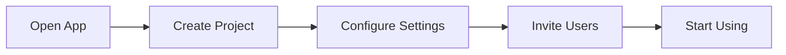

# Documentation Content Strategy

**Version:** 1.0
**Last Updated:** 2025-11-02
**Status:** Documentation Guide
**Phase:** 1.2 - Foundation Planning

---

## Overview

This guide provides a practical framework for creating and maintaining documentation within the AI-Assisted Documentation System. It defines the three distinct documentation types, their audiences, content guidelines, and directory structures.

The strategy supports three interconnected but independent documentation targets:

1. **System Developer Docs** - For developers building and modifying the system
2. **System User Docs** - For end users learning and using the system
3. **Company System Docs** - For internal teams tracking project status and access

### Why This Matters

Clear documentation strategy prevents confusion, reduces redundancy, and ensures each documentation type serves its intended audience effectively. This guide is your reference for deciding what to document where and how to maintain consistency across all three types.

---

## Documentation Type Decision Matrix

Use this matrix to determine which documentation type to create or update:

| Question | Answer | Documentation Type |
|----------|--------|-------------------|
| **Who is the audience?** | Developers working on the codebase | System Developer Docs |
| **Who is the audience?** | End users of the system | System User Docs |
| **Who is the audience?** | Company stakeholders, team leads, project managers | Company System Docs |
| **What type of content?** | API reference, architecture, code examples | System Developer Docs |
| **What type of content?** | How-to guides, tutorials, feature walkthroughs | System User Docs |
| **What type of content?** | Project status, access info, feature summaries, roadmap | Company System Docs |
| **How often updated?** | When code changes (automated) | System Developer Docs |
| **How often updated?** | When features change or user feedback received | System User Docs |
| **How often updated?** | Weekly (sprint status) to monthly (strategic) | Company System Docs |
| **How technical?** | Very technical (assumes programming knowledge) | System Developer Docs |
| **How technical?** | Non-technical (assumes no technical knowledge) | System User Docs |
| **How technical?** | Business-level (executives, project leads) | Company System Docs |

---

## System Developer Docs

### Purpose and Audience

**Primary Audience:** Developers working on the codebase

**Goal:** Enable developers to understand, modify, and extend the system with confidence

**Key Assumption:** Audience has strong programming background and understands C#, ASP.NET Core, and software architecture patterns.

### Directory Structure

```
docs/docfx-developer/
├── index.md                    # Developer landing page
├── toc.yml                     # Table of contents (navigation structure)
├── docfx.json                  # DocFX configuration (API ref + articles)
├── .gitignore                  # Exclude generated _site/ and api/
├── articles/
│   ├── architecture.md         # System architecture overview
│   ├── domain-models.md        # Domain entity documentation
│   ├── database-schema.md      # Database design and relationships
│   ├── api-guide.md            # API endpoints and patterns
│   ├── deployment.md           # Production deployment procedures
│   └── contributing.md         # Development guidelines
├── diagrams/
│   ├── architecture-*.md       # Mermaid diagrams (auto-generated)
│   ├── class-structure-*.md    # Class relationships (auto-generated)
│   └── sequence-flows.md       # Interaction flows (manually created)
├── images/
│   └── [architecture diagrams, screenshots]
└── api/                        # Auto-generated API reference (in .gitignore)
    └── (generated by DocFX from XML comments)
```

### Content Guidelines

**Tone:** Technical, precise, assumes programming knowledge. Use imperative voice ("The controller handles", "The repository retrieves").

**Depth:** Deep technical details, implementation specifics, internal algorithms, performance considerations.

**Content Types:**
- API reference (auto-generated from XML comments)
- Architecture documentation with rationale
- Code examples (C# snippets)
- Mermaid diagrams (architecture, class relationships, sequence flows)
- PlantUML diagrams (ER diagrams, deployment diagrams)

**Code Examples:** Include only production-quality C# code with:
- Proper error handling
- Following project conventions (centralized package management, explicit using statements)
- Comments explaining why, not what

**Diagrams:**
- Architecture (Mermaid C4 or flowchart format)
- Class relationships (auto-generated from compiled assemblies)
- Sequence diagrams for complex interactions
- ER diagrams for data models

**Updates:** Continuous (auto-generated API reference on code changes) + manual review of conceptual articles monthly.

### Sample Content Structure

**Architecture Article Example:**
```markdown
# Architecture Overview

## System Components

The system consists of three primary components:

1. **Example.Web** - ASP.NET Core MVC application serving the user interface
2. **Example.API** - Minimal API providing REST endpoints for data operations
3. **Test Projects** - MSTest unit tests and Playwright end-to-end tests

## Component Diagram

[Mermaid C4 diagram showing component relationships]

## Key Design Decisions

1. **Centralized Package Management** - Uses Directory.Packages.props for version management
2. **Implicit Usings Disabled** - All using statements explicit for clarity
3. **Minimal APIs** - ASP.NET Core Minimal APIs instead of traditional controller-based API

## Interaction Flows

[Mermaid sequence diagram showing HTTP request flow through MVC]
```

### Cross-References

Link to other documentation types:
- **To User Docs:** When explaining user-facing features (e.g., "See User Guide: Feature X")
- **To Company Docs:** When referencing project status or roadmap (e.g., "Feature scheduled for Q4 2025")
- **GitHub/Azure DevOps:** Link to issues, PRs, and code repositories

---

## System User Docs

### Purpose and Audience

**Primary Audience:** End users learning and using the system

**Goal:** Enable users to successfully use the system without requiring developer assistance

**Key Assumption:** Audience has no technical background and should not need to understand code, architecture, or databases.

### Directory Structure

```
docs/docfx-user/
├── index.md                    # User-friendly landing page
├── toc.yml                     # Simple, intuitive navigation
├── docfx.json                  # DocFX configuration (articles only, no API ref)
├── .gitignore                  # Exclude generated _site/
├── articles/
│   ├── getting-started.md      # Installation and first-time setup
│   ├── features.md             # Feature overview with screenshots
│   ├── faq.md                  # Frequently asked questions
│   └── support.md              # How to get help
├── tutorials/
│   ├── first-task.md           # Step-by-step first task walkthrough
│   ├── common-workflows.md     # Step-by-step common user tasks
│   └── advanced-usage.md       # For power users
├── images/
│   └── screenshots/            # UI screenshots (organized by feature)
└── diagrams/
    └── user-flows.md           # Simple Mermaid flowcharts (user perspective)
```

### Content Guidelines

**Tone:** Friendly, helpful, encouraging. Use simple language ("Click the button", "Select from the list"). Avoid jargon.

**Depth:** Task-oriented, step-by-step instructions. Focus on "how to do X" not "how X works internally".

**Content Types:**
- Getting started guide
- Step-by-step tutorials
- Feature overviews with screenshots
- FAQ (answering real user questions)
- Simple flow diagrams (Mermaid)
- How-to guides for common tasks

**Code Examples:** Rarely included. When necessary, show only CLI commands or configuration, not C# code.

**Diagrams:** Simple Mermaid flowcharts showing user workflows and decision trees (no architecture or class diagrams).

**Visual Aids:** Screenshots of actual UI, annotated with callouts, showing the user perspective.

**Updates:** When features change, after user feedback, or monthly review of FAQ relevance.

### Sample Content Structure

**Getting Started Example:**
```markdown
# Getting Started

## Installation

### Step 1: Download

1. Visit [website]
2. Click "Download"
3. Save the file to your Downloads folder


### Step 2: Install

[Step-by-step instructions with screenshots]

## Your First Task

Here's how to [accomplish something meaningful]:

1. Open the application
2. Click "New [Item]"
3. Enter a name
4. Click "Save"

You've created your first [item]! Next, try [Feature Y].

```

**Tutorial Flow Example:**
```markdown
## Flowchart


```

### Cross-References

Link to other documentation types:
- **To Developer Docs:** Rarely (only for advanced users seeking technical details)
- **To Company Docs:** For support/access information (e.g., "For access issues, see Company Docs")
- **External Resources:** Official tutorials, video guides

---

## Company System Docs

### Purpose and Audience

**Primary Audience:** Company stakeholders, team leads, project managers, developers needing status

**Goal:** Provide living documentation of project status, feature sets, and system access

**Key Assumption:** Audience is internal to the company and needs current information for decision-making.

### Directory Structure

```
docs/wiki/
├── README.md                   # Wiki home page (quick links)
├── system-purpose.md           # Business purpose and value propositions
├── system-access.md            # Environments and access procedures
├── feature-summary.md          # Current feature set and status
├── active-development.md       # What's being worked on this sprint
├── release-notes.md            # Recent changes and releases
├── roadmap.md                  # Future planned features (optional)
└── .order                      # Navigation order (for Azure DevOps Wiki)
```

### Content Guidelines

**Tone:** Business-focused, professional, informative. Use clear, direct language ("Feature X is stable", "Access requires approval").

**Depth:** High-level summaries, strategic context. Avoid technical details unless necessary for understanding.

**Content Types:**
- System purpose (business case)
- Feature status summaries with tables
- System access procedures
- Active development status (current sprint)
- Release notes and changelog
- High-level Gantt charts (Mermaid)
- Status badges (✅ Stable, 🧪 Beta, 📋 Planned)

**Code Examples:** Never. This is non-technical documentation.

**Diagrams:** Optional high-level Gantt charts or timeline visualizations using Mermaid.

**Visual Aids:** Status badges, progress indicators, tables for feature comparison.

**Updates:** Weekly (active development) to monthly (system purpose, roadmap), frequently updated to reflect current state.

### Sample Content Structure

**System Purpose Example:**
```markdown
# System Purpose

## What is [System Name]?

[One-paragraph business description of what the system does]

## Target Audience

This system is designed for:
- [Audience 1]: [description]
- [Audience 2]: [description]

## Key Value Propositions

1. **[Value 1]**: [Why this matters for the business]
2. **[Value 2]**: [Why this matters for the business]
3. **[Value 3]**: [Why this matters for the business]

## Technical Documentation

For technical details:
- [Link to Developer Docs]
- [Link to User Docs]
```

**Feature Summary Example:**
```markdown
# Feature Summary

## Current Features

| Feature | Status | Users | Since |
|---------|--------|-------|-------|
| Basic Workflow | ✅ Stable | All | v1.0 |
| Advanced Analytics | ✅ Stable | Premium | v1.2 |
| API Access | 🧪 Beta | Selected | v1.3 (beta) |
| Mobile App | 📋 Planned | - | Q2 2026 |

## Status Legend

- ✅ **Stable**: Production-ready, fully supported
- 🧪 **Beta**: Available for testing, may change
- 📋 **Planned**: Scheduled for development
- 🚧 **In Progress**: Currently being developed
```

### Cross-References

Link to other documentation types:
- **To Developer Docs:** For technical specifications and architecture details
- **To User Docs:** For feature demonstrations and usage guides
- **To GitHub/Azure DevOps:** For backlog, sprint board, and issue tracking

---

## Content Creation Workflows

### Workflow: Creating Developer Docs

1. **Write** - Create markdown article in `docs/docfx-developer/articles/`
2. **Add XML Comments** - Ensure C# code has XML documentation comments
3. **Generate Diagrams** - Run `make diagrams` to auto-generate class diagrams
4. **Build Locally** - Run `make docs-developer` and preview at http://localhost:8080
5. **Review** - Check rendering, verify links work, ensure code examples run
6. **Commit & Push** - CI/CD automatically builds and deploys to GitHub Pages

### Workflow: Creating User Docs

1. **Capture Screenshots** - Take UI screenshots of the feature in action
2. **Write** - Create markdown in `docs/docfx-user/tutorials/` or `articles/`
3. **Add Screenshots** - Place images in `images/screenshots/` with meaningful names
4. **Test Instructions** - Follow your own tutorial to verify steps work
5. **Build Locally** - Run `make docs-user` and preview at http://localhost:8081
6. **User Review** - Have a non-technical user review for clarity
7. **Commit & Push** - CI/CD automatically builds and deploys

### Workflow: Updating Company Docs

1. **Update** - Edit `.md` files in `docs/wiki/`
2. **Add Links** - Link to developer/user docs and external resources
3. **Verify Accuracy** - Ensure feature statuses match current project state
4. **Commit & Push** - `.docgen/wiki-sync.ps1` automatically syncs to GitHub Wiki or Azure DevOps Wiki

---

## AI-Assisted Content Creation

### Using Claude Code + MCP Servers

The **documentation-architect** agent integrates with MCP servers for intelligent documentation support:

**For Developer Docs:**
- Generate XML documentation comments from C# code
- Create architecture documentation from codebase analysis
- Generate Mermaid diagrams from system design
- Suggest documentation structure for new features

**For User Docs:**
- Write getting started guides based on feature analysis
- Create step-by-step tutorials for workflows
- Generate FAQ from issue tracker and support requests
- Suggest improvements based on readability analysis

**For Company Docs:**
- Summarize sprint progress in executive language
- Generate feature status tables from backlog
- Create roadmap summaries from planned features
- Write system purpose documentation from business requirements

### Example Prompts

```
"Create comprehensive architecture documentation for the Example.Web and Example.API
projects. Include system components, interaction flows with Mermaid diagrams, and
key design decisions. Reference the centralized package management strategy."

"Generate a getting started guide for new users. Include step-by-step installation,
first-time setup, and a simple workflow diagram. Use non-technical language."

"Summarize this sprint's progress in a brief paragraph suitable for executive stakeholders.
Highlight completed features and upcoming work."
```

---

## Quality Standards

### All Documentation Types

- ✅ Clear, concise writing without jargon (unless necessary)
- ✅ Correct grammar, spelling, and formatting
- ✅ All hyperlinks functional (validated by CI/CD)
- ✅ Content reflects current code/features (no stale information)
- ✅ Language appropriate for target audience
- ✅ Consistent terminology throughout

### Developer Docs Specific

- ✅ All public APIs have XML comments (generated from code)
- ✅ Architecture diagrams match actual implementation
- ✅ Code examples compile and follow project conventions
- ✅ Diagrams auto-generate from code (not manually maintained)
- ✅ Links to GitHub Issues and PRs are up-to-date

### User Docs Specific

- ✅ Screenshots match current UI (updated after UI changes)
- ✅ Step-by-step instructions verified to work end-to-end
- ✅ Tutorial tested by someone unfamiliar with the system
- ✅ FAQ answers address real user questions
- ✅ Links to support channels are current

### Company Docs Specific

- ✅ Feature status accurate (matches backlog/release notes)
- ✅ Access instructions tested and verified working
- ✅ Active development status updated weekly
- ✅ System purpose aligns with current business strategy
- ✅ Updated at least monthly, more frequently for active development

---

## Cross-Referencing Strategy

Proper cross-referencing helps users navigate between documentation types and discover relevant information.

### When to Link Between Types

**Developer Docs → User Docs:**
- When explaining user-facing features
- Example: "Users can configure X via the Settings page. See User Guide: [Feature Name]"

**Developer Docs → Company Docs:**
- When referencing project status or roadmap
- Example: "Feature Y is scheduled for Q4 2025 (see Roadmap)"

**User Docs → Developer Docs:**
- Rarely (only for advanced users seeking technical deep-dives)
- Example: "Advanced users can configure X via API (see Developer Docs)"

**User Docs → Company Docs:**
- For support and access information
- Example: "For access issues, contact support (see Company Docs: System Access)"

**Company Docs → Developer Docs:**
- For technical specifications
- Example: "Architecture overview in Developer Docs"

**Company Docs → User Docs:**
- For feature demonstrations
- Example: "See User Guide for Feature X walkthrough"

### Link Format Examples

```markdown
<!-- Linking to other documentation types -->
[User Guide for Feature X](../../docfx-user/tutorials/feature-x.md)
[Architecture Documentation](../../docfx-developer/articles/architecture.md)
[Feature Status](../../wiki/feature-summary.md)
[System Access](../../wiki/system-access.md)

<!-- External links -->
[GitHub Repository](https://github.com/NotMyself/net10-project-example)
[Azure DevOps Project](https://dev.azure.com/org/project)
[GitHub Issues](https://github.com/NotMyself/net10-project-example/issues)
```

### Broken Link Prevention

- Use relative paths for internal links (more portable)
- Validate all links in CI/CD before deployment
- Run `make validate-links` locally before pushing
- Include link validation in PR validation workflow

---

## Maintenance Schedule

### Developer Docs

| Frequency | Task |
|-----------|------|
| **Continuous** | API reference auto-generated on code changes |
| **Weekly** | Review new conceptual articles for accuracy |
| **Monthly** | Update architecture diagrams if significant changes |
| **Quarterly** | Comprehensive review of all articles for stale content |

### User Docs

| Frequency | Task |
|-----------|------|
| **On feature release** | Create tutorials for new features |
| **Monthly** | Update screenshots if UI changed |
| **Monthly** | Review and update FAQ with new user questions |
| **Quarterly** | User feedback review and improvements |

### Company Docs

| Frequency | Task |
|-----------|------|
| **Weekly** | Update active development status |
| **On release** | Update feature summary with new features |
| **Monthly** | Review system access procedures for accuracy |
| **Monthly** | Update roadmap with upcoming features |
| **Quarterly** | Review system purpose for alignment with strategy |

---

## Documentation File Locations

### Developer Docs Location
- **Path:** `/mnt/c/Users/bobby/src/claude/net10-project-example/docs/docfx-developer/`
- **Build Command:** `make docs-developer`
- **Serve Locally:** `make docs-serve` (port 8080)
- **Deployed To:** GitHub Pages (/) or Azure Static Web Apps

### User Docs Location
- **Path:** `/mnt/c/Users/bobby/src/claude/net10-project-example/docs/docfx-user/`
- **Build Command:** `make docs-user`
- **Serve Locally:** `make docs-user-serve` (port 8081)
- **Deployed To:** GitHub Pages (/user/) or Azure Static Web Apps

### Company Docs Location
- **Path:** `/mnt/c/Users/bobby/src/claude/net10-project-example/docs/wiki/`
- **Sync Command:** `.docgen/wiki-sync.ps1`
- **Deployed To:** GitHub Wiki or Azure DevOps Wiki

---

## References

- **[AI-Assisted Documentation Platform-Agnostic Architecture](./ai-docs-platform-agnostic-architecture.md)** - System design and components
- **[Phase 3: System Developer Docs Setup](../dev/active/004-ai-docs/phases/phase-3-developer-docs.md)** - Developer docs implementation
- **[Phase 4: System User Docs Setup](../dev/active/004-ai-docs/phases/phase-4-user-docs.md)** - User docs implementation
- **[Phase 5: Company System Docs Setup](../dev/active/004-ai-docs/phases/phase-5-company-docs.md)** - Company docs implementation
- **[DocFX Documentation](https://dotnet.github.io/docfx/)** - Official DocFX guide
- **[Mermaid Diagram Syntax](https://mermaid.js.org/)** - Diagram creation reference

---

## Quick Decision Guide

**Unsure which documentation type to create?**

1. **Is it for developers building the system?** → Developer Docs
2. **Is it for end users using the system?** → User Docs
3. **Is it for company stakeholders and team leads?** → Company Docs
4. **Does it explain how code works internally?** → Developer Docs only
5. **Does it explain how to use a feature?** → User Docs (and reference in Company Docs if it's a new feature)
6. **Does it show project status or access info?** → Company Docs only
7. **Does it contain code examples or architecture?** → Developer Docs only

---

**Acceptance Criteria:**
- ✅ Documents how to structure 3 documentation types
- ✅ Directory structure for each type with file trees
- ✅ Content guidelines for each type (tone, depth, audience)
- ✅ Explains when to use each documentation type (decision matrix)
- ✅ Examples for each type (sample content snippets)
- ✅ Cross-referencing strategy (how docs link to each other)
- ✅ Quality standards for all types
- ✅ Maintenance schedule with timeframes

**Status:** Complete and ready for use
**Phase:** 1.2 of Phase 1 (Documentation Planning)
