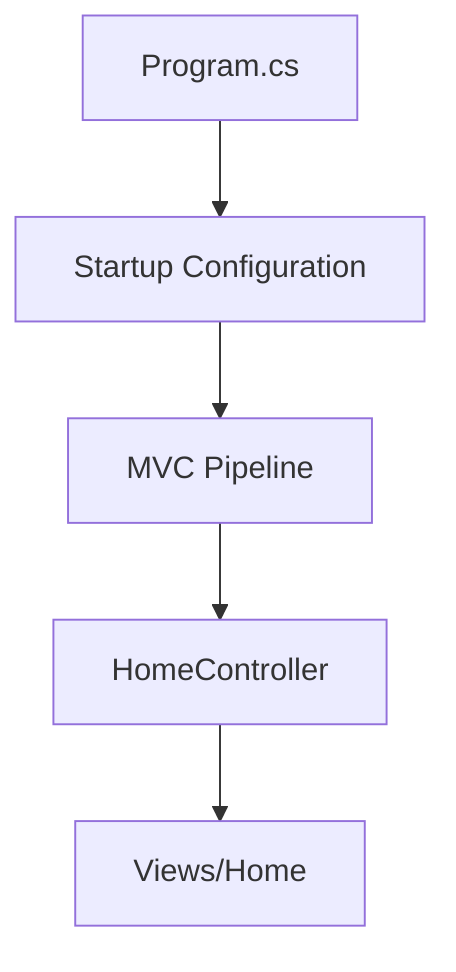
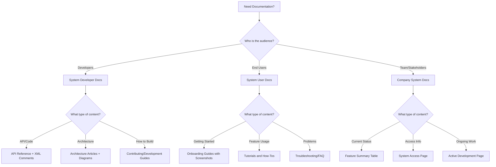

# Documentation Content Strategy

**Version:** 1.0
**Last Updated:** 2025-11-02
**Purpose:** Guide for organizing and writing content across three documentation types

---

## Overview

This document defines the content strategy for the three distinct types of documentation in this project:

1. **System Developer Docs** - Technical documentation for developers
2. **System User Docs** - User-facing documentation for end users
3. **Company System Docs** - Living documentation about system status

Each type has different audiences, purposes, and content guidelines.

---

## Quick Reference Matrix

| Documentation Type | Audience | Update Frequency | Formality | Primary Format | Publishing Target |
|-------------------|----------|------------------|-----------|----------------|-------------------|
| **System Developer Docs** | Software developers | Medium (with code changes) | High (professional) | DocFX static site | GitHub Pages / Azure SWA |
| **System User Docs** | End users | Low (with features) | Medium (friendly) | DocFX static site | GitHub Pages /user/ |
| **Company System Docs** | Team/stakeholders | High (ongoing) | Low (conversational) | Wiki markdown | GitHub Wiki / ADO Wiki |

---

## System Developer Docs

### Audience

- Developers working on the codebase
- New team members onboarding
- External contributors
- Technical architects reviewing the system

### Purpose

Answer the question: **"How does this system work technically?"**

### Content Organization

**Directory Structure:**
```
docs/docfx-developer/
├── docfx.json                    # DocFX configuration
├── index.md                      # Developer homepage
├── toc.yml                       # Navigation structure
├── articles/
│   ├── architecture/             # Architecture documentation
│   │   ├── overview.md
│   │   ├── components.md
│   │   ├── data-flow.md
│   │   └── design-patterns.md
│   ├── deployment/               # Deployment documentation
│   │   ├── local-development.md
│   │   ├── ci-cd.md
│   │   └── production.md
│   ├── domain/                   # Domain model documentation
│   │   ├── domain-overview.md
│   │   ├── entities.md
│   │   └── business-rules.md
│   ├── api/                      # API usage guides
│   │   ├── web-api-guide.md
│   │   └── minimal-api-guide.md
│   └── contributing/             # Contribution guidelines
│       ├── coding-standards.md
│       ├── pr-process.md
│       └── testing-guidelines.md
├── diagrams/
│   ├── architecture.mmd          # Mermaid source files
│   ├── classes.md                # dll2mmd output
│   └── uml/                      # PlantUML output
└── api/                          # Generated API reference (gitignored)
```

### Writing Guidelines

**Tone**:
- Professional and precise
- Assume technical knowledge
- Use industry-standard terminology
- Be concise but complete

**Structure**:
- Start with overview/context
- Provide technical details
- Include code examples
- Link to API reference
- Add diagrams for complex concepts

**Example - Good Developer Documentation**:

```markdown
# Example.Web MVC Architecture

## Overview

The Example.Web project implements a traditional ASP.NET Core MVC pattern with
Razor runtime compilation enabled for development productivity.

## Project Structure



## Key Components

### Controllers

Controllers inherit from `Controller` base class and follow RESTful conventions:

```csharp
public class HomeController : Controller
{
    private readonly ILogger<HomeController> _logger;

    public HomeController(ILogger<HomeController> logger)
    {
        _logger = logger;
    }

    public IActionResult Index()
    {
        return View();
    }
}
```

See [API Reference](~/api/Example.Web.Controllers.HomeController.yml) for complete documentation.

### Views

Views use Razor syntax and are located in `Views/[ControllerName]/[ActionName].cshtml`.

### Configuration

Application configuration follows the ASP.NET Core options pattern.
See [Configuration Guide](configuration.md) for details.

## Related Documentation

- [Domain Models](../domain/domain-overview.md)
- [Deployment](../deployment/local-development.md)
- [Testing](../contributing/testing-guidelines.md)
```

### Content Types to Include

**Architecture Documentation**:
- System architecture overview (components, layers, boundaries)
- Component interaction diagrams (sequence diagrams)
- Data flow diagrams
- Design patterns used
- Technology stack with rationale

**Deployment Documentation**:
- Local development setup
- Environment configuration
- CI/CD pipeline explanation
- Production deployment procedures
- Infrastructure as code

**Domain Models**:
- Domain concepts and terminology
- Entity relationships (ERD)
- Business rules
- Domain events
- Aggregates and bounded contexts (if using DDD)

**API Documentation**:
- API usage guides
- Authentication/authorization
- Common usage patterns
- Error handling
- Rate limiting, versioning

**Database Models**:
- Schema overview
- Entity relationships
- Migrations strategy
- Database access patterns

**System Boundaries**:
- External integrations
- API contracts
- Dependencies
- Security boundaries

### When to Update

- New features added
- Architecture changes
- Deployment process changes
- API contract changes
- After major refactoring

---

## System User Docs

### Audience

- End users of the application
- Business stakeholders
- Customer support teams
- Product managers

### Purpose

Answer the question: **"How do I use this system?"**

### Content Organization

**Directory Structure:**
```
docs/docfx-user/
├── docfx.json                    # DocFX configuration (user-friendly)
├── index.md                      # User-friendly homepage
├── toc.yml                       # Simple navigation
├── articles/
│   ├── getting-started/          # Onboarding
│   │   ├── installation.md
│   │   ├── first-login.md
│   │   └── quick-tour.md
│   ├── features/                 # Feature documentation
│   │   ├── feature-a.md
│   │   ├── feature-b.md
│   │   └── advanced-features.md
│   ├── tutorials/                # Step-by-step guides
│   │   ├── task-1.md
│   │   ├── task-2.md
│   │   └── common-workflows.md
│   ├── troubleshooting/          # Common issues
│   │   ├── faq.md
│   │   └── common-errors.md
│   └── reference/                # Reference material
│       ├── keyboard-shortcuts.md
│       └── glossary.md
├── images/
│   └── screenshots/              # Application screenshots
│       ├── login.png
│       ├── dashboard.png
│       └── feature-a-step1.png
└── diagrams/
    └── workflows.mmd             # Simple user workflow diagrams
```

### Writing Guidelines

**Tone**:
- Friendly and approachable
- Avoid jargon
- Explain concepts simply
- Use active voice
- Empathize with user needs

**Structure**:
- Start with what the user wants to achieve
- Provide step-by-step instructions
- Use screenshots liberally
- Highlight important notes/warnings
- Provide next steps/related tasks

**Example - Good User Documentation**:

```markdown
# Getting Started with Example.Web

Welcome to Example.Web! This guide will help you get up and running in just a few minutes.

## What You'll Learn

By the end of this guide, you'll be able to:
- Log in to the application
- Navigate the main dashboard
- Complete your first task

**Estimated time:** 5 minutes

## Prerequisites

Before you begin, make sure you have:
- ✅ An account (ask your administrator if you don't have one)
- ✅ Your username and password
- ✅ A modern web browser (Chrome, Firefox, Edge, or Safari)

## Step 1: Log In

1. Open your web browser and navigate to `https://example.com`

2. You'll see the login page:

   

3. Enter your username and password

4. Click **Sign In**

💡 **Tip:** Check "Remember me" if you're on your personal device.

## Step 2: Explore the Dashboard

After logging in, you'll see the main dashboard:


The dashboard has three main sections:

| Section | Purpose |
|---------|---------|
| **Recent Activity** | Shows your most recent actions |
| **Quick Actions** | Common tasks you perform frequently |
| **Notifications** | Important updates and alerts |

## Step 3: Complete Your First Task

Let's create your first item:

1. Click **Quick Actions** → **Create New Item**

2. Fill in the details:
   - **Name:** Enter a descriptive name
   - **Description:** Add details about the item
   - **Priority:** Choose Low, Medium, or High

3. Click **Save**

🎉 **Success!** You've created your first item.

## Next Steps

Now that you're familiar with the basics, try these next:

- [Learn about advanced features](../features/advanced-features.md)
- [Complete common workflows](../tutorials/common-workflows.md)
- [Explore keyboard shortcuts](../reference/keyboard-shortcuts.md)

## Need Help?

- **Stuck?** Check the [FAQ](../troubleshooting/faq.md)
- **Found a bug?** Contact support at support@example.com
- **Want to learn more?** Browse all [features](../features/feature-a.md)
```

### Content Types to Include

**Getting Started**:
- Installation/setup instructions
- First-time login
- Quick tour of the interface
- Basic concepts explained simply

**Features**:
- Overview of each feature
- What the feature does (business value)
- How to use the feature
- Tips and best practices

**Tutorials**:
- Step-by-step task completion
- Common workflows
- Real-world scenarios
- Before/after examples

**Troubleshooting**:
- FAQ (frequently asked questions)
- Common error messages and solutions
- Tips for getting help
- Known limitations

**Reference**:
- Keyboard shortcuts
- Glossary of terms
- System requirements
- Browser compatibility

### Visual Guidelines

**Screenshots**:
- Capture full interface or focused area
- Annotate with arrows/numbers if needed
- Keep current (update when UI changes)
- Use consistent size/format

**Diagrams**:
- Keep simple (avoid technical details)
- Use Mermaid for workflows:
  ```mermaid
  graph LR
      A[Start] --> B[Fill Form]
      B --> C[Review]
      C --> D{Looks Good?}
      D -->|Yes| E[Submit]
      D -->|No| B
  ```
- Focus on user actions, not system internals

### When to Update

- New features released
- UI changes
- Workflow changes
- Common support questions arise
- User feedback indicates confusion

---

## Company System Docs

### Audience

- Team members
- Stakeholders
- Project managers
- New hires
- Clients (in some cases)

### Purpose

Answer the question: **"What is the current state of this system/project?"**

### Content Organization

**Directory Structure:**
```
docs/wiki/
├── README.md                     # Wiki homepage
├── system-purpose.md             # What & why
├── system-access.md              # How to access
├── feature-summary.md            # Current features
├── active-development.md         # Current work
├── team-contacts.md              # Who to ask
├── deployment-status.md          # Environments status
└── changelog.md                  # Recent changes
```

### Writing Guidelines

**Tone**:
- Conversational and direct
- Internal team language okay
- Brevity over completeness
- Living document (okay to be rough)

**Structure**:
- Quick facts up front
- Tables for status tracking
- Links to detailed documentation
- Frequent updates expected

**Example - Good Company Documentation**:

```markdown
# Example .NET 10 Project

## Quick Facts

| Property | Value |
|----------|-------|
| **Purpose** | Demonstrate .NET 10 features and Claude Code integration |
| **Status** | ✅ Active Development |
| **Environment** | Windows 11 + WSL2 (Ubuntu) |
| **Repository** | [GitHub](https://github.com/NotMyself/net10-project-example) |
| **Documentation** | [GitHub Pages](https://notmyself.github.io/net10-project-example/) |

## What Is This?

This is an example .NET 10 project showcasing:
- ASP.NET Core MVC application (Example.Web)
- ASP.NET Core Minimal API (Example.API)
- MSTest with Microsoft.Testing.Platform
- Playwright for E2E testing
- Centralized Package Management
- Claude Code infrastructure (hooks, skills, agents)

## How to Access

**Development Environment:**
- Clone repository: `git clone https://github.com/NotMyself/net10-project-example.git`
- See [CLAUDE.md](../CLAUDE.md) for setup instructions

**Deployed Environments:**
- **Docs (Dev)**: https://notmyself.github.io/net10-project-example/ (auto-deploys from main)
- **Local MVC**: `dotnet run --project src/Example.Web` → http://localhost:5000
- **Local API**: `dotnet run --project src/Example.API` → http://localhost:5001

## Current Features

| Feature | Status | Notes |
|---------|--------|-------|
| ASP.NET Core MVC | ✅ Complete | Basic homepage implemented |
| Minimal API | ✅ Complete | Weather forecast endpoint |
| MSTest Integration | ✅ Complete | Using Microsoft.Testing.Platform |
| Playwright E2E | ✅ Complete | Browser automation working |
| Claude Code Hooks | ✅ Complete | Skill activation, file tracking |
| Documentation System | 🟡 In Progress | See [active dev](#active-development) |

## Active Development

**Current Sprint:** AI-Assisted Documentation System

**Status:** Phase 1 in progress (Documentation Planning)

**What's Being Built:**
- Platform-agnostic documentation system
- Support for GitHub + Azure DevOps
- Three documentation types (developer, user, company)
- AI integration with MCP servers

**Progress:**
- [x] Research completed (docs/research/ai-assisted-documentation.md)
- [x] Architecture designed
- [ ] Core foundation setup
- [ ] GitHub plugin implementation

**Timeline:** 3-4 weeks (30-36 hours estimated)

See [dev docs](../../dev/active/ai-assisted-documentation/) for implementation details.

## Team Contacts

| Role | Person | Contact |
|------|--------|---------|
| **Owner** | NotMyself | [@NotMyself](https://github.com/NotMyself) |
| **Documentation** | Claude Code | AI assistant |

## Recent Changes

**2025-11-02:**
- Started AI-assisted documentation implementation
- Created dev docs structure
- Created architecture documentation

**2025-10-28:**
- Completed Claude Code infrastructure setup
- Added 6 .NET-specific skills
- Installed agents (documentation-architect, etc.)

**2025-10-15:**
- Initial project setup
- Added Example.Web and Example.API
- Configured centralized package management

---

*Last Updated: 2025-11-02*
*Update this wiki page whenever project status changes!*
```

### Content Types to Include

**System Purpose**:
- What the system does (1-2 paragraphs)
- Who uses it
- Why it exists
- Business value

**System Access**:
- URLs for environments (dev, staging, prod)
- How to get credentials
- Who to ask for access
- VPN/network requirements

**Feature Summary**:
- Table of current features
- Status (complete, in progress, planned)
- Brief description
- Links to detailed docs

**Active Development**:
- What's currently being worked on
- Who's working on it
- Expected timeline
- Progress indicators
- Links to implementation docs (dev/active/)

**Team Contacts**:
- Who to ask for what
- Roles and responsibilities
- Contact information

**Deployment Status**:
- Environment statuses (up, down, degraded)
- Recent deployments
- Scheduled maintenance
- Known issues

**Changelog**:
- Recent significant changes
- Date + description
- Links to PRs/commits

### Visual Guidelines

**Keep It Simple**:
- Tables for status tracking
- Emoji for quick visual indicators (✅ 🟡 ⏳ ❌)
- Simple Mermaid Gantt charts for timelines:
  ```mermaid
  gantt
      title Development Timeline
      dateFormat YYYY-MM-DD
      Phase 1 :done, 2025-11-01, 3d
      Phase 2 :active, 2025-11-04, 7d
      Phase 3 :        2025-11-11, 5d
  ```
- Avoid complex diagrams (link to developer docs instead)

### When to Update

**Frequently** (this is living documentation):
- When features are completed
- When active development changes
- When deployment status changes
- When team members change
- After major milestones

**Tip:** Set calendar reminder to review weekly

---

## Content Lifecycle

### Creation

**System Developer Docs**:
1. New feature/component → Create documentation
2. Use AI assistance (documentation-architect agent + MCP servers)
3. Generate diagrams automatically (dll2mmd, PlantUML)
4. Add XML comments to code
5. Write conceptual articles
6. Review and refine

**System User Docs**:
1. New user-facing feature → Create guide
2. Capture screenshots
3. Write step-by-step instructions
4. Use AI to draft initial content
5. Have non-technical person review
6. Simplify based on feedback

**Company System Docs**:
1. Project milestone/status change → Update wiki
2. Quick edit directly in wiki
3. Focus on facts, not polish
4. Link to detailed docs rather than duplicate

### Maintenance

**Monthly Review** (30-60 min):
- Check developer docs for accuracy after code changes
- Update screenshots in user docs if UI changed
- Review company docs for current status
- Update diagrams if architecture changed

**Quarterly Review** (2-3 hours):
- Major template refresh if needed
- Reorganize content if structure no longer works
- Archive outdated content
- Review analytics (if enabled) for popular pages

**Continuous**:
- PR validation catches missing XML comments
- CI/CD regenerates documentation automatically
- Diagrams regenerate from code
- Wiki updates on commit

### Retirement

**Developer Docs**:
- Deprecated features → Mark as deprecated, keep for historical reference
- Old versions → Archive in separate directory

**User Docs**:
- Removed features → Delete or move to archive
- Old screenshots → Replace, don't keep old versions

**Company Docs**:
- Completed projects → Move to "Past Projects" section
- Old team members → Archive in "Alumni" section

---

## Best Practices

### Cross-Linking

**Link Liberally**:
- Developer docs → Link to API reference, related concepts, user guides
- User docs → Link to related tasks, troubleshooting, glossary
- Company docs → Link to detailed developer/user docs

**Use Relative Links**:
```markdown
<!-- Good -->
[Architecture](../architecture/overview.md)

<!-- Bad -->
[Architecture](https://example.com/docs/architecture/overview.md)
```

**Link to Specific Locations**:
```markdown
<!-- Link to file -->
[Configuration](configuration.md)

<!-- Link to section -->
[Configuration#Database](configuration.md#database)
```

### Diagrams

**Use the Right Tool**:
- Architecture/sequence/flow → **Mermaid** (native support)
- Class diagrams from code → **dll2mmd** (automated)
- Comprehensive UML → **PlantUML** (detailed)
- Database ERD → **EF Core Power Tools** (automated)

**Keep Diagrams Current**:
- Automate where possible (dll2mmd, PlantUML from code)
- Update manually-created diagrams when architecture changes
- Include diagram source (Mermaid/PlantUML) in docs, not just images

### Consistency

**Follow Conventions**:
- Use consistent heading levels
- Use consistent code block language tags
- Use consistent table formats
- Use consistent emoji (if using them)

**Templates**:
Create templates for common documentation types:
- Article template (developer docs)
- Tutorial template (user docs)
- Feature status template (company docs)

### AI Assistance

**Use AI For**:
- Drafting initial content
- Generating XML comments
- Creating architecture descriptions
- Writing user guides from feature descriptions

**Review AI Output**:
- Check for accuracy (AI can hallucinate)
- Verify code examples work
- Ensure terminology is correct
- Add missing context

**Prompts to Use**:
- "Generate XML documentation for this class using Microsoft Learn .NET conventions"
- "Create architecture documentation explaining [component] with Mermaid diagrams"
- "Write a user guide for [feature] targeting non-technical users"
- "Summarize current project status for company documentation"

---

## Documentation Types Decision Tree



---

## Appendix: Example Table of Contents

### Example Developer Docs TOC

```yaml
# toc.yml for docs/docfx-developer/

- name: Home
  href: index.md
- name: Architecture
  items:
    - name: Overview
      href: articles/architecture/overview.md
    - name: Components
      href: articles/architecture/components.md
    - name: Data Flow
      href: articles/architecture/data-flow.md
- name: API Guide
  items:
    - name: MVC Controllers
      href: articles/api/mvc-guide.md
    - name: Minimal APIs
      href: articles/api/minimal-api-guide.md
- name: Deployment
  items:
    - name: Local Development
      href: articles/deployment/local-development.md
    - name: CI/CD
      href: articles/deployment/ci-cd.md
- name: API Reference
  href: api/
```

### Example User Docs TOC

```yaml
# toc.yml for docs/docfx-user/

- name: Home
  href: index.md
- name: Getting Started
  items:
    - name: Installation
      href: articles/getting-started/installation.md
    - name: First Login
      href: articles/getting-started/first-login.md
    - name: Quick Tour
      href: articles/getting-started/quick-tour.md
- name: Features
  items:
    - name: Feature A
      href: articles/features/feature-a.md
    - name: Feature B
      href: articles/features/feature-b.md
- name: Tutorials
  items:
    - name: Complete Task 1
      href: articles/tutorials/task-1.md
    - name: Complete Task 2
      href: articles/tutorials/task-2.md
- name: Help
  items:
    - name: FAQ
      href: articles/troubleshooting/faq.md
    - name: Common Errors
      href: articles/troubleshooting/common-errors.md
```

---

**Document Status**: ✅ COMPLETE
**Version**: 1.0
**Last Updated**: 2025-11-02
**Next**: Create [Implementation Plan](ai-docs-implementation-plan.md)
