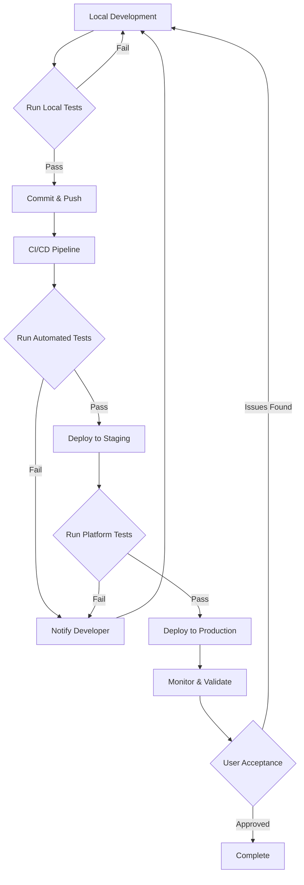

# Documentation System Testing Guide

Comprehensive testing procedures for the AI-assisted documentation system covering local testing, CI/CD validation, platform verification, and quality assurance.

## Table of Contents

- [Overview](#overview)
- [Test Environment Setup](#test-environment-setup)
- [Local Testing](#local-testing)
- [CI/CD Testing](#cicd-testing)
- [Platform-Specific Testing](#platform-specific-testing)
- [AI Assistance Testing](#ai-assistance-testing)
- [Quality Assurance](#quality-assurance)
- [Regression Testing](#regression-testing)
- [Performance Testing](#performance-testing)
- [Automated Testing](#automated-testing)
- [Troubleshooting Test Failures](#troubleshooting-test-failures)

## Overview

### Testing Strategy

The documentation system requires multi-layered testing:

1. **Local Testing** - Build and preview documentation on development machines
2. **CI/CD Testing** - Automated validation on every commit and PR
3. **Platform Testing** - Verify platform-specific features (GitHub Pages, Azure Artifacts, etc.)
4. **AI Testing** - Validate AI-assisted content generation quality
5. **Regression Testing** - Ensure changes don't break existing functionality
6. **Performance Testing** - Monitor build times and resource usage

### Test Levels

| Level | Scope | Frequency | Automated |
|-------|-------|-----------|-----------|
| Unit | Individual documentation files | Every change | Yes |
| Integration | Cross-references and links | Every commit | Yes |
| System | Full documentation builds | Every PR | Yes |
| Platform | Deployment to hosting services | Every merge to main | Yes |
| Acceptance | User-facing documentation quality | Every release | Partial |

### Success Criteria

 All documentation builds without errors
 All links and cross-references resolve correctly
 All Mermaid diagrams render properly
 API reference generates from XML comments
 Platform URLs match configuration
 CI/CD workflows complete successfully
 Documentation deploys to correct locations
 AI-generated content meets quality standards
 Build times remain under acceptable thresholds

## Test Environment Setup

### Prerequisites

```bash
# Required tools
dotnet --version    # 10.0.100-rc.2 or later
docfx --version     # 2.76 or later
pwsh --version      # 7.0 or later
git --version       # 2.30 or later
make --version      # 4.0 or later (on Linux/macOS)

# Optional tools for enhanced testing
gh --version        # GitHub CLI
az --version        # Azure CLI
jq --version        # JSON processor for script testing
markdownlint --version  # Markdown linting
```

### Environment Variables

```bash
# Set up test environment variables
export TEST_MODE=true
export DOCFX_SOURCE_BRANCH_NAME=test-branch
export DOCS_BUILD_DIR=/tmp/docs-test
export PLATFORM=GitHub  # or AzureDevOps
```

### Test Data Setup

```bash
# Clone repository for testing
git clone https://github.com/NotMyself/net10-project-example.git test-docs
cd test-docs

# Create test branch
git checkout -b test-documentation

# Install dependencies
dotnet restore
dotnet tool restore
```

## Local Testing

### Test 1: Developer Documentation Build

**Purpose:** Verify developer documentation builds correctly with API reference.

**Procedure:**

```bash
# Build developer docs
make docs-developer

# Or directly with DocFX
docfx build docs/docfx-developer/docfx.json

# Expected output:
# Build succeeded.
# Generated: docs/docfx-developer/_site/index.html
```

**Verification:**

```bash
# Check build output
test -f docs/docfx-developer/_site/index.html && echo " Homepage generated"
test -f docs/docfx-developer/_site/api/index.html && echo " API reference generated"
test -d docs/docfx-developer/_site/articles && echo " Articles directory exists"

# Check for errors in log
grep -i "error\|warning" docs/docfx-developer/docfx.log && echo "  Warnings or errors found" || echo " No errors"

# Open in browser for manual review
xdg-open docs/docfx-developer/_site/index.html  # Linux
open docs/docfx-developer/_site/index.html       # macOS
start docs/docfx-developer/_site/index.html      # Windows
```

**Expected Results:**
-  Build completes without errors
-  Homepage displays correctly
-  API reference includes ClaudeStack.Web and ClaudeStack.API namespaces
-  Articles directory contains architecture documentation
-  Navigation menu works
-  "Edit this page" links point to correct git URLs

### Test 2: User Documentation Build

**Purpose:** Verify user documentation builds correctly without API reference.

**Procedure:**

```bash
# Build user docs
make docs-user

# Or directly with DocFX
docfx build docs/docfx-user/docfx.json
```

**Verification:**

```bash
# Check build output
test -f docs/docfx-user/_site/index.html && echo " Homepage generated"
test ! -d docs/docfx-user/_site/api && echo " No API reference (correct)"
test -f docs/docfx-user/_site/articles/getting-started.html && echo " Getting started guide exists"
test -f docs/docfx-user/_site/articles/features.html && echo " Features guide exists"

# Verify Mermaid diagrams
grep -r "mermaid" docs/docfx-user/_site/articles/*.html && echo " Mermaid diagrams present"
```

**Expected Results:**
-  Build completes without errors
-  No API reference section (user docs don't need it)
-  Getting started and features guides exist
-  Mermaid diagrams render correctly
-  Images load properly

### Test 3: Wiki Content Validation

**Purpose:** Verify wiki markdown files are valid and complete.

**Procedure:**

```bash
# Check wiki structure
test -f docs/wiki/README.md && echo " Wiki homepage exists"
test -f docs/wiki/system-purpose.md && echo " System purpose exists"
test -f docs/wiki/system-access.md && echo " System access exists"
test -f docs/wiki/feature-summary.md && echo " Feature summary exists"
test -f docs/wiki/active-development.md && echo " Active development exists"

# Validate markdown
markdownlint docs/wiki/*.md || echo "  Markdown lint issues found"

# Check for broken links
grep -r "\[.*\](.*)" docs/wiki/*.md | grep -v "http" | while read link; do
  file=$(echo $link | sed 's/.*(\(.*\)).*/\1/')
  test -f "docs/wiki/$file" || echo "L Broken link: $file"
done
```

**Expected Results:**
-  All required wiki files exist
-  Markdown is valid (passes markdownlint)
-  No broken internal links
-  Mermaid diagrams syntax is correct

### Test 4: Cross-Reference Validation

**Purpose:** Verify all cross-references between documentation types work correctly.

**Procedure:**

```bash
# Extract all cross-references
grep -r "xref:" docs/docfx-developer/articles/*.md
grep -r "xref:" docs/docfx-user/articles/*.md

# Build with strict mode (fails on broken xrefs)
docfx build docs/docfx-developer/docfx.json --warningsAsErrors
docfx build docs/docfx-user/docfx.json --warningsAsErrors
```

**Expected Results:**
-  All xref links resolve correctly
-  No broken cross-references
-  API documentation xrefs work

### Test 5: Platform Configuration Validation

**Purpose:** Verify platform configuration matches expected values.

**Procedure:**

```bash
# Run platform detection
pwsh .docgen/detect-platform.ps1

# Expected output (example for GitHub):
# Detected Platform: GitHub
# Git Base URL: https://github.com/NotMyself/net10-project-example
# Git Edit URL: https://github.com/NotMyself/net10-project-example/blob

# Verify DocFX configuration
jq '.build.globalMetadata._gitContribute.repo' docs/docfx-developer/docfx.json
jq '.build.globalMetadata._gitContribute.repo' docs/docfx-user/docfx.json

# Should match platform configuration
```

**Expected Results:**
-  Platform detected correctly
-  Git URLs match platform configuration
-  DocFX files have correct git URLs

### Test 6: Build All Documentation

**Purpose:** Comprehensive build test for all documentation types.

**Procedure:**

```bash
# Build everything
make docs-all

# Or individually
make docs-developer
make docs-user
make docs-wiki  # If wiki build process exists
```

**Verification:**

```bash
# Check all outputs exist
test -d docs/docfx-developer/_site && echo " Developer docs built"
test -d docs/docfx-user/_site && echo " User docs built"
test -d docs/wiki && echo " Wiki content exists"

# Check total files generated
find docs/docfx-developer/_site -type f | wc -l
find docs/docfx-user/_site -type f | wc -l

# Should be > 10 files each
```

**Expected Results:**
-  All documentation builds successfully
-  Build completes in under 2 minutes
-  No errors or warnings
-  All assets (images, diagrams, CSS) copied correctly

## CI/CD Testing

### Test 7: GitHub Actions Workflows

**Purpose:** Verify GitHub Actions workflows trigger and complete successfully.

**Prerequisites:**
- Push access to repository
- GitHub Actions enabled
- Workflows present in `.github/workflows/`

**Procedure:**

```bash
# Create test commit
git checkout -b test-ci
echo "# Test CI" >> docs/docfx-developer/articles/test-ci.md
git add docs/docfx-developer/articles/test-ci.md
git commit -m "test: Trigger CI workflow"
git push origin test-ci

# Watch workflow
gh run watch

# Or view in browser
gh run list --branch test-ci
```

**Verification:**

```bash
# Check workflow status
gh run list --workflow=docs-developer-deploy.yml --branch=main --limit=1

# Should show:  main docs-developer-deploy: success

# Check artifacts
gh run download --name developer-docs

# Verify artifact contents
ls -la developer-docs/
```

**Expected Results:**
-  Workflow triggers on push
-  Build job completes successfully
-  Artifacts are uploaded
-  Documentation deploys to GitHub Pages
-  Build time under 5 minutes

### Test 8: PR Validation

**Purpose:** Verify pull request validation catches issues.

**Procedure:**

```bash
# Create PR with intentional issue
git checkout -b test-pr-validation
echo "# Broken [link](broken.md)" >> docs/docfx-developer/articles/test.md
git add docs/docfx-developer/articles/test.md
git commit -m "test: Broken link"
git push origin test-pr-validation

# Create PR
gh pr create --title "Test: PR Validation" --body "Testing PR validation workflow"

# Wait for checks
gh pr checks

# Should show failures:
#  authorization      - passed
#  pr-guardrails      - passed
#  quality-checks     - failed (broken link)
```

**Expected Results:**
-  PR validation workflow triggers
-  Markdownlint catches broken links
-  DocFX build catches errors
-  PR blocked from merging until issues fixed

### Test 9: Wiki Sync Workflow

**Purpose:** Verify wiki synchronization workflow works correctly.

**Prerequisites:**
- GitHub Wiki enabled
- Wiki sync workflow configured

**Procedure:**

```bash
# Make wiki change
git checkout main
echo "# New Page" > docs/wiki/new-page.md
git add docs/wiki/new-page.md
git commit -m "docs: Add new wiki page"
git push origin main

# Wait for workflow
gh run watch --workflow=docs-wiki-sync.yml

# Check GitHub Wiki
gh api repos/:owner/:repo/wiki --jq '.html_url'
# Visit URL and verify new page exists
```

**Expected Results:**
-  Workflow triggers on wiki changes
-  Wiki syncs within 5 minutes
-  README.md converts to Home.md
-  Sidebar updates with new page
-  All links work in wiki

## Platform-Specific Testing

### Test 10: GitHub Pages Deployment

**Purpose:** Verify documentation deploys correctly to GitHub Pages.

**Prerequisites:**
- GitHub Pages enabled
- gh-pages branch exists
- Proper workflow permissions

**Procedure:**

```bash
# Trigger deployment
git checkout main
git pull
echo "# Update" >> README.md
git add README.md
git commit -m "docs: Trigger Pages deployment"
git push origin main

# Wait for deployment
gh run watch --workflow=docs-developer-deploy.yml

# Check Pages status
gh api repos/:owner/:repo/pages --jq '.html_url'
```

**Verification:**

```bash
# Fetch deployed URLs
PAGES_URL=$(gh api repos/:owner/:repo/pages --jq '.html_url')

# Test URLs
curl -I "$PAGES_URL" | grep "200 OK"
curl -I "$PAGES_URL/user/" | grep "200 OK"

# Check content
curl "$PAGES_URL" | grep "<title>NET10 Project Example</title>"
```

**Expected Results:**
-  Deployment completes successfully
-  Developer docs at root path work
-  User docs at /user/ path work
-  All assets load correctly
-  No 404 errors on navigation

### Test 11: Platform Switching

**Purpose:** Verify platform switching script works correctly in both directions.

**Procedure:**

```bash
# Test 1: GitHub to Azure DevOps
pwsh .docgen/switch-platform.ps1 -Platform AzureDevOps

# Verify changes
git status
grep "dev.azure.com" docs/docfx-developer/docfx.json
test -d .github/workflows.disabled

# Revert
git reset --hard

# Test 2: Detect current platform
pwsh .docgen/detect-platform.ps1

# Test 3: Switch with force flag
pwsh .docgen/switch-platform.ps1 -Platform GitHub -Force
```

**Expected Results:**
-  Platform config updates correctly
-  DocFX files update git URLs
-  Workflows enable/disable appropriately
-  Platform detection works
-  No errors during switch

## AI Assistance Testing

### Test 12: MCP Server Integration

**Purpose:** Verify MCP server provides correct context for AI assistance.

**Prerequisites:**
- Claude desktop app installed
- MCP server configured

**Procedure:**

```bash
# Verify MCP configuration
cat ~/.config/claude/claude_desktop_config.json | jq '.mcpServers."microsoft-learn"'

# Expected output:
# {
#   "command": "npx",
#   "args": ["-y", "@modelcontextprotocol/server-microsoft-learn"]
# }

# Test in Claude desktop:
# 1. Open Claude desktop
# 2. Ask: "What is ASP.NET Core Minimal API?"
# 3. Should reference Microsoft Learn documentation
# 4. Ask: "Show me Minimal API examples"
# 5. Should provide accurate .NET examples
```

**Expected Results:**
-  MCP server starts without errors
-  Claude has access to Microsoft Learn docs
-  Responses include up-to-date .NET information
-  Code examples are accurate and runnable

### Test 13: documentation-architect Agent Quality

**Purpose:** Verify AI-generated documentation meets quality standards.

**Procedure:**

In Claude Code session:

```
Use documentation-architect agent to generate a new article about dependency injection in ASP.NET Core.

Requirements:
- Target audience: intermediate developers
- Length: 400-500 lines
- Include code examples
- Include Mermaid diagram
- Follow project documentation style
```

**Quality Checklist:**

- [ ] Content is accurate and technically correct
- [ ] Code examples compile and run
- [ ] Mermaid diagrams render properly
- [ ] Language is clear and professional
- [ ] Follows project documentation style guide
- [ ] Cross-references to related topics included
- [ ] Proper heading hierarchy (H2, H3, H4)
- [ ] No hallucinated APIs or features
- [ ] Appropriate for target audience
- [ ] 80%+ time savings vs manual writing

**Scoring:**
- 10/10 checks: Excellent quality
- 8-9/10: Good quality (minor edits needed)
- 6-7/10: Acceptable (significant edits needed)
- <6/10: Regenerate or write manually

### Test 14: Bulk AI Content Generation

**Purpose:** Test AI assistance for generating multiple documentation files in parallel.

**Procedure:**

```
Use documentation-architect agent with Haiku model to generate 4 wiki pages in parallel:

1. deployment-guide.md (250 lines)
2. troubleshooting-guide.md (300 lines)
3. configuration-reference.md (400 lines)
4. faq.md (200 lines)

Time the operation and assess quality.
```

**Expected Results:**
-  All 4 files generated successfully
-  Total time under 10 minutes
-  Quality score 8/10 or higher on each file
-  Files build without errors
-  Content is coherent and well-structured

## Quality Assurance

### Test 15: Documentation Completeness

**Purpose:** Verify all required documentation is present and complete.

**Checklist:**

**Developer Documentation:**
- [ ] Architecture overview
- [ ] API reference for all public types
- [ ] Code contribution guidelines
- [ ] Development setup guide
- [ ] Build and deployment instructions
- [ ] Testing guidelines

**User Documentation:**
- [ ] Getting started guide
- [ ] Feature documentation
- [ ] Tutorial/walkthroughs
- [ ] Troubleshooting guide
- [ ] FAQ

**Company/Wiki Documentation:**
- [ ] System purpose and overview
- [ ] Access and permissions guide
- [ ] Feature summary
- [ ] Active development status
- [ ] Roadmap and releases

### Test 16: Link Validation

**Purpose:** Verify all links (internal and external) work correctly.

**Procedure:**

```bash
# Install link checker
npm install -g markdown-link-check

# Check all markdown files
find docs -name "*.md" -exec markdown-link-check {} \;

# Check built HTML files
npm install -g broken-link-checker
blc http://localhost:8080 -ro
```

**Expected Results:**
-  No broken internal links
-  All external links return 200 OK
-  Anchor links work correctly
-  Cross-references resolve

### Test 17: Accessibility Testing

**Purpose:** Verify documentation is accessible.

**Procedure:**

```bash
# Install pa11y (accessibility testing)
npm install -g pa11y

# Test homepage
pa11y http://localhost:8080

# Test key pages
pa11y http://localhost:8080/articles/getting-started.html
pa11y http://localhost:8080/api/index.html
```

**Expected Results:**
-  No critical accessibility issues
-  Proper heading hierarchy
-  Images have alt text
-  Links have descriptive text
-  Color contrast meets WCAG AA standards

### Test 18: Mobile Responsiveness

**Purpose:** Verify documentation works on mobile devices.

**Procedure:**

```bash
# Test with various viewport sizes
npx playwright test --project=mobile-chrome --project=mobile-safari
```

**Manual Testing:**
1. Open documentation on mobile device
2. Verify navigation menu works (hamburger)
3. Verify tables scroll horizontally
4. Verify code blocks don't overflow
5. Verify diagrams scale appropriately

**Expected Results:**
-  Navigation works on mobile
-  Content readable without zooming
-  No horizontal scrolling on body
-  Touch targets are appropriately sized

## Regression Testing

### Test 19: Before/After Comparison

**Purpose:** Verify changes don't break existing functionality.

**Procedure:**

```bash
# Build before changes
git checkout main
make docs-all
cp -r docs/docfx-developer/_site /tmp/docs-before-developer
cp -r docs/docfx-user/_site /tmp/docs-before-user

# Apply changes
git checkout feature-branch
make docs-all

# Compare outputs
diff -r /tmp/docs-before-developer docs/docfx-developer/_site
diff -r /tmp/docs-before-user docs/docfx-user/_site
```

**Expected Results:**
-  Only expected files changed
-  No files unexpectedly deleted
-  No broken functionality introduced

### Test 20: Version Compatibility

**Purpose:** Verify documentation builds with different tool versions.

**Procedure:**

```bash
# Test with minimum supported versions
dotnet --version  # Should work with 10.0.100-rc.2+
docfx --version   # Should work with 2.76+

# Test with latest versions
dotnet tool update -g docfx
make docs-all
```

**Expected Results:**
-  Builds with minimum versions
-  Builds with latest versions
-  No breaking changes

## Performance Testing

### Test 21: Build Performance

**Purpose:** Measure and track documentation build times.

**Procedure:**

```bash
# Measure build times
time make docs-developer
time make docs-user
time make docs-all

# Detailed timing
docfx build docs/docfx-developer/docfx.json --log docs-developer-timing.log
cat docs-developer-timing.log | grep "Build completed"
```

**Performance Targets:**

| Operation | Target Time | Maximum Time |
|-----------|-------------|--------------|
| Developer docs build | <60 seconds | 120 seconds |
| User docs build | <45 seconds | 90 seconds |
| Complete build (all docs) | <90 seconds | 180 seconds |
| CI/CD full workflow | <5 minutes | 10 minutes |

**Expected Results:**
-  Build times within targets
-  No performance regression vs previous builds
-  Resource usage reasonable (< 2GB RAM)

### Test 22: File Size Check

**Purpose:** Verify generated documentation doesn't exceed size limits.

**Procedure:**

```bash
# Check output sizes
du -sh docs/docfx-developer/_site
du -sh docs/docfx-user/_site

# Check individual large files
find docs -type f -size +1M -exec ls -lh {} \;
```

**Size Targets:**

| Output | Target Size | Maximum Size |
|--------|-------------|--------------|
| Developer docs | < 20 MB | 50 MB |
| User docs | < 10 MB | 30 MB |
| Individual HTML files | < 500 KB | 1 MB |
| Individual images | < 200 KB | 500 KB |

**Expected Results:**
-  Sizes within targets
-  No unexpectedly large files
-  Images optimized

## Automated Testing

### Test 23: Continuous Testing Script

**Purpose:** Automated test suite for regular execution.

**Script:** `test-docs.sh`

```bash
#!/bin/bash
# test-docs.sh - Automated documentation testing

set -e

echo "=Ú Running Documentation Tests..."

# Test 1: Build all documentation
echo "[1/10] Building documentation..."
make docs-all || exit 1

# Test 2: Verify outputs exist
echo "[2/10] Verifying build outputs..."
test -d docs/docfx-developer/_site || exit 1
test -d docs/docfx-user/_site || exit 1

# Test 3: Check for errors in logs
echo "[3/10] Checking for build errors..."
! grep -i "error" docs/docfx-developer/docfx.log || exit 1
! grep -i "error" docs/docfx-user/docfx.log || exit 1

# Test 4: Validate platform configuration
echo "[4/10] Validating platform configuration..."
pwsh .docgen/detect-platform.ps1 || exit 1

# Test 5: Check git URLs
echo "[5/10] Checking git URLs..."
PLATFORM=$(jq -r '.defaultPlatform' .docgen/platform-config.json)
if [ "$PLATFORM" = "GitHub" ]; then
    grep -r "github.com" docs/docfx-developer/_site >/dev/null || exit 1
fi

# Test 6: Validate markdown
echo "[6/10] Validating markdown..."
markdownlint docs/**/*.md --config .markdownlint.json || exit 1

# Test 7: Check for broken links (sample)
echo "[7/10] Checking for obvious broken links..."
! grep -r "](broken" docs/**/*.md || exit 1

# Test 8: Verify XML comments in code
echo "[8/10] Verifying XML documentation..."
grep -r "///" src/**/*.cs | wc -l
# Should be > 50 lines of XML comments

# Test 9: Check file sizes
echo "[9/10] Checking file sizes..."
SIZE=$(du -s docs/docfx-developer/_site | cut -f1)
if [ $SIZE -gt 100000 ]; then
    echo "   Developer docs size is large: ${SIZE}KB"
fi

# Test 10: Performance check
echo "[10/10] Running performance check..."
START=$(date +%s)
make docs-all >/dev/null 2>&1
END=$(date +%s)
DURATION=$((END - START))
if [ $DURATION -gt 180 ]; then
    echo "   Build took longer than expected: ${DURATION}s"
else
    echo " Build completed in ${DURATION}s"
fi

echo " All tests passed!"
```

**Usage:**

```bash
# Run automated tests
chmod +x test-docs.sh
./test-docs.sh

# Run in CI/CD
# .github/workflows/docs-pr-validation.yml includes this
```

### Test 24: Integration with CI/CD

**Purpose:** Verify tests run automatically in CI/CD pipeline.

**Verification:**

```bash
# Check workflow includes tests
cat .github/workflows/docs-pr-validation.yml | grep -A 10 "test"

# Should include:
# - Markdown linting
# - DocFX builds
# - Link checking
# - Platform validation
```

**Expected Results:**
-  All tests run on every PR
-  Failed tests block PR merge
-  Test results visible in PR checks
-  Test failures provide clear messages

## Troubleshooting Test Failures

### Common Test Failures

**Build Fails: "DocFX not found"**

```bash
# Solution: Install DocFX
dotnet tool install -g docfx

# Verify
docfx --version
```

**Build Fails: "Permission denied"**

```bash
# Solution: Check file permissions
chmod +x .docgen/*.ps1
chmod +x test-docs.sh

# On WSL, check Windows file permissions
```

**Test Fails: "Broken links detected"**

```bash
# Solution: Find and fix broken links
markdown-link-check docs/**/*.md

# Common issues:
# - Typos in file paths
# - Missing files
# - Incorrect relative paths
```

**Test Fails: "Git URLs incorrect"**

```bash
# Solution: Re-run platform switch
pwsh .docgen/switch-platform.ps1 -Platform GitHub -Force

# Verify
grep -r "_gitContribute" docs/docfx-*/docfx.json
```

**Test Fails: "Mermaid diagram errors"**

```bash
# Solution: Validate Mermaid syntax
# Use online editor: https://mermaid.live/

# Common issues:
# - Missing semicolons
# - Invalid node IDs
# - Syntax errors
```

### Debugging Tips

**Enable Verbose Logging:**

```bash
# DocFX verbose logging
docfx build docs/docfx-developer/docfx.json --log verbose --logLevel Verbose

# PowerShell verbose logging
pwsh -Verbose .docgen/detect-platform.ps1
```

**Check Individual Files:**

```bash
# Test single markdown file
docfx build --content "docs/docfx-developer/articles/architecture.md"

# Validate single file
markdownlint docs/docfx-developer/articles/architecture.md
```

**Isolate Issues:**

```bash
# Binary search for problematic file
# 1. Move half the files aside
# 2. Test
# 3. If passes, issue is in moved files; if fails, issue is in remaining files
# 4. Repeat until isolated
```

## Summary

This comprehensive testing guide covers:

-  **Local Testing** - Build and verify documentation on development machines
-  **CI/CD Testing** - Automated validation on every commit and PR
-  **Platform Testing** - Verify platform-specific deployments
-  **AI Testing** - Validate AI-assisted content generation
-  **Quality Assurance** - Ensure completeness, accessibility, and quality
-  **Regression Testing** - Prevent breaking changes
-  **Performance Testing** - Monitor build times and resource usage
-  **Automated Testing** - Continuous testing scripts

### Testing Workflow



### Quick Reference

**Before Committing:**
```bash
make docs-all && ./test-docs.sh
```

**Before Creating PR:**
```bash
markdownlint docs/**/*.md
make docs-all
git status  # Verify no unexpected changes
```

**Before Merging PR:**
```bash
gh pr checks  # Verify all checks pass
gh pr view    # Review PR details
```

**After Merging to Main:**
```bash
# Wait 5 minutes for deployment
curl -I https://your-docs-url.github.io  # Verify deployment
```

For additional help, refer to:
- [Platform Migration Guide](platform-migration-guide.md)
- [GitHub Pages Setup Guide](github-pages-setup-guide.md)
- [AI Documentation Workflows](ai-documentation-workflows.md)

---

Last Updated: [Current Date]
Maintained By: Documentation Team
Test Coverage: Comprehensive
