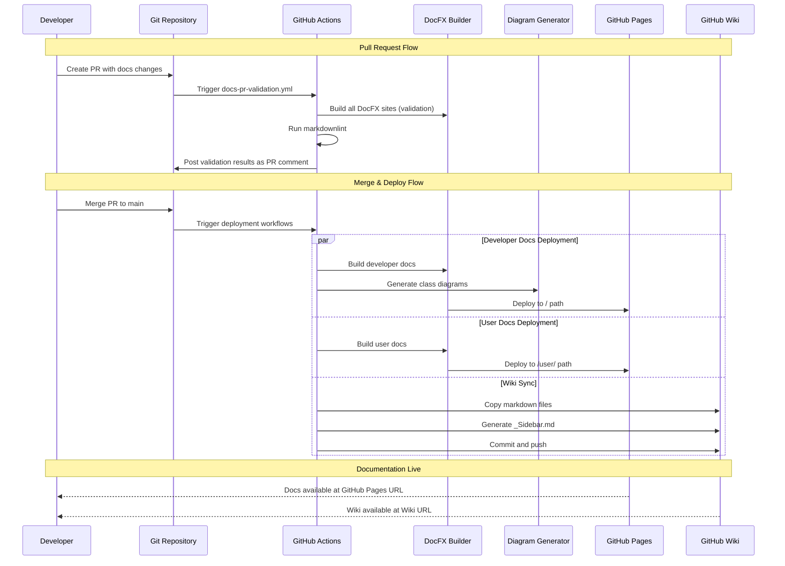

# GitHub Plugin Implementation Guide

**Version:** 1.0
**Last Updated:** 2025-11-02
**Status:** Implementation Guide

---

## Overview

This guide provides complete, production-ready instructions for implementing the GitHub plugin component of the AI-assisted documentation system. The GitHub plugin automates deployment of all three documentation types—System Developer Docs, System User Docs, and Company System Docs—using GitHub Actions, GitHub Pages, and GitHub Wiki.

### Purpose of the GitHub Plugin

The GitHub plugin transforms manual documentation deployment into a fully automated, zero-touch system:

- **System Developer Docs** → Deployed to GitHub Pages root path (/)
- **System User Docs** → Deployed to GitHub Pages user path (/user/)
- **Company System Docs** → Synchronized to GitHub Wiki

Every commit to the main branch automatically triggers deployment workflows. Pull requests undergo validation before merge, ensuring documentation quality remains high without manual intervention.

### What the Plugin Automates

**Deployment Automation:**
- DocFX builds from source code and markdown files
- Diagram generation from .NET assemblies and XML documentation
- GitHub Pages deployment with proper routing for multiple documentation sites
- GitHub Wiki synchronization from repository markdown files

**Quality Assurance:**
- Markdown linting with markdownlint-cli
- DocFX build validation in pull requests
- XML documentation comment checking (warning mode initially)
- Broken link detection (future enhancement)

**Developer Experience:**
- PR comments with validation results
- Branch protection preventing merges with failing documentation
- Workflow status badges showing documentation health
- Automatic deployment within 5 minutes of merge

### Prerequisites

**Repository Requirements:**
- GitHub repository (public or private)
- Repository admin access for configuration
- Git installed locally for testing

**.NET Environment:**
- .NET 10 SDK installed (matches global.json)
- DocFX tool installed globally (`dotnet tool install -g docfx`)
- PowerShell 7+ for cross-platform scripts

**Platform-Agnostic Core (from Phase 2):**
- `.docgen/` directory with automation scripts
- `docs/docfx-developer/` configured and tested
- `docs/docfx-user/` configured and tested
- `docs/wiki/` content created
- Diagram generation scripts functional

### Estimated Setup Time

**Initial Setup:** 30-45 minutes
- Create workflow files: 15 minutes
- Configure GitHub Pages: 5 minutes
- Configure branch protection: 5 minutes
- Test deployment: 10-15 minutes

**Total Phase 6 Time:** 4-6 hours (includes testing, troubleshooting, documentation)

---

## Architecture Overview

### GitHub Plugin Components

The GitHub plugin consists of four specialized workflows, each handling a specific documentation deployment or validation scenario:

**1. docs-developer-deploy.yml**
- **Purpose:** Build and deploy System Developer Docs to GitHub Pages root (/)
- **Triggers:** Push to main affecting `docs/docfx-developer/**`, `src/**`, or workflow file
- **Output:** Static HTML site with API reference, class diagrams, architecture docs
- **Deployment Target:** GitHub Pages environment (root path)

**2. docs-user-deploy.yml**
- **Purpose:** Build and deploy System User Docs to GitHub Pages /user/ path
- **Triggers:** Push to main affecting `docs/docfx-user/**` or workflow file
- **Output:** User-friendly HTML site with getting started guides, tutorials, screenshots
- **Deployment Target:** GitHub Pages environment (/user/ subdirectory)

**3. docs-wiki-sync.yml**
- **Purpose:** Synchronize markdown files from `docs/wiki/` to GitHub Wiki
- **Triggers:** Push to main affecting `docs/wiki/**` or workflow file
- **Output:** Wiki pages with sidebar navigation
- **Deployment Target:** GitHub Wiki repository (separate Git repo)

**4. docs-pr-validation.yml**
- **Purpose:** Validate documentation changes in pull requests before merge
- **Triggers:** Pull requests to main affecting `docs/**` or `src/**/*.cs`
- **Output:** PR comment with validation results, status check pass/fail
- **Actions:** Markdown linting, DocFX builds, XML documentation checks

### Deployment Flow



### Directory Structure

```
net10-project-example/
├── .github/
│   └── workflows/
│       ├── docs-developer-deploy.yml       # Developer docs deployment
│       ├── docs-user-deploy.yml            # User docs deployment
│       ├── docs-wiki-sync.yml              # Wiki synchronization
│       └── docs-pr-validation.yml          # PR validation
│
├── .docgen/                                # Platform-agnostic core
│   ├── diagram-gen.ps1                     # Diagram generation script
│   └── platform-config.json                # Platform configuration
│
├── docs/
│   ├── docfx-developer/                    # Developer docs source
│   │   ├── docfx.json                      # DocFX configuration
│   │   ├── index.md                        # Landing page
│   │   ├── toc.yml                         # Table of contents
│   │   ├── articles/                       # Conceptual articles
│   │   ├── api/                            # API reference (generated)
│   │   └── _site/                          # Build output (git-ignored)
│   │
│   ├── docfx-user/                         # User docs source
│   │   ├── docfx.json
│   │   ├── index.md
│   │   ├── articles/
│   │   └── _site/                          # Build output (git-ignored)
│   │
│   └── wiki/                               # Wiki source (synced to GitHub Wiki)
│       ├── README.md                       # Wiki home page
│       ├── system-purpose.md
│       ├── system-access.md
│       ├── feature-summary.md
│       └── active-development.md
│
├── src/                                    # Source code with XML comments
│   ├── Example.Web/
│   └── Example.API/
│
├── .markdownlint.json                      # Markdown linting rules
└── global.json                             # .NET SDK version
```

---

## Prerequisites

### GitHub Repository Setup

**Repository Requirements:**

1. **Repository Exists:** Public or private GitHub repository
2. **Admin Access:** Ability to modify repository settings and create workflows
3. **Wiki Initialized:** Create at least one wiki page manually
   - Navigate to repository → Wiki tab
   - Click "Create the first page"
   - Title: "Home"
   - Content: "Documentation wiki - content synced from repository"
   - Click "Save Page"
4. **Main Branch:** Repository has `main` branch (workflows trigger on this branch)

**Repository Checklist:**
- [ ] Repository created on GitHub
- [ ] Local clone exists
- [ ] Main branch is default branch
- [ ] Wiki initialized with at least one page
- [ ] Admin access confirmed

### Secrets & Permissions

**Automatic Secrets (No Configuration Required):**

GitHub Actions automatically provides the `GITHUB_TOKEN` secret with appropriate permissions for:
- Reading repository contents
- Writing to GitHub Pages
- Pushing to Wiki repository
- Posting PR comments
- Managing workflow status checks

**No manual secret creation required.** All workflows use `secrets.GITHUB_TOKEN` which is automatically injected by GitHub Actions.

**Repository Permissions (Configured in Workflow Files):**

Each workflow declares the minimum required permissions using the `permissions:` key:

```yaml
permissions:
  contents: read       # Read repository files
  pages: write         # Deploy to GitHub Pages
  id-token: write      # OIDC token for Pages deployment
  pull-requests: write # Post PR comments
  checks: write        # Create status checks
```

**GitHub Pages Settings (Manual Configuration):**

Repository → Settings → Pages:
- **Source:** GitHub Actions (recommended) or Deploy from a branch
- **Custom Domain:** Optional (configure DNS if needed)
- **Enforce HTTPS:** Enabled (recommended)

### Local Tools Required

**Required Tools for Development and Testing:**

1. **Git** (any recent version)
   ```bash
   git --version
   # git version 2.40+
   ```

2. **.NET 10 SDK** (version from global.json)
   ```bash
   dotnet --version
   # 10.0.100-rc.2.25502.107
   ```

3. **DocFX** (global tool)
   ```bash
   dotnet tool install -g docfx
   # Or update existing: dotnet tool update -g docfx
   docfx --version
   ```

4. **PowerShell 7+** (cross-platform)
   ```bash
   pwsh --version
   # PowerShell 7.4+
   ```

5. **Node.js** (for markdownlint-cli)
   ```bash
   node --version
   # v20+
   npm install -g markdownlint-cli
   ```

**Optional Tools for Enhanced Development:**

6. **GitHub CLI** (for PR creation and testing)
   ```bash
   gh --version
   # gh version 2.40+
   ```

7. **Diagram Generators** (installed in Phase 2)
   ```bash
   dotnet tool install -g dll2mmd
   dotnet tool install -g PlantUmlClassDiagramGenerator
   ```

**Installation Quick Commands:**

```bash
# Install all required tools
dotnet tool install -g docfx
npm install -g markdownlint-cli

# Verify installations
docfx --version
markdownlint --version
```

---

## Workflow 1: Developer Docs Deployment

### File: `.github/workflows/docs-developer-deploy.yml`

**Purpose:** Build and deploy System Developer Docs to GitHub Pages root path (/) whenever source code or developer documentation changes.

**Trigger Conditions:**
- Push to `main` branch
- Path filters: `docs/docfx-developer/**`, `src/**`, workflow file itself
- Manual trigger via `workflow_dispatch`

**Build Process:**
1. Checkout repository
2. Setup .NET SDK from global.json
3. Install DocFX and diagram generation tools
4. Restore NuGet dependencies
5. Build .NET projects
6. Generate class diagrams from assemblies
7. Build DocFX developer documentation
8. Upload artifact to GitHub Pages
9. Deploy to GitHub Pages environment

**Deployment Target:** GitHub Pages root path → `https://{username}.github.io/{repo}/`

### Complete YAML Example

```yaml
name: Deploy Developer Documentation

on:
  # Trigger on push to main branch affecting developer docs or source code
  push:
    branches: [main]
    paths:
      - 'docs/docfx-developer/**'
      - 'src/**'
      - '.github/workflows/docs-developer-deploy.yml'

  # Allow manual trigger from Actions tab
  workflow_dispatch:

# Minimal permissions required for this workflow
permissions:
  contents: read      # Read repository files
  pages: write        # Deploy to GitHub Pages
  id-token: write     # OIDC token for Pages deployment

# Ensure only one deployment runs at a time
# Cancel in-progress deployments when new commit pushed
concurrency:
  group: "pages-developer"
  cancel-in-progress: true

jobs:
  # Build job: Generate documentation artifacts
  build:
    runs-on: ubuntu-latest

    steps:
      # Step 1: Checkout repository code
      - name: Checkout repository
        uses: actions/checkout@v4
        with:
          fetch-depth: 0  # Full history for accurate commit info

      # Step 2: Setup .NET SDK matching global.json
      - name: Setup .NET SDK
        uses: actions/setup-dotnet@v4
        with:
          global-json-file: global.json

      # Step 3: Install DocFX as global tool
      - name: Install DocFX
        run: dotnet tool install -g docfx

      # Step 4: Install diagram generation tools
      - name: Install Diagram Tools
        run: |
          dotnet tool install -g dll2mmd
          dotnet tool install -g PlantUmlClassDiagramGenerator

      # Step 5: Restore NuGet dependencies
      - name: Restore dependencies
        run: dotnet restore

      # Step 6: Build .NET projects (required for API reference)
      - name: Build projects
        run: dotnet build --no-restore --configuration Release

      # Step 7: Generate class diagrams from compiled assemblies
      - name: Generate diagrams
        run: pwsh .docgen/diagram-gen.ps1 -All
        continue-on-error: true  # Don't fail build if diagrams fail

      # Step 8: Build Developer Documentation with DocFX
      - name: Build Developer Documentation
        run: docfx build docs/docfx-developer/docfx.json --warningsAsErrors
        # --warningsAsErrors: Treat warnings as errors (enforce quality)

      # Step 9: Upload documentation artifact for deployment
      - name: Upload Pages artifact
        uses: actions/upload-pages-artifact@v3
        with:
          path: docs/docfx-developer/_site
          # Uploads entire _site directory as artifact

  # Deploy job: Publish artifact to GitHub Pages
  deploy:
    needs: build  # Wait for build job to complete
    runs-on: ubuntu-latest

    # Configure GitHub Pages environment
    environment:
      name: github-pages
      url: ${{ steps.deployment.outputs.page_url }}

    steps:
      # Step 10: Deploy to GitHub Pages
      - name: Deploy to GitHub Pages
        id: deployment
        uses: actions/deploy-pages@v4
        # Deploys artifact from build job to GitHub Pages
        # Artifact is automatically downloaded by this action
```

### Step-by-Step Explanation

**Workflow Triggers:**
- `on.push.branches`: Executes only when commits pushed to `main` branch
- `on.push.paths`: Filters to only relevant file changes (docs, source, workflow itself)
- `workflow_dispatch`: Enables manual triggering from GitHub Actions UI

**Permissions (Principle of Least Privilege):**
- `contents: read`: Minimum permission to read repository files
- `pages: write`: Required to deploy artifacts to GitHub Pages
- `id-token: write`: Enables OIDC authentication for secure deployment

**Concurrency Control:**
- `group: "pages-developer"`: Groups related workflow runs together
- `cancel-in-progress: true`: Cancels older runs when new commit arrives (saves Actions minutes)

**Build Job Steps:**

1. **Checkout (actions/checkout@v4):** Clones repository with full git history (`fetch-depth: 0`) for accurate build metadata

2. **Setup .NET (actions/setup-dotnet@v4):** Installs .NET SDK version from global.json, ensures consistency with local development

3. **Install DocFX:** Installs latest DocFX as global .NET tool, available in PATH for subsequent steps

4. **Install Diagram Tools:** Installs dll2mmd and PlantUmlClassDiagramGenerator for automated class diagram generation from assemblies

5. **Restore Dependencies:** Downloads NuGet packages required for compilation

6. **Build Projects:** Compiles .NET solution in Release configuration, generates assemblies needed for API reference and diagram generation

7. **Generate Diagrams:** Executes PowerShell script to create Mermaid class diagrams from compiled assemblies
   - `continue-on-error: true`: Prevents build failure if diagram generation has issues (diagrams are enhancement, not requirement)

8. **Build Documentation:** Runs DocFX to generate static HTML site
   - `--warningsAsErrors`: Enforces documentation quality by treating warnings (missing XML comments, broken links) as build failures

9. **Upload Artifact:** Packages `_site/` directory as GitHub Pages artifact using official upload action

**Deploy Job Steps:**

10. **Deploy to GitHub Pages:** Uses official deploy-pages action to publish artifact
    - Automatically downloads artifact from build job
    - Deploys to GitHub Pages environment
    - Outputs `page_url` with deployed documentation URL

### Testing Locally

**Before Pushing Workflow File:**

```bash
# Navigate to repository root
cd /mnt/c/Users/bobby/src/claude/net10-project-example

# Install tools if not already installed
dotnet tool install -g docfx
dotnet tool install -g dll2mmd
dotnet tool install -g PlantUmlClassDiagramGenerator

# Test full build process
dotnet restore
dotnet build --configuration Release

# Generate diagrams (may fail if assemblies not built yet - that's OK)
pwsh .docgen/diagram-gen.ps1 -All

# Build DocFX developer docs
docfx build docs/docfx-developer/docfx.json

# Serve locally to preview
docfx serve docs/docfx-developer/_site

# Open browser to http://localhost:8080
# Verify:
# - API reference loads
# - Articles render correctly
# - Diagrams display (if generated)
# - Navigation works
# - Search functions
```

**Test Workflow Without Deploying:**

```bash
# Install act (GitHub Actions local runner)
# macOS: brew install act
# Linux: curl https://raw.githubusercontent.com/nektos/act/master/install.sh | sudo bash

# Run workflow locally (dry-run)
act push --workflows .github/workflows/docs-developer-deploy.yml --dry-run

# Run actual build job locally (skips deploy)
act push --workflows .github/workflows/docs-developer-deploy.yml --job build
```

### Troubleshooting

**Issue: DocFX build fails with "warning as error"**

**Symptoms:**
```
Error: docfx build docs/docfx-developer/docfx.json --warningsAsErrors
[ERROR] Missing XML documentation for public type 'Example.Web.Controllers.HomeController'
```

**Solution:**
Remove `--warningsAsErrors` flag temporarily while adding XML documentation comments:
```yaml
# Temporary fix (Phase 3 initial setup)
- name: Build Developer Documentation
  run: docfx build docs/docfx-developer/docfx.json
  # TODO: Re-enable --warningsAsErrors after adding XML comments
```

Add XML documentation comments to public types:
```csharp
/// <summary>
/// Home controller handles main application navigation.
/// </summary>
public class HomeController : Controller
{
    /// <summary>
    /// Displays the home page.
    /// </summary>
    /// <returns>Home view.</returns>
    public IActionResult Index()
    {
        return View();
    }
}
```

Re-enable `--warningsAsErrors` flag once all warnings resolved.

**Issue: Diagram generation fails**

**Symptoms:**
```
Error: .docgen/diagram-gen.ps1 : The term 'dll2mmd' is not recognized
```

**Solution:**
Ensure diagram tools installed in workflow:
```yaml
- name: Install Diagram Tools
  run: |
    dotnet tool install -g dll2mmd
    dotnet tool install -g PlantUmlClassDiagramGenerator
    # Verify installations
    dll2mmd --version
```

Or mark step as non-critical:
```yaml
- name: Generate diagrams
  run: pwsh .docgen/diagram-gen.ps1 -All
  continue-on-error: true
```

**Issue: GitHub Pages deployment fails with 404**

**Symptoms:**
- Workflow completes successfully
- GitHub Pages URL shows 404 error

**Solution:**

1. **Verify GitHub Pages enabled:**
   - Repository → Settings → Pages
   - Source: GitHub Actions
   - Check "Your site is live at..." message appears

2. **Wait for propagation:**
   - GitHub Pages can take 5-10 minutes to propagate
   - Check workflow logs for deployment URL
   - Visit URL in incognito mode (bypass cache)

3. **Check artifact contents:**
   - Workflow run → Artifacts → Download github-pages artifact
   - Unzip and verify `index.html` exists in root

4. **Verify permissions:**
   ```yaml
   permissions:
     contents: read
     pages: write       # Required
     id-token: write    # Required
   ```

**Issue: Workflow doesn't trigger on push**

**Symptoms:**
- Push to main branch
- No workflow run appears in Actions tab

**Solution:**

1. **Check path filters:**
   ```bash
   # Workflow only triggers if these paths change
   git diff HEAD~1 --name-only
   # Must include: docs/docfx-developer/**, src/**, or workflow file
   ```

2. **Verify branch name:**
   ```bash
   git branch --show-current
   # Must be 'main' (or change workflow to match your default branch)
   ```

3. **Check workflow file syntax:**
   ```bash
   # Install actionlint
   # macOS: brew install actionlint
   # Linux: go install github.com/rhysd/actionlint/cmd/actionlint@latest

   actionlint .github/workflows/docs-developer-deploy.yml
   ```

---

## Workflow 2: User Docs Deployment

### File: `.github/workflows/docs-user-deploy.yml`

**Purpose:** Build and deploy System User Docs to GitHub Pages `/user/` subdirectory whenever user documentation changes.

**Trigger Conditions:**
- Push to `main` branch
- Path filters: `docs/docfx-user/**`, workflow file itself
- Manual trigger via `workflow_dispatch`

**Key Difference from Developer Docs:**
User docs deploy to `/user/` subdirectory rather than root path. This requires an additional step to structure the artifact correctly.

### Complete YAML Example

```yaml
name: Deploy User Documentation

on:
  push:
    branches: [main]
    paths:
      - 'docs/docfx-user/**'
      - '.github/workflows/docs-user-deploy.yml'
  workflow_dispatch:

permissions:
  contents: read
  pages: write
  id-token: write

concurrency:
  group: "pages-user"
  cancel-in-progress: true

jobs:
  build:
    runs-on: ubuntu-latest

    steps:
      - name: Checkout repository
        uses: actions/checkout@v4

      - name: Setup .NET SDK
        uses: actions/setup-dotnet@v4
        with:
          global-json-file: global.json

      - name: Install DocFX
        run: dotnet tool install -g docfx

      # User docs don't need diagram generation (simpler content)
      # If needed, uncomment and install diagram tools

      - name: Build User Documentation
        run: docfx build docs/docfx-user/docfx.json

      # Key difference: Prepare artifact with /user/ prefix
      - name: Prepare artifact with user/ subdirectory
        run: |
          mkdir -p _artifact/user
          cp -r docs/docfx-user/_site/* _artifact/user/

      - name: Upload Pages artifact
        uses: actions/upload-pages-artifact@v3
        with:
          path: _artifact

  deploy:
    needs: build
    runs-on: ubuntu-latest

    environment:
      name: github-pages-user
      url: ${{ steps.deployment.outputs.page_url }}user/

    steps:
      - name: Deploy to GitHub Pages
        id: deployment
        uses: actions/deploy-pages@v4
```

### Differences from Developer Docs Workflow

**1. Path Filters:**
```yaml
# User docs workflow only watches user docs directory
paths:
  - 'docs/docfx-user/**'
  - '.github/workflows/docs-user-deploy.yml'

# Developer docs watches source code too (for API reference)
paths:
  - 'docs/docfx-developer/**'
  - 'src/**'
  - '.github/workflows/docs-developer-deploy.yml'
```

**2. Artifact Preparation:**
```yaml
# User docs: Must create /user/ subdirectory in artifact
- name: Prepare artifact with user/ subdirectory
  run: |
    mkdir -p _artifact/user
    cp -r docs/docfx-user/_site/* _artifact/user/

- name: Upload Pages artifact
  uses: actions/upload-pages-artifact@v3
  with:
    path: _artifact  # Upload _artifact (contains user/ subdirectory)

# Developer docs: Upload _site directly to root
- name: Upload Pages artifact
  uses: actions/upload-pages-artifact@v3
  with:
    path: docs/docfx-developer/_site  # Upload directly to root
```

**3. Environment URL:**
```yaml
# User docs: Append /user/ to page_url
environment:
  name: github-pages-user
  url: ${{ steps.deployment.outputs.page_url }}user/

# Developer docs: Use page_url directly (root path)
environment:
  name: github-pages
  url: ${{ steps.deployment.outputs.page_url }}
```

**4. Concurrency Group:**
```yaml
# User docs: Separate concurrency group
concurrency:
  group: "pages-user"

# Developer docs: Different concurrency group
concurrency:
  group: "pages-developer"
```

This separation allows both workflows to run in parallel when both documentation types change simultaneously.

### Alternative: Separate GitHub Pages Site

**Option A (Implemented Above): Single GitHub Pages site with subdirectories**
- Developer docs: `https://username.github.io/repo/`
- User docs: `https://username.github.io/repo/user/`
- Pros: Single deployment, simpler configuration
- Cons: Both docs must deploy together (can't update independently)

**Option B: Separate repository for user docs**
- Developer docs: `https://username.github.io/repo/`
- User docs: `https://username.github.io/repo-user-docs/`
- Pros: Independent versioning and deployment
- Cons: Requires second repository, more complex maintenance

For most projects, Option A (single site with subdirectories) provides the best balance of simplicity and functionality.

### Testing Locally

```bash
# Build user documentation
docfx build docs/docfx-user/docfx.json

# Simulate artifact preparation
mkdir -p _artifact/user
cp -r docs/docfx-user/_site/* _artifact/user/

# Serve from _artifact directory to test /user/ path
cd _artifact
python3 -m http.server 8080

# Open browser to http://localhost:8080/user/
# Verify:
# - User docs load at /user/ path
# - All links work with /user/ prefix
# - Navigation functions correctly
```

### Troubleshooting

**Issue: User docs show 404 at /user/ path**

**Solution:**

1. **Verify artifact structure:**
   ```bash
   # Download artifact from workflow run
   # Unzip and check structure:
   _artifact/
   └── user/
       ├── index.html
       ├── articles/
       └── ...
   ```

2. **Check DocFX base URL configuration:**
   ```json
   // docs/docfx-user/docfx.json
   {
     "build": {
       "globalMetadata": {
         "_appFooter": "User Documentation",
         "_appTitle": "System User Docs",
         "_enableSearch": true
       },
       "dest": "_site",
       "globalMetadataFiles": [],
       "fileMetadataFiles": [],
       "template": [
         "default"
       ],
       "postProcessors": ["ExtractSearchIndex"],
       "markdownEngineName": "markdig",
       "noLangKeyword": false,
       "keepFileLink": false,
       "cleanupCacheHistory": false,
       "disableGitFeatures": false
     }
   }
   ```

3. **Verify GitHub Pages settings:**
   - Settings → Pages → Source: GitHub Actions
   - Check deployment environment matches workflow (`github-pages-user`)

**Issue: User docs links broken (404 on navigation)**

**Solution:**

DocFX may generate absolute paths (/) instead of relative paths. Configure `docfx.json` for relative paths:

```json
{
  "build": {
    "globalMetadata": {
      "_disableContribution": true,
      "_disableNavbar": false,
      "_disableBreadcrumb": false
    }
  }
}
```

Or update workflow to rewrite links:

```yaml
- name: Fix links for /user/ subdirectory
  run: |
    find _artifact/user -name "*.html" -type f -exec sed -i 's|href="/|href="/user/|g' {} +
    find _artifact/user -name "*.html" -type f -exec sed -i 's|src="/|src="/user/|g' {} +
```

---

## Workflow 3: Wiki Synchronization

### File: `.github/workflows/docs-wiki-sync.yml`

**Purpose:** Synchronize markdown files from `docs/wiki/` to GitHub Wiki repository whenever wiki content changes.

**GitHub Wiki Architecture:**

GitHub Wiki is actually a separate Git repository with `.wiki` suffix:
- Main repository: `https://github.com/username/repo`
- Wiki repository: `https://github.com/username/repo.wiki`

The workflow clones the wiki repository, copies files from `docs/wiki/`, and pushes changes back.

**Trigger Conditions:**
- Push to `main` branch
- Path filters: `docs/wiki/**`, workflow file itself
- Manual trigger via `workflow_dispatch`

### Complete YAML Example

```yaml
name: Sync Wiki Documentation

on:
  push:
    branches: [main]
    paths:
      - 'docs/wiki/**'
      - '.github/workflows/docs-wiki-sync.yml'
  workflow_dispatch:

permissions:
  contents: write  # Required to push to wiki repository

jobs:
  sync-wiki:
    runs-on: ubuntu-latest

    steps:
      # Step 1: Checkout main repository
      - name: Checkout main repository
        uses: actions/checkout@v4
        with:
          fetch-depth: 1  # Shallow clone (only need latest commit)

      # Step 2: Checkout wiki repository into wiki/ subdirectory
      - name: Checkout wiki repository
        uses: actions/checkout@v4
        with:
          repository: ${{ github.repository }}.wiki
          path: wiki
          token: ${{ secrets.GITHUB_TOKEN }}

      # Step 3: Copy wiki markdown files from docs/wiki/ to wiki/
      - name: Copy wiki files
        run: |
          # Copy all markdown files
          cp docs/wiki/*.md wiki/

          # Rename README.md to Home.md (GitHub Wiki requirement)
          if [ -f wiki/README.md ]; then
            mv wiki/README.md wiki/Home.md
          fi

      # Step 4: Generate sidebar navigation
      - name: Create sidebar navigation
        run: |
          cat > wiki/_Sidebar.md <<'EOF'
          **Navigation**

          * [Home](Home)

          **System Overview**
          * [System Purpose](system-purpose)
          * [System Access](system-access)
          * [Feature Summary](feature-summary)

          **Development**
          * [Active Development](active-development)

          **Documentation**
          * [Developer Docs](${{ steps.get-repo-info.outputs.pages_url }})
          * [User Docs](${{ steps.get-repo-info.outputs.pages_url }}user/)
          EOF

      # Step 5: Get repository info for links
      - name: Get repository info
        id: get-repo-info
        run: |
          PAGES_URL="https://${{ github.repository_owner }}.github.io/${{ github.event.repository.name }}/"
          echo "pages_url=${PAGES_URL}" >> $GITHUB_OUTPUT

      # Step 6: Update sidebar with actual URLs
      - name: Update sidebar with repository URLs
        run: |
          PAGES_URL="${{ steps.get-repo-info.outputs.pages_url }}"
          sed -i "s|\${{ steps.get-repo-info.outputs.pages_url }}|${PAGES_URL}|g" wiki/_Sidebar.md

      # Step 7: Commit and push changes to wiki repository
      - name: Commit and push to wiki
        working-directory: wiki
        run: |
          git config user.name "github-actions[bot]"
          git config user.email "github-actions[bot]@users.noreply.github.com"
          git add .

          # Only commit if there are changes
          if git diff-index --quiet HEAD --; then
            echo "No changes to commit"
          else
            git commit -m "Sync wiki from main repository - ${{ github.sha }}"
            git push
            echo "Wiki updated successfully"
          fi
```

### GitHub Wiki Structure

**Wiki Repository Pattern:**

GitHub Wiki operates as a separate Git repository that can be cloned and modified:

```bash
# Clone wiki repository manually (for testing)
git clone https://github.com/username/repo.wiki.git

# Wiki repository structure
repo.wiki/
├── Home.md                    # Required: Wiki home page (from README.md)
├── system-purpose.md          # Custom wiki page
├── system-access.md
├── feature-summary.md
├── active-development.md
└── _Sidebar.md                # Optional: Navigation sidebar
```

**File Naming Requirements:**
- `Home.md` is required (serves as wiki home page)
- Other files: lowercase with hyphens (e.g., `system-purpose.md`)
- Underscores allowed but hyphens preferred
- File names become page URLs (e.g., `system-purpose.md` → `/wiki/system-purpose`)

**Sidebar Navigation (`_Sidebar.md`):**

GitHub Wiki automatically displays `_Sidebar.md` as navigation sidebar on all pages. Links use wiki page names without `.md` extension:

```markdown
**Navigation**

* [Home](Home)

**System Overview**
* [System Purpose](system-purpose)
* [System Access](system-access)
```

**Markdown Link Format:**
- `[Link Text](PageName)` - Links to another wiki page
- `[Link Text](https://example.com)` - External link
- `[Link Text](Home#section)` - Link to section within wiki page

### Wiki Sync Script

The workflow uses inline shell commands, but you can also create a dedicated script:

**File: `.docgen/wiki-sync.ps1`**

```powershell
#!/usr/bin/env pwsh
<#
.SYNOPSIS
    Synchronize wiki content from docs/wiki/ to GitHub Wiki repository.

.PARAMETER WikiRepoPath
    Path to cloned wiki repository.

.PARAMETER SourceWikiPath
    Path to source wiki content (default: docs/wiki).

.PARAMETER PagesUrl
    GitHub Pages base URL for linking to documentation.
#>
param(
    [Parameter(Mandatory=$true)]
    [string]$WikiRepoPath,

    [Parameter(Mandatory=$false)]
    [string]$SourceWikiPath = "docs/wiki",

    [Parameter(Mandatory=$false)]
    [string]$PagesUrl = ""
)

# Copy all markdown files
Write-Host "Copying wiki files from $SourceWikiPath to $WikiRepoPath..."
Copy-Item "$SourceWikiPath/*.md" -Destination $WikiRepoPath -Force

# Rename README.md to Home.md (GitHub Wiki requirement)
if (Test-Path "$WikiRepoPath/README.md") {
    Write-Host "Renaming README.md to Home.md..."
    Move-Item "$WikiRepoPath/README.md" "$WikiRepoPath/Home.md" -Force
}

# Generate sidebar
Write-Host "Generating _Sidebar.md..."
$sidebarContent = @"
**Navigation**

* [Home](Home)

**System Overview**
* [System Purpose](system-purpose)
* [System Access](system-access)
* [Feature Summary](feature-summary)

**Development**
* [Active Development](active-development)
"@

if ($PagesUrl) {
    $sidebarContent += @"

**Documentation**
* [Developer Docs]($PagesUrl)
* [User Docs]($PagesUrl/user/)
"@
}

Set-Content "$WikiRepoPath/_Sidebar.md" -Value $sidebarContent

Write-Host "Wiki sync complete!"
```

**Usage in workflow:**

```yaml
- name: Sync wiki files
  run: |
    PAGES_URL="https://${{ github.repository_owner }}.github.io/${{ github.event.repository.name }}/"
    pwsh .docgen/wiki-sync.ps1 -WikiRepoPath wiki -PagesUrl $PAGES_URL
```

### Testing Locally

**Before pushing workflow:**

```bash
# Clone wiki repository (replace with your repo)
git clone https://github.com/NotMyself/net10-project-example.wiki.git wiki-test

# Copy wiki files
cp docs/wiki/*.md wiki-test/

# Rename README to Home
mv wiki-test/README.md wiki-test/Home.md

# Create sidebar
cat > wiki-test/_Sidebar.md <<'EOF'
**Navigation**
* [Home](Home)
* [System Purpose](system-purpose)
EOF

# Commit and push (dry-run)
cd wiki-test
git add .
git status
# Verify files look correct
git diff --staged

# Push to wiki (uncomment to actually sync)
# git commit -m "Test wiki sync"
# git push
```

**Verify wiki pages:**
1. Visit `https://github.com/username/repo/wiki`
2. Check Home page appears
3. Verify sidebar navigation displays
4. Click links to test navigation
5. Check all pages render correctly

### Troubleshooting

**Issue: Wiki sync fails with "remote: Permission to username/repo.wiki.git denied"**

**Solution:**

1. **Verify wiki is initialized:**
   - Visit repository → Wiki tab
   - Create at least one page manually
   - Confirm wiki repository exists: `https://github.com/username/repo.wiki`

2. **Check workflow permissions:**
   ```yaml
   permissions:
     contents: write  # Required for wiki push
   ```

3. **Verify GITHUB_TOKEN has wiki access:**
   GitHub Actions GITHUB_TOKEN automatically has wiki access for the repository. If issues persist, check repository settings:
   - Settings → Actions → General → Workflow permissions
   - Select "Read and write permissions"

**Issue: Wiki pages don't appear in sidebar**

**Solution:**

1. **Check _Sidebar.md format:**
   ```markdown
   # WRONG: Using full URLs
   * [Home](https://github.com/user/repo/wiki/Home)

   # CORRECT: Using page names
   * [Home](Home)
   ```

2. **Verify page names match file names:**
   ```markdown
   # File: system-purpose.md
   # Sidebar link: [System Purpose](system-purpose)  ✓ Correct
   # Sidebar link: [System Purpose](SystemPurpose)   ✗ Wrong (case mismatch)
   ```

3. **Check for special characters:**
   Wiki page names should use lowercase letters, numbers, hyphens, underscores only.

**Issue: Wiki sync creates duplicate commits**

**Solution:**

The workflow includes a check to prevent empty commits:

```yaml
- name: Commit and push to wiki
  working-directory: wiki
  run: |
    git add .
    # Check if there are actual changes
    if git diff-index --quiet HEAD --; then
      echo "No changes to commit"
    else
      git commit -m "Sync wiki from main repository"
      git push
    fi
```

If duplicate commits still occur, verify this check is present in your workflow.

**Issue: Links to GitHub Pages broken in wiki**

**Solution:**

Ensure GitHub Pages URL is correctly generated:

```yaml
- name: Get repository info
  id: get-repo-info
  run: |
    # Generate GitHub Pages URL
    PAGES_URL="https://${{ github.repository_owner }}.github.io/${{ github.event.repository.name }}/"
    echo "pages_url=${PAGES_URL}" >> $GITHUB_OUTPUT

- name: Update sidebar with repository URLs
  run: |
    # Use the generated URL
    PAGES_URL="${{ steps.get-repo-info.outputs.pages_url }}"
    sed -i "s|PLACEHOLDER_URL|${PAGES_URL}|g" wiki/_Sidebar.md
```

---

## Workflow 4: PR Validation

### File: `.github/workflows/docs-pr-validation.yml`

**Purpose:** Validate documentation changes in pull requests before merge to ensure quality, catch errors early, and provide actionable feedback to contributors.

**Validation Steps:**
1. **Markdown Linting:** Check markdown files follow style guidelines (markdownlint-cli)
2. **DocFX Build Validation:** Ensure all DocFX sites build without errors
3. **XML Documentation Check:** Verify public APIs have XML documentation comments (warning mode)
4. **Build Success:** Confirm .NET projects compile successfully

**Trigger Conditions:**
- Pull requests to `main` branch
- Path filters: `docs/**`, `src/**/*.cs`, workflow file itself
- Runs on every PR commit (allows iterative fixes)

### Complete YAML Example

```yaml
name: Validate Documentation

on:
  pull_request:
    branches: [main]
    paths:
      - 'docs/**'
      - 'src/**/*.cs'
      - '.github/workflows/docs-pr-validation.yml'

permissions:
  contents: read           # Read repository files
  pull-requests: write     # Post comments on PRs
  checks: write            # Create status checks

jobs:
  validate:
    runs-on: ubuntu-latest

    steps:
      # Step 1: Checkout pull request code
      - name: Checkout pull request
        uses: actions/checkout@v4
        with:
          fetch-depth: 0  # Full history for accurate diffs

      # Step 2: Setup .NET SDK
      - name: Setup .NET SDK
        uses: actions/setup-dotnet@v4
        with:
          global-json-file: global.json

      # Step 3: Setup Node.js for markdownlint
      - name: Setup Node.js
        uses: actions/setup-node@v4
        with:
          node-version: '20'
          cache: 'npm'

      # Step 4: Install markdownlint-cli
      - name: Install markdownlint
        run: npm install -g markdownlint-cli

      # Step 5: Lint markdown files
      - name: Lint markdown files
        id: markdownlint
        run: |
          echo "## Markdown Linting Results" >> $GITHUB_STEP_SUMMARY

          if markdownlint 'docs/**/*.md' --config .markdownlint.json; then
            echo "✅ All markdown files passed linting" >> $GITHUB_STEP_SUMMARY
            echo "lint_status=success" >> $GITHUB_OUTPUT
          else
            echo "⚠️ Markdown linting found issues (see logs)" >> $GITHUB_STEP_SUMMARY
            echo "lint_status=failed" >> $GITHUB_OUTPUT
            exit 1
          fi
        continue-on-error: false

      # Step 6: Install DocFX
      - name: Install DocFX
        run: dotnet tool install -g docfx

      # Step 7: Install diagram tools (needed for developer docs)
      - name: Install Diagram Tools
        run: |
          dotnet tool install -g dll2mmd
          dotnet tool install -g PlantUmlClassDiagramGenerator

      # Step 8: Restore and build .NET projects
      - name: Build .NET projects
        id: dotnet-build
        run: |
          echo "## .NET Build Results" >> $GITHUB_STEP_SUMMARY

          dotnet restore
          dotnet build --no-restore --configuration Release

          echo "✅ .NET projects built successfully" >> $GITHUB_STEP_SUMMARY
          echo "build_status=success" >> $GITHUB_OUTPUT

      # Step 9: Generate diagrams
      - name: Generate diagrams
        run: pwsh .docgen/diagram-gen.ps1 -All
        continue-on-error: true

      # Step 10: Validate Developer Documentation build
      - name: Validate Developer Documentation
        id: docfx-developer
        run: |
          echo "## Developer Documentation Build" >> $GITHUB_STEP_SUMMARY

          if docfx build docs/docfx-developer/docfx.json; then
            echo "✅ Developer documentation built successfully" >> $GITHUB_STEP_SUMMARY
            echo "developer_docs_status=success" >> $GITHUB_OUTPUT
          else
            echo "❌ Developer documentation build failed" >> $GITHUB_STEP_SUMMARY
            echo "developer_docs_status=failed" >> $GITHUB_OUTPUT
            exit 1
          fi

      # Step 11: Validate User Documentation build
      - name: Validate User Documentation
        id: docfx-user
        run: |
          echo "## User Documentation Build" >> $GITHUB_STEP_SUMMARY

          if docfx build docs/docfx-user/docfx.json; then
            echo "✅ User documentation built successfully" >> $GITHUB_STEP_SUMMARY
            echo "user_docs_status=success" >> $GITHUB_OUTPUT
          else
            echo "❌ User documentation build failed" >> $GITHUB_STEP_SUMMARY
            echo "user_docs_status=failed" >> $GITHUB_OUTPUT
            exit 1
          fi

      # Step 12: Check for missing XML documentation (warning only)
      - name: Check XML documentation coverage
        id: xml-check
        run: |
          echo "## XML Documentation Coverage" >> $GITHUB_STEP_SUMMARY

          # Find C# files with public types but no XML comments
          # This is a simplified check - enhance with proper tooling later
          MISSING_DOCS=$(grep -r "public class\|public interface\|public enum" src/ --include="*.cs" | wc -l)
          XML_DOCS=$(grep -r "/// <summary>" src/ --include="*.cs" | wc -l)

          echo "Public types: $MISSING_DOCS" >> $GITHUB_STEP_SUMMARY
          echo "Documented types: $XML_DOCS" >> $GITHUB_STEP_SUMMARY

          if [ "$XML_DOCS" -lt "$MISSING_DOCS" ]; then
            echo "⚠️ Some public types missing XML documentation" >> $GITHUB_STEP_SUMMARY
            echo "xml_coverage=partial" >> $GITHUB_OUTPUT
          else
            echo "✅ All public types have XML documentation" >> $GITHUB_STEP_SUMMARY
            echo "xml_coverage=complete" >> $GITHUB_OUTPUT
          fi
        continue-on-error: true

      # Step 13: Create validation summary comment
      - name: Post PR comment with validation results
        if: always()
        uses: actions/github-script@v7
        with:
          script: |
            const fs = require('fs');

            // Build validation summary
            let summary = '## 📚 Documentation Validation Results\n\n';

            summary += '| Check | Status | Details |\n';
            summary += '|-------|--------|----------|\n';

            // Markdown linting
            const lintStatus = '${{ steps.markdownlint.outputs.lint_status }}';
            summary += `| Markdown Linting | ${lintStatus === 'success' ? '✅ Passed' : '❌ Failed'} | `;
            summary += lintStatus === 'success'
              ? 'All markdown files follow style guidelines\n'
              : 'See workflow logs for linting errors\n';

            // .NET build
            const buildStatus = '${{ steps.dotnet-build.outputs.build_status }}';
            summary += `| .NET Build | ${buildStatus === 'success' ? '✅ Passed' : '❌ Failed'} | `;
            summary += buildStatus === 'success'
              ? 'Projects compiled successfully\n'
              : 'Build errors detected\n';

            // Developer docs
            const devDocsStatus = '${{ steps.docfx-developer.outputs.developer_docs_status }}';
            summary += `| Developer Docs | ${devDocsStatus === 'success' ? '✅ Passed' : '❌ Failed'} | `;
            summary += devDocsStatus === 'success'
              ? 'DocFX build completed\n'
              : 'DocFX build errors detected\n';

            // User docs
            const userDocsStatus = '${{ steps.docfx-user.outputs.user_docs_status }}';
            summary += `| User Docs | ${userDocsStatus === 'success' ? '✅ Passed' : '❌ Failed'} | `;
            summary += userDocsStatus === 'success'
              ? 'DocFX build completed\n'
              : 'DocFX build errors detected\n';

            // XML documentation
            const xmlCoverage = '${{ steps.xml-check.outputs.xml_coverage }}';
            summary += `| XML Documentation | ${xmlCoverage === 'complete' ? '✅ Complete' : '⚠️ Partial'} | `;
            summary += xmlCoverage === 'complete'
              ? 'All public types documented\n'
              : 'Some public types missing XML comments (non-blocking)\n';

            summary += '\n---\n\n';

            // Add guidance if failures
            if (lintStatus !== 'success' || devDocsStatus !== 'success' || userDocsStatus !== 'success') {
              summary += '### 🔧 Next Steps\n\n';

              if (lintStatus !== 'success') {
                summary += '**Markdown Linting Failures:**\n';
                summary += '- Run `markdownlint "docs/**/*.md" --config .markdownlint.json` locally\n';
                summary += '- Fix reported issues\n';
                summary += '- Common issues: line length, trailing whitespace, heading styles\n\n';
              }

              if (devDocsStatus !== 'success' || userDocsStatus !== 'success') {
                summary += '**DocFX Build Failures:**\n';
                summary += '- Run `docfx build docs/docfx-developer/docfx.json` locally\n';
                summary += '- Run `docfx build docs/docfx-user/docfx.json` locally\n';
                summary += '- Check for missing files, broken links, or invalid markdown\n';
                summary += '- Verify all referenced files exist\n\n';
              }
            } else {
              summary += '### ✨ All Checks Passed!\n\n';
              summary += 'Documentation is ready to merge. Great work! 🎉\n';
            }

            // Find existing bot comments
            const { data: comments } = await github.rest.issues.listComments({
              owner: context.repo.owner,
              repo: context.repo.repo,
              issue_number: context.issue.number,
            });

            const botComment = comments.find(comment =>
              comment.user.type === 'Bot' &&
              comment.body.includes('Documentation Validation Results')
            );

            // Update existing comment or create new one
            if (botComment) {
              await github.rest.issues.updateComment({
                owner: context.repo.owner,
                repo: context.repo.repo,
                comment_id: botComment.id,
                body: summary
              });
            } else {
              await github.rest.issues.createComment({
                owner: context.repo.owner,
                repo: context.repo.repo,
                issue_number: context.issue.number,
                body: summary
              });
            }

      # Step 14: Set final status check
      - name: Final validation status
        if: always()
        run: |
          LINT_STATUS="${{ steps.markdownlint.outputs.lint_status }}"
          DEV_DOCS_STATUS="${{ steps.docfx-developer.outputs.developer_docs_status }}"
          USER_DOCS_STATUS="${{ steps.docfx-user.outputs.user_docs_status }}"

          if [ "$LINT_STATUS" = "success" ] && [ "$DEV_DOCS_STATUS" = "success" ] && [ "$USER_DOCS_STATUS" = "success" ]; then
            echo "✅ All documentation validation checks passed"
            exit 0
          else
            echo "❌ Documentation validation failed"
            exit 1
          fi
```

### PR Comment Format

**Example validation report posted to pull request:**

```markdown
## 📚 Documentation Validation Results

| Check | Status | Details |
|-------|--------|----------|
| Markdown Linting | ✅ Passed | All markdown files follow style guidelines |
| .NET Build | ✅ Passed | Projects compiled successfully |
| Developer Docs | ✅ Passed | DocFX build completed |
| User Docs | ✅ Passed | DocFX build completed |
| XML Documentation | ⚠️ Partial | Some public types missing XML comments (non-blocking) |

---

### ✨ All Checks Passed!

Documentation is ready to merge. Great work! 🎉
```

**Example with failures:**

```markdown
## 📚 Documentation Validation Results

| Check | Status | Details |
|-------|--------|----------|
| Markdown Linting | ❌ Failed | See workflow logs for linting errors |
| .NET Build | ✅ Passed | Projects compiled successfully |
| Developer Docs | ❌ Failed | DocFX build errors detected |
| User Docs | ✅ Passed | DocFX build completed |
| XML Documentation | ⚠️ Partial | Some public types missing XML comments (non-blocking) |

---

### 🔧 Next Steps

**Markdown Linting Failures:**
- Run `markdownlint "docs/**/*.md" --config .markdownlint.json` locally
- Fix reported issues
- Common issues: line length, trailing whitespace, heading styles

**DocFX Build Failures:**
- Run `docfx build docs/docfx-developer/docfx.json` locally
- Check for missing files, broken links, or invalid markdown
- Verify all referenced files exist
```

**Comment Updates:**

The workflow updates the same PR comment on each commit (no spam), providing a live validation status that updates as the contributor fixes issues.

### Testing Locally

**Run all validation checks before creating PR:**

```bash
# 1. Markdown linting
markdownlint "docs/**/*.md" --config .markdownlint.json

# 2. .NET build
dotnet restore
dotnet build --configuration Release

# 3. Generate diagrams
pwsh .docgen/diagram-gen.ps1 -All

# 4. Build developer docs
docfx build docs/docfx-developer/docfx.json

# 5. Build user docs
docfx build docs/docfx-user/docfx.json

# 6. Check XML documentation (manual inspection)
grep -r "public class\|public interface" src/ --include="*.cs"
grep -r "/// <summary>" src/ --include="*.cs"

# If all commands succeed, PR validation will pass
```

**Create markdownlint configuration:**

**File: `.markdownlint.json`**

```json
{
  "default": true,
  "MD013": {
    "line_length": 120,
    "code_blocks": false,
    "tables": false
  },
  "MD033": {
    "allowed_elements": ["details", "summary", "br"]
  },
  "MD041": false
}
```

**Configuration explanations:**
- `MD013`: Line length rule (relaxed to 120 chars, disabled for code blocks and tables)
- `MD033`: Allow certain HTML elements (details, summary, br)
- `MD041`: Disable "first line must be heading" rule (allows frontmatter)

### Troubleshooting

**Issue: Markdown linting fails with "MD013 Line length"**

**Solution:**

1. **Fix line length violations:**
   ```markdown
   <!-- WRONG: Line too long -->
   This is a very long line that exceeds the maximum allowed line length and should be wrapped to multiple lines for better readability.

   <!-- CORRECT: Wrapped to multiple lines -->
   This is a very long line that exceeds the maximum allowed line length and should
   be wrapped to multiple lines for better readability.
   ```

2. **Or relax line length limit in `.markdownlint.json`:**
   ```json
   {
     "MD013": {
       "line_length": 150
     }
   }
   ```

3. **Or disable for specific content:**
   ```markdown
   <!-- markdownlint-disable MD013 -->
   This very long line will not trigger MD013 warnings.
   <!-- markdownlint-enable MD013 -->
   ```

**Issue: DocFX validation fails with "Missing reference"**

**Symptoms:**
```
[ERROR] Missing reference: ~/api/Example.Web.Controllers.HomeController.yml
```

**Solution:**

1. **Verify .csproj has XML documentation enabled:**
   ```xml
   <PropertyGroup>
     <GenerateDocumentationFile>true</GenerateDocumentationFile>
   </PropertyGroup>
   ```

2. **Ensure project builds before DocFX:**
   ```yaml
   - name: Build .NET projects
     run: dotnet build --configuration Release

   # Must build BEFORE DocFX
   - name: Validate Developer Documentation
     run: docfx build docs/docfx-developer/docfx.json
   ```

3. **Check docfx.json metadata configuration:**
   ```json
   {
     "metadata": [
       {
         "src": [
           {
             "files": ["**/*.csproj"],
             "src": "../../src"
           }
         ],
         "dest": "api",
         "outputFormat": "mref",
         "includePrivateMembers": false
       }
     ]
   }
   ```

**Issue: PR comment not posted**

**Symptoms:**
- Validation runs
- No PR comment appears

**Solution:**

1. **Verify permissions:**
   ```yaml
   permissions:
     pull-requests: write  # Required for posting comments
   ```

2. **Check actions/github-script version:**
   ```yaml
   - uses: actions/github-script@v7  # Use latest version
   ```

3. **Verify PR number available:**
   ```yaml
   # Should only run on pull_request events
   on:
     pull_request:
       branches: [main]
   ```

4. **Check workflow logs for script errors:**
   - Actions tab → Workflow run → "Post PR comment" step
   - Look for JavaScript errors

**Issue: XML documentation check reports incorrect counts**

**Solution:**

The basic grep-based check is a placeholder. For production use, implement proper XML documentation checking:

**Enhanced XML documentation check script:**

**File: `.docgen/check-xml-docs.ps1`**

```powershell
#!/usr/bin/env pwsh
<#
.SYNOPSIS
    Check XML documentation coverage for public APIs.
#>

$projectFiles = Get-ChildItem -Path src -Recurse -Filter *.csproj

$totalTypes = 0
$documentedTypes = 0

foreach ($project in $projectFiles) {
    $csFiles = Get-ChildItem -Path $project.DirectoryName -Recurse -Filter *.cs

    foreach ($csFile in $csFiles) {
        $content = Get-Content $csFile.FullName -Raw

        # Count public types
        $publicTypes = [regex]::Matches($content, "public (class|interface|enum|struct)")
        $totalTypes += $publicTypes.Count

        # Count XML documentation
        $xmlDocs = [regex]::Matches($content, "///\s*<summary>")
        $documentedTypes += $xmlDocs.Count
    }
}

$coverage = if ($totalTypes -gt 0) { [math]::Round(($documentedTypes / $totalTypes) * 100, 2) } else { 0 }

Write-Host "XML Documentation Coverage:"
Write-Host "  Total public types: $totalTypes"
Write-Host "  Documented types: $documentedTypes"
Write-Host "  Coverage: $coverage%"

if ($coverage -lt 80) {
    Write-Host "⚠️ XML documentation coverage below 80% threshold" -ForegroundColor Yellow
    exit 0  # Warning only, don't fail build
} else {
    Write-Host "✅ XML documentation coverage meets threshold" -ForegroundColor Green
    exit 0
}
```

**Use in workflow:**

```yaml
- name: Check XML documentation coverage
  run: pwsh .docgen/check-xml-docs.ps1
  continue-on-error: true
```

---

## GitHub Pages Configuration

### Manual Setup Steps

GitHub Pages must be configured manually through the repository settings before workflows can deploy documentation.

#### Step 1: Enable GitHub Pages

1. **Navigate to Repository Settings:**
   - Go to repository on GitHub
   - Click "Settings" tab (requires admin access)
   - Scroll to "Pages" in left sidebar

2. **Configure Build and Deployment:**

   **Option A: GitHub Actions (Recommended)**
   - Source: **GitHub Actions**
   - This option allows workflows to deploy directly
   - Supports multiple documentation sites (developer docs, user docs)
   - No branch selection required
   - Click "Save"

   **Option B: Deploy from Branch (Alternative)**
   - Source: **Deploy from a branch**
   - Branch: **gh-pages** (will be created by workflow)
   - Folder: **/ (root)**
   - Click "Save"
   - Note: This option requires modifying workflows to push to gh-pages branch instead of using upload-pages-artifact action

3. **Verify Configuration:**
   - After saving, page shows: "Your site is published at `https://username.github.io/repo/`"
   - URL format depends on repository type:
     - User/Organization site: `https://username.github.io/`
     - Project site: `https://username.github.io/repo/`

#### Step 2: Configure Custom Domain (Optional)

**If using custom domain for documentation:**

1. **Add Custom Domain:**
   - Settings → Pages → Custom domain field
   - Enter domain: `docs.example.com`
   - Click "Save"

2. **Configure DNS Records:**

   **For subdomain (docs.example.com):**
   ```
   CNAME docs.example.com → username.github.io
   ```

   **For apex domain (example.com):**
   ```
   A @ → 185.199.108.153
   A @ → 185.199.109.153
   A @ → 185.199.110.153
   A @ → 185.199.111.153
   AAAA @ → 2606:50c0:8000::153
   AAAA @ → 2606:50c0:8001::153
   AAAA @ → 2606:50c0:8002::153
   AAAA @ → 2606:50c0:8003::153
   ```

3. **Wait for DNS Propagation:**
   - Can take up to 24 hours
   - Check status: Settings → Pages → "DNS check successful" message

4. **Enable HTTPS:**
   - Settings → Pages → Check "Enforce HTTPS"
   - Wait for certificate provisioning (can take up to 1 hour)
   - Once provisioned, custom domain will redirect to HTTPS automatically

#### Step 3: Verify Deployment

**After first workflow run:**

1. **Check Actions Tab:**
   - Actions → Select workflow run
   - Verify "build" job succeeded
   - Verify "deploy" job succeeded
   - Check deployment environment: `github-pages`

2. **Visit GitHub Pages URL:**
   - Click URL in workflow summary
   - Or navigate manually: `https://username.github.io/repo/`
   - Verify developer docs load correctly

3. **Verify User Docs:**
   - Navigate to: `https://username.github.io/repo/user/`
   - Verify user docs load correctly
   - Check navigation, links, search functionality

4. **Common First-Deploy Issues:**
   - **404 Error:** Wait 5-10 minutes for propagation
   - **CSS Not Loading:** Check browser console for CORS errors (usually resolves after propagation)
   - **Search Not Working:** Ensure DocFX postProcessors includes "ExtractSearchIndex"

### Directory Structure on gh-pages Branch

**If using "Deploy from a branch" method:**

GitHub Pages serves content from the `gh-pages` branch. The workflow pushes the following structure:

```
gh-pages/
├── index.html                     # Developer docs landing page
├── api/                           # API reference (generated by DocFX)
│   ├── index.html
│   ├── Example.Web.html
│   ├── Example.API.html
│   └── ...
├── articles/                      # Developer articles
│   ├── architecture.html
│   ├── deployment.html
│   └── ...
├── user/                          # User docs section
│   ├── index.html
│   ├── articles/
│   │   ├── getting-started.html
│   │   ├── features.html
│   │   └── ...
│   └── ...
├── styles/                        # DocFX default styles
├── fonts/                         # DocFX fonts
├── manifest.json                  # DocFX manifest
├── xrefmap.yml                    # DocFX cross-reference map
└── .nojekyll                      # Prevents Jekyll processing
```

**If using "GitHub Actions" deployment method:**

No gh-pages branch is created. Instead, artifacts are deployed directly to GitHub Pages hosting environment. The same directory structure applies, but it's managed internally by GitHub.

### Troubleshooting GitHub Pages

**Issue: 404 Error on GitHub Pages URL**

**Symptoms:**
- Workflow succeeds
- Visiting `https://username.github.io/repo/` shows 404

**Solution:**

1. **Verify GitHub Pages enabled:**
   - Settings → Pages → Source configured
   - "Your site is published at..." message appears

2. **Wait for propagation:**
   - First deployment: Up to 10 minutes
   - Subsequent deployments: 1-2 minutes
   - Clear browser cache or use incognito mode

3. **Check artifact contents:**
   - Workflow run → Artifacts → Download "github-pages" artifact
   - Unzip and verify `index.html` exists in root
   - If missing, DocFX build may have failed silently

4. **Verify deployment step succeeded:**
   ```yaml
   # Check workflow logs
   - name: Deploy to GitHub Pages
     id: deployment
     uses: actions/deploy-pages@v4

   # Should output:
   # Deployed to: https://username.github.io/repo/
   ```

**Issue: CSS and JavaScript Not Loading**

**Symptoms:**
- Page loads but has no styling
- Browser console shows 404 errors for CSS/JS files

**Solution:**

1. **Check for base URL issues:**

   DocFX may generate absolute paths (`/styles/main.css`) instead of relative paths. Configure `docfx.json`:

   ```json
   {
     "build": {
       "globalMetadata": {
         "_appFooter": "Developer Documentation",
         "_appTitle": "Project Docs",
         "_enableSearch": true
       }
     }
   }
   ```

2. **Verify .nojekyll file exists:**

   GitHub Pages uses Jekyll by default, which ignores files/folders starting with underscore. Add `.nojekyll` file:

   ```yaml
   # In workflow, after DocFX build
   - name: Disable Jekyll processing
     run: touch docs/docfx-developer/_site/.nojekyll
   ```

3. **Check HTTPS enforcement:**

   Mixed content errors can occur if site loaded via HTTPS but assets requested via HTTP:
   - Settings → Pages → Enforce HTTPS: Enabled
   - Clear browser cache
   - Visit site with `https://` prefix

**Issue: Search Not Working**

**Symptoms:**
- Search box appears
- Typing in search box shows no results

**Solution:**

1. **Verify search index generation:**

   Check `docfx.json` includes search index postprocessor:

   ```json
   {
     "build": {
       "postProcessors": ["ExtractSearchIndex"],
       "dest": "_site"
     }
   }
   ```

2. **Check for index.json file:**

   After build, verify `docs/docfx-developer/_site/index.json` exists:

   ```bash
   ls -la docs/docfx-developer/_site/index.json
   # Should exist and be non-empty
   ```

3. **Verify search script loaded:**

   Open browser dev tools → Network tab → Reload page
   - Check for `search-worker.js` request (should be 200 OK)
   - Check for `index.json` request (should be 200 OK)

**Issue: User Docs Return 404 at /user/ Path**

**Symptoms:**
- Developer docs load at `/`
- User docs return 404 at `/user/`

**Solution:**

1. **Verify artifact structure:**

   Download workflow artifact and verify structure:
   ```
   _artifact/
   └── user/
       ├── index.html
       └── ...
   ```

2. **Check workflow artifact preparation:**

   ```yaml
   # docs-user-deploy.yml
   - name: Prepare artifact with user/ subdirectory
     run: |
       mkdir -p _artifact/user
       cp -r docs/docfx-user/_site/* _artifact/user/

   - name: Upload Pages artifact
     uses: actions/upload-pages-artifact@v3
     with:
       path: _artifact  # Must upload _artifact, not _artifact/user
   ```

3. **Alternative: Separate deployment:**

   If subdirectory approach fails, use separate GitHub Pages site:
   - Create new repository: `repo-user-docs`
   - Configure GitHub Pages for that repository
   - Update workflow to deploy to separate repository

---

## Branch Protection Configuration

Branch protection rules prevent direct pushes to `main` branch and enforce documentation validation before merge. This ensures all documentation changes undergo review and automated validation.

### Recommended Settings

#### Step 1: Navigate to Branch Protection Rules

1. **Open Repository Settings:**
   - Repository → Settings → Branches (left sidebar)

2. **Add Branch Protection Rule:**
   - Click "Add branch protection rule"

3. **Configure Branch Pattern:**
   - Branch name pattern: `main`
   - This applies protection to the main branch

#### Step 2: Configure Protection Rules

**Require Pull Request Reviews Before Merging:**
- ☑ Require a pull request before merging
- Required approvals: **1** (or more for larger teams)
- ☑ Dismiss stale pull request approvals when new commits are pushed (recommended)
- ☐ Require review from Code Owners (optional, if CODEOWNERS file exists)

**Require Status Checks to Pass Before Merging:**
- ☑ Require status checks to pass before merging
- ☑ Require branches to be up to date before merging (recommended)
- Search for status checks:
  - Type "validate" → Select **"validate / Validate Documentation"**
  - If multiple checks desired, also add:
    - **".NET CI/CD / build-and-test"** (if exists from other workflows)
    - **"CodeQL"** (if security scanning enabled)

**Require Conversation Resolution Before Merging:**
- ☑ Require conversation resolution before merging (recommended)
- Ensures all review comments addressed before merge

**Require Signed Commits:**
- ☐ Require signed commits (optional, higher security environments)

**Require Linear History:**
- ☐ Require linear history (optional, enforces rebase/squash instead of merge commits)

**Include Administrators:**
- ☐ Do not allow bypassing the above settings (optional)
- If checked, even admins must follow rules (recommended for team projects)
- If unchecked, admins can bypass (useful for solo projects)

**Allow Force Pushes:**
- ☐ Allow force pushes (leave unchecked, prevents history rewriting)

**Allow Deletions:**
- ☐ Allow deletions (leave unchecked, prevents accidental branch deletion)

#### Step 3: Save Protection Rule

- Click "Create" button at bottom
- Branch protection now active for `main` branch

### Required Status Checks

**Status check names must match workflow job names exactly.**

**From docs-pr-validation.yml:**
```yaml
jobs:
  validate:  # ← Status check name: "validate"
    runs-on: ubuntu-latest
```

**Branch protection configuration:**
- Status check to require: **"validate"** (matches job name)
- Alternative format: **"Validate Documentation / validate"** (workflow name / job name)

**Verify status check names:**
1. Create a test PR
2. Wait for validation workflow to run
3. Check "All checks have passed" section in PR
4. Note exact name shown (e.g., "validate" or "Validate Documentation / validate")
5. Use exact name in branch protection rules

### Testing Branch Protection

**Verify branch protection works correctly:**

#### Test 1: Direct Push Blocked

```bash
# Try to push directly to main (should fail)
git checkout main
echo "test" >> README.md
git add README.md
git commit -m "Test direct push"
git push origin main

# Expected error:
# remote: error: GH006: Protected branch update failed for refs/heads/main.
# remote: error: Required status checks must pass before merging
```

#### Test 2: PR Without Approval Blocked

```bash
# Create feature branch
git checkout -b test-branch-protection
echo "Test change" >> docs/wiki/README.md
git add docs/wiki/README.md
git commit -m "Test: Branch protection"
git push origin test-branch-protection

# Create PR
gh pr create --title "Test: Branch Protection" --body "Testing branch protection rules"

# Try to merge immediately (should be blocked)
gh pr merge --squash

# Expected error:
# - Required status checks not passed
# - Requires approving review
```

#### Test 3: PR With Failing Validation Blocked

```bash
# Create feature branch with intentional error
git checkout -b test-validation-failure
echo "This line is intentionally very long and will fail markdownlint MD013 line length validation because it exceeds 120 characters" >> docs/wiki/README.md
git add docs/wiki/README.md
git commit -m "Test: Validation failure"
git push origin test-validation-failure

# Create PR
gh pr create --title "Test: Validation Failure" --body "Testing validation blocking merge"

# Wait for validation to run
gh pr checks

# Try to merge (should be blocked)
gh pr merge --squash

# Expected error:
# - Required status checks failed: "validate"
# - Fix issues and push to trigger re-validation
```

#### Test 4: Successful PR Flow

```bash
# Create feature branch with valid changes
git checkout -b test-successful-pr
echo "Valid documentation change" >> docs/wiki/system-purpose.md
git add docs/wiki/system-purpose.md
git commit -m "docs: Update system purpose"
git push origin test-successful-pr

# Create PR
gh pr create --title "docs: Update system purpose" --body "Adding clarification to system purpose documentation"

# Wait for validation
gh pr checks
# Status: ✓ All checks have passed

# Request review (if required)
gh pr review --approve

# Merge PR (now allowed)
gh pr merge --squash
# Success: PR merged to main
```

---

## Complete Implementation Checklist

Use this checklist to track GitHub plugin implementation progress:

### Phase 1: Workflow Creation

- [ ] Create `.github/workflows/` directory
  ```bash
  mkdir -p .github/workflows
  ```

- [ ] Create `docs-developer-deploy.yml`
  - [ ] Copy complete YAML from this guide
  - [ ] Update repository-specific values (if any)
  - [ ] Commit and push

- [ ] Create `docs-user-deploy.yml`
  - [ ] Copy complete YAML from this guide
  - [ ] Update repository-specific values (if any)
  - [ ] Commit and push

- [ ] Create `docs-wiki-sync.yml`
  - [ ] Copy complete YAML from this guide
  - [ ] Update repository-specific values (if any)
  - [ ] Commit and push

- [ ] Create `docs-pr-validation.yml`
  - [ ] Copy complete YAML from this guide
  - [ ] Update repository-specific values (if any)
  - [ ] Commit and push

- [ ] Create `.markdownlint.json` configuration
  - [ ] Copy configuration from this guide
  - [ ] Customize rules if needed
  - [ ] Commit and push

### Phase 2: GitHub Configuration

- [ ] Enable GitHub Pages
  - [ ] Navigate to Settings → Pages
  - [ ] Source: GitHub Actions
  - [ ] Verify "Your site is published at..." message
  - [ ] Note GitHub Pages URL

- [ ] Initialize GitHub Wiki
  - [ ] Navigate to Wiki tab
  - [ ] Click "Create the first page"
  - [ ] Title: "Home"
  - [ ] Content: "Documentation wiki"
  - [ ] Save page

- [ ] Configure Branch Protection
  - [ ] Navigate to Settings → Branches
  - [ ] Add rule for `main` branch
  - [ ] Require PR reviews: 1 approval
  - [ ] Require status checks: "validate"
  - [ ] Require conversation resolution
  - [ ] Save rule

### Phase 3: Testing

- [ ] Test Developer Docs Deployment
  - [ ] Make change to `docs/docfx-developer/index.md`
  - [ ] Commit and push to main
  - [ ] Verify workflow runs successfully
  - [ ] Visit GitHub Pages URL
  - [ ] Confirm developer docs deployed

- [ ] Test User Docs Deployment
  - [ ] Make change to `docs/docfx-user/index.md`
  - [ ] Commit and push to main
  - [ ] Verify workflow runs successfully
  - [ ] Visit GitHub Pages URL `/user/` path
  - [ ] Confirm user docs deployed

- [ ] Test Wiki Sync
  - [ ] Make change to `docs/wiki/system-purpose.md`
  - [ ] Commit and push to main
  - [ ] Verify workflow runs successfully
  - [ ] Visit GitHub Wiki URL
  - [ ] Confirm wiki updated

- [ ] Test PR Validation
  - [ ] Create feature branch
  - [ ] Make documentation changes
  - [ ] Create pull request
  - [ ] Verify validation workflow runs
  - [ ] Check PR comment appears
  - [ ] Verify status checks report
  - [ ] Merge PR (if validation passes)

### Phase 4: Validation

- [ ] Verify All Docs Accessible
  - [ ] Developer docs: `https://username.github.io/repo/`
  - [ ] User docs: `https://username.github.io/repo/user/`
  - [ ] Wiki: `https://github.com/username/repo/wiki`
  - [ ] All links functional
  - [ ] Search working (DocFX sites)
  - [ ] Navigation working

- [ ] Verify PR Validation Blocks Bad PRs
  - [ ] Create PR with markdown linting errors
  - [ ] Verify merge blocked
  - [ ] Fix errors
  - [ ] Verify merge allowed after fixes

- [ ] Verify Branch Protection Enforces Reviews
  - [ ] Create PR
  - [ ] Try to merge without approval
  - [ ] Verify merge blocked
  - [ ] Add approval
  - [ ] Verify merge allowed

- [ ] Verify Automatic Updates
  - [ ] Make code change (add XML comment)
  - [ ] Commit to main
  - [ ] Verify developer docs update automatically
  - [ ] Verify API reference includes new comment

### Phase 5: Documentation & Handoff

- [ ] Document GitHub Pages URL
  - [ ] Add to README.md
  - [ ] Add to repository description
  - [ ] Add to repository website field

- [ ] Document Workflow Badges (Optional)
  - [ ] Add status badges to README.md
  ```markdown
  
  
  
  ```

- [ ] Update CLAUDE.md
  - [ ] Document GitHub Pages URLs
  - [ ] Document workflow triggers
  - [ ] Document local testing commands

- [ ] Team Training (if applicable)
  - [ ] Share documentation URLs with team
  - [ ] Demonstrate PR validation workflow
  - [ ] Review markdown linting rules

---

## Secrets and Environment Variables

### Automatic Secrets

GitHub Actions automatically provides the following secrets without manual configuration:

**GITHUB_TOKEN:**
- **Purpose:** Authenticate GitHub Actions workflows to GitHub API
- **Scope:** Current repository only
- **Permissions:** Configured per workflow using `permissions:` key
- **Usage:** `${{ secrets.GITHUB_TOKEN }}`
- **No configuration required**

**Automatic Permission Scopes:**
```yaml
permissions:
  contents: read       # Read repository files
  contents: write      # Push to wiki repository
  pages: write         # Deploy to GitHub Pages
  id-token: write      # OIDC token for Pages deployment
  pull-requests: write # Post PR comments
  checks: write        # Create status checks
```

### Optional Secrets

No additional secrets required for GitHub plugin. All functionality uses `GITHUB_TOKEN`.

**Future Enhancements (Optional):**

If implementing advanced features, may need:

1. **Personal Access Token (PAT)** - For cross-repository operations
   - Use case: Syncing docs to separate repository
   - Creation: Settings → Developer settings → Personal access tokens → Generate new token
   - Scopes: `repo`, `workflow`
   - Add to repository: Settings → Secrets → Actions → New repository secret

2. **Custom Domain Verification Token** - For custom domain setup
   - Automatically handled by GitHub Pages
   - No manual secret configuration needed

### Environment Variables

**Built-in Environment Variables (Available in All Workflows):**

```yaml
# Repository information
${{ github.repository }}              # "username/repo"
${{ github.repository_owner }}        # "username"
${{ github.event.repository.name }}   # "repo"

# Branch information
${{ github.ref }}                     # "refs/heads/main"
${{ github.ref_name }}                # "main"

# Commit information
${{ github.sha }}                     # Full commit SHA
${{ github.event.head_commit.message }} # Commit message

# Pull request information (pull_request events only)
${{ github.event.pull_request.number }} # PR number
${{ github.event.pull_request.title }}  # PR title

# Workflow information
${{ github.workflow }}                # Workflow name
${{ github.run_number }}              # Workflow run number
${{ github.run_id }}                  # Unique workflow run ID
```

**Computed Environment Variables (Set in Workflows):**

```yaml
# Example: Compute GitHub Pages URL
- name: Get repository info
  id: get-repo-info
  run: |
    PAGES_URL="https://${{ github.repository_owner }}.github.io/${{ github.event.repository.name }}/"
    echo "pages_url=${PAGES_URL}" >> $GITHUB_OUTPUT

# Use in subsequent steps
- name: Use Pages URL
  run: echo "Pages URL: ${{ steps.get-repo-info.outputs.pages_url }}"
```

**GitHub Pages URL Patterns:**

| Repository Type | GitHub Pages URL |
|----------------|------------------|
| User site (`username.github.io`) | `https://username.github.io/` |
| Organization site (`org.github.io`) | `https://org.github.io/` |
| Project site | `https://username.github.io/repo/` |

---

## Troubleshooting Guide

### Issue: Workflow Fails with "No such file or directory"

**Symptoms:**
```
Error: ENOENT: no such file or directory, open 'docs/docfx-developer/docfx.json'
```

**Root Cause:**
- Path filters incorrect (workflow triggered but files don't exist)
- Typo in file path
- Files not committed to repository

**Solution:**

1. **Verify files exist in repository:**
   ```bash
   git ls-files docs/docfx-developer/docfx.json
   # Should output: docs/docfx-developer/docfx.json
   ```

2. **Check workflow path filters:**
   ```yaml
   on:
     push:
       paths:
         - 'docs/docfx-developer/**'  # Must match actual directory
   ```

3. **Verify file committed:**
   ```bash
   git status
   git add docs/docfx-developer/docfx.json
   git commit -m "Add DocFX configuration"
   git push
   ```

---

### Issue: GitHub Pages Shows 404

**Symptoms:**
- Workflow succeeds
- Visiting `https://username.github.io/repo/` shows 404

**Root Cause:**
- GitHub Pages not enabled
- Deployment artifact empty or malformed
- Propagation delay

**Solution:**

1. **Verify GitHub Pages enabled:**
   - Settings → Pages → Source: GitHub Actions
   - Look for "Your site is published at..." message

2. **Wait for propagation:**
   - First deployment: Up to 10 minutes
   - Subsequent deployments: 1-2 minutes
   - Clear browser cache or use incognito mode

3. **Check artifact contents:**
   - Workflow run → Artifacts → Download "github-pages"
   - Unzip and verify `index.html` exists in root
   - If missing, DocFX build failed silently

4. **Verify deployment step logs:**
   ```
   - name: Deploy to GitHub Pages
     id: deployment
     uses: actions/deploy-pages@v4

   # Logs should show:
   # Deployed to: https://username.github.io/repo/
   ```

---

### Issue: Wiki Sync Fails with Permission Error

**Symptoms:**
```
remote: Permission to username/repo.wiki.git denied to github-actions[bot]
```

**Root Cause:**
- Wiki not initialized
- Workflow permissions insufficient
- Repository settings restrict Actions

**Solution:**

1. **Initialize wiki manually:**
   - Repository → Wiki tab
   - Click "Create the first page"
   - Title: "Home", Content: "Wiki"
   - Save page

2. **Verify workflow permissions:**
   ```yaml
   permissions:
     contents: write  # Required for wiki push
   ```

3. **Check repository Actions permissions:**
   - Settings → Actions → General → Workflow permissions
   - Select "Read and write permissions"
   - Click "Save"

4. **Verify wiki repository exists:**
   ```bash
   git clone https://github.com/username/repo.wiki.git
   # Should clone successfully after wiki initialized
   ```

---

### Issue: PR Validation Never Completes

**Symptoms:**
- PR created
- Validation workflow doesn't run
- No status checks appear

**Root Cause:**
- Path filters exclude changed files
- Workflow trigger configuration incorrect
- Branch name mismatch

**Solution:**

1. **Verify changed files match path filters:**
   ```bash
   # Check files changed in PR
   gh pr view --json files --jq '.files[].path'

   # Must include: docs/**, src/**/*.cs, or workflow file
   ```

2. **Check workflow trigger:**
   ```yaml
   on:
     pull_request:
       branches: [main]  # PR target branch must be 'main'
       paths:
         - 'docs/**'
         - 'src/**/*.cs'
   ```

3. **Verify workflow file syntax:**
   ```bash
   # Install actionlint
   actionlint .github/workflows/docs-pr-validation.yml
   ```

4. **Check Actions enabled for repository:**
   - Settings → Actions → General → Actions permissions
   - Select "Allow all actions and reusable workflows"

---

### Issue: Diagrams Don't Render in Deployed Docs

**Symptoms:**
- Local DocFX build shows diagrams
- GitHub Pages deployment shows broken diagram placeholders

**Root Cause:**
- Diagram generation failed in workflow
- Diagram files not included in artifact
- Mermaid JavaScript not loaded

**Solution:**

1. **Verify diagram generation runs in workflow:**
   ```yaml
   - name: Generate diagrams
     run: pwsh .docgen/diagram-gen.ps1 -All
     continue-on-error: true  # Remove to make errors fail build
   ```

2. **Check workflow logs for diagram generation errors:**
   - Actions → Workflow run → "Generate diagrams" step
   - Look for errors like "dll2mmd not found"

3. **Ensure diagram tools installed:**
   ```yaml
   - name: Install Diagram Tools
     run: |
       dotnet tool install -g dll2mmd
       dotnet tool install -g PlantUmlClassDiagramGenerator
   ```

4. **Verify diagram files exist in artifact:**
   - Download artifact from workflow
   - Check for `docs/docfx-developer/_site/diagrams/` directory
   - Verify `.mmd` or `.svg` files present

5. **Check DocFX Mermaid support:**
   ```json
   // docfx.json
   {
     "build": {
       "markdownEngineName": "markdig",
       "markdownEngineProperties": {
         "markdigExtensions": ["mermaid"]
       }
     }
   }
   ```

---

### Issue: Markdown Linting Fails Unexpectedly

**Symptoms:**
```
docs/architecture/github-plugin-guide.md:123 MD013/line-length Line length [Expected: 120; Actual: 145]
```

**Root Cause:**
- Line exceeds configured max length
- Inconsistent linting rules between local and CI
- Trailing whitespace or formatting issues

**Solution:**

1. **Run linting locally before PR:**
   ```bash
   markdownlint "docs/**/*.md" --config .markdownlint.json
   ```

2. **Fix line length violations:**
   ```markdown
   <!-- Before: Line too long -->
   This is a very long line that exceeds the maximum allowed line length and should be wrapped.

   <!-- After: Wrapped to multiple lines -->
   This is a very long line that exceeds the maximum allowed line length and
   should be wrapped.
   ```

3. **Adjust `.markdownlint.json` if rules too strict:**
   ```json
   {
     "MD013": {
       "line_length": 150,  // Increase from 120
       "code_blocks": false,
       "tables": false
     }
   }
   ```

4. **Disable rule for specific sections:**
   ```markdown
   <!-- markdownlint-disable MD013 -->
   This very long line will not trigger warnings.
   <!-- markdownlint-enable MD013 -->
   ```

---

## Performance Optimization

### Caching Strategies

**Reduce workflow run times by caching dependencies:**

#### Cache NuGet Packages

```yaml
- name: Setup .NET SDK
  uses: actions/setup-dotnet@v4
  with:
    global-json-file: global.json
    cache: true  # Automatically caches NuGet packages
```

**Explicit caching:**

```yaml
- name: Cache NuGet packages
  uses: actions/cache@v4
  with:
    path: ~/.nuget/packages
    key: ${{ runner.os }}-nuget-${{ hashFiles('**/Directory.Packages.props') }}
    restore-keys: |
      ${{ runner.os }}-nuget-

- name: Restore dependencies
  run: dotnet restore
```

#### Cache DocFX Installation

```yaml
- name: Cache DocFX
  uses: actions/cache@v4
  with:
    path: ~/.dotnet/tools
    key: ${{ runner.os }}-docfx-${{ hashFiles('global.json') }}

- name: Install DocFX
  run: dotnet tool install -g docfx
```

#### Cache Node Modules (markdownlint)

```yaml
- name: Setup Node.js
  uses: actions/setup-node@v4
  with:
    node-version: '20'
    cache: 'npm'  # Automatically caches node_modules
```

**Manual caching:**

```yaml
- name: Cache node modules
  uses: actions/cache@v4
  with:
    path: ~/.npm
    key: ${{ runner.os }}-node-${{ hashFiles('**/package-lock.json') }}
```

### Path Filters

**Only trigger workflows when relevant files change:**

```yaml
on:
  push:
    branches: [main]
    paths:
      - 'docs/docfx-developer/**'  # Developer docs content
      - 'src/**'                   # Source code (API reference)
      - '.github/workflows/docs-developer-deploy.yml'  # Workflow itself
```

**Benefits:**
- Saves GitHub Actions minutes
- Faster feedback (no unnecessary runs)
- Cleaner Actions history

**Example: Avoid triggering on unrelated changes:**

```bash
# Change to CI/CD workflow (not documentation)
git add .github/workflows/dotnet-ci-cd.yml
git commit -m "ci: Update .NET CI workflow"
git push

# Documentation workflows do NOT trigger (path filters exclude this file)
```

### Concurrency Control

**Prevent multiple simultaneous deployments:**

```yaml
concurrency:
  group: "pages-developer"
  cancel-in-progress: true
```

**Benefits:**
- Cancels old deployments when new commit arrives
- Saves Actions minutes
- Ensures latest version always deployed
- Prevents race conditions

**Example: Multiple commits in quick succession:**

```bash
# Commit 1
git commit -m "docs: Update index"
git push  # Triggers workflow run #1

# Commit 2 (30 seconds later)
git commit -m "docs: Fix typo"
git push  # Triggers workflow run #2, cancels run #1
```

### Workflow Job Parallelization

**Run independent jobs in parallel:**

```yaml
jobs:
  build-developer-docs:
    runs-on: ubuntu-latest
    steps:
      # Build developer docs

  build-user-docs:
    runs-on: ubuntu-latest
    steps:
      # Build user docs

  # Both jobs run simultaneously (no dependencies)
```

**Sequential jobs (with dependencies):**

```yaml
jobs:
  build:
    runs-on: ubuntu-latest
    steps:
      # Build documentation

  deploy:
    needs: build  # Wait for build job to complete
    runs-on: ubuntu-latest
    steps:
      # Deploy documentation
```

---

## Cost Considerations

### GitHub Actions Minutes (Free Tier)

**Free Tier Limits:**
- **Public repositories:** Unlimited Actions minutes
- **Private repositories:** 2,000 minutes/month

**Typical Documentation Workflow Run Times:**

| Workflow | Duration | Frequency | Monthly Usage |
|----------|----------|-----------|---------------|
| Developer Docs Deploy | 3-5 minutes | 10 deploys/month | 30-50 minutes |
| User Docs Deploy | 2-3 minutes | 5 deploys/month | 10-15 minutes |
| Wiki Sync | 1 minute | 5 syncs/month | 5 minutes |
| PR Validation | 4-6 minutes | 20 PRs/month | 80-120 minutes |
| **Total** | | | **125-190 minutes/month** |

**Conclusion:** Well within free tier limits (2,000 minutes) for private repositories. Public repositories have no limits.

**Cost Optimization:**
- Use path filters to avoid unnecessary runs
- Enable concurrency cancellation
- Cache dependencies to reduce run times

### GitHub Pages

**Free Tier Limits:**
- **Bandwidth:** 100GB/month
- **Storage:** 1GB total
- **Build time:** 10 minutes per build

**Typical Documentation Site:**
- **Size:** 10-50MB per DocFX site
- **Bandwidth:** ~1-5GB/month (assuming 1,000 page views)
- **Build time:** 2-4 minutes

**Conclusion:** Free tier sufficient for most documentation projects. Exceeding limits only occurs with extremely high traffic (>10,000 monthly visitors).

### Storage

**GitHub Repository Storage:**
- **gh-pages branch:** ~50MB per DocFX site (if using branch deployment)
- **Wiki repository:** ~5-10MB
- **Workflow artifacts:** Temporary (7-90 days retention)

**Free Tier Limits:**
- **Repository storage:** Unlimited for public repos
- **Private repos:** 1GB storage, 1GB data transfer/month

**Conclusion:** Documentation consumes <100MB total, well within limits.

---

## Migration from Other Platforms

### From Azure DevOps to GitHub

**Prerequisites:**
- GitHub repository created
- Code migrated from Azure Repos to GitHub

**Migration Steps:**

1. **Copy Documentation Content:**
   ```bash
   # All documentation content is platform-agnostic
   # Simply commit to GitHub repository:
   git add docs/
   git add .docgen/
   git commit -m "Add documentation content"
   git push origin main
   ```

2. **Create GitHub Workflows:**
   - Copy workflows from this guide (see "Complete Implementation Checklist")
   - Commit and push workflows

3. **Configure GitHub Pages:**
   - Settings → Pages → Source: GitHub Actions
   - Save configuration

4. **Initialize GitHub Wiki:**
   - Wiki tab → Create first page
   - Workflow will sync content automatically

5. **Test Deployment:**
   - Make documentation change
   - Push to main
   - Verify workflows run and deploy successfully

**No content changes required** - all `.docgen/` scripts, DocFX configurations, and markdown content work identically on GitHub.

### From Read the Docs / GitBook

**Prerequisites:**
- Export existing markdown content
- GitHub repository set up

**Migration Steps:**

1. **Reorganize Content:**
   ```bash
   # Create DocFX directory structure
   mkdir -p docs/docfx-developer/articles
   mkdir -p docs/docfx-user/articles
   mkdir -p docs/wiki

   # Move content to appropriate directories
   # - Technical/API docs → docs/docfx-developer/
   # - User guides → docs/docfx-user/
   # - Wiki content → docs/wiki/
   ```

2. **Convert Link Formats:**
   - Read the Docs uses `.rst` format (reStructuredText)
   - GitBook uses markdown but different link format
   - Update links to DocFX format:
   ```markdown
   # Read the Docs
   :doc:`other-page`

   # DocFX
   [Other Page](other-page.md)
   ```

3. **Configure DocFX:**
   - Create `docs/docfx-developer/docfx.json` (see Phase 3)
   - Create `docs/docfx-user/docfx.json` (see Phase 4)

4. **Implement GitHub Workflows:**
   - Follow complete implementation checklist in this guide

5. **Update DNS (if custom domain):**
   - Change CNAME from Read the Docs/GitBook to GitHub Pages
   - Configure custom domain in GitHub Pages settings

**Benefits of Migration:**
- No third-party service dependencies
- Integrated with GitHub (single platform)
- Full control over build process
- Better API reference generation (DocFX)

---

## Next Steps After Setup

### Ongoing Maintenance

**Weekly:**
- [ ] Monitor workflow runs for failures
  - Actions tab → Review failed runs
  - Fix issues promptly
- [ ] Review PR validation feedback
  - Adjust `.markdownlint.json` rules if too strict
  - Update validation scripts as needed

**Monthly:**
- [ ] Update dependencies
  ```bash
  # Update DocFX
  dotnet tool update -g docfx

  # Update markdownlint
  npm update -g markdownlint-cli

  # Update diagram tools
  dotnet tool update -g dll2mmd
  dotnet tool update -g PlantUmlClassDiagramGenerator
  ```
- [ ] Review documentation coverage
  - Check for undocumented public APIs
  - Add missing XML comments
- [ ] Update architecture documentation
  - Reflect system changes in diagrams
  - Update articles for new features

**Quarterly:**
- [ ] Comprehensive documentation review
  - Read through all documentation as end user
  - Fix outdated information
  - Improve unclear sections
- [ ] Review and update screenshots
  - Capture new UI screenshots
  - Update user documentation with current UI
- [ ] Performance review
  - Check workflow run times
  - Optimize slow steps
  - Review cache effectiveness

### Advanced Features (Future Enhancements)

#### Deploy Previews for PRs

**Goal:** Generate preview documentation for PRs before merge

**Implementation:**
```yaml
name: Deploy PR Preview

on:
  pull_request:
    branches: [main]
    paths:
      - 'docs/**'

jobs:
  deploy-preview:
    runs-on: ubuntu-latest
    steps:
      - name: Build documentation
        run: docfx build docs/docfx-developer/docfx.json

      - name: Deploy to Netlify/Vercel
        # Use Netlify or Vercel for preview deployments
        # Post preview URL as PR comment
```

**Benefits:**
- Review documentation changes before merge
- Catch visual issues early
- Share previews with stakeholders

#### Automated Screenshot Generation

**Goal:** Auto-generate screenshots using Playwright

**Implementation:**
```yaml
- name: Generate screenshots
  run: |
    dotnet run --project tests/Example.Web.Tests.Playwright/Example.Web.Tests.Playwright.csproj -- --screenshot-mode
    cp -r screenshots/ docs/docfx-user/articles/images/
```

**Benefits:**
- Always up-to-date screenshots
- Consistent screenshot style
- Reduced manual maintenance

#### Link Checking via External Service

**Goal:** Detect broken links in documentation

**Implementation:**
```yaml
- name: Check links
  uses: lycheeverse/lychee-action@v2
  with:
    args: --verbose --no-progress 'docs/**/*.md'
    fail: true
```

**Benefits:**
- Catch broken external links
- Detect invalid internal references
- Maintain documentation quality

#### Analytics via Google Analytics

**Goal:** Track documentation usage

**Implementation:**
1. Add Google Analytics ID to `docfx.json`:
   ```json
   {
     "build": {
       "globalMetadata": {
         "_googleAnalyticsTagId": "G-XXXXXXXXXX"
       }
     }
   }
   ```

2. View analytics dashboard to understand:
   - Most visited pages
   - Search queries
   - User flow through documentation

---

## References

- [AI-Assisted Documentation Platform-Agnostic Architecture](./ai-docs-platform-agnostic-architecture.md) - Core architecture and design decisions
- [Documentation Content Strategy](./documentation-content-strategy.md) - Content organization and guidelines
- [Implementation Plan](./ai-docs-implementation-plan.md) - Complete phase-by-phase implementation guide
- [Azure DevOps Plugin Guide](./azure-devops-plugin-guide.md) - Azure DevOps alternative implementation
- [GitHub Actions Documentation](https://docs.github.com/actions) - Official GitHub Actions reference
- [GitHub Pages Documentation](https://docs.github.com/pages) - Official GitHub Pages reference
- [DocFX Documentation](https://dotnet.github.io/docfx/) - DocFX static site generator
- [markdownlint Documentation](https://github.com/DavidAnson/markdownlint) - Markdown linting rules

---

## Example Repository Structure

Complete file tree showing all components of the GitHub plugin implementation:

```
net10-project-example/
├── .github/
│   └── workflows/
│       ├── docs-developer-deploy.yml          # Developer docs deployment (Phase 6, Task 6.2)
│       ├── docs-user-deploy.yml               # User docs deployment (Phase 6, Task 6.3)
│       ├── docs-wiki-sync.yml                 # Wiki synchronization (Phase 6, Task 6.4)
│       └── docs-pr-validation.yml             # PR validation (Phase 6, Task 6.5)
│
├── .docgen/                                   # Platform-agnostic core (Phase 2)
│   ├── diagram-gen.ps1                        # Diagram generation script
│   ├── wiki-sync.ps1                          # Wiki sync script (optional)
│   ├── check-xml-docs.ps1                     # XML documentation checker (optional)
│   └── platform-config.json                   # Platform configuration
│
├── docs/
│   ├── architecture/                          # Architecture documentation (Phase 1)
│   │   ├── ai-docs-platform-agnostic-architecture.md
│   │   ├── documentation-content-strategy.md
│   │   ├── ai-docs-implementation-plan.md
│   │   ├── github-plugin-guide.md             # This document
│   │   └── azure-devops-plugin-guide.md
│   │
│   ├── docfx-developer/                       # System Developer Docs (Phase 3)
│   │   ├── docfx.json                         # DocFX configuration
│   │   ├── index.md                           # Landing page
│   │   ├── toc.yml                            # Table of contents
│   │   ├── articles/                          # Conceptual articles
│   │   │   ├── architecture.md
│   │   │   ├── deployment.md
│   │   │   └── ...
│   │   ├── diagrams/                          # Generated diagrams
│   │   │   ├── class-diagram.mmd
│   │   │   └── ...
│   │   ├── api/                               # API reference (generated by DocFX)
│   │   └── _site/                             # Build output (git-ignored)
│   │
│   ├── docfx-user/                            # System User Docs (Phase 4)
│   │   ├── docfx.json
│   │   ├── index.md
│   │   ├── toc.yml
│   │   ├── articles/
│   │   │   ├── getting-started.md
│   │   │   ├── features.md
│   │   │   └── ...
│   │   └── _site/                             # Build output (git-ignored)
│   │
│   └── wiki/                                  # Company System Docs (Phase 5)
│       ├── README.md                          # Wiki home (becomes Home.md)
│       ├── system-purpose.md
│       ├── system-access.md
│       ├── feature-summary.md
│       └── active-development.md
│
├── src/                                       # Source code with XML documentation
│   ├── Example.Web/
│   │   ├── Example.Web.csproj                 # XML doc generation enabled
│   │   ├── Controllers/
│   │   │   └── HomeController.cs              # With /// XML comments
│   │   └── ...
│   │
│   └── Example.API/
│       ├── Example.API.csproj                 # XML doc generation enabled
│       └── ...
│
├── .markdownlint.json                         # Markdown linting configuration
├── global.json                                # .NET SDK version
├── CLAUDE.md                                  # Project instructions (updated with GitHub Pages URLs)
├── README.md                                  # Project README (updated with docs links)
└── .gitignore                                 # Ignores _site/, bin/, obj/
```

**Key Files and Their Purposes:**

- **Workflows:** Automate deployment and validation
- **.docgen/:** Platform-agnostic automation scripts
- **docs/docfx-developer/:** Technical documentation for developers
- **docs/docfx-user/:** User-facing guides and tutorials
- **docs/wiki/:** Living documentation synced to GitHub Wiki
- **.markdownlint.json:** Ensures consistent markdown style
- **global.json:** Pins .NET SDK version for reproducible builds

---

**Document Status:** Implementation-Ready
**Last Updated:** 2025-11-02
**Maintainer:** Documentation Team
**Review Schedule:** Monthly (update for GitHub Actions changes)
