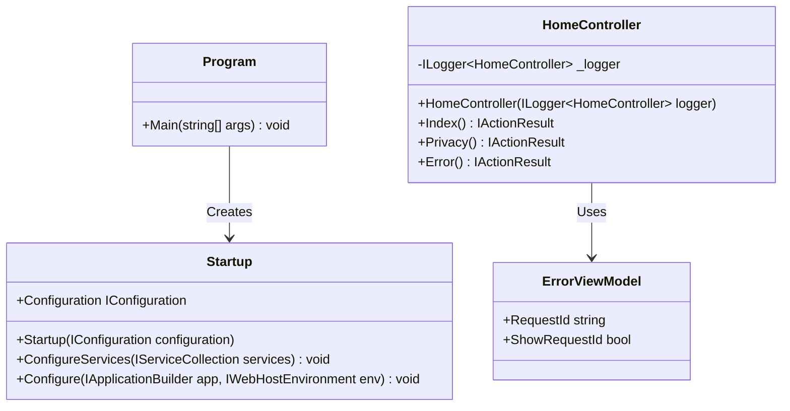
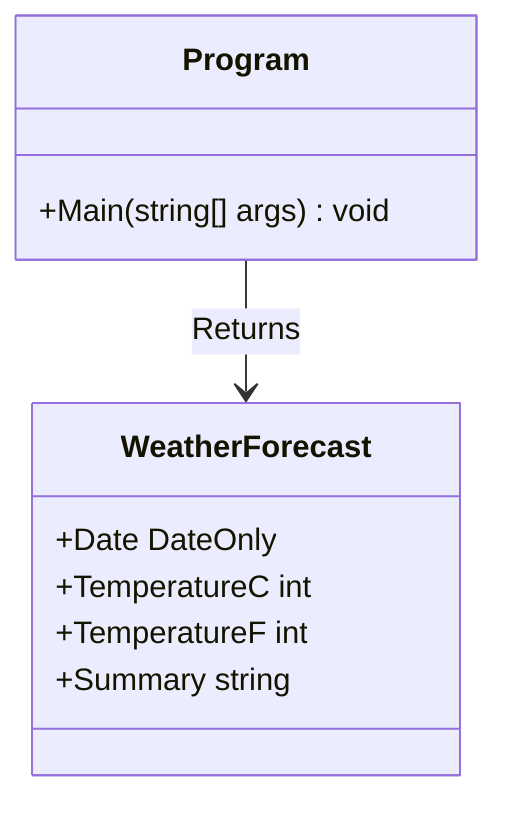
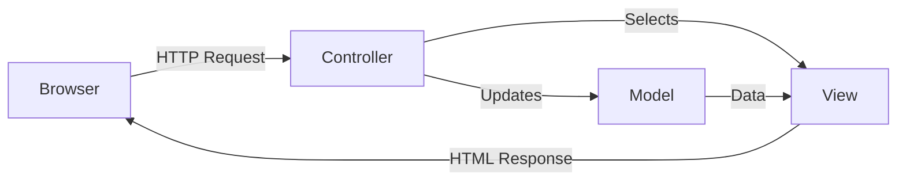
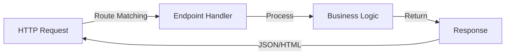

# API Reference Guide

## Overview

This guide provides an overview of the public APIs in the .NET 10 Project Example. The project consists of two main applications with minimal initial implementations designed as templates for future development.

## Example.Web (MVC Application)

### Class Structure



### Key Classes

#### Program

Entry point for the ASP.NET Core MVC application. Uses the Startup pattern for configuration.

**Namespace**: Example.Web

**See API Reference**: @Example.Web.Program

#### Startup

Configures services and the HTTP request pipeline for the MVC application.

**Key Methods**:
- `ConfigureServices`: Registers services with dependency injection
- `Configure`: Sets up middleware pipeline

**Namespace**: Example.Web

**See API Reference**: @Example.Web.Startup

#### HomeController

Default MVC controller providing home page, privacy page, and error handling.

**Actions**:
- `Index()`: Returns the home page view
- `Privacy()`: Returns the privacy policy view
- `Error()`: Returns the error view with request ID

**Namespace**: Example.Web.Controllers

**See API Reference**: @Example.Web.Controllers.HomeController

#### ErrorViewModel

View model for the error page, contains request ID tracking.

**Properties**:
- `RequestId`: Unique identifier for the request
- `ShowRequestId`: Whether to display the request ID

**Namespace**: Example.Web.Models

**See API Reference**: @Example.Web.Models.ErrorViewModel

## Example.API (Minimal API Application)

### Class Structure



### Key Components

#### Program

Entry point for the ASP.NET Core Minimal API application. Uses top-level statements pattern.

**Endpoints**:
- `GET /weatherforecast`: Returns sample weather forecast data

**Namespace**: Example.API

**See API Reference**: @Example.API.Program

#### WeatherForecast (if applicable)

Data model for weather forecast responses (commonly included in Minimal API templates).

## Design Patterns

### MVC Pattern (Example.Web)

The MVC application follows the traditional Model-View-Controller pattern:



### Minimal API Pattern (Example.API)

The Minimal API uses endpoint routing with top-level statements:



## Adding New APIs

### To Add a New MVC Controller

1. Create a new class in `Controllers/` directory
2. Inherit from `Controller` base class
3. Add action methods returning `IActionResult`
4. Create corresponding views in `Views/[ControllerName]/`

**Example**:

```csharp
using Microsoft.AspNetCore.Mvc;

namespace Example.Web.Controllers
{
    public class ProductsController : Controller
    {
        public IActionResult Index()
        {
            return View();
        }
    }
}
```

### To Add a New Minimal API Endpoint

1. Open `Program.cs` in Example.API
2. Add endpoint mapping using `app.MapGet()`, `app.MapPost()`, etc.
3. Define request/response models as needed

**Example**:

```csharp
app.MapGet("/api/products", () =>
{
    return Results.Ok(new { Message = "Products API" });
});
```

## API Documentation Guidelines

When adding new classes and methods:

1. **Add XML Comments**: Enable IntelliSense and API documentation
```csharp
/// <summary>
/// Retrieves a list of all products.
/// </summary>
/// <returns>A list of products.</returns>
public IActionResult GetProducts()
{
    // implementation
}
```

2. **Use Descriptive Names**: Follow C# naming conventions
3. **Keep Controllers Focused**: Single responsibility principle
4. **Return Appropriate HTTP Status Codes**: Use `Results` helper methods

## Related Documentation

- [Architecture Overview](architecture.md)
- [Domain Models](domain-models.md)
- [Full API Reference](../api/index.html)

## Auto-Generated Diagrams

As the project grows and more classes are added, automated class diagrams will be generated using:
- **dll2mmd**: For Mermaid class diagrams
- **PlantUmlClassDiagramGenerator**: For PlantUML diagrams

Run `make diagrams` to regenerate diagrams after adding significant new classes.
