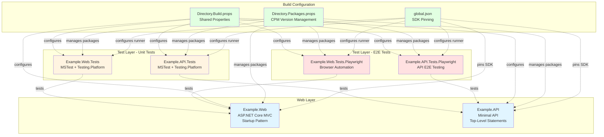
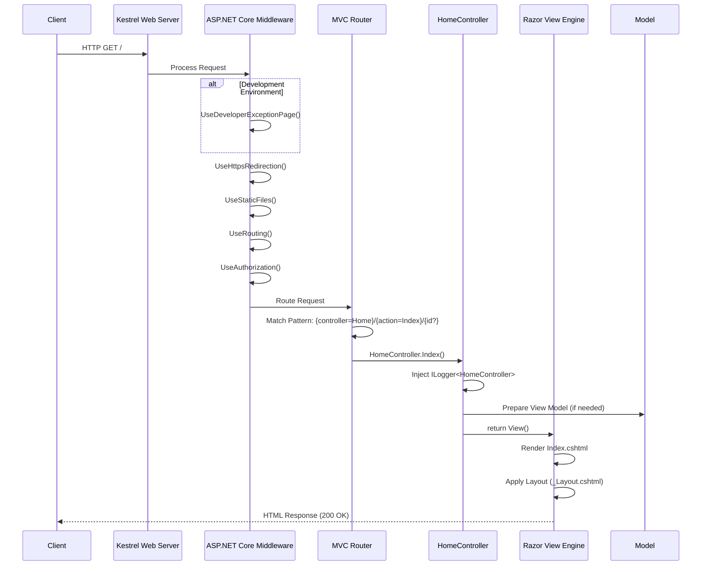
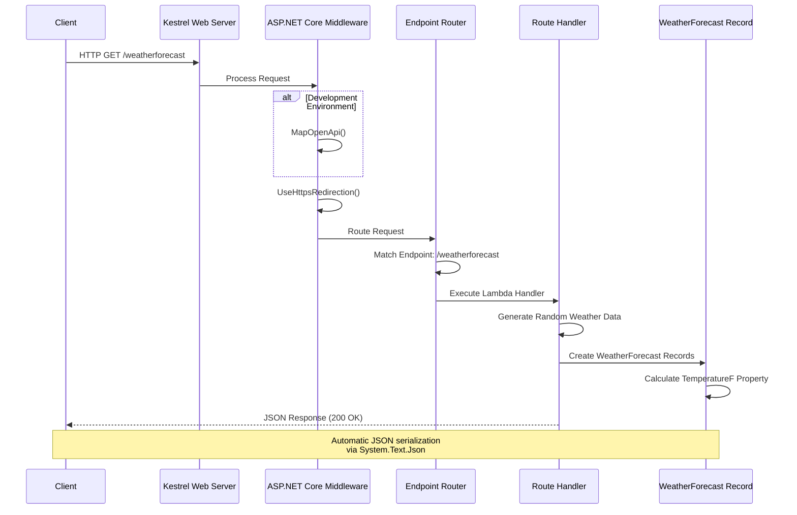

# Architecture Overview

This document provides a comprehensive overview of the .NET 10.0 RC 2 example project architecture, including system components, design decisions, and development workflows.

## System Components

The net10-project-example demonstrates a modern .NET full-stack architecture with two primary web applications and comprehensive testing infrastructure. The project showcases best practices for building maintainable, testable ASP.NET Core applications using the latest .NET 10 features.

**Example.Web** is a traditional ASP.NET Core MVC application that follows the Model-View-Controller pattern. It uses the Startup class pattern for configuration, implements controller-based routing with Razor views, and includes runtime compilation support for rapid development iterations. The application demonstrates classic web development patterns suitable for server-rendered web applications with rich UI requirements.

**Example.API** is a lightweight ASP.NET Core Minimal API application that embraces the simplified hosting model introduced in .NET 6 and refined in subsequent versions. It uses top-level statements, inline endpoint definitions, and built-in OpenAPI support for API documentation. This architecture is ideal for microservices, RESTful APIs, and scenarios where minimal ceremony and maximum performance are priorities.

Both applications are supported by a comprehensive testing strategy that includes unit tests using MSTest with the modern Microsoft.Testing.Platform runner, and end-to-end tests using Playwright for cross-browser validation. The project demonstrates enterprise-grade development practices including centralized configuration management, consistent code standards, and automated quality assurance.

## Component Diagram



## Request Flow

### MVC Application Request Flow



### Minimal API Request Flow



## Key Design Decisions

### 1. Centralized Package Management (CPM)

The project uses **Centralized Package Management** (CPM) through `Directory.Packages.props` to manage all NuGet package versions in a single location. This architectural decision provides several critical benefits for maintainability and consistency.

**How It Works:**

All package versions are defined in `Directory.Packages.props`:

```xml
<Project>
  <PropertyGroup>
    <ManagePackageVersionsCentrally>true</ManagePackageVersionsCentrally>
    <CentralPackageTransitivePinningEnabled>true</CentralPackageTransitivePinningEnabled>
  </PropertyGroup>

  <ItemGroup Label="Core Packages">
    <PackageVersion Include="Microsoft.AspNetCore.OpenApi" Version="10.0.0-rc.2.25502.107" />
  </ItemGroup>

  <ItemGroup Label="Testing Packages">
    <PackageVersion Include="MSTest" Version="4.0.0-preview.25465.3" />
    <PackageVersion Include="Microsoft.Playwright.MSTest.v4" Version="1.55.0-beta-4" />
  </ItemGroup>
</Project>
```

Individual project files reference packages **without version attributes**:

```xml
<Project Sdk="Microsoft.NET.Sdk.Web">
  <ItemGroup>
    <PackageReference Include="Microsoft.AspNetCore.OpenApi" />
  </ItemGroup>
</Project>
```

**Benefits:**

- **Single Source of Truth**: All version numbers in one file eliminates version conflicts
- **Easier Updates**: Update a package version once, applied across all projects
- **Transitive Dependency Control**: `CentralPackageTransitivePinningEnabled` ensures consistent transitive dependency versions
- **Reduced Merge Conflicts**: Fewer version specifications scattered across project files
- **Security Compliance**: Easier to audit and update packages for security vulnerabilities

**Related Documentation**: For detailed CPM guidance, see the [dotnet-centralized-packages skill](.claude/skills/dotnet-centralized-packages.md).

### 2. ImplicitUsings Disabled

The project explicitly **disables ImplicitUsings** in `Directory.Build.props`, requiring all C# files to include explicit `using` statements. While .NET 6+ enables implicit usings by default to reduce boilerplate, this project opts for explicitness.

**Configuration:**

```xml
<PropertyGroup>
  <ImplicitUsings>disable</ImplicitUsings>
</PropertyGroup>
```

**Impact on Development:**

Every C# file must explicitly declare all namespace imports:

```csharp
using System;
using System.Collections.Generic;
using System.Linq;
using System.Threading.Tasks;
using Microsoft.AspNetCore.Mvc;
using Microsoft.Extensions.Logging;
```

**Rationale:**

- **Clarity**: Developers can see exactly what namespaces are used in each file
- **Discoverability**: New team members can understand dependencies without consulting documentation
- **Compilation Control**: Explicit control over what namespaces are available prevents unintended usage
- **Reduced "Magic"**: No hidden compiler-generated using directives
- **Educational Value**: Example project demonstrates explicit coding practices

**Trade-offs:**

- More verbose code with repeated using statements
- Increased initial development time
- Larger file sizes (minimal impact)

This decision prioritizes **code clarity and educational value** over convenience, making the project an excellent learning resource for understanding .NET dependencies.

### 3. MSTest with Microsoft.Testing.Platform

The project uses **MSTest with Microsoft.Testing.Platform**, the modern test execution infrastructure introduced in .NET 8 and refined in .NET 10. This represents a significant architectural shift from the legacy VSTest runner.

**Configuration in global.json:**

```json
{
  "test": {
    "runner": "Microsoft.Testing.Platform"
  }
}
```

**Test Project Configuration:**

```xml
<PropertyGroup>
  <EnableMSTestRunner>true</EnableMSTestRunner>
  <OutputType>Exe</OutputType>
</PropertyGroup>

<ItemGroup>
  <PackageReference Include="MSTest" />
</ItemGroup>
```

**Key Differences from VSTest:**

| Aspect | VSTest (Legacy) | Microsoft.Testing.Platform (Modern) |
|--------|----------------|-------------------------------------|
| Execution | External test host process | Self-contained executable |
| Performance | Slower startup, process overhead | Faster startup, direct execution |
| Debugging | Requires attaching to test host | Direct process debugging |
| Distribution | Requires test SDK installation | Standalone executable |
| Architecture | Complex multi-process | Single process model |

**Running Tests:**

Tests are executed as standalone applications:

```bash
# Run as executable (recommended with Microsoft.Testing.Platform)
dotnet run --project tests/Example.Web.Tests/Example.Web.Tests.csproj

# Also works with traditional dotnet test
dotnet test
```

**Parallelization Configuration:**

Tests are configured for method-level parallelization in `MSTestSettings.cs`:

```csharp
using Microsoft.VisualStudio.TestTools.UnitTesting;

[assembly: Parallelize(Scope = ExecutionScope.MethodLevel)]
```

This enables maximum test throughput by running individual test methods in parallel across available CPU cores.

**Benefits:**

- **Faster Execution**: Reduced overhead from single-process architecture
- **Better IDE Integration**: Improved debugging and test discovery
- **Modern Architecture**: Aligned with .NET's performance-focused direction
- **Flexibility**: Can be run as standard .NET applications

**Related Documentation**: For complete MSTest guidance, see the [mstest-testing-platform skill](.claude/skills/mstest-testing-platform.md).

### 4. Playwright for End-to-End Testing

The project integrates **Playwright for .NET** to provide comprehensive cross-browser end-to-end testing capabilities. Playwright is a modern browser automation framework developed by Microsoft that supports Chromium, Firefox, and WebKit.

**Integration with MSTest:**

```xml
<ItemGroup>
  <PackageReference Include="Microsoft.Playwright.MSTest.v4" />
  <PackageReference Include="MSTest" />
</ItemGroup>
```

**Test Structure:**

Playwright tests inherit from `PageTest` base class:

```csharp
using System.Text.RegularExpressions;
using System.Threading.Tasks;
using Microsoft.Playwright.MSTest;
using Microsoft.VisualStudio.TestTools.UnitTesting;

[TestClass]
public class Test1 : PageTest
{
    [TestMethod]
    public async Task CanNavigateToHomepage()
    {
        await Page.GotoAsync("https://localhost:5001").ConfigureAwait(false);
        await Expect(Page).ToHaveTitleAsync(new Regex("Example")).ConfigureAwait(false);
    }
}
```

**Browser Installation:**

After creating a Playwright test project, browsers must be installed:

```powershell
pwsh -Command "cd tests/Example.Web.Tests.Playwright/bin/Debug/net10.0; ./playwright.ps1 install"
```

**Capabilities:**

- **Cross-Browser Testing**: Single codebase tests across Chrome, Firefox, Safari
- **Reliable Selectors**: Auto-waiting and retry mechanisms reduce flaky tests
- **Network Interception**: Mock API responses and test offline scenarios
- **Screenshots & Videos**: Automatic test failure artifacts
- **Mobile Emulation**: Test responsive designs with device emulation
- **Parallel Execution**: Run tests across multiple browsers simultaneously

**Architecture Benefits:**

- Tests actual browser behavior, not simulated environments
- Catches integration issues between frontend and backend
- Validates real user workflows end-to-end
- Provides confidence in production deployments

**Related Documentation**: For complete Playwright guidance, see the [playwright-dotnet skill](.claude/skills/playwright-dotnet.md).

### 5. Centralized Build Configuration

The project uses **Directory.Build.props** to centralize MSBuild properties across all projects. This ensures consistent compilation settings, code quality standards, and tooling configuration throughout the entire solution.

**Configuration:**

```xml
<Project>
  <PropertyGroup>
    <TargetFramework>net10.0</TargetFramework>
    <LangVersion>latest</LangVersion>
    <Nullable>disable</Nullable>
    <ImplicitUsings>disable</ImplicitUsings>
    <TreatWarningsAsErrors>true</TreatWarningsAsErrors>
    <AnalysisLevel>latest</AnalysisLevel>

    <!-- Enable XML documentation generation for DocFX -->
    <GenerateDocumentationFile>true</GenerateDocumentationFile>
    <!-- Suppress missing XML comment warnings until documentation is added -->
    <NoWarn>$(NoWarn);CS1591</NoWarn>
  </PropertyGroup>
</Project>
```

**Property Explanation:**

- **TargetFramework**: `net10.0` - All projects target .NET 10.0 RC 2
- **LangVersion**: `latest` - Use latest C# language features (C# 13 preview)
- **Nullable**: `disable` - Nullable reference types disabled (explicit null handling required)
- **ImplicitUsings**: `disable` - Explicit using statements required (see section 2)
- **TreatWarningsAsErrors**: `true` - All compiler warnings are treated as build errors
- **AnalysisLevel**: `latest` - Enable all latest code analyzers and diagnostics
- **GenerateDocumentationFile**: `true` - Generate XML documentation for DocFX
- **NoWarn**: Suppress CS1591 (missing XML comments) during documentation development

**Benefits:**

- **Consistency**: All projects follow identical compilation rules
- **Quality Enforcement**: `TreatWarningsAsErrors` prevents code quality degradation
- **Maintainability**: Change settings once, applied everywhere
- **Onboarding**: New projects automatically inherit correct configuration
- **CI/CD Integration**: Consistent build behavior locally and in pipelines

**MSBuild Import Mechanism:**

MSBuild automatically imports `Directory.Build.props` for every project in the directory tree. This is a built-in MSBuild feature that requires no explicit configuration in individual `.csproj` files.

**Override Behavior:**

Individual projects can override settings when necessary:

```xml
<Project Sdk="Microsoft.NET.Sdk.Web">
  <PropertyGroup>
    <!-- Override: Don't treat warnings as errors for this specific project -->
    <TreatWarningsAsErrors>false</TreatWarningsAsErrors>
  </PropertyGroup>
</Project>
```

However, overrides should be rare and well-justified to maintain consistency.

**Related Documentation**: For complete .NET CLI and build guidance, see the [dotnet-cli-essentials skill](.claude/skills/dotnet-cli-essentials.md).

## Project Structure

```
net10-project-example/
├── src/
│   ├── Example.Web/                        # ASP.NET Core MVC Application
│   │   ├── Controllers/
│   │   │   └── HomeController.cs          # MVC controllers
│   │   ├── Views/
│   │   │   ├── Home/
│   │   │   │   ├── Index.cshtml           # Razor views
│   │   │   │   └── Privacy.cshtml
│   │   │   └── Shared/
│   │   │       ├── _Layout.cshtml         # Shared layout
│   │   │       └── Error.cshtml
│   │   ├── Models/
│   │   │   └── ErrorViewModel.cs          # View models
│   │   ├── wwwroot/                       # Static files (CSS, JS, images)
│   │   ├── Program.cs                     # Application entry point
│   │   ├── Startup.cs                     # Service configuration & middleware
│   │   └── Example.Web.csproj
│   │
│   └── Example.API/                        # ASP.NET Core Minimal API
│       ├── Program.cs                     # Top-level statements, endpoint definitions
│       └── Example.API.csproj
│
├── tests/
│   ├── Example.Web.Tests/                 # Unit tests for MVC application
│   │   ├── MSTestSettings.cs              # Test parallelization configuration
│   │   ├── Test1.cs                       # Sample unit tests
│   │   └── Example.Web.Tests.csproj
│   │
│   ├── Example.API.Tests/                 # Unit tests for Minimal API
│   │   ├── MSTestSettings.cs
│   │   ├── Test1.cs
│   │   └── Example.API.Tests.csproj
│   │
│   ├── Example.Web.Tests.Playwright/      # E2E tests for MVC application
│   │   ├── MSTestSettings.cs
│   │   ├── Test1.cs                       # Browser automation tests
│   │   └── Example.Web.Tests.Playwright.csproj
│   │
│   └── Example.API.Tests.Playwright/      # E2E tests for Minimal API
│       ├── MSTestSettings.cs
│       ├── Test1.cs
│       └── Example.API.Tests.Playwright.csproj
│
├── Directory.Build.props                   # Shared MSBuild properties (all projects)
├── Directory.Packages.props                # Centralized NuGet package versions (CPM)
├── global.json                            # .NET SDK version pinning & test runner config
├── net10-project-example.slnx             # Solution file (.NET 10 XML format)
└── README.md                              # Project documentation
```

### Directory Responsibilities

| Directory | Purpose | Key Files |
|-----------|---------|-----------|
| `src/` | Production application code | Controllers, views, API endpoints |
| `tests/` | Test projects (unit + E2E) | MSTest test classes, Playwright tests |
| Root | Build configuration | Directory.Build.props, Directory.Packages.props, global.json |

### File Naming Conventions

- **Controllers**: `{Name}Controller.cs` (e.g., `HomeController.cs`)
- **Views**: `{ActionName}.cshtml` (e.g., `Index.cshtml`)
- **Test Classes**: `{Feature}Tests.cs` or `Test1.cs` (example)
- **Configuration**: PascalCase with `.props` extension for MSBuild files

## Technology Stack

### Runtime & Framework

- **.NET SDK**: 10.0.100-rc.2.25502.107 (Release Candidate 2)
- **Target Framework**: net10.0
- **C# Language Version**: Latest (C# 13 preview features)
- **Rollforward Policy**: `latestFeature` (automatically use latest installed .NET 10.x)

### Web Frameworks

- **ASP.NET Core MVC**: Traditional Model-View-Controller pattern with Razor views
- **ASP.NET Core Minimal APIs**: Lightweight HTTP APIs with top-level statements
- **Kestrel Web Server**: High-performance cross-platform web server

### Key Libraries

| Package | Version | Purpose |
|---------|---------|---------|
| `Microsoft.AspNetCore.Mvc.Razor.RuntimeCompilation` | 10.0.0-rc.2 | Hot reload for Razor views during development |
| `Microsoft.AspNetCore.OpenApi` | 10.0.0-rc.2 | OpenAPI (Swagger) document generation for Minimal APIs |
| `MSTest` | 4.0.0-preview | Modern testing framework with Microsoft.Testing.Platform |
| `Microsoft.Playwright.MSTest.v4` | 1.55.0-beta-4 | Browser automation for E2E testing |

### Testing Infrastructure

- **Unit Testing Framework**: MSTest v4 (preview)
- **Test Runner**: Microsoft.Testing.Platform (self-contained executable)
- **E2E Testing**: Playwright for .NET with MSTest integration
- **Parallelization**: Method-level parallel test execution
- **Supported Browsers**: Chromium, Firefox, WebKit (via Playwright)

### Build & Package Management

- **Build System**: MSBuild (integrated with .NET SDK)
- **Package Manager**: NuGet with Centralized Package Management (CPM)
- **Solution Format**: .NET 10 XML-based solution file (`.slnx`)

### Development Tools

- **IDE Support**: Visual Studio 2022 Preview, Visual Studio Code, JetBrains Rider
- **Code Analysis**: Built-in Roslyn analyzers (`AnalysisLevel: latest`)
- **Documentation**: DocFX (XML documentation generation enabled)

## Development Workflow

### Prerequisites

- **.NET SDK**: 10.0.100-rc.2.25502.107 or later
- **PowerShell**: 7.0+ (for Playwright browser installation)
- **IDE**: Visual Studio 2022 Preview, VS Code, or Rider

### Initial Setup

```bash
# Clone repository
git clone https://github.com/NotMyself/net10-project-example.git
cd net10-project-example

# Restore dependencies (happens automatically on first build)
dotnet restore

# Build entire solution
dotnet build

# Install Playwright browsers (one-time setup)
pwsh -Command "cd tests/Example.Web.Tests.Playwright/bin/Debug/net10.0; ./playwright.ps1 install"
pwsh -Command "cd tests/Example.API.Tests.Playwright/bin/Debug/net10.0; ./playwright.ps1 install"
```

### Building

```bash
# Build entire solution
dotnet build

# Build specific project
dotnet build src/Example.Web/Example.Web.csproj
dotnet build src/Example.API/Example.API.csproj

# Build in Release configuration
dotnet build --configuration Release

# Clean build artifacts
dotnet clean
```

### Running Applications

```bash
# Run MVC application
dotnet run --project src/Example.Web/Example.Web.csproj
# Navigate to: https://localhost:5001 (or port shown in console)

# Run Minimal API application
dotnet run --project src/Example.API/Example.API.csproj
# Navigate to: https://localhost:5001/weatherforecast
# OpenAPI docs: https://localhost:5001/openapi/v1.json (development only)

# Run with specific launch profile
dotnet run --project src/Example.Web/Example.Web.csproj --launch-profile "https"
```

### Running Tests

```bash
# Run ALL tests (unit + E2E) across all projects
dotnet test

# Run specific test project using Microsoft.Testing.Platform (recommended)
dotnet run --project tests/Example.Web.Tests/Example.Web.Tests.csproj
dotnet run --project tests/Example.API.Tests/Example.API.Tests.csproj
dotnet run --project tests/Example.Web.Tests.Playwright/Example.Web.Tests.Playwright.csproj
dotnet run --project tests/Example.API.Tests.Playwright/Example.API.Tests.Playwright.csproj

# Run with test filter
dotnet test --filter FullyQualifiedName~TestMethod1
dotnet test --filter TestCategory=Integration

# Run with detailed output
dotnet test --verbosity detailed

# Run tests with coverage collection (requires coverage tool)
dotnet test --collect:"XPlat Code Coverage"
```

### Development Best Practices

1. **Before Committing:**
   ```bash
   # Format code
   dotnet format

   # Build to check for errors
   dotnet build

   # Run tests
   dotnet test
   ```

2. **Adding New Packages:**
   ```bash
   # Step 1: Add version to Directory.Packages.props
   <PackageVersion Include="Newtonsoft.Json" Version="13.0.3" />

   # Step 2: Add reference (without version) to project file
   dotnet add src/Example.Web/Example.Web.csproj package Newtonsoft.Json
   ```

3. **Creating New Test Projects:**
   ```bash
   # Create MSTest project (inherits test runner from global.json)
   dotnet new mstest -o tests/Example.NewFeature.Tests

   # Manually add to .csproj:
   # <EnableMSTestRunner>true</EnableMSTestRunner>
   # <OutputType>Exe</OutputType>
   ```

4. **Hot Reload During Development:**
   - **MVC Application**: Razor views support hot reload (enabled via `RuntimeCompilation`)
   - **Code Changes**: Use `dotnet watch run` for automatic restart on C# changes
   ```bash
   dotnet watch run --project src/Example.Web/Example.Web.csproj
   ```

### Troubleshooting Common Issues

**Issue**: Tests fail with "Playwright browsers not found"
```bash
# Solution: Install browsers
pwsh -Command "cd tests/Example.Web.Tests.Playwright/bin/Debug/net10.0; ./playwright.ps1 install"
```

**Issue**: Build errors about package versions
```bash
# Solution: Ensure no Version attributes in .csproj PackageReference
# Versions must only be in Directory.Packages.props
```

**Issue**: Implicit using errors (namespace not found)
```csharp
// Solution: Add explicit using statement
using System;
using System.Linq;
using Microsoft.AspNetCore.Mvc;
```

**Issue**: "Test runner not found" errors
```bash
# Solution: Check global.json has test runner configured
# Ensure test projects have <EnableMSTestRunner>true</EnableMSTestRunner>
```

## Related Documentation

- **[Domain Models](domain-models.md)** - Data models and domain entities
- **[API Reference Guide](api-guide.md)** - Detailed API endpoint documentation
- **[Main Project README](../../README.md)** - Quick start and overview
- **[.NET 10 Documentation](https://learn.microsoft.com/en-us/dotnet/core/whats-new/dotnet-10/overview)** - Official Microsoft documentation
- **[ASP.NET Core Documentation](https://learn.microsoft.com/en-us/aspnet/core/)** - Web framework documentation
- **[MSTest Documentation](https://learn.microsoft.com/en-us/dotnet/core/testing/unit-testing-mstest-intro)** - Testing framework guidance
- **[Playwright for .NET](https://playwright.dev/dotnet/)** - Browser automation documentation

---

**Document Version**: 1.0
**Last Updated**: 2025-11-02
**Target Framework**: .NET 10.0 RC 2
**Maintained By**: Development Team
