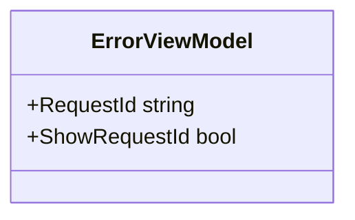
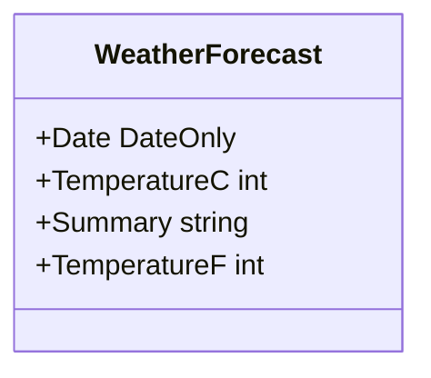
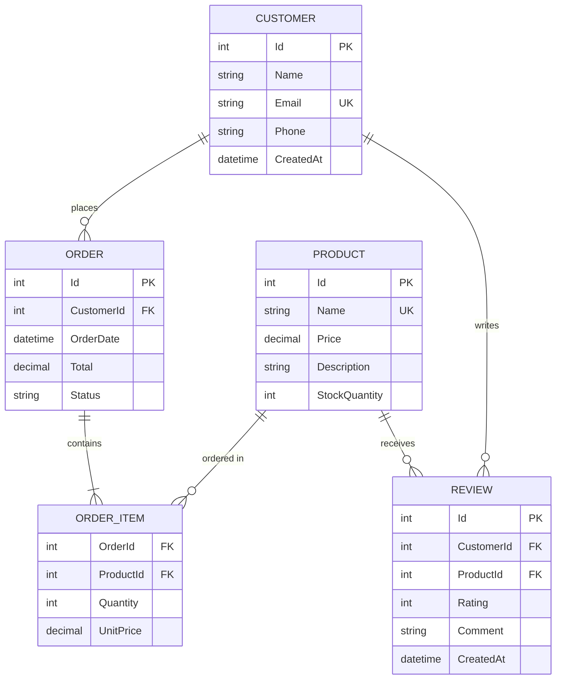

# Domain Models

## Overview

This .NET 10 project example is designed as a template with minimal initial domain models. As a reference implementation, it demonstrates the fundamental structure and patterns for building scalable domain models in ASP.NET Core applications.

The **ErrorViewModel** serves as the primary example of a model structure in this template project. It shows how to create simple, focused models for specific purposes within the application. In production applications, you would extend this foundation with rich domain models representing your business entities, value objects, and aggregate roots.

This documentation establishes patterns and best practices for domain modeling that you should follow as you evolve this template into a full application. The distinction between domain models (business logic), view models (presentation), and DTOs (API contracts) is fundamental to maintaining clean architecture.

## Current Domain Models

### ErrorViewModel

The **ErrorViewModel** is a view model designed to provide error page context. It demonstrates a simple model structure with computed properties.



**Namespace**: `ClaudeStack.Web.Models`

**Purpose**: Provides data to the error view when application exceptions occur, enabling request tracking and debugging.

**Properties**:

- `RequestId` (string): Unique identifier for the HTTP request that caused the error. Generated automatically by ASP.NET Core as `TraceIdentifier`.
- `ShowRequestId` (bool): Computed property (using `=>` expression-bodied property) that indicates whether the RequestId should be displayed to the user. Returns `true` only when RequestId is not null or empty.

**Usage in MVC Application**:

The ErrorViewModel is created by the `HomeController.Error()` action when an exception occurs:

```csharp
public IActionResult Error()
{
    var requestId = Activity.Current?.Id ?? HttpContext.TraceIdentifier;
    return View(new ErrorViewModel { RequestId = requestId });
}
```

It is then passed to the `Error.cshtml` view in `Views/Shared/Error.cshtml` for rendering.

**See API Reference**: [@ClaudeStack.Web.Models.ErrorViewModel](../api/ClaudeStack.Web.Models.ErrorViewModel.html)

### WeatherForecast (ClaudeStack.API)

The **WeatherForecast** is a record type defined in `ClaudeStack.API/Program.cs` that demonstrates a simple data transfer object for API responses.



**Namespace**: `ClaudeStack.API` (internal sealed record in Program.cs)

**Purpose**: Represents weather forecast data in the Minimal API endpoint response. Uses C# record syntax for immutable, compact data structures.

**Properties**:

- `Date` (DateOnly): The date of the forecast (primary constructor parameter).
- `TemperatureC` (int): Temperature in Celsius (primary constructor parameter).
- `Summary` (string): Weather summary description like "Freezing", "Warm", "Hot" (primary constructor parameter).
- `TemperatureF` (int): Computed property that calculates temperature in Fahrenheit from Celsius using the formula: `32 + (int)(TemperatureC / 0.5556)`.

**Usage in API**:

The WeatherForecast is generated and returned by the `/weatherforecast` GET endpoint:

```csharp
app.MapGet("/weatherforecast", () =>
{
    var forecast = Enumerable.Range(1, 5).Select(index =>
        new WeatherForecast(
            DateOnly.FromDateTime(DateTime.Now.AddDays(index)),
            Random.Shared.Next(-20, 55),
            summaries[Random.Shared.Next(summaries.Length)]
        ))
        .ToArray();
    return forecast;
})
.WithName("GetWeatherForecast");
```

**Record Type Benefits**:

- Immutable by default (all properties are init-only)
- Automatic `ToString()`, `Equals()`, and `GetHashCode()` implementation
- Primary constructor syntax for concise parameter definition
- Ideal for DTOs and data transfer objects

## Domain Modeling Best Practices

Since this is a template project, the following guidance establishes patterns for extending the application with real domain models when building production features.

### Designing Domain Models

When adding business domain entities to this application, follow these patterns:

#### 1. Separate Concerns with Dedicated Directories

Organize models by purpose to maintain clarity:

```
src/ClaudeStack.Web/
├── Models/                      # View models and presentation models
│   ├── ErrorViewModel.cs
│   └── UserProfileViewModel.cs
├── Domain/                      # Domain models (entities, value objects)
│   ├── Entities/
│   │   ├── User.cs
│   │   ├── Product.cs
│   │   └── Order.cs
│   ├── ValueObjects/
│   │   ├── Money.cs
│   │   └── Address.cs
│   └── Aggregates/
│       ├── OrderAggregate.cs
```

#### 2. Enforce Immutability for Data Integrity

Use `init` accessors for immutable properties. This prevents accidental modifications and makes intent clear:

```csharp
using System;

namespace ClaudeStack.Web.Domain.Entities
{
    /// <summary>
    /// Represents a product in the catalog.
    /// </summary>
    public class Product
    {
        /// <summary>
        /// Gets or initializes the unique product identifier.
        /// </summary>
        public int Id { get; init; }

        /// <summary>
        /// Gets or initializes the product name.
        /// </summary>
        public string Name { get; init; } = string.Empty;

        /// <summary>
        /// Gets or initializes the product price.
        /// </summary>
        public decimal Price { get; init; }

        /// <summary>
        /// Gets or initializes the product description.
        /// </summary>
        public string? Description { get; init; }

        /// <summary>
        /// Gets the date when the product was created.
        /// </summary>
        public DateTime CreatedAt { get; init; }
    }
}
```

**Benefits**:
- Prevents accidental state modifications
- Clearly indicates which properties can be set
- Thread-safe by design
- Easier to reason about object state

#### 3. Leverage Data Annotations for Validation

ASP.NET Core integrates Data Annotations validation throughout the framework:

```csharp
using System;
using System.ComponentModel.DataAnnotations;

namespace ClaudeStack.Web.Domain.ValueObjects
{
    /// <summary>
    /// Represents a contact person with validation.
    /// </summary>
    public class ContactInfo
    {
        /// <summary>
        /// Gets or initializes the full name.
        /// </summary>
        [Required(ErrorMessage = "Name is required")]
        [StringLength(100, MinimumLength = 2, ErrorMessage = "Name must be between 2 and 100 characters")]
        public string Name { get; init; } = string.Empty;

        /// <summary>
        /// Gets or initializes the email address.
        /// </summary>
        [Required(ErrorMessage = "Email is required")]
        [EmailAddress(ErrorMessage = "Invalid email format")]
        public string Email { get; init; } = string.Empty;

        /// <summary>
        /// Gets or initializes the phone number.
        /// </summary>
        [Phone(ErrorMessage = "Invalid phone format")]
        public string? PhoneNumber { get; init; }
    }
}
```

**Validation Attributes**:
- `[Required]` - Property must have a value
- `[StringLength]` - Length constraints with MinimumLength
- `[Range]` - Numeric range validation
- `[EmailAddress]` - Email format validation
- `[Phone]` - Phone number format validation
- `[RegularExpression]` - Custom pattern matching
- `[Compare]` - Cross-property validation

#### 4. Add Comprehensive XML Documentation

Document all public properties and methods for IntelliSense and API reference generation:

```csharp
/// <summary>
/// Represents a customer order in the system.
/// </summary>
public class Order
{
    /// <summary>
    /// Gets or initializes the unique order identifier.
    /// </summary>
    public int Id { get; init; }

    /// <summary>
    /// Gets or initializes the customer ID who placed the order.
    /// </summary>
    public int CustomerId { get; init; }

    /// <summary>
    /// Gets or initializes the total order amount.
    /// </summary>
    /// <remarks>
    /// This is calculated from order items and should not be manually set in production.
    /// </remarks>
    public decimal Total { get; init; }

    /// <summary>
    /// Gets or initializes the order status.
    /// </summary>
    /// <value>One of: Pending, Processing, Shipped, Delivered, Cancelled</value>
    public string Status { get; init; } = "Pending";
}
```

## Entity Relationships

As your domain grows, document relationships using Mermaid ER diagrams. This example shows a typical e-commerce domain:



**Relationship Types**:
- **One-to-Many** (`||--o{`): Customer places many Orders
- **One-to-One** (`||--||`): User has one Profile
- **Many-to-Many** (`}o--o{`): Students attend many Courses, Courses have many Students

## ViewModels vs Domain Models vs DTOs

Understanding these distinct model types is critical for maintaining clean separation of concerns.

### Domain Models

**Purpose**: Represent core business entities and contain business logic.

**Characteristics**:
- Persisted to the database
- Used across all application layers
- Contain validation rules and business methods
- Implement domain-driven design concepts
- Have identity and lifecycle

**Example**:

```csharp
using System;
using System.Collections.Generic;

namespace ClaudeStack.Web.Domain.Entities
{
    /// <summary>
    /// Represents a user in the system with business logic and validation.
    /// </summary>
    public class User
    {
        /// <summary>
        /// Gets the unique user identifier.
        /// </summary>
        public int Id { get; init; }

        /// <summary>
        /// Gets or initializes the username.
        /// </summary>
        public string Username { get; init; } = string.Empty;

        /// <summary>
        /// Gets or initializes the email address.
        /// </summary>
        public string Email { get; init; } = string.Empty;

        /// <summary>
        /// Gets the date and time when the user account was created.
        /// </summary>
        public DateTime CreatedAt { get; init; }

        /// <summary>
        /// Gets the user's posts (navigation property for EF Core).
        /// </summary>
        public ICollection<Post> Posts { get; } = new List<Post>();

        /// <summary>
        /// Determines whether the user is active based on last login activity.
        /// </summary>
        /// <returns>True if user logged in within the last 30 days; otherwise false.</returns>
        public bool IsActive(DateTime currentDate)
        {
            var thirtyDaysAgo = currentDate.AddDays(-30);
            return CreatedAt > thirtyDaysAgo;
        }

        /// <summary>
        /// Adds a new post by this user.
        /// </summary>
        /// <param name="title">The post title.</param>
        /// <param name="content">The post content.</param>
        /// <returns>The newly created post.</returns>
        public Post CreatePost(string title, string content)
        {
            return new Post { UserId = Id, Title = title, Content = content };
        }
    }
}
```

### ViewModels

**Purpose**: Tailored specifically for presentation layer (Razor views). Combine data from multiple domain models and include display-specific properties.

**Characteristics**:
- Never persisted to database
- MVC/Razor views only (ClaudeStack.Web)
- May aggregate data from multiple sources
- Include computed display properties
- Shaped for specific view requirements
- Reside in `Models/` directory

**Example**:

```csharp
using System;

namespace ClaudeStack.Web.Models
{
    /// <summary>
    /// Represents user profile information for display in the web UI.
    /// Aggregates data from User entity and related data.
    /// </summary>
    public class UserProfileViewModel
    {
        /// <summary>
        /// Gets or initializes the username.
        /// </summary>
        public string Username { get; init; } = string.Empty;

        /// <summary>
        /// Gets or initializes the email address.
        /// </summary>
        public string Email { get; init; } = string.Empty;

        /// <summary>
        /// Gets or initializes the human-readable member since date.
        /// Computed from User.CreatedAt for display.
        /// </summary>
        public string MemberSince { get; init; } = string.Empty;

        /// <summary>
        /// Gets or initializes the total number of posts by this user.
        /// Aggregated from User.Posts collection.
        /// </summary>
        public int PostCount { get; init; }

        /// <summary>
        /// Gets or initializes a value indicating whether the user profile is complete.
        /// Display-specific computed value for UI guidance.
        /// </summary>
        public bool IsProfileComplete { get; init; }
    }
}
```

### Data Transfer Objects (DTOs)

**Purpose**: Define API contracts for external communication. Decouple internal domain models from external API structure.

**Characteristics**:
- Used in API responses and requests
- Never used internally by domain logic
- Provide API versioning flexibility
- Can flatten complex object graphs
- Use record types for immutability
- Reside in `Dtos/` directory (ClaudeStack.API)

**Example**:

```csharp
using System;

namespace ClaudeStack.API.Dtos
{
    /// <summary>
    /// Data transfer object for user information in API responses.
    /// Decouples the API contract from internal User entity.
    /// </summary>
    public record UserDto(
        int Id,
        string Username,
        string Email,
        DateTime CreatedAt
    );

    /// <summary>
    /// Data transfer object for creating a new user via API.
    /// </summary>
    public record CreateUserRequest(
        string Username,
        string Email,
        string Password
    );

    /// <summary>
    /// Data transfer object for user profile information in API responses.
    /// Flattens nested relationships for API consumers.
    /// </summary>
    public record UserProfileDto(
        int Id,
        string Username,
        string Email,
        string MemberSince,
        int PostCount
    );
}
```

### Comparison Matrix

| Aspect | Domain Model | ViewModel | DTO |
|--------|--------------|-----------|-----|
| **Purpose** | Business logic | View rendering | API contract |
| **Persisted** | Yes | No | No |
| **Layer** | All layers | Presentation (MVC) | API layer |
| **Mutable** | Controlled (init properties) | Immutable (init) | Immutable (record) |
| **Location** | `Domain/Entities/` | `Models/` | `Dtos/` |
| **Example** | User, Product, Order | UserProfileViewModel | UserDto |

## Model Validation Patterns

Implement validation at multiple levels for robustness:

### 1. Declarative Attribute-Based Validation

```csharp
using System;
using System.ComponentModel.DataAnnotations;

namespace ClaudeStack.Web.Domain.Entities
{
    public class BlogPost
    {
        [Required]
        [StringLength(200, MinimumLength = 10)]
        public string Title { get; init; } = string.Empty;

        [Required]
        [StringLength(5000, MinimumLength = 50)]
        public string Content { get; init; } = string.Empty;

        [Range(typeof(DateTime), "2020-01-01", "2099-12-31")]
        public DateTime PublishDate { get; init; }

        [EmailAddress]
        public string AuthorEmail { get; init; } = string.Empty;

        [Range(0, 10)]
        public int Rating { get; init; }
    }
}
```

### 2. Custom Validation with IValidatableObject

```csharp
using System;
using System.Collections.Generic;
using System.ComponentModel.DataAnnotations;

namespace ClaudeStack.Web.Domain.ValueObjects
{
    public class DateRange : IValidatableObject
    {
        public DateTime StartDate { get; init; }
        public DateTime EndDate { get; init; }

        public IEnumerable<ValidationResult> Validate(ValidationContext validationContext)
        {
            if (EndDate <= StartDate)
            {
                yield return new ValidationResult(
                    "End date must be after start date",
                    new[] { nameof(EndDate) }
                );
            }
        }
    }
}
```

### 3. Model State Validation in MVC Controllers

```csharp
using System.ComponentModel.DataAnnotations;
using Microsoft.AspNetCore.Mvc;

namespace ClaudeStack.Web.Controllers
{
    public class ProductsController : Controller
    {
        [HttpPost]
        public IActionResult Create([FromForm] Product product)
        {
            // Automatic validation based on Data Annotations
            if (!ModelState.IsValid)
            {
                return View(product);
            }

            // Model is valid, proceed with business logic
            return RedirectToAction(nameof(Index));
        }
    }
}
```

## Adding Models to the Project

### For MVC Application (ClaudeStack.Web)

**Domain Models**:

1. Create a new directory structure: `src/ClaudeStack.Web/Domain/Entities/`
2. Create your entity class with explicit using statements
3. Add XML documentation comments
4. Apply Data Annotations for validation
5. Consider business methods and invariants

```bash
# Example workflow
cd src/ClaudeStack.Web
mkdir -p Domain/Entities
# Create Product.cs with proper structure
```

**View Models**:

1. Add new classes to `src/ClaudeStack.Web/Models/`
2. Use the `ViewModel` suffix convention
3. Keep properties simple (strings, numbers, bools)
4. Include XML documentation
5. Use `init` for immutability

### For Minimal API (ClaudeStack.API)

**DTOs**:

1. Create a `src/ClaudeStack.API/Dtos/` directory
2. Define records using primary constructor syntax
3. Add XML documentation to properties
4. Reference from endpoint handlers

```csharp
// In Program.cs or separate file
namespace ClaudeStack.API.Dtos
{
    public record ProductDto(
        int Id,
        string Name,
        decimal Price,
        string? Description
    );
}

// In endpoint
app.MapGet("/api/products/{id}", (int id) =>
{
    // Return ProductDto
    return Results.Ok(new ProductDto(1, "Widget", 19.99m, "A useful widget"));
});
```

## Related Documentation

- **[Architecture Overview](architecture.md)** - System design and component relationships
- **[API Reference Guide](api-guide.md)** - Class structures and endpoint documentation
- **[Full API Reference](../api/index.html)** - Generated API documentation from XML comments
- **[ASP.NET Core Data Annotations](https://learn.microsoft.com/en-us/dotnet/api/system.componentmodel.dataannotations)** - Microsoft validation documentation
- **[Entity Framework Core Documentation](https://learn.microsoft.com/en-us/ef/core/)** - Data persistence patterns

---

**Document Version**: 1.0

**Last Updated**: 2025-11-02

**Target Framework**: .NET 10.0 RC 2

**Maintained By**: Development Team
