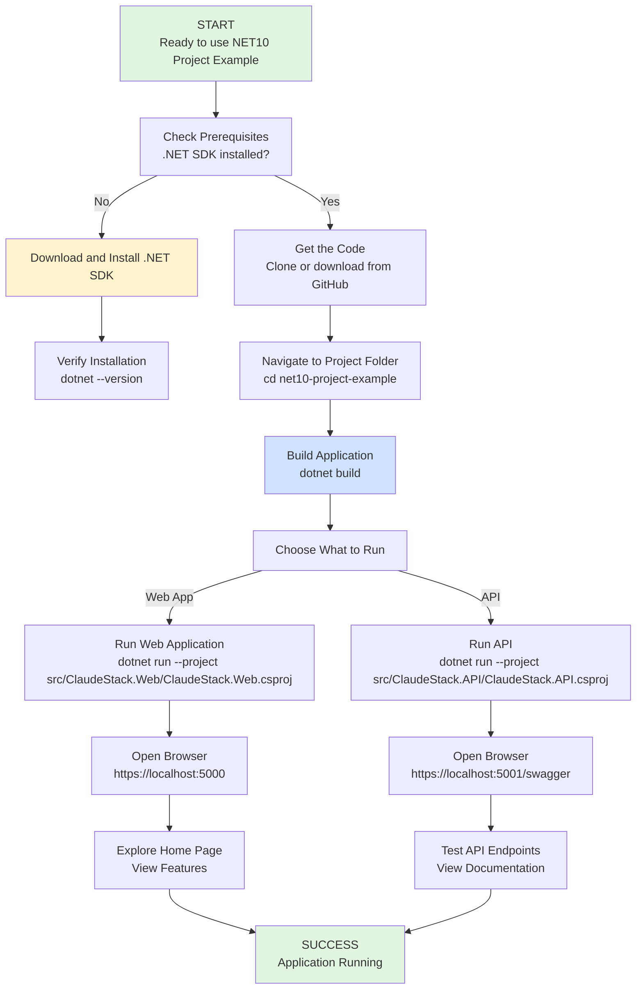

# Getting Started Guide

Welcome to NET10 Project Example! This guide will walk you through installing and running the applications in just a few minutes.

## Table of Contents

1. [Prerequisites](#prerequisites)
2. [Installation](#installation)
3. [First Run](#first-run)
4. [Your First Task](#your-first-task)
5. [User Journey](#user-journey)
6. [Troubleshooting](#troubleshooting)

## Prerequisites

Before you begin, make sure you have the following software installed on your computer:

### Required Software

| Software | Version | Purpose |
|----------|---------|---------|
| **.NET SDK** | 10.0 RC 2 or later | Runs the applications |
| **Web Browser** | Any modern browser | Access the applications |

### Step 1: Install .NET SDK

The .NET SDK is required to build and run the applications.

1. Visit the [.NET 10 Download Page](https://dotnet.microsoft.com/en-us/download/dotnet/10.0)
2. Select **.NET 10.0 RC 2** (or later)
3. Download the installer for your operating system:
   - **Windows** - Download the Windows installer (.exe)
   - **macOS** - Download the macOS installer (.pkg)
   - **Linux** - Follow the Linux installation instructions
4. Run the installer and follow the on-screen instructions
5. Verify installation by opening a terminal/command prompt and running:
   ```bash
   dotnet --version
   ```
   You should see version 10.0.100-rc.2 or later.

> **Tip:** If you're unsure about your operating system, check [this guide](https://support.microsoft.com/en-us/windows/windows-version-settings-and-product-information-15175#windows11).

### Step 2: Verify Browser

Any modern web browser works with this application:
- Google Chrome
- Microsoft Edge
- Mozilla Firefox
- Apple Safari

## Installation

### Getting the Code

Follow these steps to download and prepare the application:

#### Option 1: Using Git (Recommended)

If you have Git installed:

1. Open a terminal or command prompt
2. Navigate to where you want to store the project
3. Run the following command:
   ```bash
   git clone https://github.com/NotMyself/net10-project-example.git
   cd net10-project-example
   ```

#### Option 2: Download as ZIP

If you don't have Git:

1. Visit [the GitHub repository](https://github.com/NotMyself/net10-project-example)
2. Click the green **Code** button
3. Select **Download ZIP**
4. Extract the ZIP file to a folder on your computer
5. Open a terminal or command prompt and navigate to that folder

### Preparing the Application

Once you have the code:

1. Open a terminal or command prompt
2. Navigate to the project folder:
   ```bash
   cd net10-project-example
   ```
3. Build the application:
   ```bash
   dotnet build
   ```

The first build may take a few minutes as it downloads dependencies. You'll see messages about NuGet packages being restored.

> **Success**: You should see a message like `Build succeeded` when complete.

## First Run

Now you're ready to run the applications! You can run either the web application or the API (or both in separate terminal windows).

### Running the Web Application

The web application is a traditional website with pages you can browse:

1. Open a terminal or command prompt
2. Navigate to the project folder
3. Run the web application:
   ```bash
   dotnet run --project src/ClaudeStack.Web/ClaudeStack.Web.csproj
   ```
4. You'll see messages about the application starting. Look for a message like:
   ```
   Now listening on: https://localhost:5000
   ```
5. Open your web browser and visit: `https://localhost:5000`

The application will open to the home page. You may see a certificate warning (this is normal for development - click through it).

> **Note**: If you see "Address already in use", see the [Troubleshooting](#troubleshooting) section.

### Running the API

The API provides data endpoints that applications can connect to:

1. Open a **new** terminal or command prompt (keep the web application running in the other one)
2. Navigate to the project folder
3. Run the API:
   ```bash
   dotnet run --project src/ClaudeStack.API/ClaudeStack.API.csproj
   ```
4. You'll see a message like:
   ```
   Now listening on: https://localhost:5001
   ```
5. Open your web browser and visit: `https://localhost:5001/swagger`

The Swagger page shows all available API endpoints and lets you test them directly in your browser.

## Your First Task

Let's explore what the applications can do!

### Task 1: View the Home Page

1. If you haven't already, start the web application (see [Running the Web Application](#running-the-web-application))
2. Visit `https://localhost:5000` in your web browser
3. You should see the home page with:
   - Welcome message
   - Links to example pages
   - Navigation menu


### Task 2: Check the Weather Forecast

The application includes a weather forecast feature that displays sample data:

1. On the home page, look for a link or menu item labeled "Weather Forecast" or "Privacy"
2. Click on it to see example data
3. The page demonstrates how the web application displays information

### Task 3: Explore the API

The API provides the same data in a format that applications can consume:

1. Start the API (see [Running the API](#running-the-api))
2. Visit `https://localhost:5001/swagger` in your web browser
3. You'll see the Swagger UI - an interactive API documentation tool
4. Scroll down to find the `/weatherforecast` endpoint
5. Click **Try it out** button
6. Click **Execute** to call the API
7. You'll see the JSON response with weather data

This demonstrates how applications can fetch data from the API programmatically.

## User Journey

Here's a visual representation of how you go from starting to using the applications:



## Troubleshooting

### Common Issues and Solutions

#### 1. ".NET SDK Not Found"

**Problem:** You see an error like "dotnet: command not found" or "'dotnet' is not recognized"

**Solutions:**
- Verify .NET is installed: Open a new terminal/command prompt and run `dotnet --version`
- Restart your terminal application (sometimes it needs to reload environment variables)
- Restart your computer
- Reinstall .NET SDK from [dotnet.microsoft.com](https://dotnet.microsoft.com/en-us/download/dotnet/10.0)

#### 2. "Address Already in Use" or "Port Already in Use"

**Problem:** Error like "Address already in use" when starting an application

**Causes:**
- Another application is using that port (5000 for web, 5001 for API)
- A previous instance of the application is still running

**Solutions:**

**Windows:**
```bash
# Find what's using port 5000
netstat -ano | findstr :5000

# Kill the process (replace PID with the number from above)
taskkill /PID <PID> /F
```

**macOS/Linux:**
```bash
# Find what's using port 5000
lsof -i :5000

# Kill the process (replace PID with the number from above)
kill -9 <PID>
```

Alternatively, try running on a different port:
```bash
dotnet run --project src/ClaudeStack.Web/ClaudeStack.Web.csproj -- --urls="https://localhost:5002"
```

#### 3. Build Fails with "Could not restore"

**Problem:** Error like "NuGet package restore failed" during `dotnet build`

**Solutions:**
- Check your internet connection (NuGet packages are downloaded from the internet)
- Clear NuGet cache:
  ```bash
  dotnet nuget locals all --clear
  ```
- Try building again:
  ```bash
  dotnet build
  ```

#### 4. Certificate Warning in Browser

**Problem:** You see "Your connection is not private" or "Certificate not trusted"

**Explanation:** This is normal for development. The application uses a self-signed certificate for security during development.

**Solution:**
- Click **Advanced** or **Details** button
- Look for an option like **"Proceed to [site]"** or **"Accept the Risk and Continue"**
- Click that option to continue

This is completely safe for local development. The warning appears because your browser doesn't recognize the certificate, not because anything is wrong.

#### 5. "The application fails to start" or "No such file or directory"

**Problem:** Error when running the application

**Solutions:**
- Make sure you're in the correct folder:
  ```bash
  cd net10-project-example
  ```
- Check that the project file exists:
  ```bash
  # Windows
  dir src\ClaudeStack.Web\ClaudeStack.Web.csproj

  # macOS/Linux
  ls src/ClaudeStack.Web/ClaudeStack.Web.csproj
  ```
- Try a clean build:
  ```bash
  dotnet clean
  dotnet build
  ```

### Getting Help

If you encounter an issue not listed above:

1. Check the [GitHub Issues page](https://github.com/NotMyself/net10-project-example/issues) - search for your error message
2. Try searching Google or Stack Overflow for the error message
3. Report a new issue on GitHub with:
   - Your operating system
   - .NET version (from `dotnet --version`)
   - The exact error message
   - Steps you took before the error occurred

### Tips for Success

- **Keep terminals open:** Don't close the terminal running the web application or API unless you want to stop it
- **Use new terminals:** Open a new terminal window to run another application (don't stop the first one)
- **Clear browser cache:** If pages don't look right, try clearing your browser cache (Ctrl+Shift+Delete)
- **Check localhost:** Make sure you're visiting `https://localhost:5000` (with "https", not "http")

## Next Steps

Once you have the applications running, try:

1. **Explore the Web Application** - Browse all pages and features
2. **Test the API** - Use the Swagger UI to try different endpoints
3. **Read the Documentation** - Check out other guides for more detailed information
4. **Provide Feedback** - Let us know what you think!

Happy exploring! If you have any questions, feel free to reach out.
