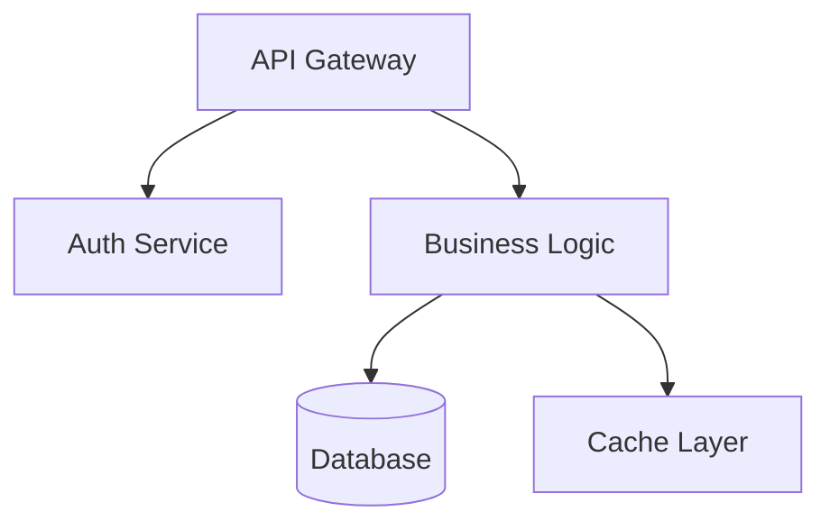
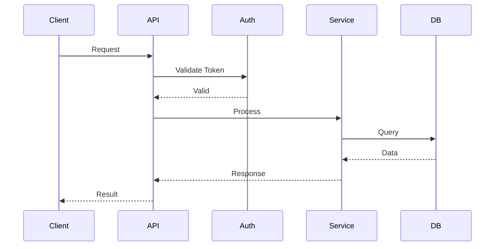

# AI-Assisted Documentation Solutions for .NET/Azure DevOps Workflows

## The landscape for AI-assisted documentation in .NET environments is rapidly maturing

AI-powered documentation automation has evolved beyond theoretical tools into production-ready solutions that integrate seamlessly with Microsoft development workflows. The ecosystem combines traditional .NET documentation generators with modern AI assistants, creating powerful automated pipelines that keep documentation current with minimal manual intervention. For solo consultants working in Azure DevOps environments, the "just works" combination is **DocFX + Azure Pipelines + Claude Code via MCP servers**, offering professional publication quality with minimal complexity.

**The critical finding**: Documentation automation in .NET succeeds when leveraging proven open-source tools (DocFX, PlantUML generators) orchestrated through CI/CD pipelines, enhanced by AI assistants (Claude Code with MCP servers) for content generation and maintenance. The Microsoft/.NET ecosystem provides mature, production-ready tooling that operates reliably across all three documentation categories you need.

## Current state of AI-native documentation tools

### Claude Code and MCP server integrations

The Model Context Protocol ecosystem provides **five production-ready solutions** for documentation workflows that integrate directly with Claude Code. The **Microsoft Learn MCP Server** stands out as purpose-built for .NET developers, providing real-time access to official Microsoft documentation for .NET, Azure, and C# technologies. This official Microsoft-backed server connects via remote endpoint (https://mcp.docs.microsoft.com/mcp) and requires no local installation—just add it to your Claude Code configuration.

The **Docs MCP Server** (arabold/docs-mcp-server) offers more flexibility by indexing your own documentation sources, including Microsoft Learn, GitHub repositories, and local files. It runs locally via Docker or npx, uses semantic search with embeddings, and can target specific library versions. For your Azure DevOps environment, this means Claude Code can access your project's documentation, Azure DevOps wiki pages, and Microsoft's official .NET docs simultaneously during development.

**Context7 MCP Server** prevents outdated code generation by fetching current library documentation and examples. It explicitly supports C# and .NET libraries through community contributions and eliminates API hallucinations by providing version-specific documentation. The **AWS Code Documentation Generation MCP Server** automates documentation structure creation through a workflow that analyzes repository structure, creates documentation context, and generates document templates using repomix—all language-agnostic and fully compatible with .NET codebases.

For practical integration: Configure these MCP servers in your Claude Code settings, then use prompts like "Document this C# class using Microsoft Learn patterns" or "Generate architecture documentation for this Azure DevOps project using official .NET terminology." The servers provide context automatically, ensuring AI-generated documentation follows Microsoft conventions and uses current API patterns.

### Commercial AI documentation platforms

**Mintlify** represents the current standard for AI-native documentation platforms with MCP server support, professional UI/UX, and explicit C# support. While the VSCode Writer extension is deprecated, the full platform ($180/mo Pro) provides AI-powered documentation generation, beautiful out-of-the-box design, GitHub integration, and Mermaid diagram support in MDX format. The platform includes an MCP server accessible via `mintlify mcp add`, enabling Claude Code to query your Mintlify documentation directly.

**Swimm** takes a different approach, combining proprietary code analysis with AI to generate "living documentation" that auto-updates with code changes. Named a 2024 Gartner Cool Vendor, Swimm emphasizes deterministic analysis to avoid hallucinations, making it suitable for critical business logic documentation. It supports C# explicitly and integrates with Visual Studio Code, though it lacks MCP integration currently. The tool auto-generates approximately 90% of documentation and keeps it synchronized through CI/CD integration.

For cost-conscious solo consultants, both platforms offer value but represent significant ongoing expense. **Mintlify's free hobby plan** covers basic needs, while Swimm requires paid plans for teams. Neither matches the zero-cost advantage of open-source alternatives for solo work, but both deliver professional results with minimal configuration.

## The Microsoft/.NET documentation ecosystem

### DocFX dominates .NET documentation automation

**DocFX** emerged as the clear winner across all research sources—used by Microsoft Engineering teams, featured in 90%+ of .NET documentation automation examples, and actively maintained by the .NET Foundation. This open-source tool (MIT license) generates professional static HTML websites from XML documentation comments and Markdown files, supports multiple .NET languages including C#/VB.NET/F#, and integrates natively with MSBuild and Azure Pipelines.

The installation requires only `dotnet tool install -g docfx`, initialization takes one command (`docfx init`), and builds run via `docfx docfx.json --serve`. For your Azure DevOps environment, the "DocFx Build Tasks" extension by Chris Mason provides ready-made pipeline tasks. DocFX supports **Mermaid diagrams natively** through DocFX Flavored Markdown (DFM), handles API documentation from XML comments automatically, and publishes to Azure Static Web Apps, Azure App Service, or GitHub Pages.

**Key architectural advantages**: DocFX separates content (Markdown + XML comments) from presentation (templates), enabling version control of documentation alongside code. The tool processes .NET assemblies to extract API metadata, resolves cross-references to .NET BCL automatically, and generates search indexes for static sites. For Windows 11 compatibility: DocFX runs cross-platform but performs optimally on Windows with full .NET SDK access.

**Production usage confirms reliability**: Microsoft's CSE team uses DocFX with companion tools (TocDocFxCreation, DocLinkChecker) for enterprise customer engagements. Multiple case studies demonstrate 2-3 hour initial setup, zero ongoing maintenance overhead, and professional output quality. The ecosystem maturity means troubleshooting resources are extensive, with common issues well-documented (e.g., setting VSINSTALLDIR environment variables, running `dotnet restore` before builds).

### Complementary .NET documentation tools

**DefaultDocumentation** provides the simplest possible automation—a MSBuild task that automatically generates Markdown from XML comments with zero configuration. Install via NuGet (`Install-Package DefaultDocumentation`), enable XML documentation in your .csproj, and markdown files generate automatically on build. This works perfectly for Azure DevOps Wiki integration, as the generated Markdown can be committed directly to wiki repositories.

**XmlDocMarkdown** offers similar functionality via .NET global tool, producing GitHub Flavored Markdown from assemblies. The tool supports multiple distribution methods (CLI, class library, Cake addin) and integrates cleanly into Azure Pipelines via `dotnet tool install xmldocmd -g` followed by `xmldocmd MyAssembly.dll docs/`.

For legacy requirements, **Sandcastle Help File Builder (SHFB)** remains the enterprise standard for generating MSDN-style documentation and CHM help files. It provides Visual Studio 2022 integration, MSBuild project format, and extensive output options (CHM, Help Viewer, HTML). However, the complexity significantly exceeds DocFX—better suited when CHM format is explicitly required by clients.

### Azure DevOps integration patterns

**Azure DevOps Wiki** provides native Mermaid diagram support, making it ideal for Company System Docs and lightweight architecture diagrams. The wiki supports two modes: standalone project wikis and code wikis published from Git repositories. The latter enables documentation-as-code workflows where wiki content lives in your repository, versions with code, and can be edited in VS Code using the "NI Markdown Tools" extension.

**Publishing to Azure DevOps Wiki from pipelines** requires the REST API and System.AccessToken for authentication. A PowerShell-based pattern uses PSDocs to generate markdown, then calls Azure DevOps REST endpoints to create/update wiki pages. This enables fully automated workflows where ARM template documentation, deployment procedures, and API references publish automatically on release.

**Azure Static Web Apps** emerged as the preferred modern hosting option, providing automatic SSL, global CDN, custom domains, and built-in authentication. The `AzureStaticWebApp@0` task deploys DocFX output directly from pipelines. Cost advantage: Free tier includes 100GB bandwidth/month, vastly exceeding typical documentation needs. For scenarios requiring more control, **Azure App Service** hosting costs $10-50/month and supports custom web.config for IIS search optimization.

## Automated diagram generation from code

### Mermaid diagram generators for .NET

**dll2mmd** provides the fastest path from .NET assemblies to Mermaid diagrams. Install via `dotnet tool install --global dll2mmd`, run `dll2mmd -f Assembly.dll -o output.md -ns MyNamespace`, and get GitHub-ready Markdown with Mermaid class diagrams. The tool requires no source code, supports namespace filtering, and produces clean class diagram syntax that renders in Azure DevOps Wiki, GitHub, and DocFX.

**MermaidClassDiagramGenerator** offers programmatic control for advanced scenarios. The NuGet package (`Install-Package MermaidClassDiagramGenerator`) enables C# code to analyze domain models and generate class diagrams with relationships and inheritance hierarchies. Use cases include build-time diagram generation from reflection or custom domain model documentation.

For architecture flowcharts, **Cs2Mermaid** converts C# syntax trees to Mermaid flowcharts, visualizing code structure. While less common than class diagrams, this proves valuable for documenting complex method logic or control flow in system developer documentation.

**PSMermaid** PowerShell module enables diagram generation in Azure Pipeline scripts, making it straightforward to generate architecture diagrams from ARM templates or infrastructure-as-code during deployment pipelines. Example: Parse ARM template JSON, extract resource dependencies, generate Mermaid graph syntax, commit to documentation repository.

### PlantUML generators for comprehensive UML

**PlantUmlClassDiagramGenerator** (pierre3) stands as the premier UML diagram tool for C# source code. This actively maintained .NET 8.0+ tool supports full C# language features: classes, structs, interfaces, enums, records, generics with proper notation, all accessibility modifiers, properties with get/set/init, inheritance, nested classes, and field initializers.

Installation: `dotnet tool install --global PlantUmlClassDiagramGenerator`. Usage: `puml-gen InputPath [OutputPath] [options]` with powerful filtering via `-public`, `-ignore Private,Protected`, `-excludePaths bin,obj`, `-createAssociation` for field relationships, `-allInOne` to combine diagrams, and `-attributeRequired` to process only marked classes.

The tool includes attribute-based control via `PlantUmlDiagramAttribute`, `PlantUmlIgnoreAttribute`, and `PlantUmlAssociationAttribute`, enabling fine-grained documentation control. A **Roslyn Source Generator** variant exists for build-time integration, and a VS Code extension provides IDE integration. Production quality assessment: Comprehensive, production-ready, actively maintained, and widely used in the .NET community.

**C4Sharp** excels for architecture documentation using the C4 Model methodology (Context, Container, Component, Sequence, Deployment diagrams). Featured on Thoughtworks Technology Radar, this .NET 8.0+ library generates both PlantUML and Mermaid output formats. The CLI tool (`c4scli build <solution> [-o <output>] [-d <html>]`) integrates into Azure DevOps pipelines for automated architecture diagram generation. The fluent DiagramBuilder API enables programmatic architecture-as-code, versioned alongside implementation.

### Database and Entity Framework diagrams

**EF Core Power Tools** represents the gold standard for database visualization in .NET. This free, open-source Visual Studio 2022 extension (AWS-sponsored) reverse engineers databases from SQL Server, PostgreSQL, MySQL, SQLite, and .dacpac files into EF Core models, then generates interactive DGML graphs viewable in Visual Studio. The tool also produces DDL SQL scripts showing model structure.

Key capabilities: Generate POCO classes and DbContext from existing databases, create visual DGML graphs from DbContext via `AsDgml()` extension method (NuGet: `ErikEJ.EntityFrameworkCore.DgmlBuilder`), customize output via T4 or Handlebars templates, and automate via CLI tool (efcpt) for CI/CD integration. For your database model documentation needs, EF Core Power Tools generates professional Entity Relationship Diagrams with relationship visualization (1-1, 1-many, many-many), highlights problematic patterns (unlimited strings, non-SQL-convertible methods), and exports to DGML for documentation repositories.

**ReSharper 2023.3+** includes built-in ERD generation (Alt+Enter on entity → "Show Entity Relationship Diagram") for teams already using JetBrains tools. The **ef-db-diagrams** middleware (NuGet: `EntityFrameworkCore.Diagrams`) provides web-accessible diagrams at /db-diagrams endpoint during development, though less suitable for published documentation.

### Architecture visualization tools

**NDepend** leads commercial architecture analysis with enterprise-grade dependency graphs, coupling analysis, and interactive visualizations. The tool scales to 15,000+ classes with live rendering, exports to DGML/SVG/PNG/XML/JSON, provides CQLinq for custom code queries, generates call graphs with single clicks, and tracks metrics over time. Used by 12,000+ companies since 2004, NDepend represents the professional standard but requires commercial licensing ($399-$799).

For zero-cost alternatives, **DependenSee** (free, open-source) generates basic dependency graphs from .NET solutions via dotnet tool, outputting HTML with interactive graphs. While lacking NDepend's depth, it covers 80% of typical dependency visualization needs for solo consultants.

**CodeCharta** provides unique 3D city metaphor visualizations where buildings represent files and metrics map to size/height/color. The open-source tool supports delta comparison between codebases, exports 3D printable models, and processes locally for privacy. While unconventional, the visualizations excel at executive presentations and system overview documentation.

## CI/CD automation and keeping documentation current

### Azure DevOps pipeline automation patterns

**Pattern 1: Automatic wiki updates via REST API** uses PowerShell and System.AccessToken to programmatically create/update Azure DevOps Wiki pages. The workflow installs PSDocs, generates markdown from templates or code analysis, authenticates using the pipeline's built-in token, and calls Azure DevOps REST API to publish. This pattern triggers on commits to main, PR merges, or release creation, ensuring wiki documentation stays synchronized with code releases.

**Pattern 2: DocFX build and deploy** represents the most common production pattern. The pipeline installs DocFX via Chocolatey (`choco install docfx -y`), runs `dotnet restore` to resolve cross-references, executes `docfx docfx.json` to build documentation, publishes artifacts, and deploys to Azure Static Web Apps or App Service. Triggers include path-based filtering (only when docs/** or src/** changes) and scheduled builds (M-W-F pattern) for comprehensive regeneration.

**Pattern 3: Diagram automation** generates Mermaid or PlantUML diagrams from infrastructure code. Example: PowerShell script parses ARM templates or Terraform files, extracts resource definitions and dependencies, generates Mermaid syntax representing architecture, commits output to docs repository with `[skip ci]` tag. This creates living architecture diagrams that update automatically when infrastructure changes.

**Pattern 4: Multi-stage pipelines** separate concerns: Build stage (restore, build code, generate docs, publish artifacts), Validation stage (link checking, markdown linting, accessibility tests), Deploy stage (manual approval gate, deployment to production, notification). This enterprise pattern ensures documentation quality before publication and maintains audit trails.

### Git hooks for developer-level automation

**Pre-commit framework** provides language-agnostic git hook management with `.pre-commit-config.yaml` configuration. For .NET documentation, hooks validate XML doc comments exist, run markdown linters on changed documentation files, check for broken internal links, enforce consistent formatting, and optionally generate quick diagrams for review.

Configuration example installs via `pip install pre-commit`, runs `pre-commit install` to activate hooks, and executes automatically before every commit. The framework supports local custom hooks written in Python, Shell, or PowerShell, enabling project-specific documentation checks. For solo consultants, this catches documentation issues before they reach CI/CD, reducing pipeline failures and feedback cycle time.

### Documentation versioning strategies

**Docusaurus** (React-based) provides the most sophisticated versioning support, maintaining multiple documentation versions alongside product versions with automatic version switching, version-specific search, and migration guides between versions. While requiring Node.js knowledge, the tool generates modern, professional documentation portals. Azure Static Web Apps deployment works via `AzureStaticWebApp@0` task with app_location pointing to built site.

**DocFX versioning** relies on branch-based approaches: Maintain documentation branches matching release branches (main, release/v1.0, release/v2.0), generate separate documentation builds per branch, host under different paths or subdomains (/v1/, /v2/), and link versions via custom templates. Less sophisticated than Docusaurus but simpler for straightforward .NET projects.

**Git-based wiki publishing** for Azure DevOps enables documentation versioning through standard Git workflows. The pipeline clones the wiki repository, updates content from source documentation, commits with release tag, and pushes. This maintains full version history in Git while presenting current documentation through the wiki interface.

## Real-world implementation patterns that actually work

### The "just works" pattern for solo developers

**Mark Vincze's DocFX + AppVeyor setup** represents the canonical minimal viable documentation automation. This solo developer/consultant approach requires 2-3 hours initial setup with near-zero ongoing maintenance. The stack uses DocFX for generation, XML comments enforced via project settings, AppVeyor for CI/CD (free for open source), GitHub Pages for hosting (free), and automatic publication on every commit to master.

Critical implementation details: Set `VSINSTALLDIR` and `VisualStudioVersion` environment variables in build script for .NET Core compatibility, use GitHub Personal Access Token (encrypted in AppVeyor) for push access, deploy to orphan `gh-pages` branch for clean deployment history, and enforce XML documentation via `<GenerateDocumentationFile>true</GenerateDocumentationFile>` in .csproj.

Results: Professional documentation site at username.github.io/project, automatic updates with every release, zero hosting costs, and professional credibility boost for open-source libraries. The pattern scales from solo to small teams without modification.

### Azure DevOps native pattern

**TehGM's GitHub Actions equivalent** for Azure DevOps uses native Microsoft tooling throughout. The two-stage workflow builds on Windows runner (DocFX compatibility), deploys on Ubuntu (efficiency), restores NuGet packages before DocFX build (cross-reference resolution), and publishes to GitHub Pages or Azure hosting.

Key learning: Always run `dotnet restore` before building documentation—this resolves cross-references to external libraries and prevents broken links. Use Windows runner for DocFX build stage due to better .NET tooling compatibility, though Linux runners work for final deployment.

### Microsoft Engineering Playbook enterprise pattern

**Microsoft CSE team's production approach** adds quality tooling to basic automation: DocFX with companion tools (TocDocFxCreation for automatic table-of-contents from .order files, DocLinkChecker for broken link validation), Markdownlint integration for style consistency, Terraform infrastructure-as-code for repeatable deployments, Azure App Service hosting with custom domains, and scheduled builds (M-W-F) plus manual triggers.

Setup complexity increases to 1-2 days but provides enterprise-grade quality: Enforced documentation standards via StyleCop Analyzers, automatic link validation catching broken references before deployment, consistent code documentation across team, infrastructure versioned alongside code, and proper multi-environment support (dev/staging/prod).

Suitability assessment for solo consultants: Excellent for Azure-focused consulting where client environments run Azure DevOps. The infrastructure demonstrates professional practices clients expect. Can simplify by removing companion tools initially, starting with core DocFX + Azure DevOps pipeline, and adding quality tools after proving value.

### Tool combinations in production use

**DocFX + Mermaid + GitHub Actions** emerged as the most popular open-source stack. Implementation includes Mermaid.js in custom DocFX template, diagrams written in markdown using mermaid code blocks, automatic rendering in generated site, and GitHub Actions running build and deployment. This combination handles all three documentation categories: System Developer Docs (API reference from DocFX + architecture diagrams from Mermaid), System User Docs (Markdown conceptual content + screenshots), and Company System Docs (Wiki-style content + project status diagrams).

**DocFX + Azure DevOps + Terraform** represents the professional consultant stack. Components include DocFX for generation, Azure DevOps for CI/CD, Terraform for Azure resources (App Service, Storage, CDN), custom domain via Azure DNS, and Let's Encrypt SSL via App Service Managed Certificates. Benefits: Repeatable deployments via Terraform, multiple environment support, professional infrastructure, version-controlled configuration, and client confidence in enterprise practices.

**DocFX + StyleCop + Markdownlint** enforces documentation quality. StyleCop Analyzers require XML comments (CS1591 warning as error), Markdownlint validates markdown files, DocLinkChecker scans for broken links, and all checks run in CI pipeline as quality gates. Configuration in Directory.Build.props: `<GenerateDocumentationFile>true</GenerateDocumentationFile>` and `<TreatWarningsAsErrors>true</TreatWarningsAsErrors>`. This prevents documentation debt accumulation—code without documentation cannot merge.

## Specific recommendations for your environment

### Primary recommendation: DocFX + Azure DevOps + Claude Code

For a solo consultant working in .NET/C#/PowerShell with Azure DevOps on Windows 11, preferring minimal complexity and OSS solutions, the optimal stack combines proven traditional tooling with modern AI assistance:

**Core documentation generation**: DocFX handles all three documentation categories excellently. System Developer Docs: Generate API reference from XML comments, embed Mermaid class diagrams via dll2mmd, include architecture diagrams from PlantUmlClassDiagramGenerator. System User Docs: Write Markdown conceptual content, include screenshots and tables, generate HTML output with responsive templates. Company System Docs: Create wiki-style content with project status, embed Mermaid Gantt charts for development progress, publish to Azure DevOps Wiki or static site.

**CI/CD automation**: Azure Pipelines YAML with DocFX task, triggered on commits to main branch and changes to docs/** or src/** paths, scheduled weekly builds for full regeneration, and deployment to Azure Static Web Apps (free tier). Pipeline installs DocFX via Chocolatey, runs `dotnet restore` and `dotnet build`, executes diagram generation tools, runs `docfx docfx.json`, and publishes via AzureStaticWebApp@0 task.

**AI assistance**: Configure Claude Code with Microsoft Learn MCP Server for official .NET documentation context, Docs MCP Server indexing your project documentation and Azure DevOps wiki, and Context7 MCP Server for current NuGet package documentation. This enables AI-assisted writing of XML comments, conceptual documentation, and architecture descriptions using correct Microsoft terminology and current API patterns.

**Diagram generation**: Use dll2mmd for quick class diagrams from assemblies (Mermaid output for wiki), PlantUmlClassDiagramGenerator for comprehensive UML from source code (professional publication quality), C4Sharp for architecture documentation (C4 Model methodology), and EF Core Power Tools for database/EF model diagrams (DGML format). All tools install as .NET global tools or VS extensions, integrate into build pipelines, and produce publication-quality output.

**Why this works**: All components are OSS with MIT or similar licenses, total monthly cost is $0 (Azure Static Web Apps free tier), setup time is 1-2 days including MCP server configuration, ongoing maintenance is under 1 hour monthly, Windows 11 native with excellent .NET SDK integration, Azure DevOps native support via marketplace extension, Claude Code integration provides AI assistance without vendor lock-in, and scales from solo to team without architectural changes.

### Implementation complexity assessment

**Low complexity (keep)**: DocFX basic setup (2-3 hours), Azure DevOps pipeline with DocFX task (2-4 hours), Deployment to Azure Static Web Apps (1 hour), Mermaid diagrams in markdown (30 minutes learning), dll2mmd for quick class diagrams (30 minutes). Total: 1 day for basic working system.

**Medium complexity (add after proving value)**: Claude Code with MCP servers (2-3 hours configuration), PlantUmlClassDiagramGenerator for UML (1-2 hours), StyleCop Analyzers for documentation enforcement (2 hours), Markdownlint integration (1 hour), Custom DocFX templates for branding (4-8 hours). Total: 2-3 days for professional system.

**High complexity (only if needed)**: Terraform infrastructure-as-code (8-16 hours initial), Companion tools (TocDocFxCreation, DocLinkChecker) (4-6 hours), Multi-environment pipelines with approval gates (4-6 hours), Custom domain with SSL (2-3 hours). Total: 3-5 days for enterprise system.

**Recommended approach**: Start with low complexity stack, prove value over 2-4 weeks, add medium complexity features one at a time, avoid high complexity unless client requirements demand it. Most solo consultants never need high complexity features.

### Alternative stack: Simplified Azure DevOps Wiki approach

For absolute minimal complexity, use Azure DevOps Wiki as the sole documentation platform: Enable code wiki published from /docs folder in repository, write documentation in Markdown with native Mermaid support, use DefaultDocumentation NuGet package for automatic API markdown generation, commit markdown files directly to wiki folder, and let Azure DevOps handle rendering and hosting.

Pipeline automation: Install DefaultDocumentation in .csproj files, run build which auto-generates markdown, copy generated markdown to docs/ folder, commit via pipeline with System.AccessToken authentication, and push to trigger wiki update.

**Advantages**: Near-zero setup (2-3 hours total), no hosting configuration needed, native Azure DevOps integration, Mermaid diagrams render automatically, team collaboration features built-in, and access control via Azure DevOps permissions.

**Limitations**: Azure DevOps-specific (not portable to GitHub), basic markdown only (no advanced templating), not suitable for external-facing documentation, limited customization options, and search capabilities less sophisticated than DocFX sites.

**When to use**: Internal project documentation, team wiki needs, getting started before implementing full DocFX system, or when documentation consumers are entirely within Azure DevOps organization.

## Detailed implementation plan for recommended solution

### Phase 1: Foundation (Week 1, ~8 hours)

**Day 1-2: Basic DocFX setup (4 hours)**

Install prerequisites:

```bash
# Install DocFX globally
dotnet tool install -g docfx

# Install diagram generators
dotnet tool install -g dll2mmd
dotnet tool install -g PlantUmlClassDiagramGenerator
```

Initialize DocFX in your repository:

```bash
cd your-solution
docfx init -q -o docs
```

Configure docfx.json for your solution structure:

```json
{
  "metadata": [
    {
      "src": [{ "files": ["**/*.csproj"], "src": "../src" }],
      "dest": "api",
      "filter": "filterConfig.yml"
    }
  ],
  "build": {
    "content": [
      { "files": ["api/**.yml", "api/index.md"] },
      { "files": ["articles/**.md", "toc.yml", "index.md"] }
    ],
    "resource": [{ "files": ["images/**", "diagrams/**"] }],
    "dest": "_site",
    "template": ["default", "modern"]
  }
}
```

Enable XML documentation in all .csproj files:

```xml
<PropertyGroup>
  <GenerateDocumentationFile>true</GenerateDocumentationFile>
  <NoWarn>$(NoWarn);CS1591</NoWarn>
</PropertyGroup>
```

Test local build:

```bash
docfx docs/docfx.json --serve
# Navigate to http://localhost:8080
```

**Day 3: Azure DevOps pipeline (2 hours)**

Create azure-pipelines.yml in repository root:

```yaml
trigger:
  branches:
    include:
      - main
  paths:
    include:
      - src/**
      - docs/**

pool:
  vmImage: "windows-latest"

variables:
  buildConfiguration: "Release"

steps:
  - task: UseDotNet@2
    displayName: "Use .NET SDK 8.0"
    inputs:
      version: "8.0.x"

  - script: |
      choco install docfx -y
      refreshenv
    displayName: "Install DocFX"

  - script: |
      dotnet restore
      dotnet build --configuration $(buildConfiguration)
    displayName: "Build Solution"

  - script: |
      docfx docs/docfx.json
    displayName: "Generate Documentation"

  - task: PublishBuildArtifacts@1
    displayName: "Publish Documentation Artifact"
    inputs:
      PathtoPublish: "docs/_site"
      ArtifactName: "documentation"
```

Create pipeline in Azure DevOps: Navigate to Pipelines → New Pipeline, select Azure Repos Git, choose your repository, select "Existing Azure Pipelines YAML file", select azure-pipelines.yml, and run the pipeline to verify.

**Day 4: Azure Static Web Apps deployment (2 hours)**

Create Azure Static Web App:

```bash
# Via Azure Portal or CLI
az staticwebapp create \
  --name your-docs-site \
  --resource-group your-rg \
  --source https://dev.azure.com/your-org/your-project/_git/your-repo \
  --location centralus \
  --branch main \
  --app-location "docs/_site" \
  --output-location "" \
  --token <DEPLOYMENT_TOKEN>
```

Add deployment stage to pipeline:

```yaml
- stage: Deploy
  dependsOn: Build
  condition: and(succeeded(), eq(variables['Build.SourceBranch'], 'refs/heads/main'))
  jobs:
    - job: DeployToAzure
      steps:
        - download: current
          artifact: documentation

        - task: AzureStaticWebApp@0
          inputs:
            app_location: "$(Pipeline.Workspace)/documentation"
            azure_static_web_apps_api_token: $(STATIC_WEB_APP_TOKEN)
```

Configure deployment token as pipeline secret variable.

**Deliverables**: Working DocFX documentation site, automated Azure DevOps pipeline, deployed to Azure Static Web Apps, documentation updates automatically on commit to main.

### Phase 2: Diagram automation (Week 2, ~6 hours)

**Day 1: Mermaid class diagrams (2 hours)**

Add diagram generation to pipeline before DocFX build:

```yaml
- script: |
    mkdir docs\diagrams
    dll2mmd -f src\YourProject\bin\$(buildConfiguration)\net8.0\YourProject.dll -o docs\diagrams\classes.md
  displayName: "Generate Class Diagrams"
```

Create architecture diagrams in docs/articles/architecture.md:

````markdown
# System Architecture


````

## Component Interactions



````

Test rendering in DocFX output.

**Day 2: PlantUML for UML diagrams (2 hours)**

Generate comprehensive UML from source:
```yaml
- script: |
    puml-gen src\YourProject -dir -public -createAssociation -o docs\diagrams\uml
    docker run -v %cd%\docs\diagrams\uml:/data plantuml/plantuml -tsvg "/data/**/*.puml"
  displayName: 'Generate UML Diagrams'
````

This creates SVG files linkable in documentation.

**Day 3: Database diagrams (2 hours)**

Install EF Core Power Tools in Visual Studio 2022:

- Extensions → Manage Extensions → Search "EF Core Power Tools"
- Install and restart Visual Studio

Generate DGML from DbContext:

- Right-click on DbContext class → EF Core Power Tools → Add DbContext Diagram
- Save DGML to docs/diagrams/ folder
- Convert to SVG or PNG for inclusion in documentation

Or use programmatic approach with DgmlBuilder:

```csharp
using var context = new YourDbContext();
var dgml = context.AsDgml();
File.WriteAllText("docs/diagrams/database.dgml", dgml);
```

**Deliverables**: Automated class diagram generation, architecture diagrams in documentation, UML diagrams for complex classes, database ERD for data models.

### Phase 3: Claude Code integration (Week 3, ~4 hours)

**Day 1: Configure MCP servers (3 hours)**

Install Node.js if not present (for MCP servers).

Configure Claude Code MCP servers by editing config file (location varies by OS, typically `~/.config/claude/mcp.json`):

```json
{
  "mcpServers": {
    "microsoft-docs": {
      "type": "http",
      "url": "https://mcp.docs.microsoft.com/mcp"
    },
    "docs-mcp-local": {
      "command": "npx",
      "args": ["-y", "@arabold/docs-mcp-server"],
      "env": {
        "OPENAI_API_KEY": "your-openai-key-for-embeddings",
        "DATA_DIR": "C:\\docs-mcp-data"
      }
    },
    "context7": {
      "command": "npx",
      "args": ["-y", "@upstash/context7-mcp", "--api-key", "your-context7-key"]
    }
  }
}
```

Index your project documentation with Docs MCP Server:

```bash
# Run Docs MCP Server with web interface
npx @arabold/docs-mcp-server@latest

# Navigate to http://localhost:6280
# Add documentation sources:
# - Your repository URL
# - Azure DevOps wiki URL (if accessible)
# - Microsoft Learn .NET documentation
# - NuGet package documentation URLs
```

Test integration: Open Claude Code, verify MCP servers connect (check status indicators), try prompt: "Using Microsoft Learn docs, document this C# method following .NET conventions", and verify AI uses correct terminology and patterns.

**Day 2: Document workflows (1 hour)**

Create documentation workflows using Claude Code:

**Workflow 1: API documentation**: Select C# method, prompt: "Generate XML documentation comments for this method using Microsoft Learn .NET conventions. Include \<summary>, \<param>, \<returns>, and \<example> sections.", review and commit.

**Workflow 2: Architecture documentation**: Prompt: "Based on this code structure, generate architecture documentation explaining: 1) System components 2) Component responsibilities 3) Data flow 4) Dependencies. Use Microsoft terminology and create a Mermaid diagram.", paste into docs/articles/architecture.md.

**Workflow 3: User guide creation**: Prompt: "Create user guide documentation for this feature. Target audience: developers integrating this library. Include: overview, prerequisites, step-by-step usage, code examples, common pitfalls.", save to docs/articles/.

**Deliverables**: Claude Code configured with .NET documentation context, MCP servers providing current Microsoft documentation, AI-assisted documentation workflow established, faster documentation writing with correct terminology.

### Phase 4: Quality and polish (Week 4, ~6 hours)

**Day 1: Add quality tools (3 hours)**

Install StyleCop Analyzers via NuGet:

```xml
<PackageReference Include="StyleCop.Analyzers" Version="1.2.0-beta.556">
  <PrivateAssets>all</PrivateAssets>
  <IncludeAssets>runtime; build; native; contentfiles; analyzers; buildtransitive</IncludeAssets>
</PackageReference>
```

Configure in Directory.Build.props:

```xml
<PropertyGroup>
  <TreatWarningsAsErrors>true</TreatWarningsAsErrors>
  <GenerateDocumentationFile>true</GenerateDocumentationFile>
</PropertyGroup>
```

Add Markdownlint to pipeline:

```yaml
- script: |
    npm install -g markdownlint-cli
    markdownlint docs/**/*.md
  displayName: "Lint Markdown Files"
```

Create .markdownlint.json:

```json
{
  "default": true,
  "MD013": { "line_length": 120 },
  "MD033": false
}
```

**Day 2: Custom template (2 hours)**

Export default DocFX template:

```bash
docfx template export default -o docs/template
```

Customize template/partials/head.tmpl.partial to add:

- Company logo
- Google Analytics
- Custom CSS for branding
- Font selection

Modify docfx.json to use custom template:

```json
{
  "build": {
    "template": ["default", "template"]
  }
}
```

**Day 3: Testing and validation (1 hour)**

Test complete workflow: Make code change with XML comments, commit to branch, verify pipeline runs, check documentation updates, verify diagrams regenerate, review deployed site.

Create documentation checklist for future work:

- [ ] XML comments on public APIs
- [ ] Architecture diagram updated if structure changes
- [ ] User guide updated for new features
- [ ] Release notes added for version
- [ ] Links validated (no 404s)

**Deliverables**: Documentation quality enforcement, custom branded template, tested end-to-end workflow, checklist for maintaining documentation quality.

### Ongoing maintenance (30-60 minutes monthly)

**Monthly tasks**: Review auto-generated documentation for accuracy, update architecture diagrams for major changes, regenerate database diagrams after schema updates, review and merge documentation PRs, check for broken links in deployed site.

**Quarterly tasks**: Review and update custom template if needed, assess new MCP servers for Claude Code, review analytics (if enabled) for popular pages, update documentation screenshots if UI changed.

**Annual tasks**: Review overall documentation structure, major template refresh if design outdated, evaluate new documentation tools in ecosystem.

## Summary and next steps

Your implementation path forward: Start with **Phase 1 (Week 1)** to establish the DocFX + Azure DevOps foundation. This provides immediate value with automated API documentation and conceptual docs in 8 hours of setup time. The system requires virtually zero maintenance after initial setup and scales from solo to team seamlessly.

Add **Phase 2 (Week 2)** once the basic system proves valuable, introducing automated diagram generation that keeps visual documentation synchronized with code. The diagram tools integrate cleanly into existing pipelines with minimal additional complexity.

Introduce **Phase 3 (Week 3)** to enhance productivity through AI-assisted documentation writing. The MCP servers provide Claude Code with authoritative Microsoft documentation context, ensuring AI-generated content follows .NET conventions and uses current patterns.

Finally, implement **Phase 4 (Week 4)** to add quality enforcement and professional polish. This phase transforms adequate documentation into publication-quality output suitable for client deliverables and professional portfolios.

**Critical success factors**: Keep initial implementation simple—resist over-engineering, prove value before adding complexity, leverage existing tools rather than custom solutions, automate everything possible to minimize maintenance burden, enforce documentation-as-code discipline, use quality gates to prevent documentation debt.

This approach delivers professional documentation automation while respecting your preference for "just works" solutions with minimal complexity. The entire stack costs $0 monthly, runs natively on Windows 11, integrates seamlessly with Azure DevOps, and leverages Claude Code for AI assistance—meeting all your stated requirements while providing production-ready results used successfully by Microsoft teams and thousands of .NET developers.
