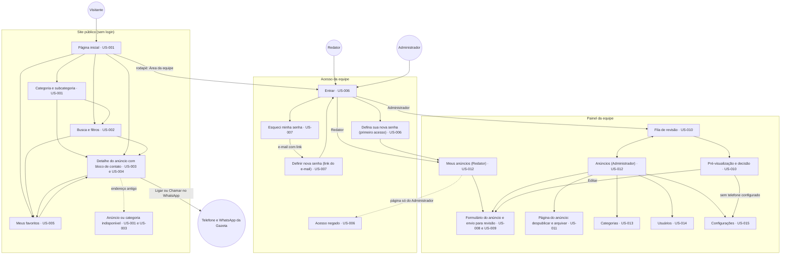

# Wireframes — GazetaMarketplace

> **Em resumo:** este conjunto de desenhos mostra, tela a tela, como o site público e o painel da equipe do GazetaMarketplace devem se organizar: o que aparece em cada página, quais botões existem e o que a pessoa vê quando não há dados, quando algo falha ou quando a busca não acha nada. São desenhos de **intenção** (layout, hierarquia e estados), não de aparência final: cores, fontes e componentes definitivos ficam para a etapa de arquitetura. Cada botão e cada campo aponta para o cenário de `specs/SPEC.md` que o justifica. O protótipo clicável em HTML **não foi gerado**: ele é opcional e fica desligado por padrão.

**Para quem é este documento:** para o Product Owner conferir se as telas refletem o que foi pedido, e para quem for construir e testar o site depois.

**Como aprovar:** leia este arquivo e abra as telas que quiser em `screens/`; depois **responda no chat** se aprova os desenhos ou o que deve mudar. As dúvidas que exigem decisão sua estão na seção "Lacunas para o SPEC", mais abaixo.

## Quem usa o quê

| Papel | Tem conta? | O que faz nas telas |
|---|---|---|
| Visitante | Não | Navega, busca, vê o anúncio, favorita (no navegador) e fala com a Gazeta por telefone ou WhatsApp. |
| Redator | Sim (equipe) | Entra no painel, cria e edita os próprios anúncios, envia para revisão e acompanha a situação. |
| Administrador | Sim (equipe) | Tudo o que o Redator faz nos anúncios (sem atalho de publicação), mais revisar, publicar, rejeitar, despublicar, arquivar, e gerenciar categorias, usuários e o telefone do site. |

## Mapa do site (Mermaid)

## Índice de telas

| Tela | Arquivo | Histórias | Quem acessa |
|---|---|---|---|
| Página inicial e categorias | [screens/US-001-pagina-inicial.md](screens/US-001-pagina-inicial.md) | US-001 | Visitante |
| Busca e filtros | [screens/US-002-busca-filtros.md](screens/US-002-busca-filtros.md) | US-002 | Visitante |
| Detalhe do anúncio | [screens/US-003-detalhe-anuncio.md](screens/US-003-detalhe-anuncio.md) | US-003 | Visitante |
| Contato com o intermediário (bloco do detalhe) | [screens/US-004-contato-intermediario.md](screens/US-004-contato-intermediario.md) | US-004 | Visitante |
| Favoritos | [screens/US-005-favoritos.md](screens/US-005-favoritos.md) | US-005 | Visitante |
| Entrar, primeiro acesso e acesso negado | [screens/US-006-login-equipe.md](screens/US-006-login-equipe.md) | US-006 | Equipe |
| Recuperar senha (2 telas mais link vencido ou usado) | [screens/US-007-recuperar-senha.md](screens/US-007-recuperar-senha.md) | US-007 | Equipe |
| Criar e editar anúncio | [screens/US-008-editar-anuncio.md](screens/US-008-editar-anuncio.md) | US-008 | Redator e Administrador |
| Enviar para revisão | [screens/US-009-enviar-revisao.md](screens/US-009-enviar-revisao.md) | US-009 | Redator e Administrador |
| Revisar anúncio (fila, pré-visualização, decisão) | [screens/US-010-revisar-anuncio.md](screens/US-010-revisar-anuncio.md) | US-010 | Administrador |
| Despublicar e arquivar | [screens/US-011-arquivar-despublicar.md](screens/US-011-arquivar-despublicar.md) | US-011 | Administrador |
| Lista de anúncios do painel | [screens/US-012-painel-anuncios.md](screens/US-012-painel-anuncios.md) | US-012 | Redator e Administrador |
| Categorias | [screens/US-013-categorias.md](screens/US-013-categorias.md) | US-013 | Administrador |
| Usuários da equipe | [screens/US-014-usuarios-equipe.md](screens/US-014-usuarios-equipe.md) | US-014 | Administrador |
| Configurações (telefone/WhatsApp do site) | [screens/US-015-contato-do-site.md](screens/US-015-contato-do-site.md) | US-015 | Administrador |

## Índice de fluxos

| Fluxo | Arquivo |
|---|---|
| Visitante: da página inicial ao contato pelo WhatsApp | [flows/visitante-home-contato.md](flows/visitante-home-contato.md) |
| Visitante: favoritar anúncios neste navegador | [flows/visitante-favoritos.md](flows/visitante-favoritos.md) |
| Equipe: do rascunho à publicação (criar, enviar, aprovar ou rejeitar, despublicar, arquivar) | [flows/equipe-anuncio-publicacao.md](flows/equipe-anuncio-publicacao.md) |
| Equipe: entrar no painel e recuperar a senha | [flows/equipe-login-recuperacao-senha.md](flows/equipe-login-recuperacao-senha.md) |

## Notas de design compartilhadas (valem para todas as telas)

### Navegação principal

- **Site público:** cabeçalho com logotipo, caixa de busca e o contador "Favoritos (n)"; rodapé com o link discreto "Área da equipe". As categorias principais ficam na página inicial. Nenhum item de menu novo além destes foi previsto.
- **Painel do Redator:** um único item, "Meus anúncios", mais o nome da pessoa e o botão "Sair".
- **Painel do Administrador:** "Anúncios" (com as abas "Fila de revisão" e "Todos os anúncios"), "Categorias", "Usuários" e "Configurações", mais o nome da pessoa e "Sair". São 4 itens, abaixo do limite de 7.
- O item ativo do menu fica destacado e marcado com `aria-current`.

### Responsivo (mobile primeiro)

- Cada tela é pensada primeiro para **320 px** e depois ampliada; a SPEC pede verificação sem rolagem horizontal em 320, 768, 1024 e 1280 px (NFR-17).
- Grade de anúncios: 2 colunas em 320 px, 3 em telas médias e 4 em telas largas; 12 (início) e 24 (busca) anúncios completam linhas nas três larguras.
- O menu do painel se recolhe abaixo de 768 px; tabelas do painel viram cartões empilhados em 320 px; os filtros da busca ficam atrás do botão "Filtros".
- Áreas de toque de pelo menos 44 × 44 px; botões de contato com rótulo de texto.

### Acessibilidade (WCAG 2.1 AA)

- HTML semântico (`header`, `nav`, `main`, `footer`), um `h1` por página, `lang="pt-BR"`, link "Ir para o conteúdo" no topo.
- Todo campo tem `label` visível; botão só com ícone tem nome acessível; o coração de favoritar usa `aria-pressed`.
- Erros de campo ficam ao lado do campo e ligados a ele (`aria-describedby`); mensagens gerais usam `role="alert"`, e confirmações de sucesso usam `role="status"`.
- Diálogos (`role="dialog"` ou `alertdialog`) prendem o foco e devolvem o foco a quem os abriu; Esc fecha.
- Contraste de texto de pelo menos 4,5:1; a situação do anúncio, os erros e os avisos nunca dependem só de cor.
- Reordenar fotos e categorias funciona por botões, sem arrastar.
- Todas as funções funcionam sem JavaScript quando possível (links navegam e formulários enviam); o JavaScript só melhora a experiência.

### Mensagens de erro

- Erro de campo: mensagem específica junto do campo (por exemplo, "Informe um título").
- Erro geral de página ou de lista: faixa com a mensagem e o botão "Tentar novamente"; nas páginas públicas, também um **código de referência** que permite achar o registro do erro, sem mostrar detalhes técnicos (@US-001-S06).
- Falta de permissão: sempre "Você não tem permissão para acessar esta página" (ou "…este anúncio"), sem mostrar o conteúdo.
- Login e recuperação de senha nunca revelam se um e-mail existe.

### Estados de página (todas as telas com lista ou dados)

Cada arquivo em `screens/` traz a tabela de estados: **padrão · vazio · carregando · erro · sem resultado**, cada um ligado ao cenário da SPEC quando existe. Estado sem cenário aparece com "—" e está listado nas lacunas abaixo. A matriz de estados **por componente** (foco, desativado etc.) fica para a etapa de arquitetura.

### Sessão e autenticação

- A sessão da equipe termina após 30 minutos parada, com o aviso "Sua sessão expirou. Entre novamente."
- Quem abre uma página do painel sem estar logado passa pela entrada e volta à página pedida.
- Depois de "Sair", o botão Voltar do navegador não mostra o painel.

### Componentes de referência (Bootstrap 5.3.8)

Barra de navegação recolhível (`navbar`), grade (`grid`), cartões (`card`), formulários (`form-control`, `form-select`), diálogos (`modal`), alertas (`alert`), paginação (`pagination`), caminho de navegação (`breadcrumb`), tabelas, botões e recolhíveis (`collapse`). Cores, tipografia e o restante do sistema visual serão definidos na arquitetura.

## Cobertura e rastreabilidade

- **15 telas** desenhadas, uma por arquivo, e **4 fluxos**; nenhum arquivo tem marcas de "a preencher".
- **128 de 128 cenários** da SPEC aparecem em pelo menos uma linha da tabela de mapeamento da sua própria tela; nenhum código de cenário citado deixa de existir na SPEC.
- **215 linhas de mapeamento** no total, cada uma ligando uma região ou controle a um ou mais cenários; **19** delas são controles estruturais sem cenário, marcados `⚠️ nenhum cenário cobre este controle` e listados abaixo.
- Só foram desenhados estados de **página**, como pede esta etapa.
- **Atualização de 2026-09-30:** entrou o cenário `@US-008-S14` (CEP fora do ar), mapeado em `screens/US-008-editar-anuncio.md` (aviso e listas de UF/Cidade) e, como referência cruzada, em `screens/US-010-revisar-anuncio.md` (selo "Cidade/UF informadas manualmente").
- **Atualização de 2026-09-30 (Serviços e Vagas de emprego):** `US-008` ganhou os layouts de Serviços (sem Preço, Tipo, até 6 fotos) e de Vagas (sem Fotos, título de 90, Área, Preço = salário), os formatos JPG, PNG, WebP, GIF e HEIC e a conversão de HEIC; `US-003` ganhou as variantes com "Salário" e sem galeria; `US-001` desenha as três variantes do card; `US-002` registra o comportamento provisório do preço em Serviços. As marcas "provisório (A4)" e "provisório (A6)" foram retiradas depois que o `/arch` decidiu essas suposições (`architecture/design-system.md`).
- **Atualização da v1.1 do SPEC (2026-09-30):** os desenhos de US-001, US-002, US-003, US-012 e US-013 passaram a usar os nomes reais de `specs/categories.md`, acompanhando os dados de exemplo dos cenários; US-013 mostra a árvore com até três níveis. O painel (US-012) continua sem coluna de preço (a regra do Salário vale só para o card e a página de detalhe).

### Controles sem cenário (⚠️)

| Tela | Controles sem cenário |
|---|---|
| US-001 | Link "Ir para o conteúdo"; logotipo (volta à página inicial) |
| US-002 | Campo "Modelo" (a regra de negócio cita, nenhum cenário usa) |
| US-003 | Caminho de navegação (`nav "Você está em"`) |
| US-006 | Link do logotipo na entrada; botão "Menu" do painel em 320 px |
| US-007 | Link "Voltar para entrar" |
| US-008 | Link "Meus anúncios" (voltar) |
| US-009 | "Cancelar" do diálogo de envio |
| US-010 | Abas "Fila de revisão" e "Todos os anúncios"; link "Fila de revisão" (voltar); "Cancelar" do diálogo de publicar |
| US-011 | "Cancelar" do diálogo de despublicar; botão "Editar" |
| US-012 | "Limpar filtros" do estado sem resultado; abas "Fila de revisão" e "Todos os anúncios" |
| US-013 | "Mover para baixo"; "Cancelar" do formulário e do diálogo |
| US-014 | "Cancelar" do formulário e do diálogo |

Esses controles são o mínimo de estrutura para o site funcionar. Se o Product Owner quiser cobertura formal, cada um vira um cenário novo em uma versão futura da SPEC.

## Lacunas para o SPEC

Itens que a interface precisa ou sugere e que a SPEC ainda não cobre. **Nenhum foi desenhado como se estivesse decidido**: onde havia uma escolha, o desenho segue a opção mais conservadora e aparece marcado abaixo. Cada item vira pergunta ao Product Owner ou cenário novo em uma versão futura da SPEC.

| # | Lacuna | Onde aparece | O que o desenho assume por enquanto |
|---|---|---|---|
| 1 | Nenhuma história tem cenário para o estado "carregando", embora as notas de UI de US-002 e US-012 o peçam. | Todas as telas com lista | Esqueleto de blocos com altura reservada (evita que a página "pule", NFR-03), sem cenário. |
| 2 | Falha do servidor na página de detalhe do anúncio: a nota de UI de US-003 pede "erro", mas não há cenário. | US-003 | Mesma tela de erro da página inicial (mensagem, "Tentar novamente", código de referência). |
| 3 | Página de categoria: a SPEC não diz se os anúncios têm paginação, ordenação e filtros como na busca. | US-001 | A categoria mostra os anúncios e um link "Filtrar e ordenar" que leva à busca com a categoria escolhida; a paginação fica a decidir. |
| 4 | Onde fica a "Fila de revisão" no menu: a SPEC cita os menus "Anúncios, Categorias, Usuários e Configurações" e a fila como tela inicial do Administrador. | US-006, US-010, US-012 | A fila é uma aba dentro de "Anúncios", ao lado de "Todos os anúncios". |
| 5 | Trocar a própria senha voluntariamente: a matriz de permissões prevê, mas só existem a troca obrigatória (US-006-S09) e a recuperação (US-007). | Painel | Nenhuma tela desenhada. |
| 6 | Mover uma subcategoria para outro pai: a mensagem de US-013-S09 diz "mova", mas não há cenário nem controle para isso. | US-013 | "Editar" só permite renomear. |
| 7 | Editar nome e e-mail de um usuário. ~~Redefinir a senha dele pelo Administrador~~ **resolvido na v1.2 do SPEC (US-014-S10).** | US-014 | "Editar" só muda o papel; nome e e-mail aparecem só para leitura. "Redefinir senha" desenhado em `screens/US-014-usuarios-equipe.md`. |
| 8 | Perda de trabalho ao expirar a sessão (30 minutos) no meio do preenchimento de um anúncio: a SPEC não diz se o que foi digitado se preserva. | US-006, US-008 | Nada é preservado; a pessoa volta ao formulário depois de entrar. |
| 9 | Falha de rede nas ações do painel (salvar, enviar, publicar, rejeitar, despublicar, arquivar, categorias, usuários, configurações): só há cenário de erro para listas, envio de foto, página inicial e busca. | US-008 a US-015 | Mensagem geral com "Tentar novamente"; texto exato a definir. |
| 10 | Lista do painel com filtro ou busca sem resultado: a nota de UI de US-012 pede, mas não há cenário. | US-012 | "Nenhum anúncio encontrado" e "Limpar filtros". |
| 11 | Pré-visualização de anúncio em Rascunho pelo próprio Redator (a matriz de permissões permite): só há cenários de leitura para "Em revisão" (US-012-S05) e para o Redator sem edição (US-008-S12). | US-008, US-012 | Anúncio em Rascunho ou Rejeitado abre direto o formulário de edição; não há tela de pré-visualização para o Redator. |
| 12 | Rótulo do botão de salvar quando o anúncio está Rejeitado: a SPEC usa "Salvar rascunho" (S01) e "Salvar" (S13). | US-008 | "Salvar rascunho" em Rascunho; "Salvar" em Rejeitado e em Publicado. |
| 13 | Páginas sem cenário: erro 404 genérico do site (endereço que não é categoria nem anúncio), "Como funciona" e política de privacidade (suposição S20), aviso de cookies (S8). | Site público | Nenhuma tela desenhada; rodapé só com "Área da equipe". |
| 14 | Campos vazios na entrada e no pedido de recuperação (por exemplo, e-mail em branco): sem cenário. | US-006, US-007 | Validação do navegador e do servidor com mensagem por campo. |
| 15 | Textos de interface que não vêm de cenário (títulos de página, dicas de campo, "Cancelar" dos diálogos, "Fale com a Gazeta"): são propostas de redação. | Todas as telas | Redação sugerida, para o Product Owner ajustar. |
| 16 | Número de anúncios por categoria na tela "Categorias": ajuda a entender o bloqueio de exclusão (US-013-S08), mas a SPEC não pede a coluna. | US-013 | Coluna "Anúncios" mostrada. |
| 17 | ~~Card e página de um anúncio sem foto (Vagas de emprego): suposição A4 do SPEC.~~ **Resolvida no `/arch`** (`architecture/design-system.md` §5.2 e §5.4). | US-001, US-002, US-003 | Bloco neutro "Vaga de emprego" no lugar da foto, com a área da vaga. |
| 18 | ~~Serviços sem preço no card, no detalhe e nos filtros de preço: suposição A6 do SPEC.~~ **Resolvida no `/arch`** (ADR-006 e `architecture/design-system.md` §5.3 e §6). | US-001, US-002, US-003 | Tipo no lugar do preço; Serviços fora da faixa de preço e no fim da ordenação por preço. |
| 19 | ~~Cenário US-003-S04 usa a categoria "Casa e jardim", que não existe na árvore.~~ **Resolvida na v1.1 do SPEC:** o cenário usa "Decorações Para Casa" e mostra "Condição" e "Tipo de produto". | US-003 | — |

## Como isto se liga às outras etapas

- **Arquitetura:** herda o desenho das telas e decide os componentes, o sistema visual e a navegação final (nenhuma cor, fonte ou ícone foi fixada aqui).
- **Construção e testes:** o nome acessível de cada controle, na tabela de mapeamento, é o que o teste automatizado usa para achar o botão ou o campo certo; cada linha diz qual cenário ele exercita.
- **Protótipo clicável:** o protótipo clicável da v1.0 está arquivado em `specs/wireframes/_archive/prototype-v1-20260930.html`. Ele não é mantido em dia; a fonte de verdade é este README, os wireframes em `screens/*.md` e o `SPEC.md`.
