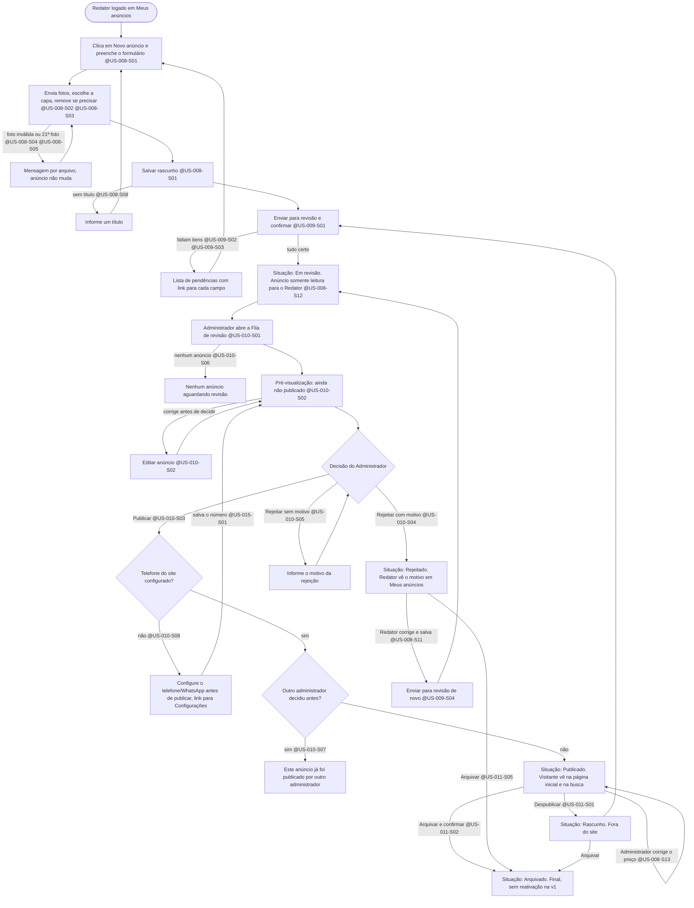
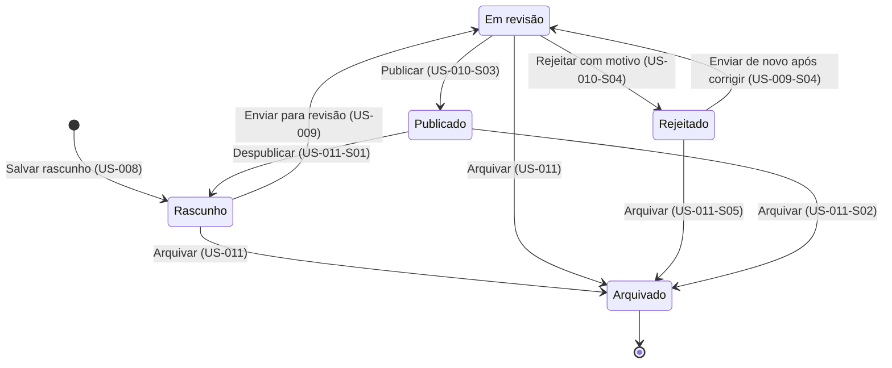

# Fluxo: Equipe, do rascunho à publicação do anúncio — @US-008, @US-009, @US-010, @US-011, @US-012, @US-015

> **Em resumo:** o Redator monta o anúncio como rascunho e o envia para revisão; o Administrador confere e decide. Só depois de publicado o visitante vê o anúncio. Se o Administrador rejeitar, o Redator vê o motivo, corrige e reenvia. O Administrador pode ainda tirar do ar (despublicar) ou encerrar (arquivar) um anúncio. Nenhum anúncio é publicado sem a aprovação de um Administrador.

## Jornada — passo a passo (Mermaid)

## Ciclo de vida do anúncio (Mermaid)

## Notas

- **Quem faz o quê:** o Redator só mexe nos próprios anúncios em Rascunho ou Rejeitado (@US-008-S10, @US-012-S01); o Administrador decide, despublica, arquiva e edita qualquer anúncio não arquivado (@US-008-S13). O Administrador que cria um anúncio segue o mesmo caminho, sem atalho de publicação.
- **Efeito imediato no site:** publicar, despublicar, arquivar e a edição do Administrador em anúncio publicado valem na hora para o visitante (@US-010-S03, @US-011-S01, @US-011-S02, @US-008-S13).
- **Rejeitado só muda ao reenviar:** depois de corrigir, o anúncio continua "Rejeitado" até o Redator clicar em "Enviar para revisão" (@US-008-S11).
- **Clique duplo:** enviar para revisão duas vezes seguidas gera uma única entrada na fila (@US-009-S05).
- Arquivado não volta na versão 1; a decisão de permitir reativação é a suposição S5 da SPEC.
