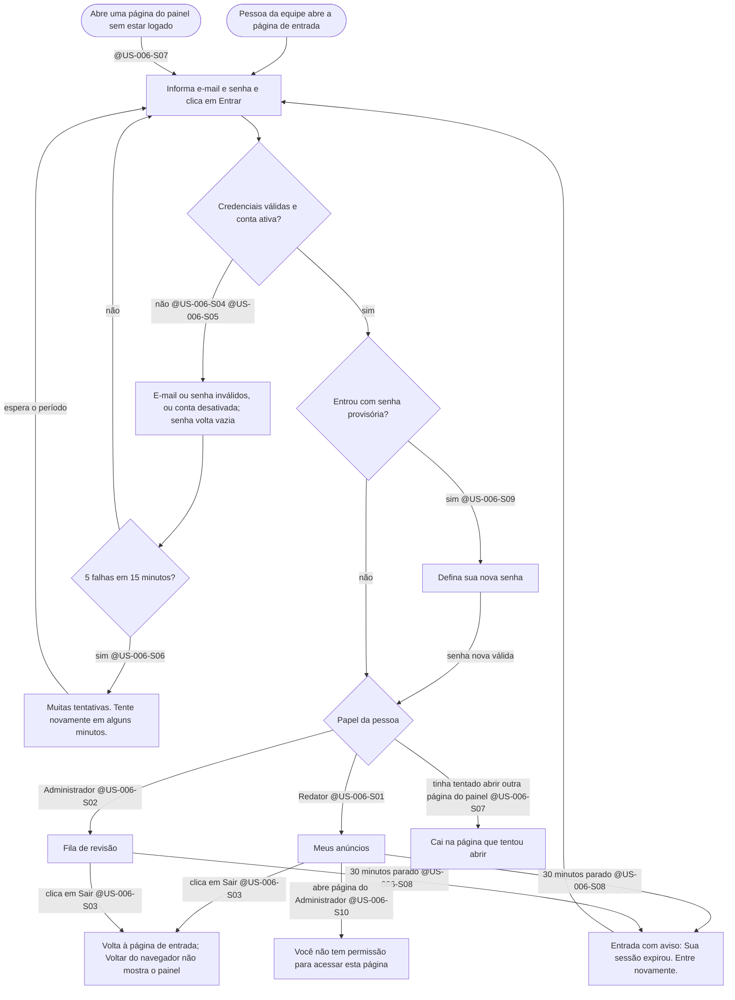
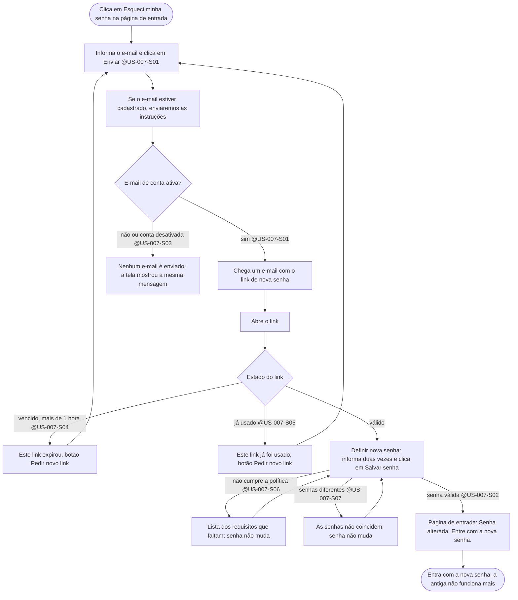

# Fluxo: Equipe, entrar no painel e recuperar a senha — @US-006, @US-007, @US-014

> **Em resumo:** a equipe entra com e-mail e senha. No primeiro acesso troca a senha provisória; quem esquece a senha pede um link por e-mail (válido por 1 hora e de uso único). Todas as respostas de erro são as mesmas, para não revelar quais e-mails existem. Este fluxo depende da suposição S6 da SPEC (recuperação por e-mail).

## Jornada — entrar e sair (Mermaid)

## Jornada — recuperar a senha (Mermaid)

## Notas

- **Conta nova:** o Administrador cria a conta com senha provisória (@US-014-S01); no primeiro acesso a pessoa é obrigada a trocá-la e a senha provisória deixa de valer (@US-006-S09).
- **Conta desativada:** não entra (@US-006-S05, @US-014-S03) e não recebe e-mail de redefinição (regra de negócio da @US-007); reativar (@US-014-S04) devolve o acesso.
- **Mensagens iguais de propósito:** a tela de entrada e a de recuperação nunca dizem se um e-mail está cadastrado. O teste automatizado deve conferir que o texto é idêntico nos dois casos.
- **Redirecionamento:** depois de entrar, quem tentou abrir uma página do painel cai nela (@US-006-S07); quem entrou pela página de entrada vai a "Meus anúncios" (Redator) ou à "Fila de revisão" (Administrador).
