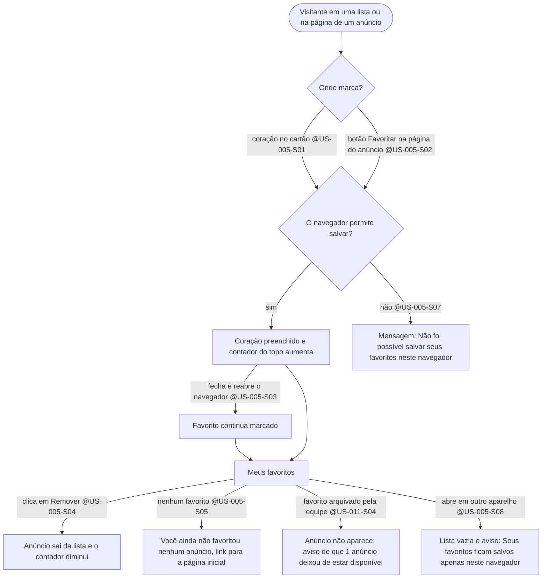

# Fluxo: Visitante favorita anúncios neste navegador — @US-005, @US-011

> **Em resumo:** o visitante marca anúncios com o coração e os revê em "Meus favoritos", sem conta. Os favoritos ficam só no navegador dele; quando a equipe tira um anúncio do ar, o anúncio some da lista com um aviso. Depende da suposição S1 da SPEC, ainda a confirmar.

## Jornada (Mermaid)

## Notas

- Os favoritos não passam pelo servidor. Por isso o teste automatizado (`/verify`) precisa reabrir o navegador no mesmo perfil para provar @US-005-S03.
- O aviso "Seus favoritos ficam salvos apenas neste navegador" é permanente na página "Meus favoritos" (@US-005-S08), não aparece só na primeira vez.
- Um favorito que deixou de estar publicado é removido da lista do visitante quando ele abre "Meus favoritos"; a remoção depende de o anúncio ter sido consultado de novo, não de um aviso enviado pelo servidor.
