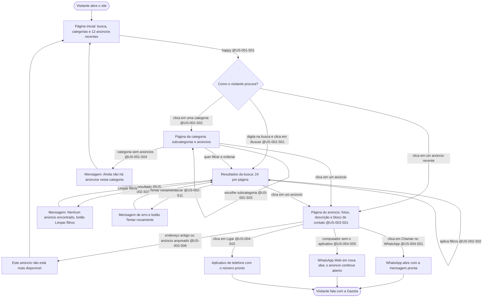

# Fluxo: Visitante, da página inicial ao contato pelo WhatsApp — @US-001, @US-002, @US-003, @US-004

> **Em resumo:** este é o caminho principal do site. O visitante chega à página inicial, encontra o anúncio por categoria ou por busca e fala com a Gazeta pelo telefone ou pelo WhatsApp. O objetivo da SPEC é que isso leve **no máximo 3 cliques a partir da página inicial**: categoria, anúncio, botão de contato.

## Jornada (Mermaid)

## Notas

- **Contagem de cliques (meta da SPEC):** Página inicial → categoria → anúncio → "Chamar no WhatsApp" são 3 cliques; pelos anúncios recentes da página inicial são 2 cliques (anúncio, botão).
- O site não registra quem clicou nos botões de contato (@US-004, regra de negócio). O `/verify` só consegue conferir o endereço aberto (`tel:` e o link do WhatsApp), não a conversa em si.
- O número exibido vem da configuração do Administrador (`US-015`); todo anúncio publicado tem contato visível porque, sem número, a publicação é bloqueada (@US-010-S08).
- O endereço de uma busca guarda todos os filtros: abrir o mesmo endereço em outra aba repete o resultado (@US-002-S09).
- Favoritar em qualquer ponto desta jornada está em `visitante-favoritos.md`.
